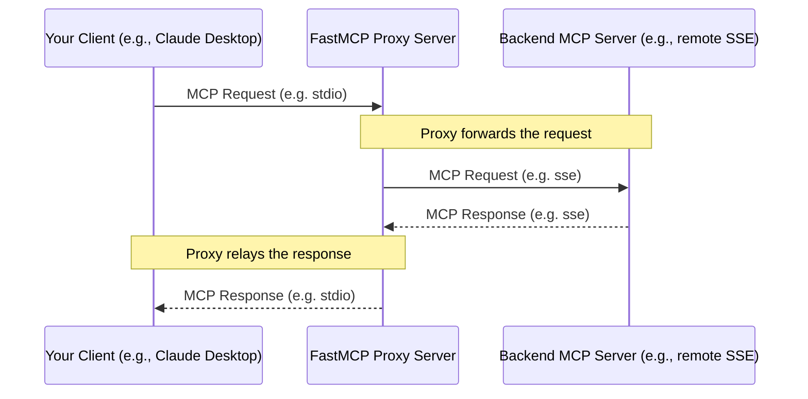

# null
Source: https://gofastmcp.com/changelog


<Update label="v2.8.0" description="2024-06-10">
  ## [v2.8.0: Transform and Roll Out](https://github.com/jlowin/fastmcp/releases/tag/v2.8.0)

  FastMCP 2.8.0 introduces powerful new ways to customize and control your MCP servers!

  ### Tool Transformation

  The highlight of this release is first-class [**Tool Transformation**](/patterns/tool-transformation), a new feature that lets you create enhanced variations of existing tools. You can now easily rename arguments, hide parameters, modify descriptions, and even wrap tools with custom validation or post-processing logic—all without rewriting the original code. This makes it easier than ever to adapt generic tools for specific LLM use cases or to simplify complex APIs. Huge thanks to [@strawgate](https://github.com/strawgate) for partnering on this, starting with [#591](https://github.com/jlowin/fastmcp/discussions/591) and [#599](https://github.com/jlowin/fastmcp/pull/599) and continuing offline.

  ### Component Control

  This release also gives you more granular control over which components are exposed to clients. With new [**tag-based filtering**](/servers/fastmcp#tag-based-filtering), you can selectively enable or disable tools, resources, and prompts based on tags, perfect for managing different environments or user permissions. Complementing this, every component now supports being [programmatically enabled or disabled](/servers/tools#disabling-tools), offering dynamic control over your server's capabilities.

  ### Tools-by-Default

  Finally, to improve compatibility with a wider range of LLM clients, this release changes the default behavior for OpenAPI integration: all API endpoints are now converted to `Tools` by default. This is a **breaking change** but pragmatically necessitated by the fact that the majority of MCP clients available today are, sadly, only compatible with MCP tools. Therefore, this change significantly simplifies the out-of-the-box experience and ensures your entire API is immediately accessible to any tool-using agent.

  ## What's Changed

  ### New Features 🎉

  * First-class tool transformation by [@jlowin](https://github.com/jlowin) in [#745](https://github.com/jlowin/fastmcp/pull/745)
  * Support enable/disable for all FastMCP components (tools, prompts, resources, templates) by [@jlowin](https://github.com/jlowin) in [#781](https://github.com/jlowin/fastmcp/pull/781)
  * Add support for tag-based component filtering by [@jlowin](https://github.com/jlowin) in [#748](https://github.com/jlowin/fastmcp/pull/748)
  * Allow tag assignments for OpenAPI by [@jlowin](https://github.com/jlowin) in [#791](https://github.com/jlowin/fastmcp/pull/791)

  ### Enhancements 🔧

  * Create common base class for components by [@jlowin](https://github.com/jlowin) in [#776](https://github.com/jlowin/fastmcp/pull/776)
  * Move components to own file; add resource by [@jlowin](https://github.com/jlowin) in [#777](https://github.com/jlowin/fastmcp/pull/777)
  * Update FastMCP component with **eq** and **repr** by [@jlowin](https://github.com/jlowin) in [#779](https://github.com/jlowin/fastmcp/pull/779)
  * Remove open-ended and server-specific settings by [@jlowin](https://github.com/jlowin) in [#750](https://github.com/jlowin/fastmcp/pull/750)

  ### Fixes 🐞

  * Ensure client is only initialized once by [@jlowin](https://github.com/jlowin) in [#758](https://github.com/jlowin/fastmcp/pull/758)
  * Fix field validator for resource by [@jlowin](https://github.com/jlowin) in [#778](https://github.com/jlowin/fastmcp/pull/778)
  * Ensure proxies can overwrite remote tools without falling back to the remote by [@jlowin](https://github.com/jlowin) in [#782](https://github.com/jlowin/fastmcp/pull/782)

  ### Breaking Changes 🛫

  * Treat all openapi routes as tools by [@jlowin](https://github.com/jlowin) in [#788](https://github.com/jlowin/fastmcp/pull/788)
  * Fix issue with global OpenAPI tags by [@jlowin](https://github.com/jlowin) in [#792](https://github.com/jlowin/fastmcp/pull/792)

  ### Docs 📚

  * Minor docs updates by [@jlowin](https://github.com/jlowin) in [#755](https://github.com/jlowin/fastmcp/pull/755)
  * Add 2.7 update by [@jlowin](https://github.com/jlowin) in [#756](https://github.com/jlowin/fastmcp/pull/756)
  * Reduce 2.7 image size by [@jlowin](https://github.com/jlowin) in [#757](https://github.com/jlowin/fastmcp/pull/757)
  * Update updates.mdx by [@jlowin](https://github.com/jlowin) in [#765](https://github.com/jlowin/fastmcp/pull/765)
  * Hide docs sidebar scrollbar by default by [@jlowin](https://github.com/jlowin) in [#766](https://github.com/jlowin/fastmcp/pull/766)
  * Add "stop vibe testing" to tutorials by [@jlowin](https://github.com/jlowin) in [#767](https://github.com/jlowin/fastmcp/pull/767)
  * Add docs links by [@jlowin](https://github.com/jlowin) in [#768](https://github.com/jlowin/fastmcp/pull/768)
  * Fix: updated variable name under Gemini remote client by [@yrangana](https://github.com/yrangana) in [#769](https://github.com/jlowin/fastmcp/pull/769)
  * Revert "Hide docs sidebar scrollbar by default" by [@jlowin](https://github.com/jlowin) in [#770](https://github.com/jlowin/fastmcp/pull/770)
  * Add updates by [@jlowin](https://github.com/jlowin) in [#773](https://github.com/jlowin/fastmcp/pull/773)
  * Add tutorials by [@jlowin](https://github.com/jlowin) in [#783](https://github.com/jlowin/fastmcp/pull/783)
  * Update LLM-friendly docs by [@jlowin](https://github.com/jlowin) in [#784](https://github.com/jlowin/fastmcp/pull/784)
  * Update oauth.mdx by [@JeremyCraigMartinez](https://github.com/JeremyCraigMartinez) in [#787](https://github.com/jlowin/fastmcp/pull/787)
  * Add changelog by [@jlowin](https://github.com/jlowin) in [#789](https://github.com/jlowin/fastmcp/pull/789)
  * Add tutorials by [@jlowin](https://github.com/jlowin) in [#790](https://github.com/jlowin/fastmcp/pull/790)
  * Add docs for tag-based filtering by [@jlowin](https://github.com/jlowin) in [#793](https://github.com/jlowin/fastmcp/pull/793)

  ### Other Changes 🦾

  * Create dependabot.yml by [@jlowin](https://github.com/jlowin) in [#759](https://github.com/jlowin/fastmcp/pull/759)
  * Bump astral-sh/setup-uv from 3 to 6 by [@dependabot](https://github.com/dependabot) in [#760](https://github.com/jlowin/fastmcp/pull/760)
  * Add dependencies section to release by [@jlowin](https://github.com/jlowin) in [#761](https://github.com/jlowin/fastmcp/pull/761)
  * Remove extra imports for MCPConfig by [@Maanas-Verma](https://github.com/Maanas-Verma) in [#763](https://github.com/jlowin/fastmcp/pull/763)
  * Split out enhancements in release notes by [@jlowin](https://github.com/jlowin) in [#764](https://github.com/jlowin/fastmcp/pull/764)

  ## New Contributors

  * [@dependabot](https://github.com/dependabot) made their first contribution in [#760](https://github.com/jlowin/fastmcp/pull/760)
  * [@Maanas-Verma](https://github.com/Maanas-Verma) made their first contribution in [#763](https://github.com/jlowin/fastmcp/pull/763)
  * [@JeremyCraigMartinez](https://github.com/JeremyCraigMartinez) made their first contribution in [#787](https://github.com/jlowin/fastmcp/pull/787)

  **Full Changelog**: [v2.7.1...v2.8.0](https://github.com/jlowin/fastmcp/compare/v2.7.1...v2.8.0)
</Update>

<Update label="v2.7.1" description="2024-06-08">
  ## [v2.7.1: The Bearer Necessities](https://github.com/jlowin/fastmcp/releases/tag/v2.7.1)

  This release primarily contains a fix for parsing string tokens that are provided to FastMCP clients.

  ### New Features 🎉

  * Respect cache setting, set default to 1 second by [@jlowin](https://github.com/jlowin) in [#747](https://github.com/jlowin/fastmcp/pull/747)

  ### Fixes 🐞

  * Ensure event store is properly typed by [@jlowin](https://github.com/jlowin) in [#753](https://github.com/jlowin/fastmcp/pull/753)
  * Fix passing token string to client auth & add auth to MCPConfig clients by [@jlowin](https://github.com/jlowin) in [#754](https://github.com/jlowin/fastmcp/pull/754)

  ### Docs 📚

  * Docs : fix client to mcp\_client in Gemini example by [@yrangana](https://github.com/yrangana) in [#734](https://github.com/jlowin/fastmcp/pull/734)
  * update add tool docstring by [@strawgate](https://github.com/strawgate) in [#739](https://github.com/jlowin/fastmcp/pull/739)
  * Fix contrib link by [@richardkmichael](https://github.com/richardkmichael) in [#749](https://github.com/jlowin/fastmcp/pull/749)

  ### Other Changes 🦾

  * Switch Pydantic defaults to kwargs by [@strawgate](https://github.com/strawgate) in [#731](https://github.com/jlowin/fastmcp/pull/731)
  * Fix Typo in CLI module by [@wfclark5](https://github.com/wfclark5) in [#737](https://github.com/jlowin/fastmcp/pull/737)
  * chore: fix prompt docstring by [@danb27](https://github.com/danb27) in [#752](https://github.com/jlowin/fastmcp/pull/752)
  * Add accept to excluded headers by [@jlowin](https://github.com/jlowin) in [#751](https://github.com/jlowin/fastmcp/pull/751)

  ### New Contributors

  * [@wfclark5](https://github.com/wfclark5) made their first contribution in [#737](https://github.com/jlowin/fastmcp/pull/737)
  * [@richardkmichael](https://github.com/richardkmichael) made their first contribution in [#749](https://github.com/jlowin/fastmcp/pull/749)
  * [@danb27](https://github.com/danb27) made their first contribution in [#752](https://github.com/jlowin/fastmcp/pull/752)

  **Full Changelog**: [v2.7.0...v2.7.1](https://github.com/jlowin/fastmcp/compare/v2.7.0...v2.7.1)
</Update>

<Update label="v2.7.0" description="2024-06-05">
  ## [v2.7.0: Pare Programming](https://github.com/jlowin/fastmcp/releases/tag/v2.7.0)

  This is primarily a housekeeping release to remove or deprecate cruft that's accumulated since v1. Primarily, this release refactors FastMCP's internals in preparation for features planned in the next few major releases. However please note that as a result, this release has some minor breaking changes (which is why it's 2.7, not 2.6.2, in accordance with repo guidelines) though not to the core user-facing APIs.

  ### Breaking Changes 🛫

  * decorators return the objects they create, not the decorated function
  * websockets is an optional dependency
  * methods on the server for automatically converting functions into tools/resources/prompts have been deprecated in favor of using the decorators directly

  ### New Features 🎉

  * allow passing flags to servers by [@zzstoatzz](https://github.com/zzstoatzz) in [#690](https://github.com/jlowin/fastmcp/pull/690)
  * replace $ref pointing to `#/components/schemas/` with `#/$defs/\` by [@phateffect](https://github.com/phateffect) in [#697](https://github.com/jlowin/fastmcp/pull/697)
  * Split Tool into Tool and FunctionTool by [@jlowin](https://github.com/jlowin) in [#700](https://github.com/jlowin/fastmcp/pull/700)
  * Use strict basemodel for Prompt; relax from\_function deprecation by [@jlowin](https://github.com/jlowin) in [#701](https://github.com/jlowin/fastmcp/pull/701)
  * Formalize resource/functionresource replationship by [@jlowin](https://github.com/jlowin) in [#702](https://github.com/jlowin/fastmcp/pull/702)
  * Formalize template/functiontemplate split by [@jlowin](https://github.com/jlowin) in [#703](https://github.com/jlowin/fastmcp/pull/703)
  * Support flexible @tool decorator call patterns by [@jlowin](https://github.com/jlowin) in [#706](https://github.com/jlowin/fastmcp/pull/706)
  * Ensure deprecation warnings have stacklevel=2 by [@jlowin](https://github.com/jlowin) in [#710](https://github.com/jlowin/fastmcp/pull/710)
  * Allow naked prompt decorator by [@jlowin](https://github.com/jlowin) in [#711](https://github.com/jlowin/fastmcp/pull/711)

  ### Fixes 🐞

  * Updates / Fixes for Tool Content Conversion by [@strawgate](https://github.com/strawgate) in [#642](https://github.com/jlowin/fastmcp/pull/642)
  * Fix pr labeler permissions by [@jlowin](https://github.com/jlowin) in [#708](https://github.com/jlowin/fastmcp/pull/708)
  * remove -n auto by [@jlowin](https://github.com/jlowin) in [#709](https://github.com/jlowin/fastmcp/pull/709)
  * Fix links in README.md by [@alainivars](https://github.com/alainivars) in [#723](https://github.com/jlowin/fastmcp/pull/723)

  Happily, this release DOES permit the use of "naked" decorators to align with Pythonic practice:

  ```python
  @mcp.tool
  def my_tool():
      ...
  ```

  **Full Changelog**: [v2.6.2...v2.7.0](https://github.com/jlowin/fastmcp/compare/v2.6.2...v2.7.0)
</Update>

<Update label="v2.6.1" description="2024-06-03">
  ## [v2.6.1: Blast Auth (second ignition)](https://github.com/jlowin/fastmcp/releases/tag/v2.6.1)

  This is a patch release to restore py.typed in #686.

  ### Docs 📚

  * Update readme by [@jlowin](https://github.com/jlowin) in [#679](https://github.com/jlowin/fastmcp/pull/679)
  * Add gemini tutorial by [@jlowin](https://github.com/jlowin) in [#680](https://github.com/jlowin/fastmcp/pull/680)
  * Fix : fix path error to CLI Documentation by [@yrangana](https://github.com/yrangana) in [#684](https://github.com/jlowin/fastmcp/pull/684)
  * Update auth docs by [@jlowin](https://github.com/jlowin) in [#687](https://github.com/jlowin/fastmcp/pull/687)

  ### Other Changes 🦾

  * Remove deprecation notice by [@jlowin](https://github.com/jlowin) in [#677](https://github.com/jlowin/fastmcp/pull/677)
  * Delete server.py by [@jlowin](https://github.com/jlowin) in [#681](https://github.com/jlowin/fastmcp/pull/681)
  * Restore py.typed by [@jlowin](https://github.com/jlowin) in [#686](https://github.com/jlowin/fastmcp/pull/686)

  ### New Contributors

  * [@yrangana](https://github.com/yrangana) made their first contribution in [#684](https://github.com/jlowin/fastmcp/pull/684)

  **Full Changelog**: [v2.6.0...v2.6.1](https://github.com/jlowin/fastmcp/compare/v2.6.0...v2.6.1)
</Update>

<Update label="v2.6.0" description="2024-06-02">
  ## [v2.6.0: Blast Auth](https://github.com/jlowin/fastmcp/releases/tag/v2.6.0)

  ### New Features 🎉

  * Introduce MCP client oauth flow by [@jlowin](https://github.com/jlowin) in [#478](https://github.com/jlowin/fastmcp/pull/478)
  * Support providing tools at init by [@jlowin](https://github.com/jlowin) in [#647](https://github.com/jlowin/fastmcp/pull/647)
  * Simplify code for running servers in processes during tests by [@jlowin](https://github.com/jlowin) in [#649](https://github.com/jlowin/fastmcp/pull/649)
  * Add basic bearer auth for server and client by [@jlowin](https://github.com/jlowin) in [#650](https://github.com/jlowin/fastmcp/pull/650)
  * Support configuring bearer auth from env vars by [@jlowin](https://github.com/jlowin) in [#652](https://github.com/jlowin/fastmcp/pull/652)
  * feat(tool): add support for excluding arguments from tool definition by [@deepak-stratforge](https://github.com/deepak-stratforge) in [#626](https://github.com/jlowin/fastmcp/pull/626)
  * Add docs for server + client auth by [@jlowin](https://github.com/jlowin) in [#655](https://github.com/jlowin/fastmcp/pull/655)

  ### Fixes 🐞

  * fix: Support concurrency in FastMcpProxy (and Client) by [@Sillocan](https://github.com/Sillocan) in [#635](https://github.com/jlowin/fastmcp/pull/635)
  * Ensure Client.close() cleans up client context appropriately by [@jlowin](https://github.com/jlowin) in [#643](https://github.com/jlowin/fastmcp/pull/643)
  * Update client.mdx: ClientError namespace by [@mjkaye](https://github.com/mjkaye) in [#657](https://github.com/jlowin/fastmcp/pull/657)

  ### Docs 📚

  * Make FastMCPTransport support simulated Streamable HTTP Transport (didn't work) by [@jlowin](https://github.com/jlowin) in [#645](https://github.com/jlowin/fastmcp/pull/645)
  * Document exclude\_args by [@jlowin](https://github.com/jlowin) in [#653](https://github.com/jlowin/fastmcp/pull/653)
  * Update welcome by [@jlowin](https://github.com/jlowin) in [#673](https://github.com/jlowin/fastmcp/pull/673)
  * Add Anthropic + Claude desktop integration guides by [@jlowin](https://github.com/jlowin) in [#674](https://github.com/jlowin/fastmcp/pull/674)
  * Minor docs design updates by [@jlowin](https://github.com/jlowin) in [#676](https://github.com/jlowin/fastmcp/pull/676)

  ### Other Changes 🦾

  * Update test typing by [@jlowin](https://github.com/jlowin) in [#646](https://github.com/jlowin/fastmcp/pull/646)
  * Add OpenAI integration docs by [@jlowin](https://github.com/jlowin) in [#660](https://github.com/jlowin/fastmcp/pull/660)

  ### New Contributors

  * [@Sillocan](https://github.com/Sillocan) made their first contribution in [#635](https://github.com/jlowin/fastmcp/pull/635)
  * [@deepak-stratforge](https://github.com/deepak-stratforge) made their first contribution in [#626](https://github.com/jlowin/fastmcp/pull/626)
  * [@mjkaye](https://github.com/mjkaye) made their first contribution in [#657](https://github.com/jlowin/fastmcp/pull/657)

  **Full Changelog**: [v2.5.2...v2.6.0](https://github.com/jlowin/fastmcp/compare/v2.5.2...v2.6.0)
</Update>

<Update label="v2.5.2" description="2024-05-29">
  ## [v2.5.2: Stayin' Alive](https://github.com/jlowin/fastmcp/releases/tag/v2.5.2)

  ### New Features 🎉

  * Add graceful error handling for unreachable mounted servers by [@davenpi](https://github.com/davenpi) in [#605](https://github.com/jlowin/fastmcp/pull/605)
  * Improve type inference from client transport by [@jlowin](https://github.com/jlowin) in [#623](https://github.com/jlowin/fastmcp/pull/623)
  * Add keep\_alive param to reuse subprocess by [@jlowin](https://github.com/jlowin) in [#624](https://github.com/jlowin/fastmcp/pull/624)

  ### Fixes 🐞

  * Fix handling tools without descriptions by [@jlowin](https://github.com/jlowin) in [#610](https://github.com/jlowin/fastmcp/pull/610)
  * Don't print env vars to console when format is wrong by [@jlowin](https://github.com/jlowin) in [#615](https://github.com/jlowin/fastmcp/pull/615)
  * Ensure behavior-affecting headers are excluded when forwarding proxies/openapi by [@jlowin](https://github.com/jlowin) in [#620](https://github.com/jlowin/fastmcp/pull/620)

  ### Docs 📚

  * Add notes about uv and claude desktop by [@jlowin](https://github.com/jlowin) in [#597](https://github.com/jlowin/fastmcp/pull/597)

  ### Other Changes 🦾

  * add init\_timeout for mcp client by [@jfouret](https://github.com/jfouret) in [#607](https://github.com/jlowin/fastmcp/pull/607)
  * Add init\_timeout for mcp client (incl settings) by [@jlowin](https://github.com/jlowin) in [#609](https://github.com/jlowin/fastmcp/pull/609)
  * Support for uppercase letters at the log level by [@ksawaray](https://github.com/ksawaray) in [#625](https://github.com/jlowin/fastmcp/pull/625)

  ### New Contributors

  * [@jfouret](https://github.com/jfouret) made their first contribution in [#607](https://github.com/jlowin/fastmcp/pull/607)
  * [@ksawaray](https://github.com/ksawaray) made their first contribution in [#625](https://github.com/jlowin/fastmcp/pull/625)

  **Full Changelog**: [v2.5.1...v2.5.2](https://github.com/jlowin/fastmcp/compare/v2.5.1...v2.5.2)
</Update>

<Update label="v2.5.1" description="2024-05-24">
  ## [v2.5.1: Route Awakening (Part 2)](https://github.com/jlowin/fastmcp/releases/tag/v2.5.1)

  ### Fixes 🐞

  * Ensure content-length is always stripped from client headers by [@jlowin](https://github.com/jlowin) in [#589](https://github.com/jlowin/fastmcp/pull/589)

  ### Docs 📚

  * Fix redundant section of docs by [@jlowin](https://github.com/jlowin) in [#583](https://github.com/jlowin/fastmcp/pull/583)

  **Full Changelog**: [v2.5.0...v2.5.1](https://github.com/jlowin/fastmcp/compare/v2.5.0...v2.5.1)
</Update>

<Update label="v2.5.0" description="2024-05-24">
  ## [v2.5.0: Route Awakening](https://github.com/jlowin/fastmcp/releases/tag/v2.5.0)

  This release introduces completely new tools for generating and customizing MCP servers from OpenAPI specs and FastAPI apps, including popular requests like mechanisms for determining what routes map to what MCP components; renaming routes; and customizing the generated MCP components.

  ### New Features 🎉

  * Add FastMCP 1.0 server support for in-memory Client / Testing by [@jlowin](https://github.com/jlowin) in [#539](https://github.com/jlowin/fastmcp/pull/539)
  * Minor addition: add transport to stdio server in mcpconfig, with default by [@jlowin](https://github.com/jlowin) in [#555](https://github.com/jlowin/fastmcp/pull/555)
  * Raise an error if a Client is created with no servers in config by [@jlowin](https://github.com/jlowin) in [#554](https://github.com/jlowin/fastmcp/pull/554)
  * Expose model preferences in `Context.sample` for flexible model selection. by [@davenpi](https://github.com/davenpi) in [#542](https://github.com/jlowin/fastmcp/pull/542)
  * Ensure custom routes are respected by [@jlowin](https://github.com/jlowin) in [#558](https://github.com/jlowin/fastmcp/pull/558)
  * Add client method to send cancellation notifications by [@davenpi](https://github.com/davenpi) in [#563](https://github.com/jlowin/fastmcp/pull/563)
  * Enhance route map logic for include/exclude OpenAPI routes by [@jlowin](https://github.com/jlowin) in [#564](https://github.com/jlowin/fastmcp/pull/564)
  * Add tag-based route maps by [@jlowin](https://github.com/jlowin) in [#565](https://github.com/jlowin/fastmcp/pull/565)
  * Add advanced control of openAPI route creation by [@jlowin](https://github.com/jlowin) in [#566](https://github.com/jlowin/fastmcp/pull/566)
  * Make error masking configurable by [@jlowin](https://github.com/jlowin) in [#550](https://github.com/jlowin/fastmcp/pull/550)
  * Ensure client headers are passed through to remote servers by [@jlowin](https://github.com/jlowin) in [#575](https://github.com/jlowin/fastmcp/pull/575)
  * Use lowercase name for headers when comparing by [@jlowin](https://github.com/jlowin) in [#576](https://github.com/jlowin/fastmcp/pull/576)
  * Permit more flexible name generation for OpenAPI servers by [@jlowin](https://github.com/jlowin) in [#578](https://github.com/jlowin/fastmcp/pull/578)
  * Ensure that tools/templates/prompts are compatible with callable objects by [@jlowin](https://github.com/jlowin) in [#579](https://github.com/jlowin/fastmcp/pull/579)

  ### Docs 📚

  * Add version badge for prefix formats by [@jlowin](https://github.com/jlowin) in [#537](https://github.com/jlowin/fastmcp/pull/537)
  * Add versioning note to docs by [@jlowin](https://github.com/jlowin) in [#551](https://github.com/jlowin/fastmcp/pull/551)
  * Bump 2.3.6 references to 2.4.0 by [@jlowin](https://github.com/jlowin) in [#567](https://github.com/jlowin/fastmcp/pull/567)

  **Full Changelog**: [v2.4.0...v2.5.0](https://github.com/jlowin/fastmcp/compare/v2.4.0...v2.5.0)
</Update>

<Update label="v2.4.0" description="2024-05-21">
  ## [v2.4.0: Config and Conquer](https://github.com/jlowin/fastmcp/releases/tag/v2.4.0)

  **Note**: this release includes a backwards-incompatible change to how resources are prefixed when mounted in composed servers. However, it is only backwards-incompatible if users were running tests or manually loading resources by prefixed key; LLMs should not have any issue discovering the new route. See [Resource Prefix Formats](https://gofastmcp.com/servers/composition#resource-prefix-formats) for more.

  ### New Features 🎉

  * Allow \* Methods and all routes as tools shortcuts by [@jlowin](https://github.com/jlowin) in [#520](https://github.com/jlowin/fastmcp/pull/520)
  * Improved support for config dicts by [@jlowin](https://github.com/jlowin) in [#522](https://github.com/jlowin/fastmcp/pull/522)
  * Support creating clients from MCP config dicts, including multi-server clients by [@jlowin](https://github.com/jlowin) in [#527](https://github.com/jlowin/fastmcp/pull/527)
  * Make resource prefix format configurable by [@jlowin](https://github.com/jlowin) in [#534](https://github.com/jlowin/fastmcp/pull/534)

  ### Fixes 🐞

  * Avoid hanging on initializing server session by [@jlowin](https://github.com/jlowin) in [#523](https://github.com/jlowin/fastmcp/pull/523)

  ### Breaking Changes 🛫

  * Remove customizable separators; improve resource separator by [@jlowin](https://github.com/jlowin) in [#526](https://github.com/jlowin/fastmcp/pull/526)

  ### Docs 📚

  * Improve client documentation by [@jlowin](https://github.com/jlowin) in [#517](https://github.com/jlowin/fastmcp/pull/517)

  ### Other Changes 🦾

  * Ensure openapi path params are handled properly by [@jlowin](https://github.com/jlowin) in [#519](https://github.com/jlowin/fastmcp/pull/519)
  * better error when missing lifespan by [@zzstoatzz](https://github.com/zzstoatzz) in [#521](https://github.com/jlowin/fastmcp/pull/521)

  **Full Changelog**: [v2.3.5...v2.4.0](https://github.com/jlowin/fastmcp/compare/v2.3.5...v2.4.0)
</Update>

<Update label="v2.3.5" description="2024-05-20">
  ## [v2.3.5: Making Progress](https://github.com/jlowin/fastmcp/releases/tag/v2.3.5)

  ### New Features 🎉

  * support messages in progress notifications by [@rickygenhealth](https://github.com/rickygenhealth) in [#471](https://github.com/jlowin/fastmcp/pull/471)
  * feat: Add middleware option in server.run by [@Maxi91f](https://github.com/Maxi91f) in [#475](https://github.com/jlowin/fastmcp/pull/475)
  * Add lifespan property to app by [@jlowin](https://github.com/jlowin) in [#483](https://github.com/jlowin/fastmcp/pull/483)
  * Update `fastmcp run` to work with remote servers by [@jlowin](https://github.com/jlowin) in [#491](https://github.com/jlowin/fastmcp/pull/491)
  * Add FastMCP.as\_proxy() by [@jlowin](https://github.com/jlowin) in [#490](https://github.com/jlowin/fastmcp/pull/490)
  * Infer sse transport from urls containing /sse by [@jlowin](https://github.com/jlowin) in [#512](https://github.com/jlowin/fastmcp/pull/512)
  * Add progress handler to client by [@jlowin](https://github.com/jlowin) in [#513](https://github.com/jlowin/fastmcp/pull/513)
  * Store the initialize result on the client by [@jlowin](https://github.com/jlowin) in [#509](https://github.com/jlowin/fastmcp/pull/509)

  ### Fixes 🐞

  * Remove patch and use upstream SSEServerTransport by [@jlowin](https://github.com/jlowin) in [#425](https://github.com/jlowin/fastmcp/pull/425)

  ### Docs 📚

  * Update transport docs by [@jlowin](https://github.com/jlowin) in [#458](https://github.com/jlowin/fastmcp/pull/458)
  * update proxy docs + example by [@zzstoatzz](https://github.com/zzstoatzz) in [#460](https://github.com/jlowin/fastmcp/pull/460)
  * doc(asgi): Change custom route example to PlainTextResponse by [@mcw0933](https://github.com/mcw0933) in [#477](https://github.com/jlowin/fastmcp/pull/477)
  * Store FastMCP instance on app.state.fastmcp\_server by [@jlowin](https://github.com/jlowin) in [#489](https://github.com/jlowin/fastmcp/pull/489)
  * Improve AGENTS.md overview by [@jlowin](https://github.com/jlowin) in [#492](https://github.com/jlowin/fastmcp/pull/492)
  * Update release numbers for anticipated version by [@jlowin](https://github.com/jlowin) in [#516](https://github.com/jlowin/fastmcp/pull/516)

  ### Other Changes 🦾

  * run tests on all PRs by [@jlowin](https://github.com/jlowin) in [#468](https://github.com/jlowin/fastmcp/pull/468)
  * add null check by [@zzstoatzz](https://github.com/zzstoatzz) in [#473](https://github.com/jlowin/fastmcp/pull/473)
  * strict typing for `server.py` by [@zzstoatzz](https://github.com/zzstoatzz) in [#476](https://github.com/jlowin/fastmcp/pull/476)
  * Doc(quickstart): Fix import statements by [@mai-nakagawa](https://github.com/mai-nakagawa) in [#479](https://github.com/jlowin/fastmcp/pull/479)
  * Add labeler by [@jlowin](https://github.com/jlowin) in [#484](https://github.com/jlowin/fastmcp/pull/484)
  * Fix flaky timeout test by increasing timeout (#474) by [@davenpi](https://github.com/davenpi) in [#486](https://github.com/jlowin/fastmcp/pull/486)
  * Skipping `test_permission_error` if runner is root. by [@ZiadAmerr](https://github.com/ZiadAmerr) in [#502](https://github.com/jlowin/fastmcp/pull/502)
  * allow passing full uvicorn config by [@zzstoatzz](https://github.com/zzstoatzz) in [#504](https://github.com/jlowin/fastmcp/pull/504)
  * Skip timeout tests on windows by [@jlowin](https://github.com/jlowin) in [#514](https://github.com/jlowin/fastmcp/pull/514)

  ### New Contributors

  * [@rickygenhealth](https://github.com/rickygenhealth) made their first contribution in [#471](https://github.com/jlowin/fastmcp/pull/471)
  * [@Maxi91f](https://github.com/Maxi91f) made their first contribution in [#475](https://github.com/jlowin/fastmcp/pull/475)
  * [@mcw0933](https://github.com/mcw0933) made their first contribution in [#477](https://github.com/jlowin/fastmcp/pull/477)
  * [@mai-nakagawa](https://github.com/mai-nakagawa) made their first contribution in [#479](https://github.com/jlowin/fastmcp/pull/479)
  * [@ZiadAmerr](https://github.com/ZiadAmerr) made their first contribution in [#502](https://github.com/jlowin/fastmcp/pull/502)

  **Full Changelog**: [v2.3.4...v2.3.5](https://github.com/jlowin/fastmcp/compare/v2.3.4...v2.3.5)
</Update>

<Update label="v2.3.4" description="2024-05-15">
  ## [v2.3.4: Error Today, Gone Tomorrow](https://github.com/jlowin/fastmcp/releases/tag/v2.3.4)

  ### New Features 🎉

  * logging stack trace for easier debugging by [@jbkoh](https://github.com/jbkoh) in [#413](https://github.com/jlowin/fastmcp/pull/413)
  * add missing StreamableHttpTransport in client exports by [@yihuang](https://github.com/yihuang) in [#408](https://github.com/jlowin/fastmcp/pull/408)
  * Improve error handling for tools and resources by [@jlowin](https://github.com/jlowin) in [#434](https://github.com/jlowin/fastmcp/pull/434)
  * feat: add support for removing tools from server by [@davenpi](https://github.com/davenpi) in [#437](https://github.com/jlowin/fastmcp/pull/437)
  * Prune titles from JSONSchemas by [@jlowin](https://github.com/jlowin) in [#449](https://github.com/jlowin/fastmcp/pull/449)
  * Declare toolsChanged capability for stdio server. by [@davenpi](https://github.com/davenpi) in [#450](https://github.com/jlowin/fastmcp/pull/450)
  * Improve handling of exceptiongroups when raised in clients by [@jlowin](https://github.com/jlowin) in [#452](https://github.com/jlowin/fastmcp/pull/452)
  * Add timeout support to client by [@jlowin](https://github.com/jlowin) in [#455](https://github.com/jlowin/fastmcp/pull/455)

  ### Fixes 🐞

  * Pin to mcp 1.8.1 to resolve callback deadlocks with SHTTP by [@jlowin](https://github.com/jlowin) in [#427](https://github.com/jlowin/fastmcp/pull/427)
  * Add reprs for OpenAPI objects by [@jlowin](https://github.com/jlowin) in [#447](https://github.com/jlowin/fastmcp/pull/447)
  * Ensure openapi defs for structured objects are loaded properly by [@jlowin](https://github.com/jlowin) in [#448](https://github.com/jlowin/fastmcp/pull/448)
  * Ensure tests run against correct python version by [@jlowin](https://github.com/jlowin) in [#454](https://github.com/jlowin/fastmcp/pull/454)
  * Ensure result is only returned if a new key was found by [@jlowin](https://github.com/jlowin) in [#456](https://github.com/jlowin/fastmcp/pull/456)

  ### Docs 📚

  * Add documentation for tool removal by [@jlowin](https://github.com/jlowin) in [#440](https://github.com/jlowin/fastmcp/pull/440)

  ### Other Changes 🦾

  * Deprecate passing settings to the FastMCP instance by [@jlowin](https://github.com/jlowin) in [#424](https://github.com/jlowin/fastmcp/pull/424)
  * Add path prefix to test by [@jlowin](https://github.com/jlowin) in [#432](https://github.com/jlowin/fastmcp/pull/432)

  ### New Contributors

  * [@jbkoh](https://github.com/jbkoh) made their first contribution in [#413](https://github.com/jlowin/fastmcp/pull/413)
  * [@davenpi](https://github.com/davenpi) made their first contribution in [#437](https://github.com/jlowin/fastmcp/pull/437)

  **Full Changelog**: [v2.3.3...v2.3.4](https://github.com/jlowin/fastmcp/compare/v2.3.3...v2.3.4)
</Update>

<Update label="v2.3.3" description="2024-05-10">
  ## [v2.3.3: SSE you later](https://github.com/jlowin/fastmcp/releases/tag/v2.3.3)

  This is a hotfix for a bug introduced in 2.3.2 that broke SSE servers

  ### Fixes 🐞

  * Fix bug that sets message path and sse path to same value by [@jlowin](https://github.com/jlowin) in [#405](https://github.com/jlowin/fastmcp/pull/405)

  ### Docs 📚

  * Update composition docs by [@jlowin](https://github.com/jlowin) in [#403](https://github.com/jlowin/fastmcp/pull/403)

  ### Other Changes 🦾

  * Add test for no prefix when importing by [@jlowin](https://github.com/jlowin) in [#404](https://github.com/jlowin/fastmcp/pull/404)

  **Full Changelog**: [v2.3.2...v2.3.3](https://github.com/jlowin/fastmcp/compare/v2.3.2...v2.3.3)
</Update>

<Update label="v2.3.2" description="2024-05-10">
  ## [v2.3.2: Stuck in the Middleware With You](https://github.com/jlowin/fastmcp/releases/tag/v2.3.2)

  ### New Features 🎉

  * Allow users to pass middleware to starlette app constructors by [@jlowin](https://github.com/jlowin) in [#398](https://github.com/jlowin/fastmcp/pull/398)
  * Deprecate transport-specific methods on FastMCP server by [@jlowin](https://github.com/jlowin) in [#401](https://github.com/jlowin/fastmcp/pull/401)

  ### Docs 📚

  * Update CLI docs by [@jlowin](https://github.com/jlowin) in [#402](https://github.com/jlowin/fastmcp/pull/402)

  ### Other Changes 🦾

  * Adding 23 tests for CLI by [@didier-durand](https://github.com/didier-durand) in [#394](https://github.com/jlowin/fastmcp/pull/394)

  **Full Changelog**: [v2.3.1...v2.3.2](https://github.com/jlowin/fastmcp/compare/v2.3.1...v2.3.2)
</Update>

<Update label="v2.3.1" description="2024-05-09">
  ## [v2.3.1: For Good-nests Sake](https://github.com/jlowin/fastmcp/releases/tag/v2.3.1)

  This release primarily patches a long-standing bug with nested ASGI SSE servers.

  ### Fixes 🐞

  * Fix tool result serialization when the tool returns a list by [@strawgate](https://github.com/strawgate) in [#379](https://github.com/jlowin/fastmcp/pull/379)
  * Ensure FastMCP handles nested SSE and SHTTP apps properly in ASGI frameworks by [@jlowin](https://github.com/jlowin) in [#390](https://github.com/jlowin/fastmcp/pull/390)

  ### Docs 📚

  * Update transport docs by [@jlowin](https://github.com/jlowin) in [#377](https://github.com/jlowin/fastmcp/pull/377)
  * Add llms.txt to docs by [@jlowin](https://github.com/jlowin) in [#384](https://github.com/jlowin/fastmcp/pull/384)
  * Fixing various text typos by [@didier-durand](https://github.com/didier-durand) in [#385](https://github.com/jlowin/fastmcp/pull/385)

  ### Other Changes 🦾

  * Adding a few tests to Image type by [@didier-durand](https://github.com/didier-durand) in [#387](https://github.com/jlowin/fastmcp/pull/387)
  * Adding tests for TimedCache by [@didier-durand](https://github.com/didier-durand) in [#388](https://github.com/jlowin/fastmcp/pull/388)

  ### New Contributors

  * [@didier-durand](https://github.com/didier-durand) made their first contribution in [#385](https://github.com/jlowin/fastmcp/pull/385)

  **Full Changelog**: [v2.3.0...v2.3.1](https://github.com/jlowin/fastmcp/compare/v2.3.0...v2.3.1)
</Update>

<Update label="v2.3.0" description="2024-05-08">
  ## [v2.3.0: Stream Me Up, Scotty](https://github.com/jlowin/fastmcp/releases/tag/v2.3.0)

  ### New Features 🎉

  * Add streaming support for HTTP transport by [@jlowin](https://github.com/jlowin) in [#365](https://github.com/jlowin/fastmcp/pull/365)
  * Support streaming HTTP transport in clients by [@jlowin](https://github.com/jlowin) in [#366](https://github.com/jlowin/fastmcp/pull/366)
  * Add streaming support to CLI by [@jlowin](https://github.com/jlowin) in [#367](https://github.com/jlowin/fastmcp/pull/367)

  ### Fixes 🐞

  * Fix streaming transport initialization by [@jlowin](https://github.com/jlowin) in [#368](https://github.com/jlowin/fastmcp/pull/368)

  ### Docs 📚

  * Update transport documentation for streaming support by [@jlowin](https://github.com/jlowin) in [#369](https://github.com/jlowin/fastmcp/pull/369)

  **Full Changelog**: [v2.2.10...v2.3.0](https://github.com/jlowin/fastmcp/compare/v2.2.10...v2.3.0)
</Update>

<Update label="v2.2.10" description="2024-05-06">
  ## [v2.2.10: That's JSON Bourne](https://github.com/jlowin/fastmcp/releases/tag/v2.2.10)

  ### Fixes 🐞

  * Disable automatic JSON parsing of tool args by [@jlowin](https://github.com/jlowin) in [#341](https://github.com/jlowin/fastmcp/pull/341)
  * Fix prompt test by [@jlowin](https://github.com/jlowin) in [#342](https://github.com/jlowin/fastmcp/pull/342)

  ### Other Changes 🦾

  * Update docs.json by [@jlowin](https://github.com/jlowin) in [#338](https://github.com/jlowin/fastmcp/pull/338)
  * Add test coverage + tests on 4 examples by [@alainivars](https://github.com/alainivars) in [#306](https://github.com/jlowin/fastmcp/pull/306)

  ### New Contributors

  * [@alainivars](https://github.com/alainivars) made their first contribution in [#306](https://github.com/jlowin/fastmcp/pull/306)

  **Full Changelog**: [v2.2.9...v2.2.10](https://github.com/jlowin/fastmcp/compare/v2.2.9...v2.2.10)
</Update>

<Update label="v2.2.9" description="2024-05-06">
  ## [v2.2.9: Str-ing the Pot (Hotfix)](https://github.com/jlowin/fastmcp/releases/tag/v2.2.9)

  This release is a hotfix for the issue detailed in #330

  ### Fixes 🐞

  * Prevent invalid resource URIs by [@jlowin](https://github.com/jlowin) in [#336](https://github.com/jlowin/fastmcp/pull/336)
  * Coerce numbers to str by [@jlowin](https://github.com/jlowin) in [#337](https://github.com/jlowin/fastmcp/pull/337)

  ### Docs 📚

  * Add client badge by [@jlowin](https://github.com/jlowin) in [#327](https://github.com/jlowin/fastmcp/pull/327)
  * Update bug.yml by [@jlowin](https://github.com/jlowin) in [#328](https://github.com/jlowin/fastmcp/pull/328)

  ### Other Changes 🦾

  * Update quickstart.mdx example to include import by [@discdiver](https://github.com/discdiver) in [#329](https://github.com/jlowin/fastmcp/pull/329)

  ### New Contributors

  * [@discdiver](https://github.com/discdiver) made their first contribution in [#329](https://github.com/jlowin/fastmcp/pull/329)

  **Full Changelog**: [v2.2.8...v2.2.9](https://github.com/jlowin/fastmcp/compare/v2.2.8...v2.2.9)
</Update>

<Update label="v2.2.8" description="2024-05-05">
  ## [v2.2.8: Parse and Recreation](https://github.com/jlowin/fastmcp/releases/tag/v2.2.8)

  ### New Features 🎉

  * Replace custom parsing with TypeAdapter by [@jlowin](https://github.com/jlowin) in [#314](https://github.com/jlowin/fastmcp/pull/314)
  * Handle \*args/\*\*kwargs appropriately for various components by [@jlowin](https://github.com/jlowin) in [#317](https://github.com/jlowin/fastmcp/pull/317)
  * Add timeout-graceful-shutdown as a default config for SSE app by [@jlowin](https://github.com/jlowin) in [#323](https://github.com/jlowin/fastmcp/pull/323)
  * Ensure prompts return descriptions by [@jlowin](https://github.com/jlowin) in [#325](https://github.com/jlowin/fastmcp/pull/325)

  ### Fixes 🐞

  * Ensure that tool serialization has a graceful fallback by [@jlowin](https://github.com/jlowin) in [#310](https://github.com/jlowin/fastmcp/pull/310)

  ### Docs 📚

  * Update docs for clarity by [@jlowin](https://github.com/jlowin) in [#312](https://github.com/jlowin/fastmcp/pull/312)

  ### Other Changes 🦾

  * Remove is\_async attribute by [@jlowin](https://github.com/jlowin) in [#315](https://github.com/jlowin/fastmcp/pull/315)
  * Dry out retrieving context kwarg by [@jlowin](https://github.com/jlowin) in [#316](https://github.com/jlowin/fastmcp/pull/316)

  **Full Changelog**: [v2.2.7...v2.2.8](https://github.com/jlowin/fastmcp/compare/v2.2.7...v2.2.8)
</Update>

<Update label="v2.2.7" description="2024-05-03">
  ## [v2.2.7: You Auth to Know Better](https://github.com/jlowin/fastmcp/releases/tag/v2.2.7)

  ### New Features 🎉

  * use pydantic\_core.to\_json by [@jlowin](https://github.com/jlowin) in [#290](https://github.com/jlowin/fastmcp/pull/290)
  * Ensure openapi descriptions are included in tool details by [@jlowin](https://github.com/jlowin) in [#293](https://github.com/jlowin/fastmcp/pull/293)
  * Bump mcp to 1.7.1 by [@jlowin](https://github.com/jlowin) in [#298](https://github.com/jlowin/fastmcp/pull/298)
  * Add support for tool annotations by [@jlowin](https://github.com/jlowin) in [#299](https://github.com/jlowin/fastmcp/pull/299)
  * Add auth support by [@jlowin](https://github.com/jlowin) in [#300](https://github.com/jlowin/fastmcp/pull/300)
  * Add low-level methods to client by [@jlowin](https://github.com/jlowin) in [#301](https://github.com/jlowin/fastmcp/pull/301)
  * Add method for retrieving current starlette request to FastMCP context by [@jlowin](https://github.com/jlowin) in [#302](https://github.com/jlowin/fastmcp/pull/302)
  * get\_starlette\_request → get\_http\_request by [@jlowin](https://github.com/jlowin) in [#303](https://github.com/jlowin/fastmcp/pull/303)
  * Support custom Serializer for Tools by [@strawgate](https://github.com/strawgate) in [#308](https://github.com/jlowin/fastmcp/pull/308)
  * Support proxy mount by [@jlowin](https://github.com/jlowin) in [#309](https://github.com/jlowin/fastmcp/pull/309)

  ### Other Changes 🦾

  * Improve context injection type checks by [@jlowin](https://github.com/jlowin) in [#291](https://github.com/jlowin/fastmcp/pull/291)
  * add readme to smarthome example by [@zzstoatzz](https://github.com/zzstoatzz) in [#294](https://github.com/jlowin/fastmcp/pull/294)

  **Full Changelog**: [v2.2.6...v2.2.7](https://github.com/jlowin/fastmcp/compare/v2.2.6...v2.2.7)
</Update>

<Update label="v2.2.6" description="2024-04-30">
  ## [v2.2.6: The REST is History](https://github.com/jlowin/fastmcp/releases/tag/v2.2.6)

  ### New Features 🎉

  * Added feature : Load MCP server using config by [@sandipan1](https://github.com/sandipan1) in [#260](https://github.com/jlowin/fastmcp/pull/260)
  * small typing fixes by [@zzstoatzz](https://github.com/zzstoatzz) in [#237](https://github.com/jlowin/fastmcp/pull/237)
  * Expose configurable timeout for OpenAPI by [@jlowin](https://github.com/jlowin) in [#279](https://github.com/jlowin/fastmcp/pull/279)
  * Lower websockets pin for compatibility by [@jlowin](https://github.com/jlowin) in [#286](https://github.com/jlowin/fastmcp/pull/286)
  * Improve OpenAPI param handling by [@jlowin](https://github.com/jlowin) in [#287](https://github.com/jlowin/fastmcp/pull/287)

  ### Fixes 🐞

  * Ensure openapi tool responses are properly converted by [@jlowin](https://github.com/jlowin) in [#283](https://github.com/jlowin/fastmcp/pull/283)
  * Fix OpenAPI examples by [@jlowin](https://github.com/jlowin) in [#285](https://github.com/jlowin/fastmcp/pull/285)
  * Fix client docs for advanced features, add tests for logging by [@jlowin](https://github.com/jlowin) in [#284](https://github.com/jlowin/fastmcp/pull/284)

  ### Other Changes 🦾

  * add testing doc by [@jlowin](https://github.com/jlowin) in [#264](https://github.com/jlowin/fastmcp/pull/264)
  * \#267 Fix openapi template resource to support multiple path parameters by [@jeger-at](https://github.com/jeger-at) in [#278](https://github.com/jlowin/fastmcp/pull/278)

  ### New Contributors

  * [@sandipan1](https://github.com/sandipan1) made their first contribution in [#260](https://github.com/jlowin/fastmcp/pull/260)
  * [@jeger-at](https://github.com/jeger-at) made their first contribution in [#278](https://github.com/jlowin/fastmcp/pull/278)

  **Full Changelog**: [v2.2.5...v2.2.6](https://github.com/jlowin/fastmcp/compare/v2.2.5...v2.2.6)
</Update>

<Update label="v2.2.5" description="2024-04-26">
  ## [v2.2.5: Context Switching](https://github.com/jlowin/fastmcp/releases/tag/v2.2.5)

  ### New Features 🎉

  * Add tests for tool return types; improve serialization behavior by [@jlowin](https://github.com/jlowin) in [#262](https://github.com/jlowin/fastmcp/pull/262)
  * Support context injection in resources, templates, and prompts (like tools) by [@jlowin](https://github.com/jlowin) in [#263](https://github.com/jlowin/fastmcp/pull/263)

  ### Docs 📚

  * Update wildcards to 2.2.4 by [@jlowin](https://github.com/jlowin) in [#257](https://github.com/jlowin/fastmcp/pull/257)
  * Update note in templates docs by [@jlowin](https://github.com/jlowin) in [#258](https://github.com/jlowin/fastmcp/pull/258)
  * Significant documentation and test expansion for tool input types by [@jlowin](https://github.com/jlowin) in [#261](https://github.com/jlowin/fastmcp/pull/261)

  **Full Changelog**: [v2.2.4...v2.2.5](https://github.com/jlowin/fastmcp/compare/v2.2.4...v2.2.5)
</Update>

<Update label="v2.2.4" description="2024-04-25">
  ## [v2.2.4: The Wild Side, Actually](https://github.com/jlowin/fastmcp/releases/tag/v2.2.4)

  The wildcard URI templates exposed in v2.2.3 were blocked by a server-level check which is removed in this release.

  ### New Features 🎉

  * Allow customization of inspector proxy port, ui port, and version by [@jlowin](https://github.com/jlowin) in [#253](https://github.com/jlowin/fastmcp/pull/253)

  ### Fixes 🐞

  * fix: unintended type convert by [@cutekibry](https://github.com/cutekibry) in [#252](https://github.com/jlowin/fastmcp/pull/252)
  * Ensure openapi resources return valid responses by [@jlowin](https://github.com/jlowin) in [#254](https://github.com/jlowin/fastmcp/pull/254)
  * Ensure servers expose template wildcards by [@jlowin](https://github.com/jlowin) in [#256](https://github.com/jlowin/fastmcp/pull/256)

  ### Docs 📚

  * Update README.md Grammar error by [@TechWithTy](https://github.com/TechWithTy) in [#249](https://github.com/jlowin/fastmcp/pull/249)

  ### Other Changes 🦾

  * Add resource template tests by [@jlowin](https://github.com/jlowin) in [#255](https://github.com/jlowin/fastmcp/pull/255)

  ### New Contributors

  * [@TechWithTy](https://github.com/TechWithTy) made their first contribution in [#249](https://github.com/jlowin/fastmcp/pull/249)
  * [@cutekibry](https://github.com/cutekibry) made their first contribution in [#252](https://github.com/jlowin/fastmcp/pull/252)

  **Full Changelog**: [v2.2.3...v2.2.4](https://github.com/jlowin/fastmcp/compare/v2.2.3...v2.2.4)
</Update>

<Update label="v2.2.3" description="2024-04-25">
  ## [v2.2.3: The Wild Side](https://github.com/jlowin/fastmcp/releases/tag/v2.2.3)

  ### New Features 🎉

  * Add wildcard params for resource templates by [@jlowin](https://github.com/jlowin) in [#246](https://github.com/jlowin/fastmcp/pull/246)

  ### Docs 📚

  * Indicate that Image class is for returns by [@jlowin](https://github.com/jlowin) in [#242](https://github.com/jlowin/fastmcp/pull/242)
  * Update mermaid diagram by [@jlowin](https://github.com/jlowin) in [#243](https://github.com/jlowin/fastmcp/pull/243)

  ### Other Changes 🦾

  * update version badges by [@jlowin](https://github.com/jlowin) in [#248](https://github.com/jlowin/fastmcp/pull/248)

  **Full Changelog**: [v2.2.2...v2.2.3](https://github.com/jlowin/fastmcp/compare/v2.2.2...v2.2.3)
</Update>

<Update label="v2.2.2" description="2024-04-24">
  ## [v2.2.2: Prompt and Circumstance](https://github.com/jlowin/fastmcp/releases/tag/v2.2.2)

  ### New Features 🎉

  * Add prompt support by [@jlowin](https://github.com/jlowin) in [#235](https://github.com/jlowin/fastmcp/pull/235)

  ### Fixes 🐞

  * Ensure that resource templates are properly exposed by [@jlowin](https://github.com/jlowin) in [#238](https://github.com/jlowin/fastmcp/pull/238)

  ### Docs 📚

  * Update docs for prompts by [@jlowin](https://github.com/jlowin) in [#236](https://github.com/jlowin/fastmcp/pull/236)

  ### Other Changes 🦾

  * Add prompt tests by [@jlowin](https://github.com/jlowin) in [#239](https://github.com/jlowin/fastmcp/pull/239)

  **Full Changelog**: [v2.2.1...v2.2.2](https://github.com/jlowin/fastmcp/compare/v2.2.1...v2.2.2)
</Update>

<Update label="v2.2.1" description="2024-04-23">
  ## [v2.2.1: Template for Success](https://github.com/jlowin/fastmcp/releases/tag/v2.2.1)

  ### New Features 🎉

  * Add resource templates by [@jlowin](https://github.com/jlowin) in [#230](https://github.com/jlowin/fastmcp/pull/230)

  ### Fixes 🐞

  * Ensure that resource templates are properly exposed by [@jlowin](https://github.com/jlowin) in [#231](https://github.com/jlowin/fastmcp/pull/231)

  ### Docs 📚

  * Update docs for resource templates by [@jlowin](https://github.com/jlowin) in [#232](https://github.com/jlowin/fastmcp/pull/232)

  ### Other Changes 🦾

  * Add resource template tests by [@jlowin](https://github.com/jlowin) in [#233](https://github.com/jlowin/fastmcp/pull/233)

  **Full Changelog**: [v2.2.0...v2.2.1](https://github.com/jlowin/fastmcp/compare/v2.2.0...v2.2.1)
</Update>

<Update label="v2.2.0" description="2024-04-22">
  ## [v2.2.0: Compose Yourself](https://github.com/jlowin/fastmcp/releases/tag/v2.2.0)

  ### New Features 🎉

  * Add support for mounting FastMCP servers by [@jlowin](https://github.com/jlowin) in [#175](https://github.com/jlowin/fastmcp/pull/175)
  * Add support for duplicate behavior == ignore by [@jlowin](https://github.com/jlowin) in [#169](https://github.com/jlowin/fastmcp/pull/169)

  ### Breaking Changes 🛫

  * Refactor MCP composition by [@jlowin](https://github.com/jlowin) in [#176](https://github.com/jlowin/fastmcp/pull/176)

  ### Docs 📚

  * Improve integration documentation by [@jlowin](https://github.com/jlowin) in [#184](https://github.com/jlowin/fastmcp/pull/184)
  * Improve documentation by [@jlowin](https://github.com/jlowin) in [#185](https://github.com/jlowin/fastmcp/pull/185)

  ### Other Changes 🦾

  * Add transport kwargs for mcp.run() and fastmcp run by [@jlowin](https://github.com/jlowin) in [#161](https://github.com/jlowin/fastmcp/pull/161)
  * Allow resource templates to have optional / excluded arguments by [@jlowin](https://github.com/jlowin) in [#164](https://github.com/jlowin/fastmcp/pull/164)
  * Update resources.mdx by [@jlowin](https://github.com/jlowin) in [#165](https://github.com/jlowin/fastmcp/pull/165)

  ### New Contributors

  * [@kongqi404](https://github.com/kongqi404) made their first contribution in [#181](https://github.com/jlowin/fastmcp/pull/181)

  **Full Changelog**: [v2.1.2...v2.2.0](https://github.com/jlowin/fastmcp/compare/v2.1.2...v2.2.0)
</Update>

<Update label="v2.1.2" description="2024-04-14">
  ## [v2.1.2: Copy That, Good Buddy](https://github.com/jlowin/fastmcp/releases/tag/v2.1.2)

  The main improvement in this release is a fix that allows FastAPI / OpenAPI-generated servers to be mounted as sub-servers.

  ### Fixes 🐞

  * Ensure objects are copied properly and test mounting fastapi by [@jlowin](https://github.com/jlowin) in [#153](https://github.com/jlowin/fastmcp/pull/153)

  ### Docs 📚

  * Fix broken links in docs by [@jlowin](https://github.com/jlowin) in [#154](https://github.com/jlowin/fastmcp/pull/154)

  ### Other Changes 🦾

  * Update README.md by [@jlowin](https://github.com/jlowin) in [#149](https://github.com/jlowin/fastmcp/pull/149)
  * Only apply log config to FastMCP loggers by [@jlowin](https://github.com/jlowin) in [#155](https://github.com/jlowin/fastmcp/pull/155)
  * Update pyproject.toml by [@jlowin](https://github.com/jlowin) in [#156](https://github.com/jlowin/fastmcp/pull/156)

  **Full Changelog**: [v2.1.1...v2.1.2](https://github.com/jlowin/fastmcp/compare/v2.1.1...v2.1.2)
</Update>

<Update label="v2.1.1" description="2024-04-14">
  ## [v2.1.1: Doc Holiday](https://github.com/jlowin/fastmcp/releases/tag/v2.1.1)

  FastMCP's docs are now available at gofastmcp.com.

  ### Docs 📚

  * Add docs by [@jlowin](https://github.com/jlowin) in [#136](https://github.com/jlowin/fastmcp/pull/136)
  * Add docs link to readme by [@jlowin](https://github.com/jlowin) in [#137](https://github.com/jlowin/fastmcp/pull/137)
  * Minor docs updates by [@jlowin](https://github.com/jlowin) in [#138](https://github.com/jlowin/fastmcp/pull/138)

  ### Fixes 🐞

  * fix branch name in example by [@zzstoatzz](https://github.com/zzstoatzz) in [#140](https://github.com/jlowin/fastmcp/pull/140)

  ### Other Changes 🦾

  * smart home example by [@zzstoatzz](https://github.com/zzstoatzz) in [#115](https://github.com/jlowin/fastmcp/pull/115)
  * Remove mac os tests by [@jlowin](https://github.com/jlowin) in [#142](https://github.com/jlowin/fastmcp/pull/142)
  * Expand support for various method interactions by [@jlowin](https://github.com/jlowin) in [#143](https://github.com/jlowin/fastmcp/pull/143)
  * Update docs and add\_resource\_fn by [@jlowin](https://github.com/jlowin) in [#144](https://github.com/jlowin/fastmcp/pull/144)
  * Update description by [@jlowin](https://github.com/jlowin) in [#145](https://github.com/jlowin/fastmcp/pull/145)
  * Support openapi 3.0 and 3.1 by [@jlowin](https://github.com/jlowin) in [#147](https://github.com/jlowin/fastmcp/pull/147)

  **Full Changelog**: [v2.1.0...v2.1.1](https://github.com/jlowin/fastmcp/compare/v2.1.0...v2.1.1)
</Update>

<Update label="v2.1.0" description="2024-04-13">
  ## [v2.1.0: Tag, You're It](https://github.com/jlowin/fastmcp/releases/tag/v2.1.0)

  The primary motivation for this release is the fix in #128 for Claude desktop compatibility, but the primary new feature of this release is per-object tags. Currently these are for bookkeeping only but will become useful in future releases.

  ### New Features 🎉

  * Add tags for all core MCP objects by [@jlowin](https://github.com/jlowin) in [#121](https://github.com/jlowin/fastmcp/pull/121)
  * Ensure that openapi tags are transferred to MCP objects by [@jlowin](https://github.com/jlowin) in [#124](https://github.com/jlowin/fastmcp/pull/124)

  ### Fixes 🐞

  * Change default mounted tool separator from / to \_ by [@jlowin](https://github.com/jlowin) in [#128](https://github.com/jlowin/fastmcp/pull/128)
  * Enter mounted app lifespans by [@jlowin](https://github.com/jlowin) in [#129](https://github.com/jlowin/fastmcp/pull/129)
  * Fix CLI that called mcp instead of fastmcp by [@jlowin](https://github.com/jlowin) in [#128](https://github.com/jlowin/fastmcp/pull/128)

  ### Breaking Changes 🛫

  * Changed configuration for duplicate resources/tools/prompts by [@jlowin](https://github.com/jlowin) in [#121](https://github.com/jlowin/fastmcp/pull/121)
  * Improve client return types by [@jlowin](https://github.com/jlowin) in [#123](https://github.com/jlowin/fastmcp/pull/123)

  ### Other Changes 🦾

  * Add tests for tags in server decorators by [@jlowin](https://github.com/jlowin) in [#122](https://github.com/jlowin/fastmcp/pull/122)
  * Clean up server tests by [@jlowin](https://github.com/jlowin) in [#125](https://github.com/jlowin/fastmcp/pull/125)

  **Full Changelog**: [v2.0.0...v2.1.0](https://github.com/jlowin/fastmcp/compare/v2.0.0...v2.1.0)
</Update>

<Update label="v2.0.0" description="2024-04-11">
  ## [v2.0.0: Second to None](https://github.com/jlowin/fastmcp/releases/tag/v2.0.0)

  ### New Features 🎉

  * Support mounting FastMCP instances as sub-MCPs by [@jlowin](https://github.com/jlowin) in [#99](https://github.com/jlowin/fastmcp/pull/99)
  * Add in-memory client for calling FastMCP servers (and tests) by [@jlowin](https://github.com/jlowin) in [#100](https://github.com/jlowin/fastmcp/pull/100)
  * Add MCP proxy server by [@jlowin](https://github.com/jlowin) in [#105](https://github.com/jlowin/fastmcp/pull/105)
  * Update FastMCP for upstream changes by [@jlowin](https://github.com/jlowin) in [#107](https://github.com/jlowin/fastmcp/pull/107)
  * Generate FastMCP servers from OpenAPI specs and FastAPI by [@jlowin](https://github.com/jlowin) in [#110](https://github.com/jlowin/fastmcp/pull/110)
  * Reorganize all client / transports by [@jlowin](https://github.com/jlowin) in [#111](https://github.com/jlowin/fastmcp/pull/111)
  * Add sampling and roots by [@jlowin](https://github.com/jlowin) in [#117](https://github.com/jlowin/fastmcp/pull/117)

  ### Fixes 🐞

  * Fix bug with tools that return lists by [@jlowin](https://github.com/jlowin) in [#116](https://github.com/jlowin/fastmcp/pull/116)

  ### Other Changes 🦾

  * Add back FastMCP CLI by [@jlowin](https://github.com/jlowin) in [#108](https://github.com/jlowin/fastmcp/pull/108)
  * Update Readme for v2 by [@jlowin](https://github.com/jlowin) in [#112](https://github.com/jlowin/fastmcp/pull/112)
  * fix deprecation warnings by [@zzstoatzz](https://github.com/zzstoatzz) in [#113](https://github.com/jlowin/fastmcp/pull/113)
  * Readme by [@jlowin](https://github.com/jlowin) in [#118](https://github.com/jlowin/fastmcp/pull/118)
  * FastMCP 2.0 by [@jlowin](https://github.com/jlowin) in [#119](https://github.com/jlowin/fastmcp/pull/119)

  **Full Changelog**: [v1.0...v2.0.0](https://github.com/jlowin/fastmcp/compare/v1.0...v2.0.0)
</Update>

<Update label="v1.0" description="2024-04-11">
  ## [v1.0: It's Official](https://github.com/jlowin/fastmcp/releases/tag/v1.0)

  This release commemorates FastMCP 1.0, which is included in the official Model Context Protocol SDK:

  ```python
  from mcp.server.fastmcp import FastMCP
  ```

  To the best of my knowledge, v1 is identical to the upstream version included with `mcp`.

  ### Docs 📚

  * Update readme to redirect to the official SDK by [@jlowin](https://github.com/jlowin) in [#79](https://github.com/jlowin/fastmcp/pull/79)

  ### Other Changes 🦾

  * fix: use Mount instead of Route for SSE message handling by [@samihamine](https://github.com/samihamine) in [#77](https://github.com/jlowin/fastmcp/pull/77)

  ### New Contributors

  * [@samihamine](https://github.com/samihamine) made their first contribution in [#77](https://github.com/jlowin/fastmcp/pull/77)

  **Full Changelog**: [v0.4.1...v1.0](https://github.com/jlowin/fastmcp/compare/v0.4.1...v1.0)
</Update>

<Update label="v0.4.1" description="2024-12-09">
  ## [v0.4.1: String Theory](https://github.com/jlowin/fastmcp/releases/tag/v0.4.1)

  ### Fixes 🐞

  * fix: handle strings containing numbers correctly by [@sd2k](https://github.com/sd2k) in [#63](https://github.com/jlowin/fastmcp/pull/63)

  ### Docs 📚

  * patch: Update pyproject.toml license by [@leonkozlowski](https://github.com/leonkozlowski) in [#67](https://github.com/jlowin/fastmcp/pull/67)

  ### Other Changes 🦾

  * Avoid new try\_eval\_type unavailable with older pydantic by [@jurasofish](https://github.com/jurasofish) in [#57](https://github.com/jlowin/fastmcp/pull/57)
  * Decorator typing by [@jurasofish](https://github.com/jurasofish) in [#56](https://github.com/jlowin/fastmcp/pull/56)

  ### New Contributors

  * [@leonkozlowski](https://github.com/leonkozlowski) made their first contribution in [#67](https://github.com/jlowin/fastmcp/pull/67)

  **Full Changelog**: [v0.4.0...v0.4.1](https://github.com/jlowin/fastmcp/compare/v0.4.0...v0.4.1)
</Update>

<Update label="v0.4.0" description="2024-12-05">
  ## [v0.4.0: Nice to MIT You](https://github.com/jlowin/fastmcp/releases/tag/v0.4.0)

  This is a relatively small release in terms of features, but the version is bumped to 0.4 to reflect that the code is being relicensed from Apache 2.0 to MIT. This is to facilitate FastMCP's inclusion in the official MCP SDK.

  ### New Features 🎉

  * Add pyright + tests by [@jlowin](https://github.com/jlowin) in [#52](https://github.com/jlowin/fastmcp/pull/52)
  * add pgvector memory example by [@zzstoatzz](https://github.com/zzstoatzz) in [#49](https://github.com/jlowin/fastmcp/pull/49)

  ### Fixes 🐞

  * fix: use stderr for logging by [@sd2k](https://github.com/sd2k) in [#51](https://github.com/jlowin/fastmcp/pull/51)

  ### Docs 📚

  * Update ai-labeler.yml by [@jlowin](https://github.com/jlowin) in [#48](https://github.com/jlowin/fastmcp/pull/48)
  * Relicense from Apache 2.0 to MIT by [@jlowin](https://github.com/jlowin) in [#54](https://github.com/jlowin/fastmcp/pull/54)

  ### Other Changes 🦾

  * fix warning and flake by [@zzstoatzz](https://github.com/zzstoatzz) in [#47](https://github.com/jlowin/fastmcp/pull/47)

  ### New Contributors

  * [@sd2k](https://github.com/sd2k) made their first contribution in [#51](https://github.com/jlowin/fastmcp/pull/51)

  **Full Changelog**: [v0.3.5...v0.4.0](https://github.com/jlowin/fastmcp/compare/v0.3.5...v0.4.0)
</Update>

<Update label="v0.3.5" description="2024-12-03">
  ## [v0.3.5: Windows of Opportunity](https://github.com/jlowin/fastmcp/releases/tag/v0.3.5)

  This release is highlighted by the ability to handle complex JSON objects as MCP inputs and improved Windows compatibility.

  ### New Features 🎉

  * Set up multiple os tests by [@jlowin](https://github.com/jlowin) in [#44](https://github.com/jlowin/fastmcp/pull/44)
  * Changes to accomodate windows users. by [@justjoehere](https://github.com/justjoehere) in [#42](https://github.com/jlowin/fastmcp/pull/42)
  * Handle complex inputs by [@jurasofish](https://github.com/jurasofish) in [#31](https://github.com/jlowin/fastmcp/pull/31)

  ### Docs 📚

  * Make AI labeler more conservative by [@jlowin](https://github.com/jlowin) in [#46](https://github.com/jlowin/fastmcp/pull/46)

  ### Other Changes 🦾

  * Additional Windows Fixes for Dev running and for importing modules in a server by [@justjoehere](https://github.com/justjoehere) in [#43](https://github.com/jlowin/fastmcp/pull/43)

  ### New Contributors

  * [@justjoehere](https://github.com/justjoehere) made their first contribution in [#42](https://github.com/jlowin/fastmcp/pull/42)
  * [@jurasofish](https://github.com/jurasofish) made their first contribution in [#31](https://github.com/jlowin/fastmcp/pull/31)

  **Full Changelog**: [v0.3.4...v0.3.5](https://github.com/jlowin/fastmcp/compare/v0.3.4...v0.3.5)
</Update>

<Update label="v0.3.4" description="2024-12-02">
  ## [v0.3.4: URL's Well That Ends Well](https://github.com/jlowin/fastmcp/releases/tag/v0.3.4)

  ### Fixes 🐞

  * Handle missing config file when installing by [@jlowin](https://github.com/jlowin) in [#37](https://github.com/jlowin/fastmcp/pull/37)
  * Remove BaseURL reference and use AnyURL by [@jlowin](https://github.com/jlowin) in [#40](https://github.com/jlowin/fastmcp/pull/40)

  **Full Changelog**: [v0.3.3...v0.3.4](https://github.com/jlowin/fastmcp/compare/v0.3.3...v0.3.4)
</Update>

<Update label="v0.3.3" description="2024-12-02">
  ## [v0.3.3: Dependence Day](https://github.com/jlowin/fastmcp/releases/tag/v0.3.3)

  ### New Features 🎉

  * Surge example by [@zzstoatzz](https://github.com/zzstoatzz) in [#29](https://github.com/jlowin/fastmcp/pull/29)
  * Support Python dependencies in Server by [@jlowin](https://github.com/jlowin) in [#34](https://github.com/jlowin/fastmcp/pull/34)

  ### Docs 📚

  * add `Contributing` section to README by [@zzstoatzz](https://github.com/zzstoatzz) in [#32](https://github.com/jlowin/fastmcp/pull/32)

  **Full Changelog**: [v0.3.2...v0.3.3](https://github.com/jlowin/fastmcp/compare/v0.3.2...v0.3.3)
</Update>

<Update label="v0.3.2" date="2024-12-01" description="Green with ENVy">
  ## [v0.3.2: Green with ENVy](https://github.com/jlowin/fastmcp/releases/tag/v0.3.2)

  ### New Features 🎉

  * Support env vars when installing by [@jlowin](https://github.com/jlowin) in [#27](https://github.com/jlowin/fastmcp/pull/27)

  ### Docs 📚

  * Remove top level env var by [@jlowin](https://github.com/jlowin) in [#28](https://github.com/jlowin/fastmcp/pull/28)

  **Full Changelog**: [v0.3.1...v0.3.2](https://github.com/jlowin/fastmcp/compare/v0.3.1...v0.3.2)
</Update>

<Update label="v0.3.1" description="2024-12-01">
  ## [v0.3.1](https://github.com/jlowin/fastmcp/releases/tag/v0.3.1)

  ### New Features 🎉

  * Update README.md by [@jlowin](https://github.com/jlowin) in [#23](https://github.com/jlowin/fastmcp/pull/23)
  * add rich handler and dotenv loading for settings by [@zzstoatzz](https://github.com/zzstoatzz) in [#22](https://github.com/jlowin/fastmcp/pull/22)
  * print exception when server can't start by [@jlowin](https://github.com/jlowin) in [#25](https://github.com/jlowin/fastmcp/pull/25)

  ### Docs 📚

  * Update README.md by [@jlowin](https://github.com/jlowin) in [#24](https://github.com/jlowin/fastmcp/pull/24)

  ### Other Changes 🦾

  * Remove log by [@jlowin](https://github.com/jlowin) in [#26](https://github.com/jlowin/fastmcp/pull/26)

  **Full Changelog**: [v0.3.0...v0.3.1](https://github.com/jlowin/fastmcp/compare/v0.3.0...v0.3.1)
</Update>

<Update label="v0.3.0" description="2024-12-01">
  ## [v0.3.0: Prompt and Circumstance](https://github.com/jlowin/fastmcp/releases/tag/v0.3.0)

  ### New Features 🎉

  * Update README by [@jlowin](https://github.com/jlowin) in [#3](https://github.com/jlowin/fastmcp/pull/3)
  * Make log levels strings by [@jlowin](https://github.com/jlowin) in [#4](https://github.com/jlowin/fastmcp/pull/4)
  * Make content method a function by [@jlowin](https://github.com/jlowin) in [#5](https://github.com/jlowin/fastmcp/pull/5)
  * Add template support by [@jlowin](https://github.com/jlowin) in [#6](https://github.com/jlowin/fastmcp/pull/6)
  * Refactor resources module by [@jlowin](https://github.com/jlowin) in [#7](https://github.com/jlowin/fastmcp/pull/7)
  * Clean up cli imports by [@jlowin](https://github.com/jlowin) in [#8](https://github.com/jlowin/fastmcp/pull/8)
  * Prepare to list templates by [@jlowin](https://github.com/jlowin) in [#11](https://github.com/jlowin/fastmcp/pull/11)
  * Move image to separate module by [@jlowin](https://github.com/jlowin) in [#9](https://github.com/jlowin/fastmcp/pull/9)
  * Add support for request context, progress, logging, etc. by [@jlowin](https://github.com/jlowin) in [#12](https://github.com/jlowin/fastmcp/pull/12)
  * Add context tests and better runtime loads by [@jlowin](https://github.com/jlowin) in [#13](https://github.com/jlowin/fastmcp/pull/13)
  * Refactor tools + resourcemanager by [@jlowin](https://github.com/jlowin) in [#14](https://github.com/jlowin/fastmcp/pull/14)
  * func → fn everywhere by [@jlowin](https://github.com/jlowin) in [#15](https://github.com/jlowin/fastmcp/pull/15)
  * Add support for prompts by [@jlowin](https://github.com/jlowin) in [#16](https://github.com/jlowin/fastmcp/pull/16)
  * Create LICENSE by [@jlowin](https://github.com/jlowin) in [#18](https://github.com/jlowin/fastmcp/pull/18)
  * Update cli file spec by [@jlowin](https://github.com/jlowin) in [#19](https://github.com/jlowin/fastmcp/pull/19)
  * Update readmeUpdate README by [@jlowin](https://github.com/jlowin) in [#20](https://github.com/jlowin/fastmcp/pull/20)
  * Use hatchling for version by [@jlowin](https://github.com/jlowin) in [#21](https://github.com/jlowin/fastmcp/pull/21)

  ### Other Changes 🦾

  * Add echo server by [@jlowin](https://github.com/jlowin) in [#1](https://github.com/jlowin/fastmcp/pull/1)
  * Add github workflows by [@jlowin](https://github.com/jlowin) in [#2](https://github.com/jlowin/fastmcp/pull/2)
  * typing updates by [@zzstoatzz](https://github.com/zzstoatzz) in [#17](https://github.com/jlowin/fastmcp/pull/17)

  ### New Contributors

  * [@jlowin](https://github.com/jlowin) made their first contribution in [#1](https://github.com/jlowin/fastmcp/pull/1)
  * [@zzstoatzz](https://github.com/zzstoatzz) made their first contribution in [#17](https://github.com/jlowin/fastmcp/pull/17)

  **Full Changelog**: [v0.2.0...v0.3.0](https://github.com/jlowin/fastmcp/compare/v0.2.0...v0.3.0)
</Update>

<Update label="v0.2.0" description="2024-11-30">
  ## [v0.2.0](https://github.com/jlowin/fastmcp/releases/tag/v0.2.0)

  **Full Changelog**: [v0.1.0...v0.2.0](https://github.com/jlowin/fastmcp/compare/v0.1.0...v0.2.0)
</Update>

<Update label="v0.1.0" description="2024-11-30">
  ## [v0.1.0](https://github.com/jlowin/fastmcp/releases/tag/v0.1.0)

  The very first release of FastMCP! 🎉

  **Full Changelog**: [Initial commits](https://github.com/jlowin/fastmcp/commits/v0.1.0)
</Update>


# Advanced Features
Source: https://gofastmcp.com/clients/advanced-features

Learn about the advanced features of the FastMCP Client.

export const VersionBadge = ({version}) => {
  return <code className="version-badge-container">
            <p className="version-badge">
                <span className="version-badge-label">New in version:</span> 
                <code className="version-badge-version">{version}</code>
            </p>
        </code>;
};

In addition to basic server interaction, FastMCP clients can also handle more advanced features and server interaction patterns. The `Client` constructor accepts additional configuration to handle these server requests.

<Tip>
  To enable many of these features, you must provide an appropriate handler or callback function. For example. In most cases, if you do not provide a handler, FastMCP's default handler will emit a `DEBUG` level log.
</Tip>

## Logging and Notifications

<VersionBadge version="2.0.0" />

MCP servers can emit logs to clients. To process these logs, you can provide a `log_handler` to the client.

The `log_handler` must be an async function that accepts a single argument, which is an instance of `fastmcp.client.logging.LogMessage`. This has attributes like `level`, `logger`, and `data`.

```python {2, 12}
from fastmcp import Client
from fastmcp.client.logging import LogMessage

async def log_handler(message: LogMessage):
    level = message.level.upper()
    logger = message.logger or 'default'
    data = message.data
    print(f"[Server Log - {level}] {logger}: {data}")

client_with_logging = Client(
    ...,
    log_handler=log_handler,
)
```

## Progress Monitoring

<VersionBadge version="2.3.5" />

MCP servers can report progress during long-running operations. The client can set a progress handler to receive and process these updates.

```python {2, 13}
from fastmcp import Client
from fastmcp.client.progress import ProgressHandler

async def my_progress_handler(
    progress: float, 
    total: float | None, 
    message: str | None
) -> None:
    print(f"Progress: {progress} / {total} ({message})")

client = Client(
    ...,
    progress_handler=my_progress_handler
)
```

By default, FastMCP uses a handler that logs progress updates at the debug level. This default handler properly handles cases where `total` or `message` might be None.

You can override the progress handler for specific tool calls:

```python
# Client uses the default debug logger for progress
client = Client(...)

async with client:
    # Use default progress handler (debug logging)
    result1 = await client.call_tool("long_task", {"param": "value"})
    
    # Override with custom progress handler just for this call
    result2 = await client.call_tool(
        "another_task", 
        {"param": "value"}, 
        progress_handler=my_progress_handler
    )
```

A typical progress update includes:

* Current progress value (e.g., 2 of 5 steps completed)
* Total expected value (may be None)
* Status message (may be None)

## LLM Sampling

<VersionBadge version="2.0.0" />

MCP Servers can request LLM completions from clients. The client can provide a `sampling_handler` to handle these requests. The sampling handler receives a list of messages and other parameters from the server, and should return a string completion.

The following example uses the `marvin` library to generate a completion:

```python {8-17, 21}
import marvin
from fastmcp import Client
from fastmcp.client.sampling import (
    SamplingMessage,
    SamplingParams,
    RequestContext,
)

async def sampling_handler(
    messages: list[SamplingMessage],
    params: SamplingParams,
    context: RequestContext
) -> str:
    return await marvin.say_async(
        message=[m.content.text for m in messages],
        instructions=params.systemPrompt,
    )

client = Client(
    ...,
    sampling_handler=sampling_handler,
)
```

## Roots

<VersionBadge version="2.0.0" />

Roots are a way for clients to inform servers about the resources they have access to or certain boundaries on their access. The server can use this information to adjust behavior or provide more accurate responses.

Servers can request roots from clients, and clients can notify servers when their roots change.

To set the roots when creating a client, users can either provide a list of roots (which can be a list of strings) or an async function that returns a list of roots.

<CodeGroup>
  ```python Static Roots {5}
  from fastmcp import Client

  client = Client(
      ..., 
      roots=["/path/to/root1", "/path/to/root2"],
  )
  ```

  ```python Dynamic Roots Callback {4-6, 10}
  from fastmcp import Client
  from fastmcp.client.roots import RequestContext

  async def roots_callback(context: RequestContext) -> list[str]:
      print(f"Server requested roots (Request ID: {context.request_id})")
      return ["/path/to/root1", "/path/to/root2"]

  client = Client(
      ..., 
      roots=roots_callback,
  )
  ```
</CodeGroup>


# Bearer Token Authentication
Source: https://gofastmcp.com/clients/auth/bearer

Authenticate your FastMCP client with a Bearer token.

export const VersionBadge = ({version}) => {
  return <code className="version-badge-container">
            <p className="version-badge">
                <span className="version-badge-label">New in version:</span> 
                <code className="version-badge-version">{version}</code>
            </p>
        </code>;
};

<VersionBadge version="2.6.0" />

<Tip>
  Bearer Token authentication is only relevant for HTTP-based transports.
</Tip>

You can configure your FastMCP client to use **bearer authentication** by supplying a valid access token. This is most appropriate for service accounts, long-lived API keys, CI/CD, applications where authentication is managed separately, or other non-interactive authentication methods.

A Bearer token is a JSON Web Token (JWT) that is used to authenticate a request. It is most commonly used in the `Authorization` header of an HTTP request, using the `Bearer` scheme:

```http
Authorization: Bearer <token>
```

## Client Usage

The most straightforward way to use a pre-existing Bearer token is to provide it as a string to the `auth` parameter of the `fastmcp.Client` or transport instance. FastMCP will automatically format it correctly for the `Authorization` header and bearer scheme.

<Tip>
  If you're using a string token, do not include the `Bearer` prefix. FastMCP will add it for you.
</Tip>

```python {5}
from fastmcp import Client

async with Client(
    "https://fastmcp.cloud/mcp", 
    auth="<your-token>",
) as client:
    await client.ping()
```

You can also supply a Bearer token to a transport instance, such as `StreamableHttpTransport` or `SSETransport`:

```python {6}
from fastmcp import Client
from fastmcp.client.transports import StreamableHttpTransport

transport = StreamableHttpTransport(
    "http://fastmcp.cloud/mcp", 
    auth="<your-token>",
)

async with Client(transport) as client:
    await client.ping()
```

## `BearerAuth` Helper

If you prefer to be more explicit and not rely on FastMCP to transform your string token, you can use the `BearerAuth` class yourself, which implements the `httpx.Auth` interface.

```python {6}
from fastmcp import Client
from fastmcp.client.auth import BearerAuth

async with Client(
    "https://fastmcp.cloud/mcp", 
    auth=BearerAuth(token="<your-token>"),
) as client:
    await client.ping()
```

## Custom Headers

If the MCP server expects a custom header or token scheme, you can manually set the client's `headers` instead of using the `auth` parameter by setting them on your transport:

```python {5}
from fastmcp import Client
from fastmcp.client.transports import StreamableHttpTransport

async with Client(
    transport=StreamableHttpTransport(
        "https://fastmcp.cloud/mcp", 
        headers={"X-API-Key": "<your-token>"},
    ),
) as client:
    await client.ping()
```


# OAuth Authentication
Source: https://gofastmcp.com/clients/auth/oauth

Authenticate your FastMCP client via OAuth 2.1.

export const VersionBadge = ({version}) => {
  return <code className="version-badge-container">
            <p className="version-badge">
                <span className="version-badge-label">New in version:</span> 
                <code className="version-badge-version">{version}</code>
            </p>
        </code>;
};

<VersionBadge version="2.6.0" />

<Tip>
  OAuth authentication is only relevant for HTTP-based transports and requires user interaction via a web browser.
</Tip>

When your FastMCP client needs to access an MCP server protected by OAuth 2.1, and the process requires user interaction (like logging in and granting consent), you should use the Authorization Code Flow. FastMCP provides the `fastmcp.client.auth.OAuth` helper to simplify this entire process.

This flow is common for user-facing applications where the application acts on behalf of the user.

## Client Usage

### Default Configuration

The simplest way to use OAuth is to pass the string `"oauth"` to the `auth` parameter of the `Client` or transport instance. FastMCP will automatically configure the client to use OAuth with default settings:

```python {4}
from fastmcp import Client

# Uses default OAuth settings
async with Client("https://fastmcp.cloud/mcp", auth="oauth") as client:
    await client.ping()
```

### `OAuth` Helper

To fully configure the OAuth flow, use the `OAuth` helper and pass it to the `auth` parameter of the `Client` or transport instance. `OAuth` manages the complexities of the OAuth 2.1 Authorization Code Grant with PKCE (Proof Key for Code Exchange) for enhanced security, and implements the full `httpx.Auth` interface.

```python {2, 4, 6}
from fastmcp import Client
from fastmcp.client.auth import OAuth

oauth = OAuth(mcp_url="https://fastmcp.cloud/mcp")

async with Client("https://fastmcp.cloud/mcp", auth=oauth) as client:
    await client.ping()
```

#### `OAuth` Parameters

* **`mcp_url`** (`str`): The full URL of the target MCP server endpoint. Used to discover OAuth server metadata
* **`scopes`** (`str | list[str]`, optional): OAuth scopes to request. Can be space-separated string or list of strings
* **`client_name`** (`str`, optional): Client name for dynamic registration. Defaults to `"FastMCP Client"`
* **`token_storage_cache_dir`** (`Path`, optional): Token cache directory. Defaults to `~/.fastmcp/oauth-mcp-client-cache/`
* **`additional_client_metadata`** (`dict[str, Any]`, optional): Extra metadata for client registration

## OAuth Flow

The OAuth flow is triggered when you use a FastMCP `Client` configured to use OAuth.

<Steps>
  <Step title="Token Check">
    The client first checks the `token_storage_cache_dir` for existing, valid tokens for the target server. If one is found, it will be used to authenticate the client.
  </Step>

  <Step title="OAuth Server Discovery">
    If no valid tokens exist, the client attempts to discover the OAuth server's endpoints using a well-known URI (e.g., `/.well-known/oauth-authorization-server`) based on the `mcp_url`.
  </Step>

  <Step title="Dynamic Client Registration">
    If the OAuth server supports it and the client isn't already registered (or credentials aren't cached), the client performs dynamic client registration according to RFC 7591.
  </Step>

  <Step title="Local Callback Server">
    A temporary local HTTP server is started on an available port. This server's address (e.g., `http://127.0.0.1:<port>/callback`) acts as the `redirect_uri` for the OAuth flow.
  </Step>

  <Step title="Browser Interaction">
    The user's default web browser is automatically opened, directing them to the OAuth server's authorization endpoint. The user logs in and grants (or denies) the requested `scopes`.
  </Step>

  <Step title="Authorization Code & Token Exchange">
    Upon approval, the OAuth server redirects the user's browser to the local callback server with an `authorization_code`. The client captures this code and exchanges it with the OAuth server's token endpoint for an `access_token` (and often a `refresh_token`) using PKCE for security.
  </Step>

  <Step title="Token Caching">
    The obtained tokens are saved to the `token_storage_cache_dir` for future use, eliminating the need for repeated browser interactions.
  </Step>

  <Step title="Authenticated Requests">
    The access token is automatically included in the `Authorization` header for requests to the MCP server.
  </Step>

  <Step title="Refresh Token">
    If the access token expires, the client will automatically use the refresh token to get a new access token.
  </Step>
</Steps>

## Token Management

### Token Storage

OAuth access tokens are automatically cached in `~/.fastmcp/oauth-mcp-client-cache/` and persist between application runs. Files are keyed by the OAuth server's base URL.

### Managing Cache

To clear the tokens for a specific server, instantiate a `FileTokenStorage` instance and call the `clear` method:

```python
from fastmcp.client.auth.oauth import FileTokenStorage

storage = FileTokenStorage(server_url="https://fastmcp.cloud/mcp")
await storage.clear()
```

To clear *all* tokens for all servers, call the `clear_all` method on the `FileTokenStorage` class:

```python
from fastmcp.client.auth.oauth import FileTokenStorage

FileTokenStorage.clear_all()
```


# Client Overview
Source: https://gofastmcp.com/clients/client

Learn how to use the FastMCP Client to interact with MCP servers.

export const VersionBadge = ({version}) => {
  return <code className="version-badge-container">
            <p className="version-badge">
                <span className="version-badge-label">New in version:</span> 
                <code className="version-badge-version">{version}</code>
            </p>
        </code>;
};

<VersionBadge version="2.0.0" />

The `fastmcp.Client` provides a high-level, asynchronous interface for interacting with any Model Context Protocol (MCP) server, whether it's built with FastMCP or another implementation. It simplifies communication by handling protocol details and connection management.

## FastMCP Client

The FastMCP Client architecture separates the protocol logic (`Client`) from the connection mechanism (`Transport`).

* **`Client`**: Handles sending MCP requests (like `tools/call`, `resources/read`), receiving responses, and managing callbacks.
* **`Transport`**: Responsible for establishing and maintaining the connection to the server (e.g., via WebSockets, SSE, Stdio, or in-memory).

### Transports

Clients must be initialized with a `transport`. You can either provide an already instantiated transport object, or provide a transport source and let FastMCP attempt to infer the correct transport to use.

The following inference rules are used to determine the appropriate `ClientTransport` based on the input type:

1. **`ClientTransport` Instance**: If you provide an already instantiated transport object, it's used directly.
2. **`FastMCP` Instance**: Creates a `FastMCPTransport` for efficient in-memory communication (ideal for testing). This also works with a **FastMCP 1.0 server** created via `mcp.server.fastmcp.FastMCP`.
3. **`Path` or `str` pointing to an existing file**:
   * If it ends with `.py`: Creates a `PythonStdioTransport` to run the script using `python`.
   * If it ends with `.js`: Creates a `NodeStdioTransport` to run the script using `node`.
4. **`AnyUrl` or `str` pointing to a URL that begins with `http://` or `https://`**:
   * Creates a `StreamableHttpTransport`
5. **`MCPConfig` or dictionary matching MCPConfig schema**: Creates a client that connects to one or more MCP servers specified in the config.
6. **Other**: Raises a `ValueError` if the type cannot be inferred.

```python
import asyncio
from fastmcp import Client, FastMCP

# Example transports (more details in Transports page)
server_instance = FastMCP(name="TestServer") # In-memory server
http_url = "https://example.com/mcp"        # HTTP server URL
server_script = "my_mcp_server.py"         # Path to a Python server file

# Client automatically infers the transport type
client_in_memory = Client(server_instance)
client_http = Client(http_url)

client_stdio = Client(server_script)

print(client_in_memory.transport)
print(client_http.transport)
print(client_stdio.transport)

# Expected Output (types may vary slightly based on environment):
# <FastMCP(server='TestServer')>
# <StreamableHttp(url='https://example.com/mcp')>
# <PythonStdioTransport(command='python', args=['/path/to/your/my_mcp_server.py'])>
```

You can also initialize a client from an MCP configuration dictionary or `MCPConfig` file:

```python
from fastmcp import Client

config = {
    "mcpServers": {
        "local": {"command": "python", "args": ["local_server.py"]},
        "remote": {"url": "https://example.com/mcp"},
    }
}

client_config = Client(config)
```

<Tip>
  For more control over connection details (like headers for SSE, environment variables for Stdio), you can instantiate the specific `ClientTransport` class yourself and pass it to the `Client`. See the [Transports](/clients/transports) page for details.
</Tip>

### Multi-Server Clients

<VersionBadge version="2.4.0" />

FastMCP supports creating clients that connect to multiple MCP servers through a single client interface using a standard MCP configuration format (`MCPConfig`). This configuration approach makes it easy to connect to multiple specialized servers or create composable systems with a simple, declarative syntax.

<Note>
  The MCP configuration format follows an emerging standard and may evolve as the specification matures. FastMCP will strive to maintain compatibility with future versions, but be aware that field names or structure might change.
</Note>

When you create a client with an `MCPConfig` containing multiple servers:

1. FastMCP creates a composite client that internally mounts all servers using their config names as prefixes
2. Tools and resources from each server are accessible with appropriate prefixes in the format `servername_toolname` and `protocol://servername/resource/path`
3. You interact with this as a single unified client, with requests automatically routed to the appropriate server

```python
from fastmcp import Client

# Create a standard MCP configuration with multiple servers
config = {
    "mcpServers": {
        # A remote HTTP server
        "weather": {
            "url": "https://weather-api.example.com/mcp",
            "transport": "streamable-http"
        },
        # A local server running via stdio
        "assistant": {
            "command": "python",
            "args": ["./my_assistant_server.py"],
            "env": {"DEBUG": "true"}
        }
    }
}

# Create a client that connects to both servers
client = Client(config)

async def main():
    async with client:
        # Access tools from different servers with prefixes
        weather_data = await client.call_tool("weather_get_forecast", {"city": "London"})
        response = await client.call_tool("assistant_answer_question", {"question": "What's the capital of France?"})
        
        # Access resources with prefixed URIs
        weather_icons = await client.read_resource("weather://weather/icons/sunny")
        templates = await client.read_resource("resource://assistant/templates/list")
        
        print(f"Weather: {weather_data}")
        print(f"Assistant: {response}")

if __name__ == "__main__":
    asyncio.run(main())
```

If your configuration has only a single server, FastMCP will create a direct client to that server without any prefixing.

## Client Usage

### Connection Lifecycle

The client operates asynchronously and must be used within an `async with` block. This context manager handles establishing the connection, initializing the MCP session, and cleaning up resources upon exit.

```python
import asyncio
from fastmcp import Client

client = Client("my_mcp_server.py") # Assumes my_mcp_server.py exists

async def main():
    # Connection is established here
    async with client:
        print(f"Client connected: {client.is_connected()}")

        # Make MCP calls within the context
        tools = await client.list_tools()
        print(f"Available tools: {tools}")

        if any(tool.name == "greet" for tool in tools):
            result = await client.call_tool("greet", {"name": "World"})
            print(f"Greet result: {result}")

    # Connection is closed automatically here
    print(f"Client connected: {client.is_connected()}")

if __name__ == "__main__":
    asyncio.run(main())
```

You can make multiple calls to the server within the same `async with` block using the established session.

### Client Methods

The `Client` provides methods corresponding to standard MCP requests:

<Warning>
  The standard client methods return user-friendly representations that may change as the protocol evolves. For consistent access to the complete data structure, use the `*_mcp` methods described later.
</Warning>

#### Tool Operations

* **`list_tools()`**: Retrieves a list of tools available on the server.
  ```python
  tools = await client.list_tools()
  # tools -> list[mcp.types.Tool]
  ```
* **`call_tool(name: str, arguments: dict[str, Any] | None = None, timeout: float | None = None, progress_handler: ProgressHandler | None = None)`**: Executes a tool on the server.
  ```python
  result = await client.call_tool("add", {"a": 5, "b": 3})
  # result -> list[mcp.types.TextContent | mcp.types.ImageContent | ...]
  print(result[0].text) # Assuming TextContent, e.g., '8'

  # With timeout (aborts if execution takes longer than 2 seconds)
  result = await client.call_tool("long_running_task", {"param": "value"}, timeout=2.0)

  # With progress handler (to track execution progress)
  result = await client.call_tool(
      "long_running_task",
      {"param": "value"},
      progress_handler=my_progress_handler
  )
  ```
  * Arguments are passed as a dictionary. FastMCP servers automatically handle JSON string parsing for complex types if needed.
  * Returns a list of content objects (usually `TextContent` or `ImageContent`).
  * The optional `timeout` parameter limits the maximum execution time (in seconds) for this specific call, overriding any client-level timeout.
  * The optional `progress_handler` parameter receives progress updates during execution, overriding any client-level progress handler.

#### Resource Operations

* **`list_resources()`**: Retrieves a list of static resources.
  ```python
  resources = await client.list_resources()
  # resources -> list[mcp.types.Resource]
  ```
* **`list_resource_templates()`**: Retrieves a list of resource templates.
  ```python
  templates = await client.list_resource_templates()
  # templates -> list[mcp.types.ResourceTemplate]
  ```
* **`read_resource(uri: str | AnyUrl)`**: Reads the content of a resource or a resolved template.
  ```python
  # Read a static resource
  readme_content = await client.read_resource("file:///path/to/README.md")
  # readme_content -> list[mcp.types.TextResourceContents | mcp.types.BlobResourceContents]
  print(readme_content[0].text) # Assuming text

  # Read a resource generated from a template
  weather_content = await client.read_resource("data://weather/london")
  print(weather_content[0].text) # Assuming text JSON
  ```

#### Prompt Operations

* **`list_prompts()`**: Retrieves available prompt templates.
* **`get_prompt(name: str, arguments: dict[str, Any] | None = None)`**: Retrieves a rendered prompt message list.

### Raw MCP Protocol Objects

<VersionBadge version="2.2.7" />

The FastMCP client attempts to provide a "friendly" interface to the MCP protocol, but sometimes you may need access to the raw MCP protocol objects. Each of the main client methods that returns data has a corresponding `*_mcp` method that returns the raw MCP protocol objects directly.

<Warning>
  The standard client methods (without `_mcp`) return user-friendly representations of MCP data, while `*_mcp` methods will always return the complete MCP protocol objects. As the protocol evolves, changes to these user-friendly representations may occur and could potentially be breaking. If you need consistent, stable access to the full data structure, prefer using the `*_mcp` methods.
</Warning>

```python
# Standard method - returns just the list of tools
tools = await client.list_tools()
# tools -> list[mcp.types.Tool]

# Raw MCP method - returns the full protocol object
result = await client.list_tools_mcp()
# result -> mcp.types.ListToolsResult
tools = result.tools
```

Available raw MCP methods:

* **`list_tools_mcp()`**: Returns `mcp.types.ListToolsResult`
* **`call_tool_mcp(name, arguments)`**: Returns `mcp.types.CallToolResult`
* **`list_resources_mcp()`**: Returns `mcp.types.ListResourcesResult`
* **`list_resource_templates_mcp()`**: Returns `mcp.types.ListResourceTemplatesResult`
* **`read_resource_mcp(uri)`**: Returns `mcp.types.ReadResourceResult`
* **`list_prompts_mcp()`**: Returns `mcp.types.ListPromptsResult`
* **`get_prompt_mcp(name, arguments)`**: Returns `mcp.types.GetPromptResult`
* **`complete_mcp(ref, argument)`**: Returns `mcp.types.CompleteResult`

These methods are especially useful for debugging or when you need to access metadata or fields that aren't exposed by the simplified methods.

### Additional Features

#### Pinging the Server

The client can be used to ping the server to verify connectivity.

```python
async with client:
    await client.ping()
    print("Server is reachable")
```

#### Session Management

When using stdio transports, clients support a `keep_alive` feature (enabled by default) that maintains subprocess sessions between connection contexts. You can manually control this behavior using the client's `close()` method.

When `keep_alive=False`, the client will automatically close the session when the context manager exits.

```python
from fastmcp import Client

client = Client("my_mcp_server.py")  # keep_alive=True by default

async def example():
    async with client:
        await client.ping()
    
    async with client:
        await client.ping()  # Same subprocess as above
```

<Note>
  For detailed examples and configuration options, see [Session Management in Transports](/clients/transports#session-management).
</Note>

#### Timeouts

<VersionBadge version="2.3.4" />

You can control request timeouts at both the client level and individual request level:

```python
from fastmcp import Client
from fastmcp.exceptions import McpError

# Client with a global 5-second timeout for all requests
client = Client(
    my_mcp_server,
    timeout=5.0  # Default timeout in seconds
)

async with client:
    # This uses the global 5-second timeout
    result1 = await client.call_tool("quick_task", {"param": "value"})
    
    # This specifies a 10-second timeout for this specific call
    result2 = await client.call_tool("slow_task", {"param": "value"}, timeout=10.0)
    
    try:
        # This will likely timeout
        result3 = await client.call_tool("medium_task", {"param": "value"}, timeout=0.01)
    except McpError as e:
        # Handle timeout error
        print(f"The task timed out: {e}")
```

<Warning>
  Timeout behavior varies between transport types:

  * With **SSE** transport, the per-request (tool call) timeout **always** takes precedence, regardless of which is lower.
  * With **HTTP** transport, the **lower** of the two timeouts (client or tool call) takes precedence.

  For consistent behavior across all transports, we recommend explicitly setting timeouts at the individual tool call level when needed, rather than relying on client-level timeouts.
</Warning>

#### Error Handling

When a `call_tool` request results in an error on the server (e.g., the tool function raised an exception), the `client.call_tool()` method will raise a `fastmcp.exceptions.ClientError`.

```python
async def safe_call_tool():
    async with client:
        try:
            # Assume 'divide' tool exists and might raise ZeroDivisionError
            result = await client.call_tool("divide", {"a": 10, "b": 0})
            print(f"Result: {result}")
        except ClientError as e:
            print(f"Tool call failed: {e}")
        except ConnectionError as e:
            print(f"Connection failed: {e}")
        except Exception as e:
            print(f"An unexpected error occurred: {e}")

# Example Output if division by zero occurs:
# Tool call failed: Division by zero is not allowed.
```

Other errors, like connection failures, will raise standard Python exceptions (e.g., `ConnectionError`, `TimeoutError`).

<Tip>
  The client transport often has its own error-handling mechanisms, so you can not always trap errors like those raised by `call_tool` outside of the `async with` block. Instead, you can use `call_tool_mcp()` to get the raw `mcp.types.CallToolResult` object and handle errors yourself by checking its `isError` attribute.
</Tip>


# Client Transports
Source: https://gofastmcp.com/clients/transports

Understand the different ways FastMCP Clients can connect to servers.

export const VersionBadge = ({version}) => {
  return <code className="version-badge-container">
            <p className="version-badge">
                <span className="version-badge-label">New in version:</span> 
                <code className="version-badge-version">{version}</code>
            </p>
        </code>;
};

<VersionBadge version="2.0.0" />

The FastMCP `Client` relies on a `ClientTransport` object to handle the specifics of connecting to and communicating with an MCP server. FastMCP provides several built-in transport implementations for common connection methods.

While the `Client` often infers the correct transport automatically (see [Client Overview](/clients/client#transport-inference)), you can also instantiate transports explicitly for more control.

<Tip>
  Clients are lightweight objects, so don't hesitate to create new ones as needed. However, be mindful of the context management - each time you open a client context (`async with client:`), a new connection or process starts. For best performance, keep client contexts open while performing multiple operations rather than repeatedly opening and closing them.
</Tip>

## Choosing a Transport

Choose the transport that best fits your use case:

* **Connecting to Remote/Persistent Servers:** Use `StreamableHttpTransport` (recommended, default for HTTP URLs) or `SSETransport` (legacy option) for web-based deployments.

* **Local Development/Testing:** Use `FastMCPTransport` for in-memory, same-process testing of your FastMCP servers.

* **Running Local Servers:** Use `UvxStdioTransport` (Python/uv) or `NpxStdioTransport` (Node/npm) if you need to run MCP servers as packaged tools.

## Network Transports

These transports connect to servers running over a network, typically long-running services accessible via URLs.

### Streamable HTTP

<VersionBadge version="2.3.0" />

Streamable HTTP is the recommended transport for web-based deployments, providing efficient bidirectional communication over HTTP.

#### Overview

* **Class:** `fastmcp.client.transports.StreamableHttpTransport`
* **Inferred From:** URLs starting with `http://` or `https://` (default for HTTP URLs since v2.3.0) that do not contain `/sse/` in the path
* **Server Compatibility:** Works with FastMCP servers running in `streamable-http` mode

#### Basic Usage

The simplest way to use Streamable HTTP is to let the transport be inferred from a URL:

```python
from fastmcp import Client
import asyncio

# The Client automatically uses StreamableHttpTransport for HTTP URLs
client = Client("https://example.com/mcp")

async def main():
    async with client:
        tools = await client.list_tools()
        print(f"Available tools: {tools}")

asyncio.run(main())
```

You can also explicitly instantiate the transport:

```python
from fastmcp.client.transports import StreamableHttpTransport

transport = StreamableHttpTransport(url="https://example.com/mcp")
client = Client(transport)
```

#### Authentication with Headers

For servers requiring authentication:

```python
from fastmcp import Client
from fastmcp.client.transports import StreamableHttpTransport

# Create transport with authentication headers
transport = StreamableHttpTransport(
    url="https://example.com/mcp",
    headers={"Authorization": "Bearer your-token-here"}
)

client = Client(transport)
```

### SSE (Server-Sent Events)

<VersionBadge version="2.0.0" />

Server-Sent Events (SSE) is a transport that allows servers to push data to clients over HTTP connections. While still supported, Streamable HTTP is now the recommended transport for new web-based deployments.

#### Overview

* **Class:** `fastmcp.client.transports.SSETransport`
* **Inferred From:** HTTP URLs containing `/sse/` in the path
* **Server Compatibility:** Works with FastMCP servers running in `sse` mode

#### Basic Usage

The simplest way to use SSE is to let the transport be inferred from a URL with `/sse/` in the path:

```python
from fastmcp import Client
import asyncio

# The Client automatically uses SSETransport for URLs containing /sse/ in the path
client = Client("https://example.com/sse")

async def main():
    async with client:
        tools = await client.list_tools()
        print(f"Available tools: {tools}")

asyncio.run(main())
```

You can also explicitly instantiate the transport for URLs that do not contain `/sse/` in the path or for more control:

```python
from fastmcp.client.transports import SSETransport

transport = SSETransport(url="https://example.com/sse")
client = Client(transport)
```

#### Authentication with Headers

SSE transport also supports custom headers for authentication:

```python
from fastmcp import Client
from fastmcp.client.transports import SSETransport

# Create SSE transport with authentication headers
transport = SSETransport(
    url="https://example.com/sse",
    headers={"Authorization": "Bearer your-token-here"}
)

client = Client(transport)
```

#### When to Use SSE vs. Streamable HTTP

* **Use Streamable HTTP when:**
  * Setting up new deployments (recommended default)
  * You need bidirectional streaming
  * You're connecting to FastMCP servers running in `streamable-http` mode

* **Use SSE when:**
  * Connecting to legacy FastMCP servers running in `sse` mode
  * Working with infrastructure optimized for Server-Sent Events

## Local Transports

These transports manage an MCP server running as a subprocess, communicating with it via standard input (stdin) and standard output (stdout). This is the standard mechanism used by clients like Claude Desktop.

### Session Management

All stdio transports support a `keep_alive` parameter (default: `True`) that controls session persistence across multiple client context managers:

* **`keep_alive=True` (default)**: The subprocess and session are maintained between client context exits and re-entries. This improves performance when making multiple separate connections to the same server.
* **`keep_alive=False`**: A new subprocess is started for each client context, ensuring complete isolation between sessions.

When `keep_alive=True`, you can manually close the session using `await client.close()` if needed. This will terminate the subprocess and require a new one to be started on the next connection.

<CodeGroup>
  ```python keep_alive=True
  from fastmcp import Client

  # Client with keep_alive=True (default)
  client = Client("my_mcp_server.py")

  async def example():
      # First session
      async with client:
          await client.ping()

      # Second session - uses the same subprocess
      async with client:
          await client.ping()

      # Manually close the session
      await client.close()

      # Third session - will start a new subprocess
      async with client:
          await client.ping()

  asyncio.run(example())
  ```

  ```python keep_alive=False
  from fastmcp import Client

  # Client with keep_alive=False
  client = Client("my_mcp_server.py", keep_alive=False)

  async def example():
      # First session
      async with client:
          await client.ping()
      
      # Second session - will start a new subprocess
      async with client:
          await client.ping()

      # Third session - will start a new subprocess
      async with client:
          await client.ping()

  asyncio.run(example())
  ```
</CodeGroup>

### Python Stdio

* **Class:** `fastmcp.client.transports.PythonStdioTransport`
* **Inferred From:** Paths to `.py` files
* **Use Case:** Running a Python-based MCP server script in a subprocess

This is the most common way to interact with local FastMCP servers during development or when integrating with tools that expect to launch a server script.

```python
from fastmcp import Client
from fastmcp.client.transports import PythonStdioTransport

server_script = "my_mcp_server.py" # Path to your server script

# Option 1: Inferred transport
client = Client(server_script)

# Option 2: Explicit transport with custom configuration
transport = PythonStdioTransport(
    script_path=server_script,
    python_cmd="/usr/bin/python3.11", # Optional: specify Python interpreter
    # args=["--some-server-arg"],      # Optional: pass arguments to the script
    # env={"MY_VAR": "value"},         # Optional: set environment variables
)
client = Client(transport)

async def main():
    async with client:
        tools = await client.list_tools()
        print(f"Connected via Python Stdio, found tools: {tools}")

asyncio.run(main())
```

<Warning>
  The server script must include logic to start the MCP server and listen on stdio, typically via `mcp.run()` or `fastmcp.server.run()`. The Client only launches the script; it doesn't inject the server logic.
</Warning>

### Node.js Stdio

* **Class:** `fastmcp.client.transports.NodeStdioTransport`
* **Inferred From:** Paths to `.js` files
* **Use Case:** Running a Node.js-based MCP server script in a subprocess

Similar to the Python transport, but for JavaScript servers.

```python
from fastmcp import Client
from fastmcp.client.transports import NodeStdioTransport

node_server_script = "my_mcp_server.js" # Path to your Node.js server script

# Option 1: Inferred transport
client = Client(node_server_script)

# Option 2: Explicit transport
transport = NodeStdioTransport(
    script_path=node_server_script,
    node_cmd="node", # Optional: specify path to Node executable
)
client = Client(transport)

async def main():
    async with client:
        tools = await client.list_tools()
        print(f"Connected via Node.js Stdio, found tools: {tools}")

asyncio.run(main())
```

### UVX Stdio (Experimental)

* **Class:** `fastmcp.client.transports.UvxStdioTransport`
* **Inferred From:** Not automatically inferred
* **Use Case:** Running an MCP server packaged as a Python tool using [`uvx`](https://docs.astral.sh/uv/reference/cli/#uvx)

This is useful for executing MCP servers distributed as command-line tools or packages without installing them into your environment.

```python
from fastmcp import Client
from fastmcp.client.transports import UvxStdioTransport

# Run a hypothetical 'cloud-analyzer-mcp' tool via uvx
transport = UvxStdioTransport(
    tool_name="cloud-analyzer-mcp",
    # from_package="cloud-analyzer-cli", # Optional: specify package if tool name differs
    # with_packages=["boto3", "requests"] # Optional: add dependencies
)
client = Client(transport)

async def main():
    async with client:
        result = await client.call_tool("analyze_bucket", {"name": "my-data"})
        print(f"Analysis result: {result}")

asyncio.run(main())
```

### NPX Stdio (Experimental)

* **Class:** `fastmcp.client.transports.NpxStdioTransport`
* **Inferred From:** Not automatically inferred
* **Use Case:** Running an MCP server packaged as an NPM package using `npx`

Similar to `UvxStdioTransport`, but for the Node.js ecosystem.

```python
from fastmcp import Client
from fastmcp.client.transports import NpxStdioTransport

# Run an MCP server from an NPM package
transport = NpxStdioTransport(
    package="mcp-server-package",
    # args=["--port", "stdio"] # Optional: pass arguments to the package
)
client = Client(transport)

async def main():
    async with client:
        result = await client.call_tool("get_npm_data", {})
        print(f"Result: {result}")

asyncio.run(main())
```

## In-Memory Transports

### FastMCP Transport

* **Class:** `fastmcp.client.transports.FastMCPTransport`
* **Inferred From:** An instance of `fastmcp.server.FastMCP` or a **FastMCP 1.0 server** (`mcp.server.fastmcp.FastMCP`)
* **Use Case:** Connecting directly to a FastMCP server instance in the same Python process

This is extremely useful for testing your FastMCP servers.

```python
from fastmcp import FastMCP, Client
import asyncio

# 1. Create your FastMCP server instance
server = FastMCP(name="InMemoryServer")

@server.tool
def ping(): 
    return "pong"

# 2. Create a client pointing directly to the server instance
client = Client(server)  # Transport is automatically inferred

async def main():
    async with client:
        result = await client.call_tool("ping")
        print(f"In-memory call result: {result}")

asyncio.run(main())
```

Communication happens through efficient in-memory queues, making it very fast and ideal for unit testing.

## Configuration-Based Transports

### MCPConfig Transport

<VersionBadge version="2.4.0" />

* **Class:** `fastmcp.client.transports.MCPConfigTransport`
* **Inferred From:** An instance of `MCPConfig` or a dictionary matching the MCPConfig schema
* **Use Case:** Connecting to one or more MCP servers defined in a configuration object

MCPConfig follows an emerging standard for MCP server configuration but is subject to change as the specification evolves. The standard supports both local servers (running via stdio) and remote servers (accessed via HTTP).

```python
from fastmcp import Client

# Configuration for multiple MCP servers (both local and remote)
config = {
    "mcpServers": {
        # Remote HTTP server
        "weather": {
            "url": "https://weather-api.example.com/mcp",
            "transport": "streamable-http"
        },
        # Local stdio server
        "assistant": {
            "command": "python",
            "args": ["./assistant_server.py"],
            "env": {"DEBUG": "true"}
        },
        # Another remote server
        "calendar": {
            "url": "https://calendar-api.example.com/mcp",
            "transport": "streamable-http"
        }
    }
}

# Create a transport from the config (happens automatically with Client)
client = Client(config)

async def main():
    async with client:
        # Tools are accessible with server name prefixes
        weather = await client.call_tool("weather_get_forecast", {"city": "London"})
        answer = await client.call_tool("assistant_answer_question", {"query": "What is MCP?"})
        events = await client.call_tool("calendar_list_events", {"date": "2023-06-01"})
        
        # Resources use prefixed URI paths
        icons = await client.read_resource("weather://weather/icons/sunny")
        docs = await client.read_resource("resource://assistant/docs/mcp")

asyncio.run(main())
```

If your configuration has only a single server, the client will connect directly to that server without any prefixing. This makes it convenient to switch between single and multi-server configurations without changing your client code.

<Note>
  The MCPConfig format is an emerging standard for MCP server configuration and may change as the MCP ecosystem evolves. While FastMCP aims to maintain compatibility with future versions, be aware that field names or structure might change.
</Note>


# Community Showcase
Source: https://gofastmcp.com/community/showcase

High-quality projects and examples from the FastMCP community

export const YouTubeEmbed = ({videoId, title}) => {
  return <iframe className="w-full aspect-video rounded-md" src={`https://www.youtube.com/embed/${videoId}`} title={title} frameBorder="0" allow="accelerometer; autoplay; clipboard-write; encrypted-media; gyroscope; picture-in-picture" allowFullScreen />;
};

## Featured Projects

Discover exemplary MCP servers and implementations created by our community. These projects demonstrate best practices and innovative uses of FastMCP.

### Learning Resources

<Card title="MCP Dummy Server" icon="graduation-cap" href="https://github.com/WaiYanNyeinNaing/mcp-dummy-server">
  A comprehensive educational example demonstrating FastMCP best practices with professional dual-transport server implementation, interactive test client, and detailed documentation.
</Card>

#### Video Tutorials

**Build Remote MCP Servers w/ Python & FastMCP** - Claude Integrations Tutorial by Greg + Code

<YouTubeEmbed videoId="bOYkbXP-GGo" title="Build Remote MCP Servers w/ Python & FastMCP" />

**FastMCP — the best way to build an MCP server with Python** - Tutorial by ZazenCodes

<YouTubeEmbed videoId="rnljvmHorQw" title="FastMCP — the best way to build an MCP server with Python" />

**Speedrun a MCP server for Claude Desktop (fastmcp)** - Tutorial by Nate from Prefect

<YouTubeEmbed videoId="67ZwpkUEtSI" title="Speedrun a MCP server for Claude Desktop (fastmcp)" />

### Community Examples

Have you built something interesting with FastMCP? We'd love to feature high-quality examples here! Start a [discussion on GitHub](https://github.com/jlowin/fastmcp/discussions) to share your project.

## Contributing

To get your project featured:

1. Ensure your project demonstrates best practices
2. Include comprehensive documentation
3. Add clear usage examples
4. Open a discussion in our [GitHub Discussions](https://github.com/jlowin/fastmcp/discussions)

We review submissions regularly and feature projects that provide value to the FastMCP community.

## Further Reading

* [Contrib Modules](/integrations/contrib) - Community-contributed modules that are distributed with FastMCP itself


# Integrating FastMCP in ASGI Applications
Source: https://gofastmcp.com/deployment/asgi

Integrate FastMCP servers into existing Starlette, FastAPI, or other ASGI applications

export const VersionBadge = ({version}) => {
  return <code className="version-badge-container">
            <p className="version-badge">
                <span className="version-badge-label">New in version:</span> 
                <code className="version-badge-version">{version}</code>
            </p>
        </code>;
};

While FastMCP provides standalone server capabilities, you can also integrate your FastMCP server into existing web applications. This approach is useful for:

* Adding MCP functionality to an existing website or API
* Mounting MCP servers under specific URL paths
* Combining multiple services in a single application
* Leveraging existing authentication and middleware

Please note that all FastMCP servers have a `run()` method that can be used to start the server. This guide focuses on integration with broader ASGI frameworks.

## ASGI Server

FastMCP servers can be created as [Starlette](https://www.starlette.io/) ASGI apps for straightforward hosting or integration into existing applications.

The first step is to obtain a Starlette application instance from your FastMCP server using the `http_app()` method:

<Tip>
  The `http_app()` method is new in FastMCP 2.3.2. In older versions, use `sse_app()` for SSE transport or `streamable_http_app()` for Streamable HTTP transport.
</Tip>

```python
from fastmcp import FastMCP

mcp = FastMCP("MyServer")

@mcp.tool
def hello(name: str) -> str:
    return f"Hello, {name}!"

# Get a Starlette app instance for Streamable HTTP transport (recommended)
http_app = mcp.http_app()

# For legacy SSE transport (deprecated)
sse_app = mcp.http_app(transport="sse")
```

Both approaches return a Starlette application that can be integrated with other ASGI-compatible web frameworks.

The returned app stores the `FastMCP` instance on `app.state.fastmcp_server`, so you
can access it from custom middleware or routes via `request.app.state.fastmcp_server`.

The MCP server's endpoint is mounted at the root path `/mcp/` for Streamable HTTP transport, and `/sse/` for SSE transport, though you can change these paths by passing a `path` argument to the `http_app()` method:

```python
# For Streamable HTTP transport
http_app = mcp.http_app(path="/custom-mcp-path")

# For SSE transport (deprecated)
sse_app = mcp.http_app(path="/custom-sse-path", transport="sse")
```

### Running the Server

To run the FastMCP server, you can use the `uvicorn` ASGI server:

```python
from fastmcp import FastMCP
import uvicorn

mcp = FastMCP("MyServer")

http_app = mcp.http_app()

if __name__ == "__main__":
    uvicorn.run(http_app, host="0.0.0.0", port=8000)
```

Or, from the command line:

```bash
uvicorn path.to.your.app:http_app --host 0.0.0.0 --port 8000
```

### Custom Middleware

<VersionBadge version="2.3.2" />

You can add custom Starlette middleware to your FastMCP ASGI apps by passing a list of middleware instances to the app creation methods:

```python
from fastmcp import FastMCP
from starlette.middleware import Middleware
from starlette.middleware.cors import CORSMiddleware

# Create your FastMCP server
mcp = FastMCP("MyServer")

# Define custom middleware
custom_middleware = [
    Middleware(
        CORSMiddleware,
        allow_origins=["https://example.com", "https://app.example.com"],
        allow_credentials=True,
        allow_methods=["GET", "POST", "OPTIONS"],
        allow_headers=["Content-Type", "Authorization"],
    ),
]

# Create ASGI app with custom middleware
http_app = mcp.http_app(middleware=custom_middleware)
```

## Starlette Integration

<VersionBadge version="2.3.1" />

You can mount your FastMCP server in another Starlette application:

```python
from fastmcp import FastMCP
from starlette.applications import Starlette
from starlette.routing import Mount

# Create your FastMCP server as well as any tools, resources, etc.
mcp = FastMCP("MyServer")

# Create the ASGI app
mcp_app = mcp.http_app(path='/mcp')

# Create a Starlette app and mount the MCP server
app = Starlette(
    routes=[
        Mount("/mcp-server", app=mcp_app),
        # Add other routes as needed
    ],
    lifespan=mcp_app.lifespan,
)
```

The MCP endpoint will be available at `/mcp-server/mcp/` of the resulting Starlette app.

<Warning>
  For Streamable HTTP transport, you **must** pass the lifespan context from the FastMCP app to the resulting Starlette app, as nested lifespans are not recognized. Otherwise, the FastMCP server's session manager will not be properly initialized.
</Warning>

### Nested Mounts

You can create complex routing structures by nesting mounts:

```python
from fastmcp import FastMCP
from starlette.applications import Starlette
from starlette.routing import Mount

# Create your FastMCP server as well as any tools, resources, etc.
mcp = FastMCP("MyServer")

# Create the ASGI app
mcp_app = mcp.http_app(path='/mcp')

# Create nested application structure
inner_app = Starlette(routes=[Mount("/inner", app=mcp_app)])
app = Starlette(
    routes=[Mount("/outer", app=inner_app)],
    lifespan=mcp_app.lifespan,
)
```

In this setup, the MCP server is accessible at the `/outer/inner/mcp/` path of the resulting Starlette app.

<Warning>
  For Streamable HTTP transport, you **must** pass the lifespan context from the FastMCP app to the *outer* Starlette app, as nested lifespans are not recognized. Otherwise, the FastMCP server's session manager will not be properly initialized.
</Warning>

## FastAPI Integration

<VersionBadge version="2.3.1" />

FastAPI is built on Starlette, so you can mount your FastMCP server in a similar way:

```python
from fastmcp import FastMCP
from fastapi import FastAPI
from starlette.routing import Mount

# Create your FastMCP server as well as any tools, resources, etc.
mcp = FastMCP("MyServer")

# Create the ASGI app
mcp_app = mcp.http_app(path='/mcp')

# Create a FastAPI app and mount the MCP server
app = FastAPI(lifespan=mcp_app.lifespan)
app.mount("/mcp-server", mcp_app)
```

The MCP endpoint will be available at `/mcp-server/mcp/` of the resulting FastAPI app.

<Warning>
  For Streamable HTTP transport, you **must** pass the lifespan context from the FastMCP app to the resulting FastAPI app, as nested lifespans are not recognized. Otherwise, the FastMCP server's session manager will not be properly initialized.
</Warning>

## Custom Routes

In addition to adding your FastMCP server to an existing ASGI app, you can also add custom web routes to your FastMCP server, which will be exposed alongside the MCP endpoint. To do so, use the `@custom_route` decorator. Note that this is less flexible than using a full ASGI framework, but can be useful for adding simple endpoints like health checks to your standalone server.

```python
from fastmcp import FastMCP
from starlette.requests import Request
from starlette.responses import PlainTextResponse

mcp = FastMCP("MyServer")

@mcp.custom_route("/health", methods=["GET"])
async def health_check(request: Request) -> PlainTextResponse:
    return PlainTextResponse("OK")
```

These routes will be included in the FastMCP app when mounted in your web application.


# Running Your FastMCP Server
Source: https://gofastmcp.com/deployment/running-server

Learn how to run and deploy your FastMCP server using various transport protocols like STDIO, Streamable HTTP, and SSE.

export const VersionBadge = ({version}) => {
  return <code className="version-badge-container">
            <p className="version-badge">
                <span className="version-badge-label">New in version:</span> 
                <code className="version-badge-version">{version}</code>
            </p>
        </code>;
};

FastMCP servers can be run in different ways depending on your application's needs, from local command-line tools to persistent web services. This guide covers the primary methods for running your server, focusing on the available transport protocols: STDIO, Streamable HTTP, and SSE.

## The `run()` Method

FastMCP servers can be run directly from Python by calling the `run()` method on a `FastMCP` instance.

<Tip>
  For maximum compatibility, it's best practice to place the `run()` call within an `if __name__ == "__main__":` block. This ensures the server starts only when the script is executed directly, not when imported as a module.
</Tip>

```python {9-10} my_server.py
from fastmcp import FastMCP

mcp = FastMCP(name="MyServer")

@mcp.tool
def hello(name: str) -> str:
    return f"Hello, {name}!"

if __name__ == "__main__":
    mcp.run()
```

You can now run this MCP server by executing `python my_server.py`.

MCP servers can be run with a variety of different transport options, depending on your application's requirements. The `run()` method can take a `transport` argument and other transport-specific keyword arguments to configure how the server operates.

## The FastMCP CLI

FastMCP also provides a command-line interface for running servers without modifying the source code. After installing FastMCP, you can run your server directly from the command line:

```bash
fastmcp run server.py
```

<Tip>
  **Important**: When using `fastmcp run`, it **ignores** the `if __name__ == "__main__"` block entirely. Instead, it looks for a FastMCP object named `mcp`, `server`, or `app` and calls its `run()` method directly with the transport options you specify.

  This means you can use `fastmcp run` to override the transport specified in your code, which is particularly useful for testing or changing deployment methods without modifying the code.
</Tip>

You can specify transport options and other configuration:

```bash
fastmcp run server.py --transport sse --port 9000
```

For development and testing, you can use the `dev` command to run your server with the MCP Inspector:

```bash
fastmcp dev server.py
```

See the [CLI documentation](/patterns/cli) for detailed information about all available commands and options.

### Passing Arguments to Servers

When servers accept command line arguments (using argparse, click, or other libraries), you can pass them after `--`:

```bash
fastmcp run config_server.py -- --config config.json
fastmcp run database_server.py -- --database-path /tmp/db.sqlite --debug
```

This is useful for servers that need configuration files, database paths, API keys, or other runtime options.

## Transport Options

Below is a comparison of available transport options to help you choose the right one for your needs:

| Transport           | Use Cases                                                                            | Recommendation                                                |
| ------------------- | ------------------------------------------------------------------------------------ | ------------------------------------------------------------- |
| **STDIO**           | Local tools, command-line scripts, and integrations with clients like Claude Desktop | Best for local tools and when clients manage server processes |
| **Streamable HTTP** | Web-based deployments, microservices, exposing MCP over a network                    | Recommended choice for web-based deployments                  |
| **SSE**             | Existing web-based deployments that rely on SSE                                      | Deprecated - prefer Streamable HTTP for new projects          |

### STDIO

The STDIO transport is the default and most widely compatible option for local MCP server execution. It is ideal for local tools, command-line integrations, and clients like Claude Desktop. However, it has the disadvantage of having to run the MCP code locally, which can introduce security concerns with third-party servers.

STDIO is the default transport, so you don't need to specify it when calling `run()`. However, you can specify it explicitly to make your intent clear:

```python {6}
from fastmcp import FastMCP

mcp = FastMCP()

if __name__ == "__main__":
    mcp.run(transport="stdio")
```

When using Stdio transport, you will typically *not* run the server yourself as a separate process. Rather, your *clients* will spin up a new server process for each session. As such, no additional configuration is required.

### Streamable HTTP

<VersionBadge version="2.3.0" />

Streamable HTTP is a modern, efficient transport for exposing your MCP server via HTTP. It is the recommended transport for web-based deployments.

To run a server using Streamable HTTP, you can use the `run()` method with the `transport` argument set to `"streamable-http"`. This will start a Uvicorn server on the default host (`127.0.0.1`), port (`8000`), and path (`/mcp/`).

<CodeGroup>
  ```python {6} server.py
  from fastmcp import FastMCP

  mcp = FastMCP()

  if __name__ == "__main__":
      mcp.run(transport="streamable-http")
  ```

  ```python {5} client.py
  import asyncio
  from fastmcp import Client

  async def example():
      async with Client("http://127.0.0.1:8000/mcp/") as client:
          await client.ping()

  if __name__ == "__main__":
      asyncio.run(example())
  ```
</CodeGroup>

To customize the host, port, path, or log level, provide appropriate keyword arguments to the `run()` method.

<CodeGroup>
  ```python {8-11} server.py
  from fastmcp import FastMCP

  mcp = FastMCP()

  if __name__ == "__main__":
      mcp.run(
          transport="streamable-http",
          host="127.0.0.1",
          port=4200,
          path="/my-custom-path",
          log_level="debug",
      )
  ```

  ```python {5} client.py
  import asyncio
  from fastmcp import Client

  async def example():
      async with Client("http://127.0.0.1:4200/my-custom-path") as client:
          await client.ping()

  if __name__ == "__main__":
      asyncio.run(example())
  ```
</CodeGroup>

### SSE

<Warning>
  The SSE transport is deprecated and may be removed in a future version.
  New applications should use Streamable HTTP transport instead.
</Warning>

Server-Sent Events (SSE) is an HTTP-based protocol for server-to-client streaming. While FastMCP still supports SSE, it is deprecated and Streamable HTTP is preferred for new projects.

To run a server using SSE, you can use the `run()` method with the `transport` argument set to `"sse"`. This will start a Uvicorn server on the default host (`127.0.0.1`), port (`8000`), and with default SSE path (`/sse/`) and message path (`/messages/`).

<CodeGroup>
  ```python {6} server.py
  from fastmcp import FastMCP

  mcp = FastMCP()

  if __name__ == "__main__":
      mcp.run(transport="sse")
  ```

  ```python {3,7} client.py
  import asyncio
  from fastmcp import Client
  from fastmcp.client.transports import SSETransport

  async def example():
      async with Client(
          transport=SSETransport("http://127.0.0.1:8000/sse/")
      ) as client:
          await client.ping()

  if __name__ == "__main__":
      asyncio.run(example())
  ```
</CodeGroup>

<Tip>
  Notice that the client in the above example uses an explicit `SSETransport` to connect to the server. FastMCP will attempt to infer the appropriate transport from the provided configuration, but HTTP URLs are assumed to be Streamable HTTP (as of FastMCP 2.3.0).
</Tip>

To customize the host, port, or log level, provide appropriate keyword arguments to the `run()` method. You can also adjust the SSE path (which clients should connect to) and the message POST endpoint (which clients use to send subsequent messages).

<CodeGroup>
  ```python {8-12} server.py
  from fastmcp import FastMCP

  mcp = FastMCP()

  if __name__ == "__main__":
      mcp.run(
          transport="sse",
          host="127.0.0.1",
          port=4200,
          log_level="debug",
          path="/my-custom-sse-path",
      )
  ```

  ```python {7} client.py
  import asyncio
  from fastmcp import Client
  from fastmcp.client.transports import SSETransport

  async def example():
      async with Client(
          transport=SSETransport("http://127.0.0.1:4200/my-custom-sse-path")
      ) as client:
          await client.ping()

  if __name__ == "__main__":
      asyncio.run(example())
  ```
</CodeGroup>

## Async Usage

FastMCP provides both synchronous and asynchronous APIs for running your server. The `run()` method seen in previous examples is a synchronous method that internally uses `anyio.run()` to run the asynchronous server. For applications that are already running in an async context, FastMCP provides the `run_async()` method.

```python {10-12}
from fastmcp import FastMCP
import asyncio

mcp = FastMCP(name="MyServer")

@mcp.tool
def hello(name: str) -> str:
    return f"Hello, {name}!"

async def main():
    # Use run_async() in async contexts
    await mcp.run_async(transport="streamable-http")

if __name__ == "__main__":
    asyncio.run(main())
```

<Warning>
  The `run()` method cannot be called from inside an async function because it already creates its own async event loop internally. If you attempt to call `run()` from inside an async function, you'll get an error about the event loop already running.

  Always use `run_async()` inside async functions and `run()` in synchronous contexts.
</Warning>

Both `run()` and `run_async()` accept the same transport arguments, so all the examples above apply to both methods.

## Custom Routes

You can also add custom web routes to your FastMCP server, which will be exposed alongside the MCP endpoint. To do so, use the `@custom_route` decorator. Note that this is less flexible than using a full ASGI framework, but can be useful for adding simple endpoints like health checks to your standalone server.

```python
from fastmcp import FastMCP
from starlette.requests import Request
from starlette.responses import PlainTextResponse

mcp = FastMCP("MyServer")

@mcp.custom_route("/health", methods=["GET"])
async def health_check(request: Request) -> PlainTextResponse:
    return PlainTextResponse("OK")

if __name__ == "__main__":
    mcp.run()
```


# Installation
Source: https://gofastmcp.com/getting-started/installation


## Install FastMCP

We recommend using [uv](https://docs.astral.sh/uv/getting-started/installation/) to install and manage FastMCP.

If you plan to use FastMCP in your project, you can add it as a dependency with:

```bash
uv add fastmcp
```

Alternatively, you can install it directly with `pip` or `uv pip`:

<CodeGroup>
  ```bash uv
  uv pip install fastmcp
  ```

  ```bash pip
  pip install fastmcp
  ```
</CodeGroup>

### Verify Installation

To verify that FastMCP is installed correctly, you can run the following command:

```bash
fastmcp version
```

You should see output like the following:

```bash
$ fastmcp version

FastMCP version:   0.4.2.dev41+ga077727.d20250410
MCP version:                                1.6.0
Python version:                            3.12.2
Platform:            macOS-15.3.1-arm64-arm-64bit
FastMCP root path:            ~/Developer/fastmcp
```

## Upgrading from the Official MCP SDK

Upgrading from the official MCP SDK's FastMCP 1.0 to FastMCP 2.0 is generally straightforward. The core server API is highly compatible, and in many cases, changing your import statement from `from mcp.server.fastmcp import FastMCP` to `from fastmcp import FastMCP` will be sufficient.

```python {1-5}
# Before
# from mcp.server.fastmcp import FastMCP

# After
from fastmcp import FastMCP

mcp = FastMCP("My MCP Server")
```

<Warning>
  Prior to `fastmcp==2.3.0` and `mcp==1.8.0`, the 2.x API always mirrored the 1.0 API. However, as the projects diverge, this can not be guaranteed. You may see deprecation warnings if you attempt to use 1.0 APIs in FastMCP 2.x. Please refer to this documentation for details on new capabilities.
</Warning>

## Versioning and Breaking Changes

While we make every effort not to introduce backwards-incompatible changes to our public APIs and behavior, FastMCP exists in a rapidly evolving MCP landscape. We're committed to bringing the most cutting-edge features to our users, which occasionally necessitates changes to existing functionality.

As a practice, breaking changes will only occur on minor version changes (e.g., 2.3.x to 2.4.0). A minor version change indicates either:

* A significant new feature set that warrants a new minor version
* Introducing breaking changes that may affect behavior on upgrade

For users concerned about stability in production environments, we recommend pinning FastMCP to a specific version in your dependencies.

Whenever possible, FastMCP will issue deprecation warnings when users attempt to use APIs that are either deprecated or destined for future removal. These warnings will be maintained for at least 1 minor version release, and may be maintained longer.

Note that the "public API" includes the public functionality of the `FastMCP` server, core FastMCP components like `Tool`, `Prompt`, `Resource`, and `ResourceTemplate`, and their respective public methods. It does not include private methods, utilities, or objects that are stored as private attributes, as we do not expect users to rely on those implementation details.

## Installing for Development

If you plan to contribute to FastMCP, you should begin by cloning the repository and using uv to install all dependencies (development dependencies are installed automatically):

```bash
git clone https://github.com/jlowin/fastmcp.git
cd fastmcp
uv sync
```

This will install all dependencies, including ones for development, and create a virtual environment, which you can activate and use as normal.

### Unit Tests

FastMCP has a comprehensive unit test suite, and all PR's must introduce and pass appropriate tests. To run the tests, use pytest:

```bash
pytest
```

### Pre-Commit Hooks

FastMCP uses pre-commit to manage code quality, including formatting, linting, and type-safety. All PRs must pass the pre-commit hooks, which are run as a part of the CI process. To install the pre-commit hooks, run:

```bash
uv run pre-commit install
```

Alternatively, to run pre-commit manually at any time, use:

```bash
pre-commit run --all-files
```


# Quickstart
Source: https://gofastmcp.com/getting-started/quickstart


Welcome! This guide will help you quickly set up FastMCP and run your first MCP server.

If you haven't already installed FastMCP, follow the [installation instructions](/getting-started/installation).

## Creating a FastMCP Server

A FastMCP server is a collection of tools, resources, and other MCP components. To create a server, start by instantiating the `FastMCP` class.

Create a new file called `my_server.py` and add the following code:

```python my_server.py
from fastmcp import FastMCP

mcp = FastMCP("My MCP Server")
```

That's it! You've created a FastMCP server, albeit a very boring one. Let's add a tool to make it more interesting.

## Adding a Tool

To add a tool that returns a simple greeting, write a function and decorate it with `@mcp.tool` to register it with the server:

```python my_server.py {5-7}
from fastmcp import FastMCP

mcp = FastMCP("My MCP Server")

@mcp.tool
def greet(name: str) -> str:
    return f"Hello, {name}!"
```

## Testing the Server

To test the server, create a FastMCP client and point it at the server object.

```python my_server.py {1-2, 10-17}
import asyncio
from fastmcp import FastMCP, Client

mcp = FastMCP("My MCP Server")

@mcp.tool
def greet(name: str) -> str:
    return f"Hello, {name}!"

client = Client(mcp)

async def call_tool(name: str):
    async with client:
        result = await client.call_tool("greet", {"name": name})
        print(result)

asyncio.run(call_tool("Ford"))
```

There are a few things to note here:

* Clients are asynchronous, so we need to use `asyncio.run` to run the client.
* We must enter a client context (`async with client:`) before using the client. You can make multiple client calls within the same context.

## Running the server

In order to run the server with Python, we need to add a `run` statement to the `__main__` block of the server file.

```python my_server.py {9-10}
from fastmcp import FastMCP

mcp = FastMCP("My MCP Server")

@mcp.tool
def greet(name: str) -> str:
    return f"Hello, {name}!"

if __name__ == "__main__":
    mcp.run()
```

This lets us run the server with `python my_server.py`, using the default `stdio` transport, which is the standard way to expose an MCP server to a client.

<Tip>
  Why do we need the `if __name__ == "__main__":` block?

  Within the FastMCP ecosystem, this line may be unnecessary. However, including it ensures that your FastMCP server runs for all users and clients in a consistent way and is therefore recommended as best practice.
</Tip>

### Interacting with the Python server

Now that the server can be executed with `python my_server.py`, we can interact with it like any other MCP server.

In a new file, create a client and point it at the server file:

```python my_client.py
import asyncio
from fastmcp import Client

client = Client("my_server.py")

async def call_tool(name: str):
    async with client:
        result = await client.call_tool("greet", {"name": name})
        print(result)

asyncio.run(call_tool("Ford"))
```

### Using the FastMCP CLI

To have FastMCP run the server for us, we can use the `fastmcp run` command. This will start the server and keep it running until it is stopped. By default, it will use the `stdio` transport, which is a simple text-based protocol for interacting with the server.

```bash
fastmcp run my_server.py:mcp
```

Note that FastMCP *does not* require the `__main__` block in the server file, and will ignore it if it is present. Instead, it looks for the server object provided in the CLI command (here, `mcp`). If no server object is provided, `fastmcp run` will automatically search for servers called "mcp", "app", or "server" in the file.

<Tip>
  We pointed our client at the server file, which is recognized as a Python MCP server and executed with `python my_server.py` by default. This executes the `__main__` block of the server file. There are other ways to run the server, which are described in the [server configuration](/servers/fastmcp#running-the-server) guide.
</Tip>


# Welcome to FastMCP 2.0!
Source: https://gofastmcp.com/getting-started/welcome

The fast, Pythonic way to build MCP servers and clients.

The [Model Context Protocol](https://modelcontextprotocol.io/) (MCP) is a new, standardized way to provide context and tools to your LLMs, and FastMCP makes building MCP servers and clients simple and intuitive. Create tools, expose resources, define prompts, and more with clean, Pythonic code:

```python {1}
from fastmcp import FastMCP

mcp = FastMCP("Demo 🚀")

@mcp.tool
def add(a: int, b: int) -> int:
    """Add two numbers"""
    return a + b

if __name__ == "__main__":
    mcp.run()
```

## Beyond the Protocol

FastMCP is the standard framework for working with the Model Context Protocol. FastMCP 1.0 was incorporated into the [official MCP Python SDK](https://github.com/modelcontextprotocol/python-sdk) in 2024.

This is FastMCP 2.0, the **actively maintained version** that provides a complete toolkit for working with the MCP ecosystem.

FastMCP 2.0 has a comprehensive set of features that go far beyond the core MCP specification, all in service of providing **the simplest path to production**. These include deployment, auth, clients, server proxying and composition, generating servers from REST APIs, dynamic tool rewriting, built-in testing tools, integrations, and more.

Ready to upgrade or get started? Follow the [installation instructions](/getting-started/installation), which include steps for upgrading from the official MCP SDK.

## What is MCP?

The Model Context Protocol lets you build servers that expose data and functionality to LLM applications in a secure, standardized way. It is often described as "the USB-C port for AI", providing a uniform way to connect LLMs to resources they can use. It may be easier to think of it as an API, but specifically designed for LLM interactions. MCP servers can:

* Expose data through `Resources` (think of these sort of like GET endpoints; they are used to load information into the LLM's context)
* Provide functionality through `Tools` (sort of like POST endpoints; they are used to execute code or otherwise produce a side effect)
* Define interaction patterns through `Prompts` (reusable templates for LLM interactions)
* And more!

FastMCP provides a high-level, Pythonic interface for building, managing, and interacting with these servers.

## Why FastMCP?

The MCP protocol is powerful but implementing it involves a lot of boilerplate - server setup, protocol handlers, content types, error management. FastMCP handles all the complex protocol details and server management, so you can focus on building great tools. It's designed to be high-level and Pythonic; in most cases, decorating a function is all you need.

FastMCP 2.0 has evolved into a comprehensive platform that goes far beyond basic protocol implementation. While 1.0 provided server-building capabilities (and is now part of the official MCP SDK), 2.0 offers a complete ecosystem including client libraries, authentication systems, deployment tools, integrations with major AI platforms, testing frameworks, and production-ready infrastructure patterns.

FastMCP aims to be:

🚀 **Fast**: High-level interface means less code and faster development

🍀 **Simple**: Build MCP servers with minimal boilerplate

🐍 **Pythonic**: Feels natural to Python developers

🔍 **Complete**: A comprehensive platform for all MCP use cases, from dev to prod

FastMCP is made with 💙 by [Prefect](https://www.prefect.io/).

## LLM-Friendly Docs

This documentation is also available in [llms.txt format](https://llmstxt.org/), which is a simple markdown standard that LLMs can consume easily.

There are two ways to access the LLM-friendly documentation:

* [llms.txt](https://gofastmcp.com/llms.txt) is essentially a sitemap, listing all the pages in the documentation.
* [llms-full.txt](https://gofastmcp.com/llms-full.txt) contains the entire documentation. Note this may exceed the context window of your LLM.

In addition, any page can be accessed as markdown by appending `.md` to the URL. For example, this page would become `https://gofastmcp.com/getting-started/welcome.md`, which you can view [here](/getting-started/welcome.md).

Finally, you can copy the contents of any page as markdown by pressing "Cmd+C" (or "Ctrl+C" on Windows) on your keyboard.


# Anthropic API + FastMCP
Source: https://gofastmcp.com/integrations/anthropic

Call FastMCP servers from the Anthropic API

export const VersionBadge = ({version}) => {
  return <code className="version-badge-container">
            <p className="version-badge">
                <span className="version-badge-label">New in version:</span> 
                <code className="version-badge-version">{version}</code>
            </p>
        </code>;
};

Anthropic's [Messages API](https://docs.anthropic.com/en/api/messages) supports MCP servers as remote tool sources. This tutorial will show you how to create a FastMCP server and deploy it to a public URL, then how to call it from the Messages API.

<Tip>
  Currently, the MCP connector only accesses **tools** from MCP servers—it queries the `list_tools` endpoint and exposes those functions to Claude. Other MCP features like resources and prompts are not currently supported. You can read more about the MCP connector in the [Anthropic documentation](https://docs.anthropic.com/en/docs/agents-and-tools/mcp-connector).
</Tip>

## Create a Server

First, create a FastMCP server with the tools you want to expose. For this example, we'll create a server with a single tool that rolls dice.

```python server.py
import random
from fastmcp import FastMCP

mcp = FastMCP(name="Dice Roller")

@mcp.tool
def roll_dice(n_dice: int) -> list[int]:
    """Roll `n_dice` 6-sided dice and return the results."""
    return [random.randint(1, 6) for _ in range(n_dice)]

if __name__ == "__main__":
    mcp.run(transport="sse", port=8000)
```

## Deploy the Server

Your server must be deployed to a public URL in order for Anthropic to access it. The MCP connector supports both SSE and Streamable HTTP transports.

For development, you can use tools like `ngrok` to temporarily expose a locally-running server to the internet. We'll do that for this example (you may need to install `ngrok` and create a free account), but you can use any other method to deploy your server.

Assuming you saved the above code as `server.py`, you can run the following two commands in two separate terminals to deploy your server and expose it to the internet:

<CodeGroup>
  ```bash FastMCP server
  python server.py
  ```

  ```bash ngrok
  ngrok http 8000
  ```
</CodeGroup>

<Warning>
  This exposes your unauthenticated server to the internet. Only run this command in a safe environment if you understand the risks.
</Warning>

## Call the Server

To use the Messages API with MCP servers, you'll need to install the Anthropic Python SDK (not included with FastMCP):

```bash
pip install anthropic
```

You'll also need to authenticate with Anthropic. You can do this by setting the `ANTHROPIC_API_KEY` environment variable. Consult the Anthropic SDK documentation for more information.

```bash
export ANTHROPIC_API_KEY="your-api-key"
```

Here is an example of how to call your server from Python. Note that you'll need to replace `https://your-server-url.com` with the actual URL of your server. In addition, we use `/sse` as the endpoint because we deployed an SSE server with the default path; you may need to use a different endpoint if you customized your server's deployment. **At this time you must also include the `extra_headers` parameter with the `anthropic-beta` header.**

```python {5, 13-22}
import anthropic
from rich import print

# Your server URL (replace with your actual URL)
url = 'https://your-server-url.com'

client = anthropic.Anthropic()

response = client.beta.messages.create(
    model="claude-sonnet-4-20250514",
    max_tokens=1000,
    messages=[{"role": "user", "content": "Roll a few dice!"}],
    mcp_servers=[
        {
            "type": "url",
            "url": f"{url}/sse",
            "name": "dice-server",
        }
    ],
    extra_headers={
        "anthropic-beta": "mcp-client-2025-04-04"
    }
)

print(response.content)
```

If you run this code, you'll see something like the following output:

```text
I'll roll some dice for you! Let me use the dice rolling tool.

I rolled 3 dice and got: 4, 2, 6

The results were 4, 2, and 6. Would you like me to roll again or roll a different number of dice?
```

## Authentication

<VersionBadge version="2.6.0" />

The MCP connector supports OAuth authentication through authorization tokens, which means you can secure your server while still allowing Anthropic to access it.

### Server Authentication

The simplest way to add authentication to the server is to use a bearer token scheme.

For this example, we'll quickly generate our own tokens with FastMCP's `RSAKeyPair` utility, but this may not be appropriate for production use. For more details, see the complete server-side [Bearer Auth](/servers/auth/bearer) documentation.

We'll start by creating an RSA key pair to sign and verify tokens.

```python
from fastmcp.server.auth.providers.bearer import RSAKeyPair

key_pair = RSAKeyPair.generate()
access_token = key_pair.create_token(audience="dice-server")
```

<Warning>
  FastMCP's `RSAKeyPair` utility is for development and testing only.
</Warning>

Next, we'll create a `BearerAuthProvider` to authenticate the server.

```python
from fastmcp import FastMCP
from fastmcp.server.auth import BearerAuthProvider

auth = BearerAuthProvider(
    public_key=key_pair.public_key,
    audience="dice-server",
)

mcp = FastMCP(name="Dice Roller", auth=auth)
```

Here is a complete example that you can copy/paste. For simplicity and the purposes of this example only, it will print the token to the console. **Do NOT do this in production!**

```python server.py [expandable]
from fastmcp import FastMCP
from fastmcp.server.auth import BearerAuthProvider
from fastmcp.server.auth.providers.bearer import RSAKeyPair
import random

key_pair = RSAKeyPair.generate()
access_token = key_pair.create_token(audience="dice-server")

auth = BearerAuthProvider(
    public_key=key_pair.public_key,
    audience="dice-server",
)

mcp = FastMCP(name="Dice Roller", auth=auth)

@mcp.tool
def roll_dice(n_dice: int) -> list[int]:
    """Roll `n_dice` 6-sided dice and return the results."""
    return [random.randint(1, 6) for _ in range(n_dice)]

if __name__ == "__main__":
    print(f"\n---\n\n🔑 Dice Roller access token:\n\n{access_token}\n\n---\n")
    mcp.run(transport="sse", port=8000)
```

### Client Authentication

If you try to call the authenticated server with the same Anthropic code we wrote earlier, you'll get an error indicating that the server rejected the request because it's not authenticated.

```python
Error code: 400 - {
    "type": "error", 
    "error": {
        "type": "invalid_request_error", 
        "message": "MCP server 'dice-server' requires authentication. Please provide an authorization_token.",
    },
}
```

To authenticate the client, you can pass the token using the `authorization_token` parameter in your MCP server configuration:

```python {8, 21}
import anthropic
from rich import print

# Your server URL (replace with your actual URL)
url = 'https://your-server-url.com'

# Your access token (replace with your actual token)
access_token = 'your-access-token'

client = anthropic.Anthropic()

response = client.beta.messages.create(
    model="claude-sonnet-4-20250514",
    max_tokens=1000,
    messages=[{"role": "user", "content": "Roll a few dice!"}],
    mcp_servers=[
        {
            "type": "url",
            "url": f"{url}/sse",
            "name": "dice-server",
            "authorization_token": access_token
        }
    ],
    extra_headers={
        "anthropic-beta": "mcp-client-2025-04-04"
    }
)

print(response.content)
```

You should now see the dice roll results in the output.


# Claude Desktop + FastMCP
Source: https://gofastmcp.com/integrations/claude-desktop

Call FastMCP servers from Claude Desktop

Claude Desktop supports MCP servers through local STDIO connections, allowing you to extend Claude's capabilities with custom tools, resources, and prompts from your FastMCP servers.

<Note>
  This guide focuses specifically on using FastMCP servers with Claude Desktop. For general Claude Desktop MCP setup and official examples, see the [official Claude Desktop quickstart guide](https://modelcontextprotocol.io/quickstart/user).
</Note>

## Requirements

Claude Desktop requires MCP servers to run locally using STDIO transport. This means your server will communicate with Claude through standard input/output rather than HTTP.

<Tip>
  If you need to connect to remote servers, you can create a **proxy server** that runs locally via STDIO and forwards requests to remote HTTP servers. See the [Proxy Servers](#proxy-servers) section below.
</Tip>

## Create a Server

The examples in this guide will use the following simple dice-rolling server, saved as `server.py`.

```python server.py
import random
from fastmcp import FastMCP

mcp = FastMCP(name="Dice Roller")

@mcp.tool
def roll_dice(n_dice: int) -> list[int]:
    """Roll `n_dice` 6-sided dice and return the results."""
    return [random.randint(1, 6) for _ in range(n_dice)]

if __name__ == "__main__":
    mcp.run()
```

## Install the Server

### FastMCP CLI

The easiest way to install a FastMCP server in Claude Desktop is using the `fastmcp install` command. This automatically handles the configuration and dependency management.

```bash
fastmcp install server.py
```

The install command supports the same `file.py:object` notation as the `run` command. If no object is specified, it will automatically look for a FastMCP server object named `mcp`, `server`, or `app` in your file:

```bash
# These are equivalent if your server object is named 'mcp'
fastmcp install server.py
fastmcp install server.py:mcp

# Use explicit object name if your server has a different name
fastmcp install server.py:my_custom_server
```

After installation, restart Claude Desktop completely. You should see a hammer icon (🔨) in the bottom left of the input box, indicating that MCP tools are available.

#### Dependencies

If your server has dependencies, include them with the `--with` flag:

```bash
fastmcp install server.py --with pandas --with requests
```

Alternatively, you can specify dependencies directly in your server code:

```python server.py
from fastmcp import FastMCP

mcp = FastMCP(
    name="Dice Roller",
    dependencies=["pandas", "requests"]
)
```

#### Environment Variables

<Warning>
  Claude Desktop runs servers in a completely isolated environment with no access to your shell environment or locally installed applications. You must explicitly pass any environment variables your server needs.
</Warning>

If your server needs environment variables (like API keys), you must include them:

```bash
fastmcp install server.py --name "Weather Server" \
  --env-var API_KEY=your-api-key \
  --env-var DEBUG=true
```

Or load them from a `.env` file:

```bash
fastmcp install server.py --name "Weather Server" --env-file .env
```

<Warning>
  * **`uv` must be installed and available in your system PATH**. Claude Desktop runs in its own isolated environment and needs `uv` to manage dependencies.
  * **On macOS, it is recommended to install `uv` globally with Homebrew** so that Claude Desktop will detect it: `brew install uv`. Installing `uv` with other methods may not make it accessible to Claude Desktop.
</Warning>

### Manual Configuration

For more control over the configuration, you can manually edit Claude Desktop's configuration file. You can open the configuration file from Claude's developer settings, or find it in the following locations:

* **macOS**: `~/Library/Application Support/Claude/claude_desktop_config.json`
* **Windows**: `%APPDATA%\Claude\claude_desktop_config.json`

The configuration file is a JSON object with a `mcpServers` key, which contains the configuration for each MCP server.

```json
{
  "mcpServers": {
    "dice-roller": {
      "command": "python",
      "args": ["path/to/your/server.py"]
    }
  }
}
```

After updating the configuration file, restart Claude Desktop completely. Look for the hammer icon (🔨) to confirm your server is loaded.

#### Dependencies

If your server has dependencies, you can use `uv` or another package manager to set up the environment.

```json
{
  "mcpServers": {
    "dice-roller": {
      "command": "uv",
      "args": [
        "run",
        "--with", "pandas",
        "--with", "requests", 
        "python",
        "path/to/your/server.py"
      ]
    }
  }
}
```

<Warning>
  * **`uv` must be installed and available in your system PATH**. Claude Desktop runs in its own isolated environment and needs `uv` to manage dependencies.
  * **On macOS, it is recommended to install `uv` globally with Homebrew** so that Claude Desktop will detect it: `brew install uv`. Installing `uv` with other methods may not make it accessible to Claude Desktop.
</Warning>

#### Environment Variables

You can also specify environment variables in the configuration:

```json
{
  "mcpServers": {
    "weather-server": {
      "command": "python",
      "args": ["path/to/weather_server.py"],
      "env": {
        "API_KEY": "your-api-key",
        "DEBUG": "true"
      }
    }
  }
}
```

<Warning>
  Claude Desktop runs servers in a completely isolated environment with no access to your shell environment or locally installed applications. You must explicitly pass any environment variables your server needs.
</Warning>

## Remote Servers

Claude Desktop only supports local STDIO servers, but FastMCP can create a proxy server that forwards requests to a remote HTTP server. You can install the proxy server in Claude Desktop.

Create a proxy server that connects to a remote HTTP server:

```python proxy_server.py
from fastmcp import FastMCP

# Create a proxy to a remote server
proxy = FastMCP.as_proxy(
    "https://example.com/mcp/sse", 
    name="Remote Server Proxy"
)

if __name__ == "__main__":
    proxy.run()  # Runs via STDIO for Claude Desktop
```

### Authentication

For authenticated remote servers, create an authenticated client following the guidance in the [client auth documentation](/clients/auth/bearer) and pass it to the proxy:

```python auth_proxy_server.py {7}
from fastmcp import FastMCP, Client
from fastmcp.client.auth import BearerAuth

# Create authenticated client
client = Client(
    "https://api.example.com/mcp/sse",
    auth=BearerAuth(token="your-access-token")
)

# Create proxy using the authenticated client
proxy = FastMCP.as_proxy(client, name="Authenticated Proxy")

if __name__ == "__main__":
    proxy.run()
```


# Contrib Modules
Source: https://gofastmcp.com/integrations/contrib

Community-contributed modules extending FastMCP

export const VersionBadge = ({version}) => {
  return <code className="version-badge-container">
            <p className="version-badge">
                <span className="version-badge-label">New in version:</span> 
                <code className="version-badge-version">{version}</code>
            </p>
        </code>;
};

<VersionBadge version="2.2.1" />

FastMCP includes a `contrib` package that holds community-contributed modules. These modules extend FastMCP's functionality but aren't officially maintained by the core team.

Contrib modules provide additional features, integrations, or patterns that complement the core FastMCP library. They offer a way for the community to share useful extensions while keeping the core library focused and maintainable.

The available modules can be viewed in the [contrib directory](https://github.com/jlowin/fastmcp/tree/main/src/fastmcp/contrib).

## Usage

To use a contrib module, import it from the `fastmcp.contrib` package:

```python
from fastmcp.contrib import my_module
```

## Important Considerations

* **Stability**: Modules in `contrib` may have different testing requirements or stability guarantees compared to the core library.
* **Compatibility**: Changes to core FastMCP might break modules in `contrib` without explicit warnings in the main changelog.
* **Dependencies**: Contrib modules may have additional dependencies not required by the core library. These dependencies are typically documented in the module's README or separate requirements files.

## Contributing

We welcome contributions to the `contrib` package! If you have a module that extends FastMCP in a useful way, consider contributing it:

1. Create a new directory in `src/fastmcp/contrib/` for your module
2. Add proper tests for your module in `tests/contrib/`
3. Include comprehensive documentation in a README.md file, including usage and examples, as well as any additional dependencies or installation instructions
4. Submit a pull request

The ideal contrib module:

* Solves a specific use case or integration need
* Follows FastMCP coding standards
* Includes thorough documentation and examples
* Has comprehensive tests
* Specifies any additional dependencies


# Gemini SDK + FastMCP
Source: https://gofastmcp.com/integrations/gemini

Call FastMCP servers from the Google Gemini SDK

export const VersionBadge = ({version}) => {
  return <code className="version-badge-container">
            <p className="version-badge">
                <span className="version-badge-label">New in version:</span> 
                <code className="version-badge-version">{version}</code>
            </p>
        </code>;
};

Google's Gemini API includes built-in support for MCP servers in their Python and JavaScript SDKs, allowing you to connect directly to MCP servers and use their tools seamlessly with Gemini models.

## Gemini Python SDK

Google's [Gemini Python SDK](https://ai.google.dev/gemini-api/docs) can use FastMCP clients directly.

<Note>
  Google's MCP integration is currently experimental and available in the Python and JavaScript SDKs. The API automatically calls MCP tools when needed and can connect to both local and remote MCP servers.
</Note>

<Tip>
  Currently, Gemini's MCP support only accesses **tools** from MCP servers—it queries the `list_tools` endpoint and exposes those functions to the AI. Other MCP features like resources and prompts are not currently supported.
</Tip>

### Create a Server

First, create a FastMCP server with the tools you want to expose. For this example, we'll create a server with a single tool that rolls dice.

```python server.py
import random
from fastmcp import FastMCP

mcp = FastMCP(name="Dice Roller")

@mcp.tool
def roll_dice(n_dice: int) -> list[int]:
    """Roll `n_dice` 6-sided dice and return the results."""
    return [random.randint(1, 6) for _ in range(n_dice)]

if __name__ == "__main__":
    mcp.run()
```

### Call the Server

To use the Gemini API with MCP, you'll need to install the Google Generative AI SDK:

```bash
pip install google-genai
```

You'll also need to authenticate with Google. You can do this by setting the `GEMINI_API_KEY` environment variable. Consult the Gemini SDK documentation for more information.

```bash
export GEMINI_API_KEY="your-api-key"
```

Gemini's SDK interacts directly with the MCP client session. To call the server, you'll need to instantiate a FastMCP client, enter its connection context, and pass the client session to the Gemini SDK.

```python {5, 9, 15}
from fastmcp import Client
from google import genai
import asyncio

mcp_client = Client("server.py")
gemini_client = genai.Client()

async def main():    
    async with mcp_client:
        response = await gemini_client.aio.models.generate_content(
            model="gemini-2.0-flash",
            contents="Roll 3 dice!",
            config=genai.types.GenerateContentConfig(
                temperature=0,
                tools=[mcp_client.session],  # Pass the FastMCP client session
            ),
        )
        print(response.text)

if __name__ == "__main__":
    asyncio.run(main())
```

If you run this code, you'll see output like:

```text
Okay, I rolled 3 dice and got a 5, 4, and 1.
```

### Remote & Authenticated Servers

In the above example, we connected to our local server using `stdio` transport. Because we're using a FastMCP client, you can also connect to any local or remote MCP server, using any [transport](/clients/transports) or [auth](/clients/auth) method supported by FastMCP, simply by changing the client configuration.

For example, to connect to a remote, authenticated server, you can use the following client:

```python
from fastmcp import Client
from fastmcp.client.auth import BearerAuth

mcp_client = Client(
    "https://my-server.com/sse",
    auth=BearerAuth("<your-token>"),
)
```

The rest of the code remains the same.


# OpenAI API + FastMCP
Source: https://gofastmcp.com/integrations/openai

Call FastMCP servers from the OpenAI API

export const VersionBadge = ({version}) => {
  return <code className="version-badge-container">
            <p className="version-badge">
                <span className="version-badge-label">New in version:</span> 
                <code className="version-badge-version">{version}</code>
            </p>
        </code>;
};

## Responses API

OpenAI's [Responses API](https://platform.openai.com/docs/api-reference/responses) supports [MCP servers](https://platform.openai.com/docs/guides/tools-remote-mcp) as remote tool sources, allowing you to extend AI capabilities with custom functions.

<Note>
  The Responses API is a distinct API from OpenAI's Completions API or Assistants API. At this time, only the Responses API supports MCP.
</Note>

<Tip>
  Currently, the Responses API only accesses **tools** from MCP servers—it queries the `list_tools` endpoint and exposes those functions to the AI agent. Other MCP features like resources and prompts are not currently supported.
</Tip>

### Create a Server

First, create a FastMCP server with the tools you want to expose. For this example, we'll create a server with a single tool that rolls dice.

```python server.py
import random
from fastmcp import FastMCP

mcp = FastMCP(name="Dice Roller")

@mcp.tool
def roll_dice(n_dice: int) -> list[int]:
    """Roll `n_dice` 6-sided dice and return the results."""
    return [random.randint(1, 6) for _ in range(n_dice)]

if __name__ == "__main__":
    mcp.run(transport="sse", port=8000)
```

### Deploy the Server

Your server must be deployed to a public URL in order for OpenAI to access it.

For development, you can use tools like `ngrok` to temporarily expose a locally-running server to the internet. We'll do that for this example (you may need to install `ngrok` and create a free account), but you can use any other method to deploy your server.

Assuming you saved the above code as `server.py`, you can run the following two commands in two separate terminals to deploy your server and expose it to the internet:

<CodeGroup>
  ```bash FastMCP server
  python server.py
  ```

  ```bash ngrok
  ngrok http 8000
  ```
</CodeGroup>

<Warning>
  This exposes your unauthenticated server to the internet. Only run this command in a safe environment if you understand the risks.
</Warning>

### Call the Server

To use the Responses API, you'll need to install the OpenAI Python SDK (not included with FastMCP):

```bash
pip install openai
```

You'll also need to authenticate with OpenAI. You can do this by setting the `OPENAI_API_KEY` environment variable. Consult the OpenAI SDK documentation for more information.

```bash
export OPENAI_API_KEY="your-api-key"
```

Here is an example of how to call your server from Python. Note that you'll need to replace `https://your-server-url.com` with the actual URL of your server. In addition, we use `/sse` as the endpoint because we deployed an SSE server with the default path; you may need to use a different endpoint if you customized your server's deployment.

```python {4, 11-16}
from openai import OpenAI

# Your server URL (replace with your actual URL)
url = 'https://your-server-url.com'

client = OpenAI()

resp = client.responses.create(
    model="gpt-4.1",
    tools=[
        {
            "type": "mcp",
            "server_label": "dice_server",
            "server_url": f"{url}/sse",
            "require_approval": "never",
        },
    ],
    input="Roll a few dice!",
)

print(resp.output_text)
```

If you run this code, you'll see something like the following output:

```text
You rolled 3 dice and got the following results: 6, 4, and 2!
```

### Authentication

<VersionBadge version="2.6.0" />

The Responses API can include headers to authenticate the request, which means you don't have to worry about your server being publicly accessible.

#### Server Authentication

The simplest way to add authentication to the server is to use a bearer token scheme.

For this example, we'll quickly generate our own tokens with FastMCP's `RSAKeyPair` utility, but this may not be appropriate for production use. For more details, see the complete server-side [Bearer Auth](/servers/auth/bearer) documentation.

We'll start by creating an RSA key pair to sign and verify tokens.

```python
from fastmcp.server.auth.providers.bearer import RSAKeyPair

key_pair = RSAKeyPair.generate()
access_token = key_pair.create_token(audience="dice-server")
```

<Warning>
  FastMCP's `RSAKeyPair` utility is for development and testing only.
</Warning>

Next, we'll create a `BearerAuthProvider` to authenticate the server.

```python
from fastmcp import FastMCP
from fastmcp.server.auth import BearerAuthProvider

auth = BearerAuthProvider(
    public_key=key_pair.public_key,
    audience="dice-server",
)

mcp = FastMCP(name="Dice Roller", auth=auth)
```

Here is a complete example that you can copy/paste. For simplicity and the purposes of this example only, it will print the token to the console. **Do NOT do this in production!**

```python server.py [expandable]
from fastmcp import FastMCP
from fastmcp.server.auth import BearerAuthProvider
from fastmcp.server.auth.providers.bearer import RSAKeyPair
import random

key_pair = RSAKeyPair.generate()
access_token = key_pair.create_token(audience="dice-server")

auth = BearerAuthProvider(
    public_key=key_pair.public_key,
    audience="dice-server",
)

mcp = FastMCP(name="Dice Roller", auth=auth)

@mcp.tool
def roll_dice(n_dice: int) -> list[int]:
    """Roll `n_dice` 6-sided dice and return the results."""
    return [random.randint(1, 6) for _ in range(n_dice)]

if __name__ == "__main__":
    print(f"\n---\n\n🔑 Dice Roller access token:\n\n{access_token}\n\n---\n")
    mcp.run(transport="sse", port=8000)
```

#### Client Authentication

If you try to call the authenticated server with the same OpenAI code we wrote earlier, you'll get an error like this:

```python
pythonAPIStatusError: Error code: 424 - {
    "error": {
        "message": "Error retrieving tool list from MCP server: 'dice_server'. Http status code: 401 (Unauthorized)",
        "type": "external_connector_error",
        "param": "tools",
        "code": "http_error"
    }
}
```

As expected, the server is rejecting the request because it's not authenticated.

To authenticate the client, you can pass the token in the `Authorization` header with the `Bearer` scheme:

```python {4, 7, 19-21} [expandable]
from openai import OpenAI

# Your server URL (replace with your actual URL)
url = 'https://your-server-url.com'

# Your access token (replace with your actual token)
access_token = 'your-access-token'

client = OpenAI()

resp = client.responses.create(
    model="gpt-4.1",
    tools=[
        {
            "type": "mcp",
            "server_label": "dice_server",
            "server_url": f"{url}/sse",
            "require_approval": "never",
            "headers": {
                "Authorization": f"Bearer {access_token}"
            }
        },
    ],
    input="Roll a few dice!",
)

print(resp.output_text)
```

You should now see the dice roll results in the output.


# FastMCP CLI
Source: https://gofastmcp.com/patterns/cli

Learn how to use the FastMCP command-line interface

export const VersionBadge = ({version}) => {
  return <code className="version-badge-container">
            <p className="version-badge">
                <span className="version-badge-label">New in version:</span> 
                <code className="version-badge-version">{version}</code>
            </p>
        </code>;
};

FastMCP provides a command-line interface (CLI) that makes it easy to run, develop, and install your MCP servers. The CLI is automatically installed when you install FastMCP.

```bash
fastmcp --help
```

## Commands Overview

| Command   | Purpose                                         | Dependency Management                                                                                             |
| --------- | ----------------------------------------------- | ----------------------------------------------------------------------------------------------------------------- |
| `run`     | Run a FastMCP server directly                   | Uses your current environment; you are responsible for ensuring all dependencies are available                    |
| `dev`     | Run a server with the MCP Inspector for testing | Creates an isolated environment; dependencies must be explicitly specified with `--with` and/or `--with-editable` |
| `install` | Install a server in the Claude desktop app      | Creates an isolated environment; dependencies must be explicitly specified with `--with` and/or `--with-editable` |
| `version` | Display version information                     | N/A                                                                                                               |

## Command Details

### `run`

Run a FastMCP server directly or proxy a remote server.

```bash
fastmcp run server.py
```

<Tip>
  This command runs the server directly in your current Python environment. You are responsible for ensuring all dependencies are available.
</Tip>

#### Options

| Option    | Flag                | Description                                                      |
| --------- | ------------------- | ---------------------------------------------------------------- |
| Transport | `--transport`, `-t` | Transport protocol to use (`stdio`, `streamable-http`, or `sse`) |
| Host      | `--host`            | Host to bind to when using http transport (default: 127.0.0.1)   |
| Port      | `--port`, `-p`      | Port to bind to when using http transport (default: 8000)        |
| Log Level | `--log-level`, `-l` | Log level (DEBUG, INFO, WARNING, ERROR, CRITICAL)                |

#### Server Specification

<VersionBadge version="2.3.5" />

The server can be specified in three ways:

1. `server.py` - imports the module and looks for a FastMCP object named `mcp`, `server`, or `app`. Errors if no such object is found.
2. `server.py:custom_name` - imports and uses the specified server object
3. `http://server-url/path` or `https://server-url/path` - connects to a remote server and creates a proxy

<Tip>
  When using `fastmcp run` with a local file, it **ignores** the `if __name__ == "__main__"` block entirely. Instead, it finds your server object and calls its `run()` method directly with the transport options you specify. This means you can use `fastmcp run` to override the transport specified in your code.
</Tip>

For example, if your code contains:

```python
# server.py
from fastmcp import FastMCP

mcp = FastMCP("MyServer")

@mcp.tool
def hello(name: str) -> str:
    return f"Hello, {name}!"

if __name__ == "__main__":
    # This is ignored when using `fastmcp run`!
    mcp.run(transport="stdio")
```

You can run it with Streamable HTTP transport regardless of what's in the `__main__` block:

```bash
fastmcp run server.py --transport streamable-http --port 8000
```

**Examples**

```bash
# Run a local server with Streamable HTTP transport on a custom port
fastmcp run server.py --transport streamable-http --port 8000

# Connect to a remote server and proxy as a stdio server
fastmcp run https://example.com/mcp-server

# Connect to a remote server with specified log level
fastmcp run https://example.com/mcp-server --log-level DEBUG
```

### `dev`

Run a MCP server with the [MCP Inspector](https://github.com/modelcontextprotocol/inspector) for testing.

```bash
fastmcp dev server.py
```

<Tip>
  This command runs your server in an isolated environment. All dependencies must be explicitly specified using the `--with` and/or `--with-editable` options.
</Tip>

<Warning>
  The `dev` command is a shortcut for testing a server over STDIO only. When the Inspector launches, you may need to:

  1. Select "STDIO" from the transport dropdown
  2. Connect manually

  This command does not support HTTP testing. To test a server over HTTP:

  1. Start your server manually with HTTP transport using either:
     ```bash
     fastmcp run server.py --transport streamable-http
     ```
     or
     ```bash
     python server.py  # Assuming your __main__ block sets HTTP transport
     ```
  2. Open the MCP Inspector separately and connect to your running server
</Warning>

#### Options

| Option              | Flag                    | Description                                                     |
| ------------------- | ----------------------- | --------------------------------------------------------------- |
| Editable Package    | `--with-editable`, `-e` | Directory containing pyproject.toml to install in editable mode |
| Additional Packages | `--with`                | Additional packages to install (can be used multiple times)     |
| Inspector Version   | `--inspector-version`   | Version of the MCP Inspector to use                             |
| UI Port             | `--ui-port`             | Port for the MCP Inspector UI                                   |
| Server Port         | `--server-port`         | Port for the MCP Inspector Proxy server                         |

**Example**

```bash
# Run dev server with editable mode and additional packages
fastmcp dev server.py -e . --with pandas --with matplotlib
```

### `install`

Install a MCP server in the Claude desktop app.

```bash
fastmcp install server.py
```

Note that for security reasons, Claude runs every MCP server in a completely isolated environment. Therefore, all dependencies must be explicitly specified using the `--with` and/or `--with-editable` options (following `uv` conventions) or by attaching them to your server in code via the `dependencies` parameter.

<Warning>
  * **`uv` must be installed and available in your system PATH**. Claude Desktop runs in its own isolated environment and needs `uv` to manage dependencies.
  * **On macOS, it is recommended to install `uv` globally with Homebrew** so that Claude Desktop will detect it: `brew install uv`. Installing `uv` with other methods may not make it accessible to Claude Desktop.
</Warning>

<Warning>
  The `install` command currently only sets up servers for STDIO transport. When installed in the Claude desktop app, your server will be run using STDIO regardless of any transport configuration in your code.
</Warning>

#### Server Specification

The `install` command supports the same `file.py:object` notation as the `run` command:

1. `server.py` - imports the module and looks for a FastMCP object named `mcp`, `server`, or `app`. Errors if no such object is found.
2. `server.py:custom_name` - imports and uses the specified server object

**Examples**

```bash
# Auto-detects server object (looks for 'mcp', 'server', or 'app')
fastmcp install server.py

# Uses specific server object
fastmcp install server.py:my_server

# With custom name and dependencies
fastmcp install server.py:my_server -n "My Analysis Server" --with pandas
```

### `version`

Display version information about FastMCP and related components.

```bash
fastmcp version
```


# Decorating Methods
Source: https://gofastmcp.com/patterns/decorating-methods

Properly use instance methods, class methods, and static methods with FastMCP decorators.

FastMCP's decorator system is designed to work with functions, but you may see unexpected behavior if you try to decorate an instance or class method. This guide explains the correct approach for using methods with all FastMCP decorators (`@tool`, `@resource`, and `.prompt`).

## Why Are Methods Hard?

When you apply a FastMCP decorator like `@tool`, `@resource`, or `@prompt` to a method, the decorator captures the function at decoration time. For instance methods and class methods, this poses a challenge because:

1. For instance methods: The decorator gets the unbound method before any instance exists
2. For class methods: The decorator gets the function before it's bound to the class

This means directly decorating these methods doesn't work as expected. In practice, the LLM would see parameters like `self` or `cls` that it cannot provide values for.

Additionally, **FastMCP decorators return objects (Tool, Resource, or Prompt instances) rather than the original function**. This means that when you decorate a method directly, the method becomes the returned object and is no longer callable by your code:

<Warning>
  **Don't do this!**

  The method will no longer be callable from Python, and the tool won't be callable by LLMs.

  ```python

  from fastmcp import FastMCP
  mcp = FastMCP()

  class MyClass:
      @mcp.tool
      def my_method(self, x: int) -> int:
          return x * 2

  obj = MyClass()
  obj.my_method(5)  # Fails - my_method is a Tool, not a function
  ```
</Warning>

This is another important reason to register methods functionally after defining the class.

## Recommended Patterns

### Instance Methods

<Warning>
  **Don't do this!**

  ```python
  from fastmcp import FastMCP

  mcp = FastMCP()

  class MyClass:
      @mcp.tool  # This won't work correctly
      def add(self, x, y):
          return x + y
  ```
</Warning>

When the decorator is applied this way, it captures the unbound method. When the LLM later tries to use this component, it will see `self` as a required parameter, but it won't know what to provide for it, causing errors or unexpected behavior.

<Check>
  **Do this instead**:

  ```python
  from fastmcp import FastMCP

  mcp = FastMCP()

  class MyClass:
      def add(self, x, y):
          return x + y

  # Create an instance first, then register the bound methods
  obj = MyClass()
  mcp.tool(obj.add)

  # Now you can call it without 'self' showing up as a parameter
  await mcp._mcp_call_tool('add', {'x': 1, 'y': 2})  # Returns 3
  ```
</Check>

This approach works because:

1. You first create an instance of the class (`obj`)
2. When you access the method through the instance (`obj.add`), Python creates a bound method where `self` is already set to that instance
3. When you register this bound method, the system sees a callable that only expects the appropriate parameters, not `self`

### Class Methods

The behavior of decorating class methods depends on the order of decorators:

<Warning>
  **Don't do this** (decorator order matters):

  ```python
  from fastmcp import FastMCP

  mcp = FastMCP()

  class MyClass:
      @classmethod
      @mcp.tool  # This won't work but won't raise an error
      def from_string_v1(cls, s):
          return cls(s)
      
      @mcp.tool
      @classmethod  # This will raise a helpful ValueError
      def from_string_v2(cls, s):
          return cls(s)
  ```
</Warning>

* If `@classmethod` comes first, then `@mcp.tool`: No error is raised, but it won't work correctly
* If `@mcp.tool` comes first, then `@classmethod`: FastMCP will detect this and raise a helpful `ValueError` with guidance

<Check>
  **Do this instead**:

  ```python
  from fastmcp import FastMCP

  mcp = FastMCP()

  class MyClass:
      @classmethod
      def from_string(cls, s):
          return cls(s)

  # Register the class method after the class is defined
  mcp.tool(MyClass.from_string)
  ```
</Check>

This works because:

1. The `@classmethod` decorator is applied properly during class definition
2. When you access `MyClass.from_string`, Python provides a special method object that automatically binds the class to the `cls` parameter
3. When registered, only the appropriate parameters are exposed to the LLM, hiding the implementation detail of the `cls` parameter

### Static Methods

Static methods "work" with FastMCP decorators, but this is not recommended because the FastMCP decorator will not return a callable method. Therefore, you should register static methods the same way as other methods.

<Warning>
  **This is not recommended, though it will work.**

  ```python
  from fastmcp import FastMCP

  mcp = FastMCP()

  class MyClass:
      @mcp.tool
      @staticmethod
      def utility(x, y):
          return x + y
  ```
</Warning>

This works because `@staticmethod` converts the method to a regular function, which the FastMCP decorator can then properly process. However, this is not recommended because the FastMCP decorator will not return a callable staticmethod. Therefore, you should register static methods the same way as other methods.

<Check>
  **Prefer this pattern:**

  ```python
  from fastmcp import FastMCP

  mcp = FastMCP()

  class MyClass:
      @staticmethod
      def utility(x, y):
          return x + y

  # This also works
  mcp.tool(MyClass.utility)
  ```
</Check>

## Additional Patterns

### Creating Components at Class Initialization

You can automatically register instance methods when creating an object:

```python
from fastmcp import FastMCP

mcp = FastMCP()

class ComponentProvider:
    def __init__(self, mcp_instance):
        # Register methods
        mcp_instance.tool(self.tool_method)
        mcp_instance.resource("resource://data")(self.resource_method)
    
    def tool_method(self, x):
        return x * 2
    
    def resource_method(self):
        return "Resource data"

# The methods are automatically registered when creating the instance
provider = ComponentProvider(mcp)
```

This pattern is useful when:

* You want to encapsulate registration logic within the class itself
* You have multiple related components that should be registered together
* You want to ensure that methods are always properly registered when creating an instance

The class automatically registers its methods during initialization, ensuring they're properly bound to the instance before registration.

## Summary

The current behavior of FastMCP decorators with methods is:

* **Static methods**: Can be decorated directly and work perfectly with all FastMCP decorators
* **Class methods**: Cannot be decorated directly and will raise a helpful `ValueError` with guidance
* **Instance methods**: Should be registered after creating an instance using the decorator calls

For class and instance methods, you should register them after creating the instance or class to ensure proper method binding. This ensures that the methods are properly bound before being registered.

Understanding these patterns allows you to effectively organize your components into classes while maintaining proper method binding, giving you the benefits of object-oriented design without sacrificing the simplicity of FastMCP's decorator system.


# HTTP Requests
Source: https://gofastmcp.com/patterns/http-requests

Accessing and using HTTP requests in FastMCP servers

export const VersionBadge = ({version}) => {
  return <code className="version-badge-container">
            <p className="version-badge">
                <span className="version-badge-label">New in version:</span> 
                <code className="version-badge-version">{version}</code>
            </p>
        </code>;
};

<VersionBadge version="2.2.11" />

## Overview

When running FastMCP as a web server, your MCP tools, resources, and prompts might need to access the underlying HTTP request information, such as headers, client IP, or query parameters.

FastMCP provides a clean way to access HTTP request information through a dependency function.

## Accessing HTTP Requests

The recommended way to access the current HTTP request is through the `get_http_request()` dependency function:

```python {2, 3, 11}
from fastmcp import FastMCP
from fastmcp.server.dependencies import get_http_request
from starlette.requests import Request

mcp = FastMCP(name="HTTP Request Demo")

@mcp.tool
async def user_agent_info() -> dict:
    """Return information about the user agent."""
    # Get the HTTP request
    request: Request = get_http_request()
    
    # Access request data
    user_agent = request.headers.get("user-agent", "Unknown")
    client_ip = request.client.host if request.client else "Unknown"
    
    return {
        "user_agent": user_agent,
        "client_ip": client_ip,
        "path": request.url.path,
    }
```

This approach works anywhere within a request's execution flow, not just within your MCP function. It's useful when:

1. You need access to HTTP information in helper functions
2. You're calling nested functions that need HTTP request data
3. You're working with middleware or other request processing code

## Accessing HTTP Headers Only

If you only need request headers and want to avoid potential errors, you can use the `get_http_headers()` helper:

```python {2}
from fastmcp import FastMCP
from fastmcp.server.dependencies import get_http_headers

mcp = FastMCP(name="Headers Demo")

@mcp.tool
async def safe_header_info() -> dict:
    """Safely get header information without raising errors."""
    # Get headers (returns empty dict if no request context)
    headers = get_http_headers()
    
    # Get authorization header
    auth_header = headers.get("authorization", "")
    is_bearer = auth_header.startswith("Bearer ")
    
    return {
        "user_agent": headers.get("user-agent", "Unknown"),
        "content_type": headers.get("content-type", "Unknown"),
        "has_auth": bool(auth_header),
        "auth_type": "Bearer" if is_bearer else "Other" if auth_header else "None",
        "headers_count": len(headers)
    }
```

By default, `get_http_headers()` excludes problematic headers like `host` and `content-length`. To include all headers, use `get_http_headers(include_all=True)`.

## Important Notes

* HTTP requests are only available when FastMCP is running as part of a web application
* Accessing the HTTP request with `get_http_request()` outside of a web request context will raise a `RuntimeError`
* The `get_http_headers()` function **never raises errors** - it returns an empty dict when no request context is available
* The `get_http_request()` function returns a standard [Starlette Request](https://www.starlette.io/requests/) object


# Testing MCP Servers
Source: https://gofastmcp.com/patterns/testing

Learn how to test your FastMCP servers effectively

Testing your MCP servers thoroughly is essential for ensuring they work correctly when deployed. FastMCP makes this easy through a variety of testing patterns.

## In-Memory Testing

The most efficient way to test an MCP server is to pass your FastMCP server instance directly to a Client. This enables in-memory testing without having to start a separate server process, which is particularly useful because managing an MCP server programmatically can be challenging.

Here is an example of using a `Client` to test a server with pytest:

```python
import pytest
from fastmcp import FastMCP, Client

@pytest.fixture
def mcp_server():
    server = FastMCP("TestServer")
    
@server.tool
    def greet(name: str) -> str:
        return f"Hello, {name}!"
        
    return server

async def test_tool_functionality(mcp_server):
    # Pass the server directly to the Client constructor
    async with Client(mcp_server) as client:
        result = await client.call_tool("greet", {"name": "World"})
        assert result[0].text == "Hello, World!"
```

This pattern creates a direct connection between the client and server, allowing you to test your server's functionality efficiently.


# Tool Transformation
Source: https://gofastmcp.com/patterns/tool-transformation

Create enhanced tool variants with modified schemas, argument mappings, and custom behavior.

export const VersionBadge = ({version}) => {
  return <code className="version-badge-container">
            <p className="version-badge">
                <span className="version-badge-label">New in version:</span> 
                <code className="version-badge-version">{version}</code>
            </p>
        </code>;
};

<VersionBadge version="2.8.0" />

Tool transformation allows you to create new, enhanced tools from existing ones. This powerful feature enables you to adapt tools for different contexts, simplify complex interfaces, or add custom logic without duplicating code.

## Why Transform Tools?

Often, an existing tool is *almost* perfect for your use case, but it might have:

* A confusing description (or no description at all).
* Argument names or descriptions that are not intuitive for an LLM (e.g., `q` instead of `query`).
* Unnecessary parameters that you want to hide from the LLM.
* A need for input validation before the original tool is called.
* A need to modify or format the tool's output.

Instead of rewriting the tool from scratch, you can **transform** it to fit your needs.

## Basic Transformation

The primary way to create a transformed tool is with the `Tool.from_tool()` class method. At its simplest, you can use it to change a tool's top-level metadata like its `name`, `description`, or `tags`.

In the following simple example, we take a generic `search` tool and adjust its name and description to help an LLM client better understand its purpose.

```python {13-21}
from fastmcp import FastMCP
from fastmcp.tools import Tool

mcp = FastMCP()

# The original, generic tool
@mcp.tool
def search(query: str, category: str = "all") -> list[dict]:
    """Searches for items in the database."""
    return database.search(query, category)

# Create a more domain-specific version by changing its metadata
product_search_tool = Tool.from_tool(
    search,
    name="find_products",
    description="""
        Search for products in the e-commerce catalog. 
        Use this when customers ask about finding specific items, 
        checking availability, or browsing product categories.
        """,
)

mcp.add_tool(product_search_tool)
```

<Tip>
  When you transform a tool, the original tool remains registered on the server. To avoid confusing an LLM with two similar tools, you can disable the original one:

  ```python
  from fastmcp import FastMCP
  from fastmcp.tools import Tool

  mcp = FastMCP()

  # The original, generic tool
  @mcp.tool
  def search(query: str, category: str = "all") -> list[dict]:
      ...

  # Create a more domain-specific version
  product_search_tool = Tool.from_tool(search, ...)
  mcp.add_tool(product_search_tool)

  # Disable the original tool
  search.disable()
  ```
</Tip>

Now, clients see a tool named `find_products` with a clear, domain-specific purpose and relevant tags, even though it still uses the original generic `search` function's logic.

### Parameters

The `Tool.from_tool()` class method is the primary way to create a transformed tool. It takes the following parameters:

* `tool`: The tool to transform. This is the only required argument.
* `name`: An optional name for the new tool.
* `description`: An optional description for the new tool.
* `transform_args`: A dictionary of `ArgTransform` objects, one for each argument you want to modify.
* `transform_fn`: An optional function that will be called instead of the parent tool's logic.
* `tags`: An optional set of tags for the new tool.
* `annotations`: An optional set of `ToolAnnotations` for the new tool.
* `serializer`: An optional function that will be called to serialize the result of the new tool.

The result is a new `TransformedTool` object that wraps the parent tool and applies the transformations you specify. You can add this tool to your MCP server using its `add_tool()` method.

## Modifying Arguments

To modify a tool's parameters, provide a dictionary of `ArgTransform` objects to the `transform_args` parameter of `Tool.from_tool()`. Each key is the name of the *original* argument you want to modify.

<Tip>
  You only need to provide a `transform_args` entry for arguments you want to modify. All other arguments will be passed through unchanged.
</Tip>

### The ArgTransform Class

To modify an argument, you need to create an `ArgTransform` object. This object has the following parameters:

* `name`: The new name for the argument.
* `description`: The new description for the argument.
* `default`: The new default value for the argument.
* `default_factory`: A function that will be called to generate a default value for the argument. This is useful for arguments that need to be generated for each tool call, such as timestamps or unique IDs.
* `hide`: Whether to hide the argument from the LLM.
* `required`: Whether the argument is required, usually used to make an optional argument be required instead.
* `type`: The new type for the argument.

<Tip>
  Certain combinations of parameters are not allowed. For example, you can only use `default_factory` with `hide=True`, because dynamic defaults cannot be represented in a JSON schema for the client. You can only set required=True for arguments that do not declare a default value.
</Tip>

### Descriptions

By far the most common reason to transform a tool, after its own description, is to improve its argument descriptions. A good description is crucial for helping an LLM understand how to use a parameter correctly. This is especially important when wrapping tools from external APIs, whose argument descriptions may be missing or written for developers, not LLMs.

In this example, we add a helpful description to the `user_id` argument:

```python {16-19}
from fastmcp import FastMCP
from fastmcp.tools import Tool
from fastmcp.tools.tool_transform import ArgTransform

mcp = FastMCP()

@mcp.tool
def find_user(user_id: str):
    """Finds a user by their ID."""
    ...

new_tool = Tool.from_tool(
    find_user,
    transform_args={
        "user_id": ArgTransform(
            description=(
                "The unique identifier for the user, "
                "usually in the format 'usr-xxxxxxxx'."
            )
        )
    }
)
```

### Names

At times, you may want to rename an argument to make it more intuitive for an LLM.

For example, in the following example, we take a generic `q` argument and expand it to `search_query`:

```python {15}
from fastmcp import FastMCP
from fastmcp.tools import Tool
from fastmcp.tools.tool_transform import ArgTransform

mcp = FastMCP()

@mcp.tool
def search(q: str):
    """Searches for items in the database."""
    return database.search(q)

new_tool = Tool.from_tool(
    search,
    transform_args={
        "q": ArgTransform(name="search_query")
    }
)
```

### Default Values

You can update the default value for any argument using the `default` parameter. Here, we change the default value of the `y` argument to 10:

```python{15}
from fastmcp import FastMCP
from fastmcp.tools import Tool
from fastmcp.tools.tool_transform import ArgTransform

mcp = FastMCP()

@mcp.tool
def add(x: int, y: int) -> int:
    """Adds two numbers."""
    return x + y

new_tool = Tool.from_tool(
    add,
    transform_args={
        "y": ArgTransform(default=10)
    }
)
```

Default values are especially useful in combination with hidden arguments.

### Hiding Arguments

Sometimes a tool requires arguments that shouldn't be exposed to the LLM, such as API keys, configuration flags, or internal IDs. You can hide these parameters using `hide=True`. Note that you can only hide arguments that have a default value (or for which you provide a new default), because the LLM can't provide a value at call time.

<Tip>
  To pass a constant value to the parent tool, combine `hide=True` with `default=<value>`.
</Tip>

```python {19-20}
import os
from fastmcp import FastMCP
from fastmcp.tools import Tool
from fastmcp.tools.tool_transform import ArgTransform

mcp = FastMCP()

@mcp.tool
def send_email(to: str, subject: str, body: str, api_key: str):
    """Sends an email."""
    ...
    
# Create a simplified version that hides the API key
new_tool = Tool.from_tool(
    send_email,
    name="send_notification",
    transform_args={
        "api_key": ArgTransform(
            hide=True, 
            default=os.environ.get("EMAIL_API_KEY"),
        )
    }
)
```

The LLM now only sees the `to`, `subject`, and `body` parameters. The `api_key` is supplied automatically from an environment variable.

For values that must be generated for each tool call (like timestamps or unique IDs), use `default_factory`, which is called with no arguments every time the tool is called. For example,

```python {3-4}
transform_args = {
    'timestamp': ArgTransform(
        hide=True,
        default_factory=lambda: datetime.now(),
    )
}
```

<Warning>
  `default_factory` can only be used with `hide=True`. This is because visible parameters need static defaults that can be represented in a JSON schema for the client.
</Warning>

### Required Values

In rare cases where you want to make an optional argument required, you can set `required=True`. This has no effect if the argument was already required.

```python {3}
transform_args = {
    'user_id': ArgTransform(
        required=True,
    )
}
```

## Modifying Tool Behavior

<Warning>
  With great power comes great responsibility. Modifying tool behavior is a very advanced feature.
</Warning>

In addition to changing a tool's schema, advanced users can also modify its behavior. This is useful for adding validation logic, or for post-processing the tool's output.

The `from_tool()` method takes a `transform_fn` parameter, which is an async function that replaces the parent tool's logic and gives you complete control over the tool's execution.

### The Transform Function

The `transform_fn` is an async function that **completely replaces** the parent tool's logic.

Critically, the transform function's arguments are used to determine the new tool's final schema. Any arguments that are not already present in the parent tool schema OR the `transform_args` will be added to the new tool's schema. Note that when `transform_args` and your function have the same argument name, the `transform_args` metadata will take precedence, if provided.

```python
async def my_custom_logic(user_input: str, max_length: int = 100) -> str:
    # Your custom logic here - this completely replaces the parent tool
    return f"Custom result for: {user_input[:max_length]}"

Tool.from_tool(transform_fn=my_custom_logic)
```

<Tip>
  The name / docstring of the `transform_fn` are ignored. Only its arguments are used to determine the final schema.
</Tip>

### Calling the Parent Tool

Most of the time, you don't want to completely replace the parent tool's behavior. Instead, you want to add validation, modify inputs, or post-process outputs while still leveraging the parent tool's core functionality. For this, FastMCP provides the special `forward()` and `forward_raw()` functions.

Both `forward()` and `forward_raw()` are async functions that let you call the parent tool from within your `transform_fn`:

* **`forward()`** (recommended): Automatically handles argument mapping based on your `ArgTransform` configurations. Call it with the transformed argument names.
* **`forward_raw()`**: Bypasses all transformation and calls the parent tool directly with its original argument names. This is rarely needed unless you're doing complex argument manipulation, perhaps without `arg_transforms`.

The most common transformation pattern is to validate (potentially renamed) arguments before calling the parent tool. Here's an example that validates that `x` and `y` are positive before calling the parent tool:

<Tabs>
  <Tab title="Using forward()">
    In the simplest case, your parent tool and your transform function have the same arguments. You can call `forward()` with the same argument names as the parent tool:

    ```python {15}
    from fastmcp import FastMCP
    from fastmcp.tools import Tool
    from fastmcp.tools.tool_transform import forward

    mcp = FastMCP()

    @mcp.tool
    def add(x: int, y: int) -> int:
        """Adds two numbers."""
        return x + y

    async def ensure_positive(x: int, y: int) -> int:
        if x <= 0 or y <= 0:
            raise ValueError("x and y must be positive")
        return await forward(x=x, y=y)

    new_tool = Tool.from_tool(
        add,
        transform_fn=ensure_positive,
    )

    mcp.add_tool(new_tool)
    ```
  </Tab>

  <Tab title="Using forward() with renamed args">
    When your transformed tool has different argument names than the parent tool, you can call `forward()` with the renamed arguments and it will automatically map the arguments to the parent tool's arguments:

    ```python {15, 20-23}
    from fastmcp import FastMCP
    from fastmcp.tools import Tool
    from fastmcp.tools.tool_transform import forward

    mcp = FastMCP()

    @mcp.tool
    def add(x: int, y: int) -> int:
        """Adds two numbers."""
        return x + y

    async def ensure_positive(a: int, b: int) -> int:
        if a <= 0 or b <= 0:
            raise ValueError("a and b must be positive")
        return await forward(a=a, b=b)

    new_tool = Tool.from_tool(
        add,
        transform_fn=ensure_positive,
        transform_args={
            "x": ArgTransform(name="a"),
            "y": ArgTransform(name="b"),
        }
    )

    mcp.add_tool(new_tool)
    ```
  </Tab>

  <Tab title="Using forward_raw()">
    Finally, you can use `forward_raw()` to bypass all argument mapping and call the parent tool directly with its original argument names.

    ```python {15, 20-23}
    from fastmcp import FastMCP
    from fastmcp.tools import Tool
    from fastmcp.tools.tool_transform import forward

    mcp = FastMCP()

    @mcp.tool
    def add(x: int, y: int) -> int:
        """Adds two numbers."""
        return x + y

    async def ensure_positive(a: int, b: int) -> int:
        if a <= 0 or b <= 0:
            raise ValueError("a and b must be positive")
        return await forward_raw(x=a, y=b)

    new_tool = Tool.from_tool(
        add,
        transform_fn=ensure_positive,
        transform_args={
            "x": ArgTransform(name="a"),
            "y": ArgTransform(name="b"),
        }
    )

    mcp.add_tool(new_tool)
    ```
  </Tab>
</Tabs>

### Passing Arguments with \*\*kwargs

If your `transform_fn` includes `**kwargs` in its signature, it will receive **all arguments from the parent tool after `ArgTransform` configurations have been applied**. This is powerful for creating flexible validation functions that don't require you to add every argument to the function signature.

In the following example, we wrap a parent tool that accepts two arguments `x` and `y`. These are renamed to `a` and `b` in the transformed tool, and the transform only validates `a`, passing the other argument through as `**kwargs`.

```python {12, 15}
from fastmcp import FastMCP
from fastmcp.tools import Tool
from fastmcp.tools.tool_transform import forward

mcp = FastMCP()

@mcp.tool
def add(x: int, y: int) -> int:
    """Adds two numbers."""
    return x + y

async def ensure_a_positive(a: int, **kwargs) -> int:
    if a <= 0:
        raise ValueError("a must be positive")
    return await forward(a=a, **kwargs)

new_tool = Tool.from_tool(
    add,
    transform_fn=ensure_a_positive,
    transform_args={
        "x": ArgTransform(name="a"),
        "y": ArgTransform(name="b"),
    }
)

mcp.add_tool(new_tool)
```

<Tip>
  In the above example, `**kwargs` receives the renamed argument `b`, not the original argument `y`. It is therefore recommended to use with `forward()`, not `forward_raw()`.
</Tip>

## Common Patterns

Tool transformation is a flexible feature that supports many powerful patterns. Here are a few common use cases to give you ideas.

### Adapting Remote or Generated Tools

This is one of the most common reasons to use tool transformation. Tools from remote servers (via a [proxy](/servers/proxy)) or generated from an [OpenAPI spec](/servers/openapi) are often too generic for direct use by an LLM. You can use transformation to create a simpler, more intuitive version for your specific needs.

### Chaining Transformations

You can chain transformations by using an already transformed tool as the parent for a new transformation. This lets you build up complex behaviors in layers, for example, first renaming arguments, and then adding validation logic to the renamed tool.

### Context-Aware Tool Factories

You can write functions that act as "factories," generating specialized versions of a tool for different contexts. For example, you could create a `get_my_data` tool that is specific to the currently logged-in user by hiding the `user_id` parameter and providing it automatically.


# __init__
Source: https://gofastmcp.com/python-sdk/fastmcp-cli-__init__


# `fastmcp.cli`

FastMCP CLI package.


# claude
Source: https://gofastmcp.com/python-sdk/fastmcp-cli-claude


# `fastmcp.cli.claude`

Claude app integration utilities.

## Functions

### `get_claude_config_path`

```python
get_claude_config_path() -> Path | None
```

Get the Claude config directory based on platform.

### `update_claude_config`

```python
update_claude_config(file_spec: str, server_name: str) -> bool
```

Add or update a FastMCP server in Claude's configuration.

**Args:**

* `file_spec`: Path to the server file, optionally with :object suffix
* `server_name`: Name for the server in Claude's config
* `with_editable`: Optional directory to install in editable mode
* `with_packages`: Optional list of additional packages to install
* `env_vars`: Optional dictionary of environment variables. These are merged with
  any existing variables, with new values taking precedence.

**Raises:**

* `RuntimeError`: If Claude Desktop's config directory is not found, indicating
  Claude Desktop may not be installed or properly set up.


# cli
Source: https://gofastmcp.com/python-sdk/fastmcp-cli-cli


# `fastmcp.cli.cli`

FastMCP CLI tools.

## Functions

### `version`

```python
version(ctx: Context)
```

### `dev`

```python
dev(server_spec: str = typer.Argument(..., help='Python file to run, optionally with :object suffix'), with_editable: Annotated[Path | None, typer.Option('--with-editable', '-e', help='Directory containing pyproject.toml to install in editable mode', exists=True, file_okay=False, resolve_path=True)] = None, with_packages: Annotated[list[str], typer.Option('--with', help='Additional packages to install')] = [], inspector_version: Annotated[str | None, typer.Option('--inspector-version', help='Version of the MCP Inspector to use')] = None, ui_port: Annotated[int | None, typer.Option('--ui-port', help='Port for the MCP Inspector UI')] = None, server_port: Annotated[int | None, typer.Option('--server-port', help='Port for the MCP Inspector Proxy server')] = None) -> None
```

Run a MCP server with the MCP Inspector.

### `run`

```python
run(ctx: typer.Context, server_spec: str = typer.Argument(..., help='Python file, object specification (file:obj), or URL'), transport: Annotated[str | None, typer.Option('--transport', '-t', help='Transport protocol to use (stdio, streamable-http, or sse)')] = None, host: Annotated[str | None, typer.Option('--host', help='Host to bind to when using http transport (default: 127.0.0.1)')] = None, port: Annotated[int | None, typer.Option('--port', '-p', help='Port to bind to when using http transport (default: 8000)')] = None, log_level: Annotated[str | None, typer.Option('--log-level', '-l', help='Log level (DEBUG, INFO, WARNING, ERROR, CRITICAL)')] = None) -> None
```

Run a MCP server or connect to a remote one.

The server can be specified in three ways:

1. Module approach: server.py - runs the module directly, looking for an object named mcp/server/app.

2. Import approach: server.py:app - imports and runs the specified server object.

3. URL approach: [http://server-url](http://server-url) - connects to a remote server and creates a proxy.

Note: This command runs the server directly. You are responsible for ensuring
all dependencies are available.

Server arguments can be passed after -- :
fastmcp run server.py -- --config config.json --debug

### `install`

```python
install(server_spec: str = typer.Argument(..., help='Python file to run, optionally with :object suffix'), server_name: Annotated[str | None, typer.Option('--name', '-n', help="Custom name for the server (defaults to server's name attribute or file name)")] = None, with_editable: Annotated[Path | None, typer.Option('--with-editable', '-e', help='Directory containing pyproject.toml to install in editable mode', exists=True, file_okay=False, resolve_path=True)] = None, with_packages: Annotated[list[str], typer.Option('--with', help='Additional packages to install')] = [], env_vars: Annotated[list[str], typer.Option('--env-var', '-v', help='Environment variables in KEY=VALUE format')] = [], env_file: Annotated[Path | None, typer.Option('--env-file', '-f', help='Load environment variables from a .env file', exists=True, file_okay=True, dir_okay=False, resolve_path=True)] = None) -> None
```

Install a MCP server in the Claude desktop app.

Environment variables are preserved once added and only updated if new values
are explicitly provided.


# run
Source: https://gofastmcp.com/python-sdk/fastmcp-cli-run


# `fastmcp.cli.run`

FastMCP run command implementation.

## Functions

### `is_url`

```python
is_url(path: str) -> bool
```

Check if a string is a URL.

### `parse_file_path`

```python
parse_file_path(server_spec: str) -> tuple[Path, str | None]
```

Parse a file path that may include a server object specification.

**Args:**

* `server_spec`: Path to file, optionally with :object suffix

**Returns:**

* Tuple of (file\_path, server\_object)

### `import_server`

```python
import_server(file: Path, server_object: str | None = None) -> Any
```

Import a MCP server from a file.

**Args:**

* `file`: Path to the file
* `server_object`: Optional object name in format "module:object" or just "object"

**Returns:**

* The server object

### `create_client_server`

```python
create_client_server(url: str) -> Any
```

Create a FastMCP server from a client URL.

**Args:**

* `url`: The URL to connect to

**Returns:**

* A FastMCP server instance

### `import_server_with_args`

```python
import_server_with_args(file: Path, server_object: str | None = None, server_args: list[str] | None = None) -> Any
```

Import a server with optional command line arguments.

**Args:**

* `file`: Path to the server file
* `server_object`: Optional server object name
* `server_args`: Optional command line arguments to inject

**Returns:**

* The imported server object

### `run_command`

```python
run_command(server_spec: str, transport: str | None = None, host: str | None = None, port: int | None = None, log_level: str | None = None, server_args: list[str] | None = None) -> None
```

Run a MCP server or connect to a remote one.

**Args:**

* `server_spec`: Python file, object specification (file:obj), or URL
* `transport`: Transport protocol to use
* `host`: Host to bind to when using http transport
* `port`: Port to bind to when using http transport
* `log_level`: Log level
* `server_args`: Additional arguments to pass to the server


# __init__
Source: https://gofastmcp.com/python-sdk/fastmcp-client-__init__


# `fastmcp.client`

*This module is empty or contains only private/internal implementations.*


# __init__
Source: https://gofastmcp.com/python-sdk/fastmcp-client-auth-__init__


# `fastmcp.client.auth`

*This module is empty or contains only private/internal implementations.*


# bearer
Source: https://gofastmcp.com/python-sdk/fastmcp-client-auth-bearer


# `fastmcp.client.auth.bearer`

## Classes

### `BearerAuth`

**Methods:**

#### `auth_flow`

```python
auth_flow(self, request)
```


# oauth
Source: https://gofastmcp.com/python-sdk/fastmcp-client-auth-oauth


# `fastmcp.client.auth.oauth`

## Functions

### `default_cache_dir`

```python
default_cache_dir() -> Path
```

### `OAuth`

```python
OAuth(mcp_url: str, scopes: str | list[str] | None = None, client_name: str = 'FastMCP Client', token_storage_cache_dir: Path | None = None, additional_client_metadata: dict[str, Any] | None = None) -> _MCPOAuthClientProvider
```

Create an OAuthClientProvider for an MCP server.

This is intended to be provided to the `auth` parameter of an
httpx.AsyncClient (or appropriate FastMCP client/transport instance)

**Args:**

* `mcp_url`: Full URL to the MCP endpoint (e.g. "http\://host/mcp/sse/")
* `scopes`: OAuth scopes to request. Can be a
* `client_name`: Name for this client during registration
* `token_storage_cache_dir`: Directory for FileTokenStorage
* `additional_client_metadata`: Extra fields for OAuthClientMetadata

**Returns:**

* OAuthClientProvider

## Classes

### `ServerOAuthMetadata`

More flexible OAuth metadata model that accepts broader ranges of values
than the restrictive MCP standard model.

This handles real-world OAuth servers like PayPal that may support
additional methods not in the MCP specification.

### `OAuthClientProvider`

OAuth client provider with more flexible OAuth metadata discovery.

### `FileTokenStorage`

File-based token storage implementation for OAuth credentials and tokens.
Implements the mcp.client.auth.TokenStorage protocol.

Each instance is tied to a specific server URL for proper token isolation.

**Methods:**

#### `get_base_url`

```python
get_base_url(url: str) -> str
```

Extract the base URL (scheme + host) from a URL.

#### `get_cache_key`

```python
get_cache_key(self) -> str
```

Generate a safe filesystem key from the server's base URL.

#### `clear`

```python
clear(self) -> None
```

Clear all cached data for this server.

#### `clear_all`

```python
clear_all(cls, cache_dir: Path | None = None) -> None
```

Clear all cached data for all servers.


# client
Source: https://gofastmcp.com/python-sdk/fastmcp-client-client


# `fastmcp.client.client`

## Classes

### `Client`

MCP client that delegates connection management to a Transport instance.

The Client class is responsible for MCP protocol logic, while the Transport
handles connection establishment and management. Client provides methods for
working with resources, prompts, tools and other MCP capabilities.

Args:
transport: Connection source specification, which can be:

* ClientTransport: Direct transport instance
* FastMCP: In-process FastMCP server
* AnyUrl | str: URL to connect to
* Path: File path for local socket
* MCPConfig: MCP server configuration
* dict: Transport configuration
  roots: Optional RootsList or RootsHandler for filesystem access
  sampling\_handler: Optional handler for sampling requests
  log\_handler: Optional handler for log messages
  message\_handler: Optional handler for protocol messages
  progress\_handler: Optional handler for progress notifications
  timeout: Optional timeout for requests (seconds or timedelta)
  init\_timeout: Optional timeout for initial connection (seconds or timedelta).
  Set to 0 to disable. If None, uses the value in the FastMCP global settings.

Examples:

```python # Connect to FastMCP server client =
Client("http://localhost:8080")

async with client:
    # List available resources resources = await client.list_resources()

    # Call a tool result = await client.call_tool("my_tool", {"param":
    "value"})
```

**Methods:**

#### `session`

```python
session(self) -> ClientSession
```

Get the current active session. Raises RuntimeError if not connected.

#### `initialize_result`

```python
initialize_result(self) -> mcp.types.InitializeResult
```

Get the result of the initialization request.

#### `set_roots`

```python
set_roots(self, roots: RootsList | RootsHandler) -> None
```

Set the roots for the client. This does not automatically call `send_roots_list_changed`.

#### `set_sampling_callback`

```python
set_sampling_callback(self, sampling_callback: SamplingHandler) -> None
```

Set the sampling callback for the client.

#### `is_connected`

```python
is_connected(self) -> bool
```

Check if the client is currently connected.


# logging
Source: https://gofastmcp.com/python-sdk/fastmcp-client-logging


# `fastmcp.client.logging`

## Functions

### `create_log_callback`

```python
create_log_callback(handler: LogHandler | None = None) -> LoggingFnT
```


# oauth_callback
Source: https://gofastmcp.com/python-sdk/fastmcp-client-oauth_callback


# `fastmcp.client.oauth_callback`

OAuth callback server for handling authorization code flows.

This module provides a reusable callback server that can handle OAuth redirects
and display styled responses to users.

## Functions

### `create_callback_html`

```python
create_callback_html(message: str, is_success: bool = True, title: str = 'FastMCP OAuth', server_url: str | None = None) -> str
```

Create a styled HTML response for OAuth callbacks.

### `create_oauth_callback_server`

```python
create_oauth_callback_server(port: int, callback_path: str = '/callback', server_url: str | None = None, response_future: asyncio.Future | None = None) -> Server
```

Create an OAuth callback server.

**Args:**

* `port`: The port to run the server on
* `callback_path`: The path to listen for OAuth redirects on
* `server_url`: Optional server URL to display in success messages
* `response_future`: Optional future to resolve when OAuth callback is received

**Returns:**

* Configured uvicorn Server instance (not yet running)

## Classes

### `CallbackResponse`

**Methods:**

#### `from_dict`

```python
from_dict(cls, data: dict[str, str]) -> CallbackResponse
```

#### `to_dict`

```python
to_dict(self) -> dict[str, str]
```


# progress
Source: https://gofastmcp.com/python-sdk/fastmcp-client-progress


# `fastmcp.client.progress`

*This module is empty or contains only private/internal implementations.*


# roots
Source: https://gofastmcp.com/python-sdk/fastmcp-client-roots


# `fastmcp.client.roots`

## Functions

### `convert_roots_list`

```python
convert_roots_list(roots: RootsList) -> list[mcp.types.Root]
```

### `create_roots_callback`

```python
create_roots_callback(handler: RootsList | RootsHandler) -> ListRootsFnT
```


# sampling
Source: https://gofastmcp.com/python-sdk/fastmcp-client-sampling


# `fastmcp.client.sampling`

## Functions

### `create_sampling_callback`

```python
create_sampling_callback(sampling_handler: SamplingHandler) -> SamplingFnT
```


# transports
Source: https://gofastmcp.com/python-sdk/fastmcp-client-transports


# `fastmcp.client.transports`

## Functions

### `infer_transport`

```python
infer_transport(transport: ClientTransport | FastMCP | FastMCP1Server | AnyUrl | Path | MCPConfig | dict[str, Any] | str) -> ClientTransport
```

Infer the appropriate transport type from the given transport argument.

This function attempts to infer the correct transport type from the provided
argument, handling various input types and converting them to the appropriate
ClientTransport subclass.

The function supports these input types:

* ClientTransport: Used directly without modification
* FastMCP or FastMCP1Server: Creates an in-memory FastMCPTransport
* Path or str (file path): Creates PythonStdioTransport (.py) or NodeStdioTransport (.js)
* AnyUrl or str (URL): Creates StreamableHttpTransport (default) or SSETransport (for /sse endpoints)
* MCPConfig or dict: Creates MCPConfigTransport, potentially connecting to multiple servers

For HTTP URLs, they are assumed to be Streamable HTTP URLs unless they end in `/sse`.

For MCPConfig with multiple servers, a composite client is created where each server
is mounted with its name as prefix. This allows accessing tools and resources from multiple
servers through a single unified client interface, using naming patterns like
`servername_toolname` for tools and `protocol://servername/path` for resources.
If the MCPConfig contains only one server, a direct connection is established without prefixing.

Examples:

```python
# Connect to a local Python script
transport = infer_transport("my_script.py")

# Connect to a remote server via HTTP
transport = infer_transport("http://example.com/mcp")

# Connect to multiple servers using MCPConfig
config = {
    "mcpServers": {
        "weather": {"url": "http://weather.example.com/mcp"},
        "calendar": {"url": "http://calendar.example.com/mcp"}
    }
}
transport = infer_transport(config)
```

## Classes

### `SessionKwargs`

Keyword arguments for the MCP ClientSession constructor.

### `ClientTransport`

Abstract base class for different MCP client transport mechanisms.

A Transport is responsible for establishing and managing connections
to an MCP server, and providing a ClientSession within an async context.

### `WSTransport`

Transport implementation that connects to an MCP server via WebSockets.

### `SSETransport`

Transport implementation that connects to an MCP server via Server-Sent Events.

### `StreamableHttpTransport`

Transport implementation that connects to an MCP server via Streamable HTTP Requests.

### `StdioTransport`

Base transport for connecting to an MCP server via subprocess with stdio.

This is a base class that can be subclassed for specific command-based
transports like Python, Node, Uvx, etc.

### `PythonStdioTransport`

Transport for running Python scripts.

### `FastMCPStdioTransport`

Transport for running FastMCP servers using the FastMCP CLI.

### `NodeStdioTransport`

Transport for running Node.js scripts.

### `UvxStdioTransport`

Transport for running commands via the uvx tool.

### `NpxStdioTransport`

Transport for running commands via the npx tool.

### `FastMCPTransport`

In-memory transport for FastMCP servers.

This transport connects directly to a FastMCP server instance in the same
Python process. It works with both FastMCP 2.x servers and FastMCP 1.0
servers from the low-level MCP SDK. This is particularly useful for unit
tests or scenarios where client and server run in the same runtime.

### `MCPConfigTransport`

Transport for connecting to one or more MCP servers defined in an MCPConfig.

This transport provides a unified interface to multiple MCP servers defined in an MCPConfig
object or dictionary matching the MCPConfig schema. It supports two key scenarios:

1. If the MCPConfig contains exactly one server, it creates a direct transport to that server.
2. If the MCPConfig contains multiple servers, it creates a composite client by mounting
   all servers on a single FastMCP instance, with each server's name used as its mounting prefix.

In the multi-server case, tools are accessible with the prefix pattern `{server_name}_{tool_name}`
and resources with the pattern `protocol://{server_name}/path/to/resource`.

This is particularly useful for creating clients that need to interact with multiple specialized
MCP servers through a single interface, simplifying client code.

Examples:

```python
from fastmcp import Client
from fastmcp.utilities.mcp_config import MCPConfig

# Create a config with multiple servers
config = {
    "mcpServers": {
        "weather": {
            "url": "https://weather-api.example.com/mcp",
            "transport": "streamable-http"
        },
        "calendar": {
            "url": "https://calendar-api.example.com/mcp",
            "transport": "streamable-http"
        }
    }
}

# Create a client with the config
client = Client(config)

async with client:
    # Access tools with prefixes
    weather = await client.call_tool("weather_get_forecast", {"city": "London"})
    events = await client.call_tool("calendar_list_events", {"date": "2023-06-01"})

    # Access resources with prefixed URIs
    icons = await client.read_resource("weather://weather/icons/sunny")
```


# exceptions
Source: https://gofastmcp.com/python-sdk/fastmcp-exceptions


# `fastmcp.exceptions`

Custom exceptions for FastMCP.

## Classes

### `FastMCPError`

Base error for FastMCP.

### `ValidationError`

Error in validating parameters or return values.

### `ResourceError`

Error in resource operations.

### `ToolError`

Error in tool operations.

### `PromptError`

Error in prompt operations.

### `InvalidSignature`

Invalid signature for use with FastMCP.

### `ClientError`

Error in client operations.

### `NotFoundError`

Object not found.

### `DisabledError`

Object is disabled.


# __init__
Source: https://gofastmcp.com/python-sdk/fastmcp-prompts-__init__


# `fastmcp.prompts`

*This module is empty or contains only private/internal implementations.*


# prompt
Source: https://gofastmcp.com/python-sdk/fastmcp-prompts-prompt


# `fastmcp.prompts.prompt`

Base classes for FastMCP prompts.

## Functions

### `Message`

```python
Message(content: str | MCPContent, role: Role | None = None, **kwargs: Any) -> PromptMessage
```

A user-friendly constructor for PromptMessage.

## Classes

### `PromptArgument`

An argument that can be passed to a prompt.

### `Prompt`

A prompt template that can be rendered with parameters.

**Methods:**

#### `to_mcp_prompt`

```python
to_mcp_prompt(self, **overrides: Any) -> MCPPrompt
```

Convert the prompt to an MCP prompt.

#### `from_function`

```python
from_function(fn: Callable[..., PromptResult | Awaitable[PromptResult]], name: str | None = None, description: str | None = None, tags: set[str] | None = None, enabled: bool | None = None) -> FunctionPrompt
```

Create a Prompt from a function.

The function can return:

* A string (converted to a message)
* A Message object
* A dict (converted to a message)
* A sequence of any of the above

### `FunctionPrompt`

A prompt that is a function.

**Methods:**

#### `from_function`

```python
from_function(cls, fn: Callable[..., PromptResult | Awaitable[PromptResult]], name: str | None = None, description: str | None = None, tags: set[str] | None = None, enabled: bool | None = None) -> FunctionPrompt
```

Create a Prompt from a function.

The function can return:

* A string (converted to a message)
* A Message object
* A dict (converted to a message)
* A sequence of any of the above


# prompt_manager
Source: https://gofastmcp.com/python-sdk/fastmcp-prompts-prompt_manager


# `fastmcp.prompts.prompt_manager`

## Classes

### `PromptManager`

Manages FastMCP prompts.

**Methods:**

#### `mount`

```python
mount(self, server: MountedServer) -> None
```

Adds a mounted server as a source for prompts.

#### `add_prompt_from_fn`

```python
add_prompt_from_fn(self, fn: Callable[..., PromptResult | Awaitable[PromptResult]], name: str | None = None, description: str | None = None, tags: set[str] | None = None) -> FunctionPrompt
```

Create a prompt from a function.

#### `add_prompt`

```python
add_prompt(self, prompt: Prompt) -> Prompt
```

Add a prompt to the manager.


# __init__
Source: https://gofastmcp.com/python-sdk/fastmcp-resources-__init__


# `fastmcp.resources`

*This module is empty or contains only private/internal implementations.*


# resource
Source: https://gofastmcp.com/python-sdk/fastmcp-resources-resource


# `fastmcp.resources.resource`

Base classes and interfaces for FastMCP resources.

## Classes

### `Resource`

Base class for all resources.

**Methods:**

#### `from_function`

```python
from_function(fn: Callable[[], Any], uri: str | AnyUrl, name: str | None = None, description: str | None = None, mime_type: str | None = None, tags: set[str] | None = None, enabled: bool | None = None) -> FunctionResource
```

#### `set_default_mime_type`

```python
set_default_mime_type(cls, mime_type: str | None) -> str
```

Set default MIME type if not provided.

#### `set_default_name`

```python
set_default_name(self) -> Self
```

Set default name from URI if not provided.

#### `to_mcp_resource`

```python
to_mcp_resource(self, **overrides: Any) -> MCPResource
```

Convert the resource to an MCPResource.

#### `key`

```python
key(self) -> str
```

The key of the component. This is used for internal bookkeeping
and may reflect e.g. prefixes or other identifiers. You should not depend on
keys having a certain value, as the same tool loaded from different
hierarchies of servers may have different keys.

### `FunctionResource`

A resource that defers data loading by wrapping a function.

The function is only called when the resource is read, allowing for lazy loading
of potentially expensive data. This is particularly useful when listing resources,
as the function won't be called until the resource is actually accessed.

The function can return:

* str for text content (default)
* bytes for binary content
* other types will be converted to JSON

**Methods:**

#### `from_function`

```python
from_function(cls, fn: Callable[[], Any], uri: str | AnyUrl, name: str | None = None, description: str | None = None, mime_type: str | None = None, tags: set[str] | None = None, enabled: bool | None = None) -> FunctionResource
```

Create a FunctionResource from a function.


# resource_manager
Source: https://gofastmcp.com/python-sdk/fastmcp-resources-resource_manager


# `fastmcp.resources.resource_manager`

Resource manager functionality.

## Classes

### `ResourceManager`

Manages FastMCP resources.

**Methods:**

#### `mount`

```python
mount(self, server: MountedServer) -> None
```

Adds a mounted server as a source for resources and templates.

#### `add_resource_or_template_from_fn`

```python
add_resource_or_template_from_fn(self, fn: Callable[..., Any], uri: str, name: str | None = None, description: str | None = None, mime_type: str | None = None, tags: set[str] | None = None) -> Resource | ResourceTemplate
```

Add a resource or template to the manager from a function.

**Args:**

* `fn`: The function to register as a resource or template
* `uri`: The URI for the resource or template
* `name`: Optional name for the resource or template
* `description`: Optional description of the resource or template
* `mime_type`: Optional MIME type for the resource or template
* `tags`: Optional set of tags for categorizing the resource or template

**Returns:**

* The added resource or template. If a resource or template with the same URI already exists,
* returns the existing resource or template.

#### `add_resource_from_fn`

```python
add_resource_from_fn(self, fn: Callable[..., Any], uri: str, name: str | None = None, description: str | None = None, mime_type: str | None = None, tags: set[str] | None = None) -> Resource
```

Add a resource to the manager from a function.

**Args:**

* `fn`: The function to register as a resource
* `uri`: The URI for the resource
* `name`: Optional name for the resource
* `description`: Optional description of the resource
* `mime_type`: Optional MIME type for the resource
* `tags`: Optional set of tags for categorizing the resource

**Returns:**

* The added resource. If a resource with the same URI already exists,
* returns the existing resource.

#### `add_resource`

```python
add_resource(self, resource: Resource) -> Resource
```

Add a resource to the manager.

**Args:**

* `resource`: A Resource instance to add. The resource's .key attribute
  will be used as the storage key. To overwrite it, call
  Resource.with\_key() before calling this method.

#### `add_template_from_fn`

```python
add_template_from_fn(self, fn: Callable[..., Any], uri_template: str, name: str | None = None, description: str | None = None, mime_type: str | None = None, tags: set[str] | None = None) -> ResourceTemplate
```

Create a template from a function.

#### `add_template`

```python
add_template(self, template: ResourceTemplate) -> ResourceTemplate
```

Add a template to the manager.

**Args:**

* `template`: A ResourceTemplate instance to add. The template's .key attribute
  will be used as the storage key. To overwrite it, call
  ResourceTemplate.with\_key() before calling this method.

**Returns:**

* The added template. If a template with the same URI already exists,
* returns the existing template.


# template
Source: https://gofastmcp.com/python-sdk/fastmcp-resources-template


# `fastmcp.resources.template`

Resource template functionality.

## Functions

### `build_regex`

```python
build_regex(template: str) -> re.Pattern
```

### `match_uri_template`

```python
match_uri_template(uri: str, uri_template: str) -> dict[str, str] | None
```

## Classes

### `ResourceTemplate`

A template for dynamically creating resources.

**Methods:**

#### `from_function`

```python
from_function(fn: Callable[..., Any], uri_template: str, name: str | None = None, description: str | None = None, mime_type: str | None = None, tags: set[str] | None = None, enabled: bool | None = None) -> FunctionResourceTemplate
```

#### `set_default_mime_type`

```python
set_default_mime_type(cls, mime_type: str | None) -> str
```

Set default MIME type if not provided.

#### `matches`

```python
matches(self, uri: str) -> dict[str, Any] | None
```

Check if URI matches template and extract parameters.

#### `to_mcp_template`

```python
to_mcp_template(self, **overrides: Any) -> MCPResourceTemplate
```

Convert the resource template to an MCPResourceTemplate.

#### `from_mcp_template`

```python
from_mcp_template(cls, mcp_template: MCPResourceTemplate) -> ResourceTemplate
```

Creates a FastMCP ResourceTemplate from a raw MCP ResourceTemplate object.

#### `key`

```python
key(self) -> str
```

The key of the component. This is used for internal bookkeeping
and may reflect e.g. prefixes or other identifiers. You should not depend on
keys having a certain value, as the same tool loaded from different
hierarchies of servers may have different keys.

### `FunctionResourceTemplate`

A template for dynamically creating resources.

**Methods:**

#### `from_function`

```python
from_function(cls, fn: Callable[..., Any], uri_template: str, name: str | None = None, description: str | None = None, mime_type: str | None = None, tags: set[str] | None = None, enabled: bool | None = None) -> FunctionResourceTemplate
```

Create a template from a function.


# types
Source: https://gofastmcp.com/python-sdk/fastmcp-resources-types


# `fastmcp.resources.types`

Concrete resource implementations.

## Classes

### `TextResource`

A resource that reads from a string.

### `BinaryResource`

A resource that reads from bytes.

### `FileResource`

A resource that reads from a file.

Set is\_binary=True to read file as binary data instead of text.

**Methods:**

#### `validate_absolute_path`

```python
validate_absolute_path(cls, path: Path) -> Path
```

Ensure path is absolute.

#### `set_binary_from_mime_type`

```python
set_binary_from_mime_type(cls, is_binary: bool, info: ValidationInfo) -> bool
```

Set is\_binary based on mime\_type if not explicitly set.

### `HttpResource`

A resource that reads from an HTTP endpoint.

### `DirectoryResource`

A resource that lists files in a directory.

**Methods:**

#### `validate_absolute_path`

```python
validate_absolute_path(cls, path: Path) -> Path
```

Ensure path is absolute.

#### `list_files`

```python
list_files(self) -> list[Path]
```

List files in the directory.


# __init__
Source: https://gofastmcp.com/python-sdk/fastmcp-server-__init__


# `fastmcp.server`

*This module is empty or contains only private/internal implementations.*


# __init__
Source: https://gofastmcp.com/python-sdk/fastmcp-server-auth-__init__


# `fastmcp.server.auth`

*This module is empty or contains only private/internal implementations.*


# auth
Source: https://gofastmcp.com/python-sdk/fastmcp-server-auth-auth


# `fastmcp.server.auth.auth`

## Classes

### `OAuthProvider`


# __init__
Source: https://gofastmcp.com/python-sdk/fastmcp-server-auth-providers-__init__


# `fastmcp.server.auth.providers`

*This module is empty or contains only private/internal implementations.*


# bearer
Source: https://gofastmcp.com/python-sdk/fastmcp-server-auth-providers-bearer


# `fastmcp.server.auth.providers.bearer`

## Classes

### `JWKData`

JSON Web Key data structure.

### `JWKSData`

JSON Web Key Set data structure.

### `RSAKeyPair`

**Methods:**

#### `generate`

```python
generate(cls) -> 'RSAKeyPair'
```

Generate an RSA key pair for testing.

**Returns:**

* (private\_key\_pem, public\_key\_pem)

#### `create_token`

```python
create_token(self, subject: str = 'fastmcp-user', issuer: str = 'https://fastmcp.example.com', audience: str | list[str] | None = None, scopes: list[str] | None = None, expires_in_seconds: int = 3600, additional_claims: dict[str, Any] | None = None, kid: str | None = None) -> str
```

Generate a test JWT token for testing purposes.

**Args:**

* `private_key_pem`: RSA private key in PEM format
* `subject`: Subject claim (usually user ID)
* `issuer`: Issuer claim
* `audience`: Audience claim - can be a string or list of strings (optional)
* `scopes`: List of scopes to include
* `expires_in_seconds`: Token expiration time in seconds
* `additional_claims`: Any additional claims to include
* `kid`: Key ID for JWKS lookup (optional)

**Returns:**

* Signed JWT token string

### `BearerAuthProvider`

Simple JWT Bearer Token validator for hosted MCP servers.
Uses RS256 asymmetric encryption. Supports either static public key
or JWKS URI for key rotation.

Note that this provider DOES NOT permit client registration or revocation, or any OAuth flows.
It is intended to be used with a control plane that manages clients and tokens.


# bearer_env
Source: https://gofastmcp.com/python-sdk/fastmcp-server-auth-providers-bearer_env


# `fastmcp.server.auth.providers.bearer_env`

## Classes

### `EnvBearerAuthProviderSettings`

Settings for the BearerAuthProvider.

### `EnvBearerAuthProvider`

A BearerAuthProvider that loads settings from environment variables. Any
providing setting will always take precedence over the environment
variables.


# in_memory
Source: https://gofastmcp.com/python-sdk/fastmcp-server-auth-providers-in_memory


# `fastmcp.server.auth.providers.in_memory`

## Classes

### `InMemoryOAuthProvider`

An in-memory OAuth provider for testing purposes.
It simulates the OAuth 2.1 flow locally without external calls.


# context
Source: https://gofastmcp.com/python-sdk/fastmcp-server-context


# `fastmcp.server.context`

## Functions

### `set_context`

```python
set_context(context: Context) -> Generator[Context, None, None]
```

## Classes

### `Context`

Context object providing access to MCP capabilities.

This provides a cleaner interface to MCP's RequestContext functionality.
It gets injected into tool and resource functions that request it via type hints.

To use context in a tool function, add a parameter with the Context type annotation:

```python
@server.tool
def my_tool(x: int, ctx: Context) -> str:
    # Log messages to the client
    ctx.info(f"Processing {x}")
    ctx.debug("Debug info")
    ctx.warning("Warning message")
    ctx.error("Error message")

    # Report progress
    ctx.report_progress(50, 100, "Processing")

    # Access resources
    data = ctx.read_resource("resource://data")

    # Get request info
    request_id = ctx.request_id
    client_id = ctx.client_id

    return str(x)
```

The context parameter name can be anything as long as it's annotated with Context.
The context is optional - tools that don't need it can omit the parameter.

**Methods:**

#### `request_context`

```python
request_context(self) -> RequestContext
```

Access to the underlying request context.

If called outside of a request context, this will raise a ValueError.

#### `client_id`

```python
client_id(self) -> str | None
```

Get the client ID if available.

#### `request_id`

```python
request_id(self) -> str
```

Get the unique ID for this request.

#### `session_id`

```python
session_id(self) -> str | None
```

Get the MCP session ID for HTTP transports.

Returns the session ID that can be used as a key for session-based
data storage (e.g., Redis) to share data between tool calls within
the same client session.

**Returns:**

* The session ID for HTTP transports (SSE, StreamableHTTP), or None
* for stdio and in-memory transports which don't use session IDs.

#### `session`

```python
session(self)
```

Access to the underlying session for advanced usage.

#### `get_http_request`

```python
get_http_request(self) -> Request
```

Get the active starlette request.


# dependencies
Source: https://gofastmcp.com/python-sdk/fastmcp-server-dependencies


# `fastmcp.server.dependencies`

## Functions

### `get_context`

```python
get_context() -> Context
```

### `get_http_request`

```python
get_http_request() -> Request
```

### `get_http_headers`

```python
get_http_headers(include_all: bool = False) -> dict[str, str]
```

Extract headers from the current HTTP request if available.

Never raises an exception, even if there is no active HTTP request (in which case
an empty dict is returned).

By default, strips problematic headers like `content-length` that cause issues if forwarded to downstream clients.
If `include_all` is True, all headers are returned.


# http
Source: https://gofastmcp.com/python-sdk/fastmcp-server-http


# `fastmcp.server.http`

## Functions

### `set_http_request`

```python
set_http_request(request: Request) -> Generator[Request, None, None]
```

### `setup_auth_middleware_and_routes`

```python
setup_auth_middleware_and_routes(auth: OAuthProvider) -> tuple[list[Middleware], list[BaseRoute], list[str]]
```

Set up authentication middleware and routes if auth is enabled.

**Args:**

* `auth`: The OAuthProvider authorization server provider

**Returns:**

* Tuple of (middleware, auth\_routes, required\_scopes)

### `create_base_app`

```python
create_base_app(routes: list[BaseRoute], middleware: list[Middleware], debug: bool = False, lifespan: Callable | None = None) -> StarletteWithLifespan
```

Create a base Starlette app with common middleware and routes.

**Args:**

* `routes`: List of routes to include in the app
* `middleware`: List of middleware to include in the app
* `debug`: Whether to enable debug mode
* `lifespan`: Optional lifespan manager for the app

**Returns:**

* A Starlette application

### `create_sse_app`

```python
create_sse_app(server: FastMCP[LifespanResultT], message_path: str, sse_path: str, auth: OAuthProvider | None = None, debug: bool = False, routes: list[BaseRoute] | None = None, middleware: list[Middleware] | None = None) -> StarletteWithLifespan
```

Return an instance of the SSE server app.

**Args:**

* `server`: The FastMCP server instance
* `message_path`: Path for SSE messages
* `sse_path`: Path for SSE connections
* `auth`: Optional auth provider
* `debug`: Whether to enable debug mode
* `routes`: Optional list of custom routes
* `middleware`: Optional list of middleware

Returns:
A Starlette application with RequestContextMiddleware

### `create_streamable_http_app`

```python
create_streamable_http_app(server: FastMCP[LifespanResultT], streamable_http_path: str, event_store: EventStore | None = None, auth: OAuthProvider | None = None, json_response: bool = False, stateless_http: bool = False, debug: bool = False, routes: list[BaseRoute] | None = None, middleware: list[Middleware] | None = None) -> StarletteWithLifespan
```

Return an instance of the StreamableHTTP server app.

**Args:**

* `server`: The FastMCP server instance
* `streamable_http_path`: Path for StreamableHTTP connections
* `event_store`: Optional event store for session management
* `auth`: Optional auth provider
* `json_response`: Whether to use JSON response format
* `stateless_http`: Whether to use stateless mode (new transport per request)
* `debug`: Whether to enable debug mode
* `routes`: Optional list of custom routes
* `middleware`: Optional list of middleware

**Returns:**

* A Starlette application with StreamableHTTP support

## Classes

### `StarletteWithLifespan`

**Methods:**

#### `lifespan`

```python
lifespan(self) -> Lifespan
```

### `RequestContextMiddleware`

Middleware that stores each request in a ContextVar


# middleware
Source: https://gofastmcp.com/python-sdk/fastmcp-server-middleware


# `fastmcp.server.middleware`

## Functions

### `make_middleware_wrapper`

```python
make_middleware_wrapper(middleware: Middleware, call_next: CallNext[T, R]) -> CallNext[T, R]
```

Create a wrapper that applies a single middleware to a context. The
closure bakes in the middleware and call\_next function, so it can be
passed to other functions that expect a call\_next function.

## Classes

### `CallNext`

### `CallToolResult`

### `ListToolsResult`

### `ListResourcesResult`

### `ListResourceTemplatesResult`

### `ListPromptsResult`

### `ServerResultProtocol`

### `MiddlewareContext`

Unified context for all middleware operations.

**Methods:**

#### `copy`

```python
copy(self, **kwargs: Any) -> MiddlewareContext[T]
```

### `Middleware`

Base class for FastMCP middleware with dispatching hooks.


# openapi
Source: https://gofastmcp.com/python-sdk/fastmcp-server-openapi


# `fastmcp.server.openapi`

FastMCP server implementation for OpenAPI integration.

## Classes

### `MCPType`

Type of FastMCP component to create from a route.

### `RouteType`

Deprecated: Use MCPType instead.

This enum is kept for backward compatibility and will be removed in a future version.

### `RouteMap`

Mapping configuration for HTTP routes to FastMCP component types.

### `OpenAPITool`

Tool implementation for OpenAPI endpoints.

### `OpenAPIResource`

Resource implementation for OpenAPI endpoints.

### `OpenAPIResourceTemplate`

Resource template implementation for OpenAPI endpoints.

### `FastMCPOpenAPI`

FastMCP server implementation that creates components from an OpenAPI schema.

This class parses an OpenAPI specification and creates appropriate FastMCP components
(Tools, Resources, ResourceTemplates) based on route mappings.


# proxy
Source: https://gofastmcp.com/python-sdk/fastmcp-server-proxy


# `fastmcp.server.proxy`

## Classes

### `ProxyToolManager`

A ToolManager that sources its tools from a remote client in addition to local and mounted tools.

### `ProxyResourceManager`

A ResourceManager that sources its resources from a remote client in addition to local and mounted resources.

### `ProxyPromptManager`

A PromptManager that sources its prompts from a remote client in addition to local and mounted prompts.

### `ProxyTool`

A Tool that represents and executes a tool on a remote server.

**Methods:**

#### `from_mcp_tool`

```python
from_mcp_tool(cls, client: Client, mcp_tool: mcp.types.Tool) -> ProxyTool
```

Factory method to create a ProxyTool from a raw MCP tool schema.

### `ProxyResource`

A Resource that represents and reads a resource from a remote server.

**Methods:**

#### `from_mcp_resource`

```python
from_mcp_resource(cls, client: Client, mcp_resource: mcp.types.Resource) -> ProxyResource
```

Factory method to create a ProxyResource from a raw MCP resource schema.

### `ProxyTemplate`

A ResourceTemplate that represents and creates resources from a remote server template.

**Methods:**

#### `from_mcp_template`

```python
from_mcp_template(cls, client: Client, mcp_template: mcp.types.ResourceTemplate) -> ProxyTemplate
```

Factory method to create a ProxyTemplate from a raw MCP template schema.

### `ProxyPrompt`

A Prompt that represents and renders a prompt from a remote server.

**Methods:**

#### `from_mcp_prompt`

```python
from_mcp_prompt(cls, client: Client, mcp_prompt: mcp.types.Prompt) -> ProxyPrompt
```

Factory method to create a ProxyPrompt from a raw MCP prompt schema.

### `FastMCPProxy`

A FastMCP server that acts as a proxy to a remote MCP-compliant server.
It uses specialized managers that fulfill requests via an HTTP client.


# settings
Source: https://gofastmcp.com/python-sdk/fastmcp-settings


# `fastmcp.settings`

## Classes

### `ExtendedEnvSettingsSource`

A special EnvSettingsSource that allows for multiple env var prefixes to be used.

Raises a deprecation warning if the old `FASTMCP_SERVER_` prefix is used.

**Methods:**

#### `get_field_value`

```python
get_field_value(self, field: FieldInfo, field_name: str) -> tuple[Any, str, bool]
```

### `ExtendedSettingsConfigDict`

### `Settings`

FastMCP settings.

**Methods:**

#### `settings_customise_sources`

```python
settings_customise_sources(cls, settings_cls: type[BaseSettings], init_settings: PydanticBaseSettingsSource, env_settings: PydanticBaseSettingsSource, dotenv_settings: PydanticBaseSettingsSource, file_secret_settings: PydanticBaseSettingsSource) -> tuple[PydanticBaseSettingsSource, ...]
```

#### `settings`

```python
settings(self) -> Self
```

This property is for backwards compatibility with FastMCP \< 2.8.0,
which accessed fastmcp.settings.settings

#### `setup_logging`

```python
setup_logging(self) -> Self
```

Finalize the settings.


# __init__
Source: https://gofastmcp.com/python-sdk/fastmcp-tools-__init__


# `fastmcp.tools`

*This module is empty or contains only private/internal implementations.*


# tool
Source: https://gofastmcp.com/python-sdk/fastmcp-tools-tool


# `fastmcp.tools.tool`

## Functions

### `default_serializer`

```python
default_serializer(data: Any) -> str
```

## Classes

### `Tool`

Internal tool registration info.

**Methods:**

#### `to_mcp_tool`

```python
to_mcp_tool(self, **overrides: Any) -> MCPTool
```

#### `from_function`

```python
from_function(fn: Callable[..., Any], name: str | None = None, description: str | None = None, tags: set[str] | None = None, annotations: ToolAnnotations | None = None, exclude_args: list[str] | None = None, serializer: Callable[[Any], str] | None = None, enabled: bool | None = None) -> FunctionTool
```

Create a Tool from a function.

#### `from_tool`

```python
from_tool(cls, tool: Tool, transform_fn: Callable[..., Any] | None = None, name: str | None = None, transform_args: dict[str, ArgTransform] | None = None, description: str | None = None, tags: set[str] | None = None, annotations: ToolAnnotations | None = None, serializer: Callable[[Any], str] | None = None, enabled: bool | None = None) -> TransformedTool
```

### `FunctionTool`

**Methods:**

#### `from_function`

```python
from_function(cls, fn: Callable[..., Any], name: str | None = None, description: str | None = None, tags: set[str] | None = None, annotations: ToolAnnotations | None = None, exclude_args: list[str] | None = None, serializer: Callable[[Any], str] | None = None, enabled: bool | None = None) -> FunctionTool
```

Create a Tool from a function.

### `ParsedFunction`

**Methods:**

#### `from_function`

```python
from_function(cls, fn: Callable[..., Any], exclude_args: list[str] | None = None, validate: bool = True) -> ParsedFunction
```


# tool_manager
Source: https://gofastmcp.com/python-sdk/fastmcp-tools-tool_manager


# `fastmcp.tools.tool_manager`

## Classes

### `ToolManager`

Manages FastMCP tools.

**Methods:**

#### `mount`

```python
mount(self, server: MountedServer) -> None
```

Adds a mounted server as a source for tools.

#### `add_tool_from_fn`

```python
add_tool_from_fn(self, fn: Callable[..., Any], name: str | None = None, description: str | None = None, tags: set[str] | None = None, annotations: ToolAnnotations | None = None, serializer: Callable[[Any], str] | None = None, exclude_args: list[str] | None = None) -> Tool
```

Add a tool to the server.

#### `add_tool`

```python
add_tool(self, tool: Tool) -> Tool
```

Register a tool with the server.

#### `remove_tool`

```python
remove_tool(self, key: str) -> None
```

Remove a tool from the server.

**Args:**

* `key`: The key of the tool to remove

**Raises:**

* `NotFoundError`: If the tool is not found


# __init__
Source: https://gofastmcp.com/python-sdk/fastmcp-utilities-__init__


# `fastmcp.utilities`

FastMCP utility modules.


# cache
Source: https://gofastmcp.com/python-sdk/fastmcp-utilities-cache


# `fastmcp.utilities.cache`

## Classes

### `TimedCache`

**Methods:**

#### `set`

```python
set(self, key: Any, value: Any) -> None
```

#### `get`

```python
get(self, key: Any) -> Any
```

#### `clear`

```python
clear(self) -> None
```


# components
Source: https://gofastmcp.com/python-sdk/fastmcp-utilities-components


# `fastmcp.utilities.components`

## Classes

### `FastMCPComponent`

Base class for FastMCP tools, prompts, resources, and resource templates.

**Methods:**

#### `key`

```python
key(self) -> str
```

The key of the component. This is used for internal bookkeeping
and may reflect e.g. prefixes or other identifiers. You should not depend on
keys having a certain value, as the same tool loaded from different
hierarchies of servers may have different keys.

#### `with_key`

```python
with_key(self, key: str) -> Self
```

#### `enable`

```python
enable(self) -> None
```

Enable the component.

#### `disable`

```python
disable(self) -> None
```

Disable the component.


# exceptions
Source: https://gofastmcp.com/python-sdk/fastmcp-utilities-exceptions


# `fastmcp.utilities.exceptions`

## Functions

### `iter_exc`

```python
iter_exc(group: BaseExceptionGroup)
```

### `get_catch_handlers`

```python
get_catch_handlers() -> Mapping[type[BaseException] | Iterable[type[BaseException]], Callable[[BaseExceptionGroup[Any]], Any]]
```


# http
Source: https://gofastmcp.com/python-sdk/fastmcp-utilities-http


# `fastmcp.utilities.http`

## Functions

### `find_available_port`

```python
find_available_port() -> int
```

Find an available port by letting the OS assign one.


# json_schema
Source: https://gofastmcp.com/python-sdk/fastmcp-utilities-json_schema


# `fastmcp.utilities.json_schema`

## Functions

### `compress_schema`

```python
compress_schema(schema: dict, prune_params: list[str] | None = None, prune_defs: bool = True, prune_additional_properties: bool = True, prune_titles: bool = False) -> dict
```

Remove the given parameters from the schema.

**Args:**

* `schema`: The schema to compress
* `prune_params`: List of parameter names to remove from properties
* `prune_defs`: Whether to remove unused definitions
* `prune_additional_properties`: Whether to remove additionalProperties: false
* `prune_titles`: Whether to remove title fields from the schema


# logging
Source: https://gofastmcp.com/python-sdk/fastmcp-utilities-logging


# `fastmcp.utilities.logging`

Logging utilities for FastMCP.

## Functions

### `get_logger`

```python
get_logger(name: str) -> logging.Logger
```

Get a logger nested under FastMCP namespace.

**Args:**

* `name`: the name of the logger, which will be prefixed with 'FastMCP.'

**Returns:**

* a configured logger instance

### `configure_logging`

```python
configure_logging(level: Literal['DEBUG', 'INFO', 'WARNING', 'ERROR', 'CRITICAL'] | int = 'INFO', logger: logging.Logger | None = None, enable_rich_tracebacks: bool = True) -> None
```

Configure logging for FastMCP.

**Args:**

* `logger`: the logger to configure
* `level`: the log level to use


# mcp_config
Source: https://gofastmcp.com/python-sdk/fastmcp-utilities-mcp_config


# `fastmcp.utilities.mcp_config`

## Functions

### `infer_transport_type_from_url`

```python
infer_transport_type_from_url(url: str | AnyUrl) -> Literal['streamable-http', 'sse']
```

Infer the appropriate transport type from the given URL.

## Classes

### `StdioMCPServer`

**Methods:**

#### `to_transport`

```python
to_transport(self) -> StdioTransport
```

### `RemoteMCPServer`

**Methods:**

#### `to_transport`

```python
to_transport(self) -> StreamableHttpTransport | SSETransport
```

### `MCPConfig`

**Methods:**

#### `from_dict`

```python
from_dict(cls, config: dict[str, Any]) -> MCPConfig
```


# openapi
Source: https://gofastmcp.com/python-sdk/fastmcp-utilities-openapi


# `fastmcp.utilities.openapi`

## Functions

### `parse_openapi_to_http_routes`

```python
parse_openapi_to_http_routes(openapi_dict: dict[str, Any]) -> list[HTTPRoute]
```

Parses an OpenAPI schema dictionary into a list of HTTPRoute objects
using the openapi-pydantic library.

Supports both OpenAPI 3.0.x and 3.1.x versions.

### `clean_schema_for_display`

```python
clean_schema_for_display(schema: JsonSchema | None) -> JsonSchema | None
```

Clean up a schema dictionary for display by removing internal/complex fields.

### `generate_example_from_schema`

```python
generate_example_from_schema(schema: JsonSchema | None) -> Any
```

Generate a simple example value from a JSON schema dictionary.
Very basic implementation focusing on types.

### `format_json_for_description`

```python
format_json_for_description(data: Any, indent: int = 2) -> str
```

Formats Python data as a JSON string block for markdown.

### `format_description_with_responses`

```python
format_description_with_responses(base_description: str, responses: dict[str, Any], parameters: list[ParameterInfo] | None = None, request_body: RequestBodyInfo | None = None) -> str
```

Formats the base description string with response, parameter, and request body information.

**Args:**

* `base_description`: The initial description to be formatted.
* `responses`: A dictionary of response information, keyed by status code.
* `parameters`: A list of parameter information,
  including path and query parameters. Each parameter includes details such as name,
  location, whether it is required, and a description.
* `request_body`: Information about the request body,
  including its description, whether it is required, and its content schema.

**Returns:**

* The formatted description string with additional details about responses, parameters,
* and the request body.

## Classes

### `ParameterInfo`

Represents a single parameter for an HTTP operation in our IR.

### `RequestBodyInfo`

Represents the request body for an HTTP operation in our IR.

### `ResponseInfo`

Represents response information in our IR.

### `HTTPRoute`

Intermediate Representation for a single OpenAPI operation.

### `OpenAPIParser`

Unified parser for OpenAPI schemas with generic type parameters to handle both 3.0 and 3.1.

**Methods:**

#### `parse`

```python
parse(self) -> list[HTTPRoute]
```

Parse the OpenAPI schema into HTTP routes.


# types
Source: https://gofastmcp.com/python-sdk/fastmcp-utilities-types


# `fastmcp.utilities.types`

Common types used across FastMCP.

## Functions

### `get_cached_typeadapter`

```python
get_cached_typeadapter(cls: T) -> TypeAdapter[T]
```

TypeAdapters are heavy objects, and in an application context we'd typically
create them once in a global scope and reuse them as often as possible.
However, this isn't feasible for user-generated functions. Instead, we use a
cache to minimize the cost of creating them as much as possible.

### `issubclass_safe`

```python
issubclass_safe(cls: type, base: type) -> bool
```

Check if cls is a subclass of base, even if cls is a type variable.

### `is_class_member_of_type`

```python
is_class_member_of_type(cls: type, base: type) -> bool
```

Check if cls is a member of base, even if cls is a type variable.

Base can be a type, a UnionType, or an Annotated type. Generic types are not
considered members (e.g. T is not a member of list\[T]).

### `find_kwarg_by_type`

```python
find_kwarg_by_type(fn: Callable, kwarg_type: type) -> str | None
```

Find the name of the kwarg that is of type kwarg\_type.

Includes union types that contain the kwarg\_type, as well as Annotated types.

## Classes

### `FastMCPBaseModel`

Base model for FastMCP models.

### `Image`

Helper class for returning images from tools.

**Methods:**

#### `to_image_content`

```python
to_image_content(self, mime_type: str | None = None, annotations: Annotations | None = None) -> ImageContent
```

Convert to MCP ImageContent.

### `Audio`

Helper class for returning audio from tools.

**Methods:**

#### `to_audio_content`

```python
to_audio_content(self, mime_type: str | None = None, annotations: Annotations | None = None) -> AudioContent
```

### `File`

Helper class for returning audio from tools.

**Methods:**

#### `to_resource_content`

```python
to_resource_content(self, mime_type: str | None = None, annotations: Annotations | None = None) -> EmbeddedResource
```


# Bearer Token Authentication
Source: https://gofastmcp.com/servers/auth/bearer

Secure your FastMCP server's HTTP endpoints by validating JWT Bearer tokens.

export const VersionBadge = ({version}) => {
  return <code className="version-badge-container">
            <p className="version-badge">
                <span className="version-badge-label">New in version:</span> 
                <code className="version-badge-version">{version}</code>
            </p>
        </code>;
};

<VersionBadge version="2.6.0" />

<Tip>
  Authentication and authorization are only relevant for HTTP-based transports.
</Tip>

<Note>
  The [MCP specification](https://modelcontextprotocol.io/specification/2025-03-26/basic/authorization) requires servers to implement full OAuth 2.1 authorization flows with dynamic client registration, server metadata discovery, and complete token endpoints. FastMCP's Bearer Token authentication provides a simpler, more practical alternative by directly validating pre-issued JWT tokens—ideal for service-to-service communication and programmatic environments where full OAuth flows may be impractical, and in accordance with how the MCP ecosystem is pragmatically evolving. However, please note that since it doesn't implement the full OAuth 2.1 flow, this implementation does not strictly comply with the MCP specification.
</Note>

Bearer Token authentication is a common way to secure HTTP-based APIs. In this model, the client sends a token (usually a JSON Web Token or JWT) in the `Authorization` header with the "Bearer" scheme. The server then validates this token to grant or deny access.

FastMCP supports Bearer Token authentication for its HTTP-based transports (`streamable-http` and `sse`), allowing you to protect your server from unauthorized access.

## Authentication Strategy

FastMCP uses **asymmetric encryption** for token validation, which provides a clean security separation between token issuers and FastMCP servers. This approach means:

* **No shared secrets**: Your FastMCP server never needs access to private keys or client secrets
* **Public key verification**: The server only needs a public key (or JWKS endpoint) to verify token signatures
* **Secure token issuance**: Tokens are signed by an external service using a private key that never leaves the issuer
* **Scalable architecture**: Multiple FastMCP servers can validate tokens without coordinating secrets

This design allows you to integrate FastMCP servers into existing authentication infrastructures without compromising security boundaries.

## Configuration

To enable Bearer Token validation on your FastMCP server, use the `BearerAuthProvider` class. This provider validates incoming JWTs by verifying signatures, checking expiration, and optionally validating claims.

<Warning>
  The `BearerAuthProvider` validates tokens; it does **not** issue them (or implement any part of an OAuth flow). You'll need to generate tokens separately, either using FastMCP utilities or an external Identity Provider (IdP) or OAuth 2.1 Authorization Server.
</Warning>

### Basic Setup

To configure bearer token authentication, instantiate a `BearerAuthProvider` instance and pass it to the `auth` parameter of the `FastMCP` instance.

The `BearerAuthProvider` requires either a static public key or a JWKS URI (but not both!) in order to verify the token's signature. All other parameters are optional -- if they are provided, they will be used as additional validation criteria.

```python {2, 10}
from fastmcp import FastMCP
from fastmcp.server.auth import BearerAuthProvider

auth = BearerAuthProvider(
    jwks_uri="https://my-identity-provider.com/.well-known/jwks.json",
    issuer="https://my-identity-provider.com/",
    audience="my-mcp-server"
)

mcp = FastMCP(name="My MCP Server", auth=auth)
```

### Configuration Parameters

| Parameter         | Type        | Required                        | Description                                            |
| ----------------- | ----------- | ------------------------------- | ------------------------------------------------------ |
| `public_key`      | `str`       | If `jwks_uri` is not provided   | RSA public key in PEM format for static key validation |
| `jwks_uri`        | `str`       | If `public_key` is not provided | URL for JSON Web Key Set endpoint                      |
| `issuer`          | `str`       | No                              | Expected JWT `iss` claim value                         |
| `audience`        | `str`       | No                              | Expected JWT `aud` claim value                         |
| `required_scopes` | `list[str]` | No                              | Global scopes required for all requests                |

#### Public Key

If you have a public key in PEM format, you can provide it to the `BearerAuthProvider` as a string.

```python {12}
from fastmcp.server.auth import BearerAuthProvider
import inspect

public_key_pem = inspect.cleandoc(
    """
    -----BEGIN PUBLIC KEY-----
    MIIBIjANBgkqhkiG9w0BAQEFAAOCAQ8AMIIBCgKCAQEAy...
    -----END PUBLIC KEY-----
    """
)

auth = BearerAuthProvider(public_key=public_key_pem)
```

#### JWKS URI

```python
provider = BearerAuthProvider(
    jwks_uri="https://idp.example.com/.well-known/jwks.json"
)
```

<Note>
  JWKS is recommended for production as it supports automatic key rotation and multiple signing keys.
</Note>

## Generating Tokens

For development and testing, FastMCP provides the `RSAKeyPair` utility class to generate tokens without needing an external OAuth provider.

<Warning>
  The `RSAKeyPair` utility is intended for development and testing only. For production, use a proper OAuth 2.1 Authorization Server or Identity Provider.
</Warning>

### Basic Token Generation

```python
from fastmcp import FastMCP
from fastmcp.server.auth import BearerAuthProvider
from fastmcp.server.auth.providers.bearer import RSAKeyPair

# Generate a new key pair
key_pair = RSAKeyPair.generate()

# Configure the auth provider with the public key
auth = BearerAuthProvider(
    public_key=key_pair.public_key,
    issuer="https://dev.example.com",
    audience="my-dev-server"
)

mcp = FastMCP(name="Development Server", auth=auth)

# Generate a token for testing
token = key_pair.create_token(
    subject="dev-user",
    issuer="https://dev.example.com",
    audience="my-dev-server",
    scopes=["read", "write"]
)

print(f"Test token: {token}")
```

### Token Creation Parameters

The `create_token()` method accepts these parameters:

| Parameter            | Type        | Default                         | Description                         |
| -------------------- | ----------- | ------------------------------- | ----------------------------------- |
| `subject`            | `str`       | `"fastmcp-user"`                | JWT subject claim (usually user ID) |
| `issuer`             | `str`       | `"https://fastmcp.example.com"` | JWT issuer claim                    |
| `audience`           | `str`       | `None`                          | JWT audience claim                  |
| `scopes`             | `list[str]` | `None`                          | OAuth scopes to include             |
| `expires_in_seconds` | `int`       | `3600`                          | Token expiration time               |
| `additional_claims`  | `dict`      | `None`                          | Extra claims to include             |
| `kid`                | `str`       | `None`                          | Key ID for JWKS lookup              |

## Accessing Token Claims

Once authenticated, your tools, resources, or prompts can access token information using the `get_access_token()` dependency function:

```python
from fastmcp import FastMCP, Context, ToolError
from fastmcp.server.dependencies import get_access_token, AccessToken

@mcp.tool
async def get_my_data(ctx: Context) -> dict:
    access_token: AccessToken = get_access_token()
    
    user_id = access_token.client_id  # From JWT 'sub' or 'client_id' claim
    user_scopes = access_token.scopes
    
    if "data:read_sensitive" not in user_scopes:
        raise ToolError("Insufficient permissions: 'data:read_sensitive' scope required.")
    
    return {
        "user": user_id,
        "sensitive_data": f"Private data for {user_id}",
        "granted_scopes": user_scopes
    }
```

### AccessToken Properties

| Property     | Type               | Description                        |
| ------------ | ------------------ | ---------------------------------- |
| `token`      | `str`              | The raw JWT string                 |
| `client_id`  | `str`              | Authenticated principal identifier |
| `scopes`     | `list[str]`        | Granted scopes                     |
| `expires_at` | `datetime \| None` | Token expiration timestamp         |


# Server Composition
Source: https://gofastmcp.com/servers/composition

Combine multiple FastMCP servers into a single, larger application using mounting and importing.

export const VersionBadge = ({version}) => {
  return <code className="version-badge-container">
            <p className="version-badge">
                <span className="version-badge-label">New in version:</span> 
                <code className="version-badge-version">{version}</code>
            </p>
        </code>;
};

<VersionBadge version="2.2.0" />

As your MCP applications grow, you might want to organize your tools, resources, and prompts into logical modules or reuse existing server components. FastMCP supports composition through two methods:

* **`import_server`**: For a one-time copy of components with prefixing (static composition).
* **`mount`**: For creating a live link where the main server delegates requests to the subserver (dynamic composition).

## Why Compose Servers?

* **Modularity**: Break down large applications into smaller, focused servers (e.g., a `WeatherServer`, a `DatabaseServer`, a `CalendarServer`).
* **Reusability**: Create common utility servers (e.g., a `TextProcessingServer`) and mount them wherever needed.
* **Teamwork**: Different teams can work on separate FastMCP servers that are later combined.
* **Organization**: Keep related functionality grouped together logically.

### Importing vs Mounting

The choice of importing or mounting depends on your use case and requirements.

| Feature              | Importing                                    | Mounting                                   |
| -------------------- | -------------------------------------------- | ------------------------------------------ |
| **Method**           | `FastMCP.import_server(server, prefix=None)` | `FastMCP.mount(server, prefix=None)`       |
| **Composition Type** | One-time copy (static)                       | Live link (dynamic)                        |
| **Updates**          | Changes to subserver NOT reflected           | Changes to subserver immediately reflected |
| **Prefix**           | Optional - omit for original names           | Optional - omit for original names         |
| **Best For**         | Bundling finalized components                | Modular runtime composition                |

### Proxy Servers

FastMCP supports [MCP proxying](/servers/proxy), which allows you to mirror a local or remote server in a local FastMCP instance. Proxies are fully compatible with both importing and mounting.

<VersionBadge version="2.4.0" />

You can also create proxies from configuration dictionaries that follow the MCPConfig schema, which is useful for quickly connecting to one or more remote servers. See the [Proxy Servers documentation](/servers/proxy#configuration-based-proxies) for details on configuration-based proxying. Note that MCPConfig follows an emerging standard and its format may evolve over time.

## Importing (Static Composition)

The `import_server()` method copies all components (tools, resources, templates, prompts) from one `FastMCP` instance (the *subserver*) into another (the *main server*). An optional `prefix` can be provided to avoid naming conflicts. If no prefix is provided, components are imported without modification. When multiple servers are imported with the same prefix (or no prefix), the most recently imported server's components take precedence.

```python
from fastmcp import FastMCP
import asyncio

# Define subservers
weather_mcp = FastMCP(name="WeatherService")

@weather_mcp.tool
def get_forecast(city: str) -> dict:
    """Get weather forecast."""
    return {"city": city, "forecast": "Sunny"}

@weather_mcp.resource("data://cities/supported")
def list_supported_cities() -> list[str]:
    """List cities with weather support."""
    return ["London", "Paris", "Tokyo"]

# Define main server
main_mcp = FastMCP(name="MainApp")

# Import subserver
async def setup():
    await main_mcp.import_server(weather_mcp, prefix="weather")

# Result: main_mcp now contains prefixed components:
# - Tool: "weather_get_forecast"
# - Resource: "data://weather/cities/supported" 

if __name__ == "__main__":
    asyncio.run(setup())
    main_mcp.run()
```

### How Importing Works

When you call `await main_mcp.import_server(subserver, prefix={whatever})`:

1. **Tools**: All tools from `subserver` are added to `main_mcp` with names prefixed using `{prefix}_`.
   * `subserver.tool(name="my_tool")` becomes `main_mcp.tool(name="{prefix}_my_tool")`.
2. **Resources**: All resources are added with URIs prefixed in the format `protocol://{prefix}/path`.
   * `subserver.resource(uri="data://info")` becomes `main_mcp.resource(uri="data://{prefix}/info")`.
3. **Resource Templates**: Templates are prefixed similarly to resources.
   * `subserver.resource(uri="data://{id}")` becomes `main_mcp.resource(uri="data://{prefix}/{id}")`.
4. **Prompts**: All prompts are added with names prefixed using `{prefix}_`.
   * `subserver.prompt(name="my_prompt")` becomes `main_mcp.prompt(name="{prefix}_my_prompt")`.

Note that `import_server` performs a **one-time copy** of components. Changes made to the `subserver` *after* importing **will not** be reflected in `main_mcp`. The `subserver`'s `lifespan` context is also **not** executed by the main server.

<Tip>
  The `prefix` parameter is optional. If omitted, components are imported without modification.
</Tip>

#### Importing Without Prefixes

<VersionBadge version="2.9.0" />

You can also import servers without specifying a prefix, which copies components using their original names:

```python

from fastmcp import FastMCP
import asyncio

# Define subservers
weather_mcp = FastMCP(name="WeatherService")

@weather_mcp.tool
def get_forecast(city: str) -> dict:
    """Get weather forecast."""
    return {"city": city, "forecast": "Sunny"}

@weather_mcp.resource("data://cities/supported")
def list_supported_cities() -> list[str]:
    """List cities with weather support."""
    return ["London", "Paris", "Tokyo"]

# Define main server
main_mcp = FastMCP(name="MainApp")

# Import subserver
async def setup():
    # Import without prefix - components keep original names
    await main_mcp.import_server(weather_mcp)

# Result: main_mcp now contains:
# - Tool: "get_forecast" (original name preserved)
# - Resource: "data://cities/supported" (original URI preserved)

if __name__ == "__main__":
    asyncio.run(setup())
    main_mcp.run()
```

#### Conflict Resolution

<VersionBadge version="2.9.0" />

When importing multiple servers with the same prefix, or no prefix, components from the **most recently imported** server take precedence.

## Mounting (Live Linking)

The `mount()` method creates a **live link** between the `main_mcp` server and the `subserver`. Instead of copying components, requests for components matching the optional `prefix` are **delegated** to the `subserver` at runtime. If no prefix is provided, the subserver's components are accessible without prefixing. When multiple servers are mounted with the same prefix (or no prefix), the most recently mounted server takes precedence for conflicting component names.

```python
import asyncio
from fastmcp import FastMCP, Client

# Define subserver
dynamic_mcp = FastMCP(name="DynamicService")

@dynamic_mcp.tool
def initial_tool():
    """Initial tool demonstration."""
    return "Initial Tool Exists"

# Mount subserver (synchronous operation)
main_mcp = FastMCP(name="MainAppLive")
main_mcp.mount(dynamic_mcp, prefix="dynamic")

# Add a tool AFTER mounting - it will be accessible through main_mcp
@dynamic_mcp.tool
def added_later():
    """Tool added after mounting."""
    return "Tool Added Dynamically!"

# Testing access to mounted tools
async def test_dynamic_mount():
    tools = await main_mcp.get_tools()
    print("Available tools:", list(tools.keys()))
    # Shows: ['dynamic_initial_tool', 'dynamic_added_later']
    
    async with Client(main_mcp) as client:
        result = await client.call_tool("dynamic_added_later")
        print("Result:", result[0].text)
        # Shows: "Tool Added Dynamically!"

if __name__ == "__main__":
    asyncio.run(test_dynamic_mount())
```

### How Mounting Works

When mounting is configured:

1. **Live Link**: The parent server establishes a connection to the mounted server.
2. **Dynamic Updates**: Changes to the mounted server are immediately reflected when accessed through the parent.
3. **Prefixed Access**: The parent server uses prefixes to route requests to the mounted server.
4. **Delegation**: Requests for components matching the prefix are delegated to the mounted server at runtime.

The same prefixing rules apply as with `import_server` for naming tools, resources, templates, and prompts.

<Tip>
  The `prefix` parameter is optional. If omitted, components are mounted without modification.
</Tip>

#### Mounting Without Prefixes

<VersionBadge version="2.9.0" />

You can also mount servers without specifying a prefix, which makes components accessible without prefixing. This works identically to [importing without prefixes](#importing-without-prefixes), including [conflict resolution](#conflict-resolution).

### Direct vs. Proxy Mounting

<VersionBadge version="2.2.7" />

FastMCP supports two mounting modes:

1. **Direct Mounting** (default): The parent server directly accesses the mounted server's objects in memory.
   * No client lifecycle events occur on the mounted server
   * The mounted server's lifespan context is not executed
   * Communication is handled through direct method calls
2. **Proxy Mounting**: The parent server treats the mounted server as a separate entity and communicates with it through a client interface.
   * Full client lifecycle events occur on the mounted server
   * The mounted server's lifespan is executed when a client connects
   * Communication happens via an in-memory Client transport

```python
# Direct mounting (default when no custom lifespan)
main_mcp.mount(api_server, prefix="api")

# Proxy mounting (preserves full client lifecycle)
main_mcp.mount(api_server, prefix="api", as_proxy=True)

# Mounting without a prefix (components accessible without prefixing)
main_mcp.mount(api_server)
```

FastMCP automatically uses proxy mounting when the mounted server has a custom lifespan, but you can override this behavior with the `as_proxy` parameter.

#### Interaction with Proxy Servers

When using `FastMCP.as_proxy()` to create a proxy server, mounting that server will always use proxy mounting:

```python
# Create a proxy for a remote server
remote_proxy = FastMCP.as_proxy(Client("http://example.com/mcp"))

# Mount the proxy (always uses proxy mounting)
main_server.mount(remote_proxy, prefix="remote")
```

## Resource Prefix Formats

<VersionBadge version="2.4.0" />

When mounting or importing servers, resource URIs are usually prefixed to avoid naming conflicts. FastMCP supports two different formats for resource prefixes:

### Path Format (Default)

In path format, prefixes are added to the path component of the URI:

```
resource://prefix/path/to/resource
```

This is the default format since FastMCP 2.4. This format is recommended because it avoids issues with URI protocol restrictions (like underscores not being allowed in protocol names).

### Protocol Format (Legacy)

In protocol format, prefixes are added as part of the protocol:

```
prefix+resource://path/to/resource
```

This was the default format in FastMCP before 2.4. While still supported, it's not recommended for new code as it can cause problems with prefix names that aren't valid in URI protocols.

### Configuring the Prefix Format

You can configure the prefix format globally in code:

```python
import fastmcp
fastmcp.settings.resource_prefix_format = "protocol" 
```

Or via environment variable:

```bash
FASTMCP_RESOURCE_PREFIX_FORMAT=protocol
```

Or per-server:

```python
from fastmcp import FastMCP

# Create a server that uses legacy protocol format
server = FastMCP("LegacyServer", resource_prefix_format="protocol")

# Create a server that uses new path format
server = FastMCP("NewServer", resource_prefix_format="path")
```

When mounting or importing servers, the prefix format of the parent server is used.


# MCP Context
Source: https://gofastmcp.com/servers/context

Access MCP capabilities like logging, progress, and resources within your MCP objects.

export const VersionBadge = ({version}) => {
  return <code className="version-badge-container">
            <p className="version-badge">
                <span className="version-badge-label">New in version:</span> 
                <code className="version-badge-version">{version}</code>
            </p>
        </code>;
};

When defining FastMCP [tools](/servers/tools), [resources](/servers/resources), resource templates, or [prompts](/servers/prompts), your functions might need to interact with the underlying MCP session or access server capabilities. FastMCP provides the `Context` object for this purpose.

## What Is Context?

The `Context` object provides a clean interface to access MCP features within your functions, including:

* **Logging**: Send debug, info, warning, and error messages back to the client
* **Progress Reporting**: Update the client on the progress of long-running operations
* **Resource Access**: Read data from resources registered with the server
* **LLM Sampling**: Request the client's LLM to generate text based on provided messages
* **Request Information**: Access metadata about the current request
* **Server Access**: When needed, access the underlying FastMCP server instance

## Accessing the Context

### Via Dependency Injection

To use the context object within any of your functions, simply add a parameter to your function signature and type-hint it as `Context`. FastMCP will automatically inject the context instance when your function is called.

**Key Points:**

* The parameter name (e.g., `ctx`, `context`) doesn't matter, only the type hint `Context` is important.
* The context parameter can be placed anywhere in your function's signature; it will not be exposed to MCP clients as a valid parameter.
* The context is optional - functions that don't need it can omit the parameter entirely.
* Context methods are async, so your function usually needs to be async as well.
* The type hint can be a union (`Context | None`) or use `Annotated[]` and it will still work properly.
* Context is only available during a request; attempting to use context methods outside a request will raise errors. If you need to debug or call your context methods outside of a request, you can type your variable as `Context | None=None` to avoid missing argument errors.

#### Tools

```python
from fastmcp import FastMCP, Context

mcp = FastMCP(name="ContextDemo")

@mcp.tool
async def process_file(file_uri: str, ctx: Context) -> str:
    """Processes a file, using context for logging and resource access."""
    # Context is available as the ctx parameter
    return "Processed file"
```

#### Resources and Templates

<VersionBadge version="2.2.5" />

```python
@mcp.resource("resource://user-data")
async def get_user_data(ctx: Context) -> dict:
    """Fetch personalized user data based on the request context."""
    # Context is available as the ctx parameter
    return {"user_id": "example"}

@mcp.resource("resource://users/{user_id}/profile")
async def get_user_profile(user_id: str, ctx: Context) -> dict:
    """Fetch user profile with context-aware logging."""
    # Context is available as the ctx parameter
    return {"id": user_id}
```

#### Prompts

<VersionBadge version="2.2.5" />

```python
@mcp.prompt
async def data_analysis_request(dataset: str, ctx: Context) -> str:
    """Generate a request to analyze data with contextual information."""
    # Context is available as the ctx parameter
    return f"Please analyze the following dataset: {dataset}"
```

### Via Dependency Function

<VersionBadge version="2.2.11" />

While the simplest way to access context is through function parameter injection as shown above, there are cases where you need to access the context in code that may not be easy to modify to accept a context parameter, or that is nested deeper within your function calls.

FastMCP provides dependency functions that allow you to retrieve the active context from anywhere within a server request's execution flow:

```python {2,9}
from fastmcp import FastMCP, Context
from fastmcp.server.dependencies import get_context

mcp = FastMCP(name="DependencyDemo")

# Utility function that needs context but doesn't receive it as a parameter
async def process_data(data: list[float]) -> dict:
    # Get the active context - only works when called within a request
    ctx = get_context()    
    await ctx.info(f"Processing {len(data)} data points")
    
@mcp.tool
async def analyze_dataset(dataset_name: str) -> dict:
    # Call utility function that uses context internally
    data = load_data(dataset_name)
    await process_data(data)
```

**Important Notes:**

* The `get_context` function should only be used within the context of a server request. Calling it outside of a request will raise a `RuntimeError`.
* The `get_context` function is server-only and should not be used in client code.

## Context Capabilities

### Logging

Send log messages back to the MCP client. This is useful for debugging and providing visibility into function execution during a request.

```python
@mcp.tool
async def analyze_data(data: list[float], ctx: Context) -> dict:
    """Analyze numerical data with logging."""
    await ctx.debug("Starting analysis of numerical data")
    await ctx.info(f"Analyzing {len(data)} data points")
    
    try:
        result = sum(data) / len(data)
        await ctx.info(f"Analysis complete, average: {result}")
        return {"average": result, "count": len(data)}
    except ZeroDivisionError:
        await ctx.warning("Empty data list provided")
        return {"error": "Empty data list"}
    except Exception as e:
        await ctx.error(f"Analysis failed: {str(e)}")
        raise
```

**Available Logging Methods:**

* **`ctx.debug(message: str)`**: Low-level details useful for debugging
* **`ctx.info(message: str)`**: General information about execution
* **`ctx.warning(message: str)`**: Potential issues that didn't prevent execution
* **`ctx.error(message: str)`**: Errors that occurred during execution
* **`ctx.log(level: Literal["debug", "info", "warning", "error"], message: str, logger_name: str | None = None)`**: Generic log method supporting custom logger names

### Progress Reporting

For long-running operations, notify the client about the progress. This allows clients to display progress indicators and provide a better user experience.

```python
@mcp.tool
async def process_items(items: list[str], ctx: Context) -> dict:
    """Process a list of items with progress updates."""
    total = len(items)
    results = []
    
    for i, item in enumerate(items):
        # Report progress as percentage
        await ctx.report_progress(progress=i, total=total)
        
        # Process the item (simulated with a sleep)
        await asyncio.sleep(0.1)
        results.append(item.upper())
    
    # Report 100% completion
    await ctx.report_progress(progress=total, total=total)
    
    return {"processed": len(results), "results": results}
```

**Method signature:**

* **`ctx.report_progress(progress: float, total: float | None = None)`**
  * `progress`: Current progress value (e.g., 24)
  * `total`: Optional total value (e.g., 100). If provided, clients may interpret this as a percentage.

Progress reporting requires the client to have sent a `progressToken` in the initial request. If the client doesn't support progress reporting, these calls will have no effect.

### Resource Access

Read data from resources registered with your FastMCP server. This allows functions to access files, configuration, or dynamically generated content.

```python
@mcp.tool
async def summarize_document(document_uri: str, ctx: Context) -> str:
    """Summarize a document by its resource URI."""
    # Read the document content
    content_list = await ctx.read_resource(document_uri)
    
    if not content_list:
        return "Document is empty"
    
    document_text = content_list[0].content
    
    # Example: Generate a simple summary (length-based)
    words = document_text.split()
    total_words = len(words)
    
    await ctx.info(f"Document has {total_words} words")
    
    # Return a simple summary
    if total_words > 100:
        summary = " ".join(words[:100]) + "..."
        return f"Summary ({total_words} words total): {summary}"
    else:
        return f"Full document ({total_words} words): {document_text}"
```

**Method signature:**

* **`ctx.read_resource(uri: str | AnyUrl) -> list[ReadResourceContents]`**
  * `uri`: The resource URI to read
  * Returns a list of resource content parts (usually containing just one item)

The returned content is typically accessed via `content_list[0].content` and can be text or binary data depending on the resource.

### LLM Sampling

<VersionBadge version="2.0.0" />

Request the client's LLM to generate text based on provided messages. This is useful when your function needs to leverage the LLM's capabilities to process data or generate responses.

```python
@mcp.tool
async def analyze_sentiment(text: str, ctx: Context) -> dict:
    """Analyze the sentiment of a text using the client's LLM."""
    # Create a sampling prompt asking for sentiment analysis
    prompt = f"Analyze the sentiment of the following text as positive, negative, or neutral. Just output a single word - 'positive', 'negative', or 'neutral'. Text to analyze: {text}"
    
    # Send the sampling request to the client's LLM (provide a hint for the model you want to use)
    response = await ctx.sample(prompt, model_preferences="claude-3-sonnet")
    
    # Process the LLM's response
    sentiment = response.text.strip().lower()
    
    # Map to standard sentiment values
    if "positive" in sentiment:
        sentiment = "positive"
    elif "negative" in sentiment:
        sentiment = "negative"
    else:
        sentiment = "neutral"
    
    return {"text": text, "sentiment": sentiment}
```

**Method signature:**

* **`ctx.sample(messages: str | list[str | SamplingMessage], system_prompt: str | None = None, temperature: float | None = None, max_tokens: int | None = None, model_preferences: ModelPreferences | str | list[str] | None = None) -> TextContent | ImageContent`**
  * `messages`: A string or list of strings/message objects to send to the LLM
  * `system_prompt`: Optional system prompt to guide the LLM's behavior
  * `temperature`: Optional sampling temperature (controls randomness)
  * `max_tokens`: Optional maximum number of tokens to generate (defaults to 512)
  * `model_preferences`: Optional model selection preferences (e.g., a model hint string, list of hints, or a ModelPreferences object)
  * Returns the LLM's response as TextContent or ImageContent

When providing a simple string, it's treated as a user message. For more complex scenarios, you can provide a list of messages with different roles.

````python
@mcp.tool
async def generate_example(concept: str, ctx: Context) -> str:
    """Generate a Python code example for a given concept."""
    # Using a system prompt and a user message
    response = await ctx.sample(
        messages=f"Write a simple Python code example demonstrating '{concept}'.",
        system_prompt="You are an expert Python programmer. Provide concise, working code examples without explanations.",
        temperature=0.7,
        max_tokens=300
    )
    
    code_example = response.text
    return f"```python\n{code_example}\n```"
````

See [Client Sampling](/clients/client#llm-sampling) for more details on how clients handle these requests.

### Request Information

Access metadata about the current request and client.

```python
@mcp.tool
async def request_info(ctx: Context) -> dict:
    """Return information about the current request."""
    return {
        "request_id": ctx.request_id,
        "client_id": ctx.client_id or "Unknown client"
    }
```

**Available Properties:**

* **`ctx.request_id -> str`**: Get the unique ID for the current MCP request
* **`ctx.client_id -> str | None`**: Get the ID of the client making the request, if provided during initialization
* **`ctx.session_id -> str | None`**: Get the MCP session ID for session-based data sharing (HTTP transports only)

### Advanced Access

#### FastMCP Server and Sessions

```python
@mcp.tool
async def advanced_tool(ctx: Context) -> str:
    """Demonstrate advanced context access."""
    # Access the FastMCP server instance
    server_name = ctx.fastmcp.name
    
    # Low-level session access (rarely needed)
    session = ctx.session
    request_context = ctx.request_context
    
    return f"Server: {server_name}"
```

#### HTTP Requests

<VersionBadge version="2.2.7" />

<Warning>
  The `ctx.get_http_request()` method is deprecated and will be removed in a future version.
  Please use the `get_http_request()` dependency function instead.
  See the [HTTP Requests pattern](/patterns/http-requests) for more details.
</Warning>

For web applications, you can access the underlying HTTP request:

```python
@mcp.tool
async def handle_web_request(ctx: Context) -> dict:
    """Access HTTP request information from the Starlette request."""
    request = ctx.get_http_request()
    
    # Access HTTP headers, query parameters, etc.
    user_agent = request.headers.get("user-agent", "Unknown")
    client_ip = request.client.host if request.client else "Unknown"
    
    return {
        "user_agent": user_agent,
        "client_ip": client_ip,
        "path": request.url.path,
    }
```

#### Advanced Properties Reference

* **`ctx.fastmcp -> FastMCP`**: Access the server instance the context belongs to
* **`ctx.session`**: Access the raw `mcp.server.session.ServerSession` object
* **`ctx.request_context`**: Access the raw `mcp.shared.context.RequestContext` object

<Warning>
  Direct use of `session` or `request_context` requires understanding the low-level MCP Python SDK and may be less stable than using the methods provided directly on the `Context` object.
</Warning>


# The FastMCP Server
Source: https://gofastmcp.com/servers/fastmcp

Learn about the core FastMCP server class and how to run it.

export const VersionBadge = ({version}) => {
  return <code className="version-badge-container">
            <p className="version-badge">
                <span className="version-badge-label">New in version:</span> 
                <code className="version-badge-version">{version}</code>
            </p>
        </code>;
};

The central piece of a FastMCP application is the `FastMCP` server class. This class acts as the main container for your application's tools, resources, and prompts, and manages communication with MCP clients.

## Creating a Server

Instantiating a server is straightforward. You typically provide a name for your server, which helps identify it in client applications or logs.

```python
from fastmcp import FastMCP

# Create a basic server instance
mcp = FastMCP(name="MyAssistantServer")

# You can also add instructions for how to interact with the server
mcp_with_instructions = FastMCP(
    name="HelpfulAssistant",
    instructions="""
        This server provides data analysis tools.
        Call get_average() to analyze numerical data.
    """,
)
```

The `FastMCP` constructor accepts several arguments:

* `name`: (Optional) A human-readable name for your server. Defaults to "FastMCP".
* `instructions`: (Optional) Description of how to interact with this server. These instructions help clients understand the server's purpose and available functionality.
* `lifespan`: (Optional) An async context manager function for server startup and shutdown logic.
* `tags`: (Optional) A set of strings to tag the server itself.
* `tools`: (Optional) A list of tools (or functions to convert to tools) to add to the server. In some cases, providing tools programmatically may be more convenient than using the `@mcp.tool` decorator.
* `**settings`: Keyword arguments corresponding to additional `ServerSettings` configuration

## Components

FastMCP servers expose several types of components to the client:

### Tools

Tools are functions that the client can call to perform actions or access external systems.

```python
@mcp.tool
def multiply(a: float, b: float) -> float:
    """Multiplies two numbers together."""
    return a * b
```

See [Tools](/servers/tools) for detailed documentation.

### Resources

Resources expose data sources that the client can read.

```python
@mcp.resource("data://config")
def get_config() -> dict:
    """Provides the application configuration."""
    return {"theme": "dark", "version": "1.0"}
```

See [Resources & Templates](/servers/resources) for detailed documentation.

### Resource Templates

Resource templates are parameterized resources that allow the client to request specific data.

```python
@mcp.resource("users://{user_id}/profile")
def get_user_profile(user_id: int) -> dict:
    """Retrieves a user's profile by ID."""
    # The {user_id} in the URI is extracted and passed to this function
    return {"id": user_id, "name": f"User {user_id}", "status": "active"}
```

See [Resources & Templates](/servers/resources) for detailed documentation.

### Prompts

Prompts are reusable message templates for guiding the LLM.

```python
@mcp.prompt
def analyze_data(data_points: list[float]) -> str:
    """Creates a prompt asking for analysis of numerical data."""
    formatted_data = ", ".join(str(point) for point in data_points)
    return f"Please analyze these data points: {formatted_data}"
```

See [Prompts](/servers/prompts) for detailed documentation.

## Tag-Based Filtering

<VersionBadge version="2.8.0" />

FastMCP supports tag-based filtering to selectively expose components based on configurable include/exclude tag sets. This is useful for creating different views of your server for different environments or users.

Components can be tagged when defined using the `tags` parameter:

```python
@mcp.tool(tags={"public", "utility"})
def public_tool() -> str:
    return "This tool is public"

@mcp.tool(tags={"internal", "admin"})
def admin_tool() -> str:
    return "This tool is for admins only"
```

The filtering logic works as follows:

* **Include tags**: If specified, only components with at least one matching tag are exposed
* **Exclude tags**: Components with any matching tag are filtered out
* **Precedence**: Exclude tags always take priority over include tags

<Tip>
  To ensure a component is never exposed, you can set `enabled=False` on the component itself. To learn more, see the component-specific documentation.
</Tip>

You configure tag-based filtering when creating your server:

```python
# Only expose components tagged with "public"
mcp = FastMCP(include_tags={"public"})

# Hide components tagged as "internal" or "deprecated"  
mcp = FastMCP(exclude_tags={"internal", "deprecated"})

# Combine both: show admin tools but hide deprecated ones
mcp = FastMCP(include_tags={"admin"}, exclude_tags={"deprecated"})
```

This filtering applies to all component types (tools, resources, resource templates, and prompts) and affects both listing and access.

## Running the Server

FastMCP servers need a transport mechanism to communicate with clients. You typically start your server by calling the `mcp.run()` method on your `FastMCP` instance, often within an `if __name__ == "__main__":` block in your main server script. This pattern ensures compatibility with various MCP clients.

```python
# my_server.py
from fastmcp import FastMCP

mcp = FastMCP(name="MyServer")

@mcp.tool
def greet(name: str) -> str:
    """Greet a user by name."""
    return f"Hello, {name}!"

if __name__ == "__main__":
    # This runs the server, defaulting to STDIO transport
    mcp.run()
    
    # To use a different transport, e.g., HTTP:
    # mcp.run(transport="streamable-http", host="127.0.0.1", port=9000)
```

FastMCP supports several transport options:

* STDIO (default, for local tools)
* Streamable HTTP (recommended for web services)
* SSE (legacy web transport, deprecated)

The server can also be run using the FastMCP CLI.

For detailed information on each transport, how to configure them (host, port, paths), and when to use which, please refer to the [**Running Your FastMCP Server**](/deployment/running-server) guide.

## Composing Servers

<VersionBadge version="2.2.0" />

FastMCP supports composing multiple servers together using `import_server` (static copy) and `mount` (live link). This allows you to organize large applications into modular components or reuse existing servers.

See the [Server Composition](/servers/composition) guide for full details, best practices, and examples.

```python
# Example: Importing a subserver
from fastmcp import FastMCP
import asyncio

main = FastMCP(name="Main")
sub = FastMCP(name="Sub")

@sub.tool
def hello(): 
    return "hi"

# Mount directly
main.mount(sub, prefix="sub")
```

## Proxying Servers

<VersionBadge version="2.0.0" />

FastMCP can act as a proxy for any MCP server (local or remote) using `FastMCP.as_proxy`, letting you bridge transports or add a frontend to existing servers. For example, you can expose a remote SSE server locally via stdio, or vice versa.

See the [Proxying Servers](/servers/proxy) guide for details and advanced usage.

```python
from fastmcp import FastMCP, Client

backend = Client("http://example.com/mcp/sse")
proxy = FastMCP.as_proxy(backend, name="ProxyServer")
# Now use the proxy like any FastMCP server
```

## Server Configuration

Servers can be configured using a combination of initialization arguments, global settings, and transport-specific settings.

### Server-Specific Configuration

Server-specific settings are passed when creating the `FastMCP` instance and control server behavior:

```python
from fastmcp import FastMCP

# Configure server-specific settings
mcp = FastMCP(
    name="ConfiguredServer",
    dependencies=["requests", "pandas>=2.0.0"],  # Optional server dependencies
    include_tags={"public", "api"},              # Only expose these tagged components
    exclude_tags={"internal", "deprecated"},     # Hide these tagged components
    on_duplicate_tools="error",                  # Handle duplicate registrations
    on_duplicate_resources="warn",
    on_duplicate_prompts="replace",
)
```

### Global Settings

Global settings affect all FastMCP servers and can be configured via environment variables (prefixed with `FASTMCP_`) or in a `.env` file:

```python
import fastmcp

# Access global settings
print(fastmcp.settings.log_level)        # Default: "INFO"
print(fastmcp.settings.mask_error_details)  # Default: False
print(fastmcp.settings.resource_prefix_format)  # Default: "path"
```

Common global settings include:

* **`log_level`**: Logging level ("DEBUG", "INFO", "WARNING", "ERROR", "CRITICAL"), set with `FASTMCP_LOG_LEVEL`
* **`mask_error_details`**: Whether to hide detailed error information from clients, set with `FASTMCP_MASK_ERROR_DETAILS`
* **`resource_prefix_format`**: How to format resource prefixes ("path" or "protocol"), set with `FASTMCP_RESOURCE_PREFIX_FORMAT`

### Transport-Specific Configuration

Transport settings are provided when running the server and control network behavior:

```python
# Configure transport when running
mcp.run(
    transport="streamable-http",
    host="0.0.0.0",           # Bind to all interfaces
    port=9000,                # Custom port
    log_level="DEBUG",        # Override global log level
)

# Or for async usage
await mcp.run_async(
    transport="streamable-http", 
    host="127.0.0.1",
    port=8080,
)
```

### Environment Variables

Settings can be configured via environment variables:

```bash
# Global settings
export FASTMCP_LOG_LEVEL=DEBUG
export FASTMCP_MASK_ERROR_DETAILS=True
export FASTMCP_RESOURCE_PREFIX_FORMAT=protocol
```

### Custom Tool Serialization

<VersionBadge version="2.2.7" />

By default, FastMCP serializes tool return values to JSON when they need to be converted to text. You can customize this behavior by providing a `tool_serializer` function when creating your server:

```python
import yaml
from fastmcp import FastMCP

# Define a custom serializer that formats dictionaries as YAML
def yaml_serializer(data):
    return yaml.dump(data, sort_keys=False)

# Create a server with the custom serializer
mcp = FastMCP(name="MyServer", tool_serializer=yaml_serializer)

@mcp.tool
def get_config():
    """Returns configuration in YAML format."""
    return {"api_key": "abc123", "debug": True, "rate_limit": 100}
```

The serializer function takes any data object and returns a string representation. This is applied to **all non-string return values** from your tools. Tools that already return strings bypass the serializer.

This customization is useful when you want to:

* Format data in a specific way (like YAML or custom formats)
* Control specific serialization options (like indentation or sorting)
* Add metadata or transform data before sending it to clients

<Tip>
  If the serializer function raises an exception, the tool will fall back to the default JSON serialization to avoid breaking the server.
</Tip>


# MCP Middleware
Source: https://gofastmcp.com/servers/middleware

Add cross-cutting functionality to your MCP server with middleware that can inspect, modify, and respond to all MCP requests and responses.

export const VersionBadge = ({version}) => {
  return <code className="version-badge-container">
            <p className="version-badge">
                <span className="version-badge-label">New in version:</span> 
                <code className="version-badge-version">{version}</code>
            </p>
        </code>;
};

<VersionBadge version="2.9.0" />

MCP middleware is a powerful concept that allows you to add cross-cutting functionality to your FastMCP server. Unlike traditional web middleware, MCP middleware is designed specifically for the Model Context Protocol, providing hooks for different types of MCP operations like tool calls, resource reads, and prompt requests.

<Tip>
  MCP middleware is a FastMCP-specific concept and is not part of the official MCP protocol specification. This middleware system is designed to work with FastMCP servers and may not be compatible with other MCP implementations.
</Tip>

<Warning>
  MCP middleware is a brand new concept and may be subject to breaking changes in future versions.
</Warning>

## What is MCP Middleware?

MCP middleware lets you intercept and modify MCP requests and responses as they flow through your server. Think of it as a pipeline where each piece of middleware can inspect what's happening, make changes, and then pass control to the next middleware in the chain.

Common use cases for MCP middleware include:

* **Authentication and Authorization**: Verify client permissions before executing operations
* **Logging and Monitoring**: Track usage patterns and performance metrics
* **Rate Limiting**: Control request frequency per client or operation type
* **Request/Response Transformation**: Modify data before it reaches tools or after it leaves
* **Caching**: Store frequently requested data to improve performance
* **Error Handling**: Provide consistent error responses across your server

## How Middleware Works

FastMCP middleware operates on a pipeline model. When a request comes in, it flows through your middleware in the order they were added to the server. Each middleware can:

1. **Inspect the incoming request** and its context
2. **Modify the request** before passing it to the next middleware or handler
3. **Execute the next middleware/handler** in the chain by calling `call_next()`
4. **Inspect and modify the response** before returning it
5. **Handle errors** that occur during processing

The key insight is that middleware forms a chain where each piece decides whether to continue processing or stop the chain entirely.

If you're familiar with ASGI middleware, the basic structure of FastMCP middleware will feel familiar. At its core, middleware is a callable class that receives a context object containing information about the current JSON-RPC message and a handler function to continue the middleware chain.

It's important to understand that MCP operates on the [JSON-RPC specification](https://spec.modelcontextprotocol.io/specification/basic/transports/). While FastMCP presents requests and responses in a familiar way, these are fundamentally JSON-RPC messages, not HTTP request/response pairs like you might be used to in web applications. FastMCP middleware works with all [transport types](/clients/transports), including local stdio transport and HTTP transports, though not all middleware implementations are compatible across all transports (e.g., middleware that inspects HTTP headers won't work with stdio transport).

The most fundamental way to implement middleware is by overriding the `__call__` method on the `Middleware` base class:

```python
from fastmcp.server.middleware import Middleware, MiddlewareContext

class RawMiddleware(Middleware):
    async def __call__(self, context: MiddlewareContext, call_next):
        # This method receives ALL messages regardless of type
        print(f"Raw middleware processing: {context.method}")
        result = await call_next(context)
        print(f"Raw middleware completed: {context.method}")
        return result
```

This gives you complete control over every message that flows through your server, but requires you to handle all message types manually.

## Middleware Hooks

To make it easier for users to target specific types of messages, FastMCP middleware provides a variety of specialized hooks. Instead of implementing the raw `__call__` method, you can override specific hook methods that are called only for certain types of operations, allowing you to target exactly the level of specificity you need for your middleware logic.

### Hook Hierarchy and Execution Order

FastMCP provides multiple hooks that are called with varying levels of specificity. Understanding this hierarchy is crucial for effective middleware design.

When a request comes in, **multiple hooks may be called for the same request**, going from general to specific:

1. **`on_message`** - Called for ALL MCP messages (both requests and notifications)
2. **`on_request` or `on_notification`** - Called based on the message type
3. **Operation-specific hooks** - Called for specific MCP operations like `on_call_tool`

For example, when a client calls a tool, your middleware will receive **three separate hook calls**:

1. First: `on_message` (because it's any MCP message)
2. Second: `on_request` (because tool calls expect responses)
3. Third: `on_call_tool` (because it's specifically a tool execution)

This hierarchy allows you to target your middleware logic with the right level of specificity. Use `on_message` for broad concerns like logging, `on_request` for authentication, and `on_call_tool` for tool-specific logic like performance monitoring.

### Available Hooks

* `on_message`: Called for all MCP messages (requests and notifications)
* `on_request`: Called specifically for MCP requests (that expect responses)
* `on_notification`: Called specifically for MCP notifications (fire-and-forget)
* `on_call_tool`: Called when tools are being executed
* `on_read_resource`: Called when resources are being read
* `on_get_prompt`: Called when prompts are being retrieved
* `on_list_tools`: Called when listing available tools
* `on_list_resources`: Called when listing available resources
* `on_list_resource_templates`: Called when listing resource templates
* `on_list_prompts`: Called when listing available prompts

## Component Access in Middleware

Understanding how to access component information (tools, resources, prompts) in middleware is crucial for building powerful middleware functionality. The access patterns differ significantly between listing operations and execution operations.

### Listing Operations vs Execution Operations

FastMCP middleware handles two types of operations differently:

**Listing Operations** (`on_list_tools`, `on_list_resources`, `on_list_prompts`, etc.):

* Middleware receives **FastMCP component objects** with full metadata
* These objects include FastMCP-specific properties like `tags` that aren't part of the MCP specification
* The result contains complete component information before it's converted to MCP format
* Tags and other metadata are stripped when finally returned to the MCP client

**Execution Operations** (`on_call_tool`, `on_read_resource`, `on_get_prompt`):

* Middleware runs **before** the component is executed
* The middleware result is either the execution result or an error if the component wasn't found
* Component metadata isn't directly available in the hook parameters

### Accessing Component Metadata During Execution

If you need to check component properties (like tags) during execution operations, use the FastMCP server instance available through the context:

```python
from fastmcp.server.middleware import Middleware, MiddlewareContext
from fastmcp.exceptions import ToolError

class TagBasedMiddleware(Middleware):
    async def on_call_tool(self, context: MiddlewareContext, call_next):
        # Access the tool object to check its metadata
        if context.fastmcp_context:
            try:
                tool = await context.fastmcp_context.fastmcp.get_tool(context.message.name)
                
                # Check if this tool has a "private" tag
                if "private" in tool.tags:
                    raise ToolError("Access denied: private tool")
                    
                # Check if tool is enabled
                if not tool.enabled:
                    raise ToolError("Tool is currently disabled")
                    
            except Exception:
                # Tool not found or other error - let execution continue
                # and handle the error naturally
                pass
        
        return await call_next(context)
```

The same pattern works for resources and prompts:

```python
from fastmcp.server.middleware import Middleware, MiddlewareContext
from fastmcp.exceptions import ResourceError, PromptError

class ComponentAccessMiddleware(Middleware):
    async def on_read_resource(self, context: MiddlewareContext, call_next):
        if context.fastmcp_context:
            try:
                resource = await context.fastmcp_context.fastmcp.get_resource(context.message.uri)
                if "restricted" in resource.tags:
                    raise ResourceError("Access denied: restricted resource")
            except Exception:
                pass
        return await call_next(context)
    
    async def on_get_prompt(self, context: MiddlewareContext, call_next):
        if context.fastmcp_context:
            try:
                prompt = await context.fastmcp_context.fastmcp.get_prompt(context.message.name)
                if not prompt.enabled:
                    raise PromptError("Prompt is currently disabled")
            except Exception:
                pass
        return await call_next(context)
```

### Working with Listing Results

For listing operations, you can inspect and modify the FastMCP components directly:

```python
from fastmcp.server.middleware import Middleware, MiddlewareContext, ListToolsResult

class ListingFilterMiddleware(Middleware):
    async def on_list_tools(self, context: MiddlewareContext, call_next):
        result = await call_next(context)
        
        # Filter out tools with "private" tag
        filtered_tools = {
            name: tool for name, tool in result.tools.items()
            if "private" not in tool.tags
        }
        
        # Return modified result
        return ListToolsResult(tools=filtered_tools)
```

This filtering happens before the components are converted to MCP format and returned to the client, so the tags (which are FastMCP-specific) are naturally stripped in the final response.

### Anatomy of a Hook

Every middleware hook follows the same pattern. Let's examine the `on_message` hook to understand the structure:

```python
async def on_message(self, context: MiddlewareContext, call_next):
    # 1. Pre-processing: Inspect and optionally modify the request
    print(f"Processing {context.method}")
    
    # 2. Chain continuation: Call the next middleware/handler
    result = await call_next(context)
    
    # 3. Post-processing: Inspect and optionally modify the response
    print(f"Completed {context.method}")
    
    # 4. Return the result (potentially modified)
    return result
```

### Hook Parameters

Every hook receives two parameters:

1. **`context: MiddlewareContext`** - Contains information about the current request:
   * `context.method` - The MCP method name (e.g., "tools/call")
   * `context.source` - Where the request came from ("client" or "server")
   * `context.type` - Message type ("request" or "notification")
   * `context.message` - The MCP message data
   * `context.timestamp` - When the request was received
   * `context.fastmcp_context` - FastMCP Context object (if available)

2. **`call_next`** - A function that continues the middleware chain. You **must** call this to proceed, unless you want to stop processing entirely.

### Control Flow

You have complete control over the request flow:

* **Continue processing**: Call `await call_next(context)` to proceed
* **Modify the request**: Change the context before calling `call_next`
* **Modify the response**: Change the result after calling `call_next`
* **Stop the chain**: Don't call `call_next` (rarely needed)
* **Handle errors**: Wrap `call_next` in try/catch blocks

## Creating Middleware

FastMCP middleware is implemented by subclassing the `Middleware` base class and overriding the hooks you need. You only need to implement the hooks that are relevant to your use case.

```python
from fastmcp import FastMCP
from fastmcp.server.middleware import Middleware, MiddlewareContext

class LoggingMiddleware(Middleware):
    """Middleware that logs all MCP operations."""
    
    async def on_message(self, context: MiddlewareContext, call_next):
        """Called for all MCP messages."""
        print(f"Processing {context.method} from {context.source}")
        
        result = await call_next(context)
        
        print(f"Completed {context.method}")
        return result

# Add middleware to your server
mcp = FastMCP("MyServer")
mcp.add_middleware(LoggingMiddleware())
```

This creates a basic logging middleware that will print information about every request that flows through your server.

## Adding Middleware to Your Server

### Single Middleware

Adding middleware to your server is straightforward:

```python
mcp = FastMCP("MyServer")
mcp.add_middleware(LoggingMiddleware())
```

### Multiple Middleware

Middleware executes in the order it's added to the server. The first middleware added runs first on the way in, and last on the way out:

```python
mcp = FastMCP("MyServer")

mcp.add_middleware(AuthenticationMiddleware("secret-token"))
mcp.add_middleware(PerformanceMiddleware())
mcp.add_middleware(LoggingMiddleware())
```

This creates the following execution flow:

1. AuthenticationMiddleware (pre-processing)
2. PerformanceMiddleware (pre-processing)
3. LoggingMiddleware (pre-processing)
4. Actual tool/resource handler
5. LoggingMiddleware (post-processing)
6. PerformanceMiddleware (post-processing)
7. AuthenticationMiddleware (post-processing)

## Server Composition and Middleware

When using [Server Composition](/servers/composition) with `mount` or `import_server`, middleware behavior follows these rules:

1. **Parent server middleware** runs for all requests, including those routed to mounted servers
2. **Mounted server middleware** only runs for requests handled by that specific server
3. **Middleware order** is preserved within each server

This allows you to create layered middleware architectures where parent servers handle cross-cutting concerns like authentication, while child servers focus on domain-specific middleware.

```python
# Parent server with middleware
parent = FastMCP("Parent")
parent.add_middleware(AuthenticationMiddleware("token"))

# Child server with its own middleware  
child = FastMCP("Child")
child.add_middleware(LoggingMiddleware())

@child.tool
def child_tool() -> str:
    return "from child"

# Mount the child server
parent.mount(child, prefix="child")
```

When a client calls "child\_tool", the request will flow through the parent's authentication middleware first, then route to the child server where it will go through the child's logging middleware.

## Examples

### Authentication Middleware

This middleware checks for a valid authorization token on all requests:

```python
from fastmcp.server.middleware import Middleware, MiddlewareContext
from fastmcp.exceptions import ToolError

class AuthenticationMiddleware(Middleware):
    def __init__(self, required_token: str):
        self.required_token = required_token
    
    async def on_request(self, context: MiddlewareContext, call_next):
        if hasattr(context, 'fastmcp_context') and context.fastmcp_context:
            try:
                request = context.fastmcp_context.get_http_request()
                auth_header = request.headers.get("Authorization")
                
                if not auth_header or not auth_header.startswith("Bearer "):
                    raise ToolError("Missing or invalid authorization header")
                
                token = auth_header.split(" ", 1)[1]
                if token != self.required_token:
                    raise ToolError("Invalid authentication token")
                    
            except Exception:
                pass
        
        return await call_next(context)

# Usage
mcp = FastMCP("SecureServer")
mcp.add_middleware(AuthenticationMiddleware("secret-token-123"))
```

### Performance Monitoring Middleware

This middleware tracks how long tools take to execute:

```python
import time
import logging

class PerformanceMiddleware(Middleware):
    def __init__(self):
        self.logger = logging.getLogger("performance")
    
    async def on_call_tool(self, context: MiddlewareContext, call_next):
        tool_name = context.message.name
        start_time = time.time()
        
        try:
            result = await call_next(context)
            execution_time = time.time() - start_time
            
            self.logger.info(
                f"Tool {tool_name} completed in {execution_time:.3f}s"
            )
            
            return result
            
        except Exception as e:
            execution_time = time.time() - start_time
            self.logger.error(
                f"Tool {tool_name} failed after {execution_time:.3f}s: {e}"
            )
            raise
```

### Request Transformation Middleware

This middleware adds metadata to tool calls:

```python
class TransformationMiddleware(Middleware):
    async def on_call_tool(self, context: MiddlewareContext, call_next):
        if hasattr(context.message, 'arguments'):
            args = context.message.arguments or {}
            args['_middleware_timestamp'] = context.timestamp.isoformat()
            
            modified_context = context.copy(
                message=context.message.model_copy(update={'arguments': args})
            )
        else:
            modified_context = context
        
        return await call_next(modified_context)
```


# OpenAPI Integration
Source: https://gofastmcp.com/servers/openapi

Generate MCP servers from OpenAPI specs and FastAPI apps

export const VersionBadge = ({version}) => {
  return <code className="version-badge-container">
            <p className="version-badge">
                <span className="version-badge-label">New in version:</span> 
                <code className="version-badge-version">{version}</code>
            </p>
        </code>;
};

<VersionBadge version="2.0.0" />

FastMCP can automatically generate an MCP server from an OpenAPI specification or FastAPI app. Instead of manually creating tools and resources, you provide an OpenAPI spec and FastMCP intelligently converts your API endpoints into the appropriate MCP components.

## Quick Start

To convert an OpenAPI specification to an MCP server, you can use the `FastMCP.from_openapi` class method. This method takes an OpenAPI specification and an async HTTPX client that can be used to make requests to the API, and returns an MCP server.

Here's an example:

```python {11-15}
import httpx
from fastmcp import FastMCP

# Create an HTTP client for your API
client = httpx.AsyncClient(base_url="https://api.example.com")

# Load your OpenAPI spec 
openapi_spec = httpx.get("https://api.example.com/openapi.json").json()

# Create the MCP server
mcp = FastMCP.from_openapi(
    openapi_spec=openapi_spec,
    client=client,
    name="My API Server"
)

if __name__ == "__main__":
    mcp.run()
```

That's it! Your entire API is now available as an MCP server. Clients can discover and interact with your API endpoints through the MCP protocol, with full schema validation and type safety.

## Route Mapping

By default, FastMCP converts **every endpoint** in your OpenAPI specification into an MCP **Tool**. This provides a simple, predictable starting point that ensures all your API's functionality is immediately available to the vast majority of LLM clients which only support MCP tools.

While this is a pragmatic default for maximum compatibility, you can easily customize this behavior. Internally, FastMCP uses an ordered list of `RouteMap` objects to determine how to map OpenAPI routes to various MCP component types.

Each `RouteMap` specifies a combination of methods, patterns, and tags, as well as a corresponding MCP component type. Each OpenAPI route is checked against each `RouteMap` in order, and the first one that matches every criteria is used to determine its converted MCP type. A special type, `EXCLUDE`, can be used to exclude routes from the MCP server entirely.

* **Methods**: HTTP methods to match (e.g. `["GET", "POST"]` or `"*"` for all)
* **Pattern**: Regex pattern to match the route path (e.g. `r"^/users/.*"` or `r".*"` for all)
* **Tags**: A set of OpenAPI tags that must all be present. An empty set (`{}`) means no tag filtering, so the route matches regardless of its tags.
* **MCP type**: What MCP component type to create (`TOOL`, `RESOURCE`, `RESOURCE_TEMPLATE`, or `EXCLUDE`)
* **MCP tags** A set of custom tags to add to components created from matching routes

Here is FastMCP's default rule:

```python
from fastmcp.server.openapi import RouteMap, MCPType

DEFAULT_ROUTE_MAPPINGS = [
    # All routes become tools
    RouteMap(mcp_type=MCPType.TOOL),
]
```

### Custom Route Maps

When creating your FastMCP server, you can customize routing behavior by providing your own list of `RouteMap` objects. Your custom maps are processed before the default route maps, and routes will be assigned to the first matching custom map.

For example, prior to FastMCP 2.8.0, GET requests were automatically mapped to `Resource` and `ResourceTemplate` components based on whether they had path parameters. (This was changed solely for client compatibility reasons.) You can restore this behavior by providing custom route maps:

```python {2, 5-10}
from fastmcp import FastMCP
from fastmcp.server.openapi import RouteMap, MCPType

# Restore pre-2.8.0 semantic mapping
semantic_maps = [
    # GET requests with path parameters become ResourceTemplates
    RouteMap(methods=["GET"], pattern=r".*\{.*\}.*", mcp_type=MCPType.RESOURCE_TEMPLATE),
    # All other GET requests become Resources
    RouteMap(methods=["GET"], pattern=r".*", mcp_type=MCPType.RESOURCE),
]

mcp = FastMCP.from_openapi(
    ...,
    route_maps=semantic_maps,
)
```

With these maps, `GET` requests are handled semantically, and all other methods (`POST`, `PUT`, etc.) will fall through to the default rule and become `Tool`s.

Here is a more complete example that uses custom route maps to convert all `GET` endpoints under `/analytics/` to tools while excluding all admin endpoints and all routes tagged "internal". All other routes will be handled by the default rules:

```python
from fastmcp import FastMCP
from fastmcp.server.openapi import RouteMap, MCPType

mcp = FastMCP.from_openapi(
    ...,
    route_maps=[

        # Analytics `GET` endpoints are tools
        RouteMap(
            methods=["GET"], 
            pattern=r"^/analytics/.*", 
            mcp_type=MCPType.TOOL,
        ),

        # Exclude all admin endpoints
        RouteMap(
            pattern=r"^/admin/.*", 
            mcp_type=MCPType.EXCLUDE,
        ),

        # Exclude all routes tagged "internal"
        RouteMap(
            tags={"internal"},
            mcp_type=MCPType.EXCLUDE,
        ),
    ],
)
```

<Tip>
  The default route maps are always applied after your custom maps, so you do not have to create route maps for every possible route.
</Tip>

### Excluding Routes

To exclude routes from the MCP server, use a route map to assign them to `MCPType.EXCLUDE`.

You can use this to remove sensitive or internal routes by targeting them specifically:

```python {7,8}
from fastmcp import FastMCP
from fastmcp.server.openapi import RouteMap, MCPType

mcp = FastMCP.from_openapi(
    ...,
    route_maps=[
        RouteMap(pattern=r"^/admin/.*", mcp_type=MCPType.EXCLUDE),
        RouteMap(tags={"internal"}, mcp_type=MCPType.EXCLUDE),
    ],
)
```

Or you can use a catch-all rule to exclude everything that your maps don't handle explicitly:

```python {10}
from fastmcp import FastMCP
from fastmcp.server.openapi import RouteMap, MCPType

mcp = FastMCP.from_openapi(
    ...,
    route_maps=[
        # custom mapping logic goes here
        ...,
        # exclude all remaining routes
        RouteMap(mcp_type=MCPType.EXCLUDE),
    ],
)
```

<Tip>
  Using a catch-all exclusion rule will prevent the default route mappings from being applied, since it will match every remaining route. This is useful if you want to explicitly allow-list certain routes.
</Tip>

### Advanced Route Mapping

<VersionBadge version="2.5.0" />

For advanced use cases that require more complex logic, you can provide a `route_map_fn` callable. After the route map logic is applied, this function is called on each matched route and its assigned MCP component type. It can optionally return a different component type to override the mapped assignment. If it returns `None`, the assigned type is used.

In addition to more precise targeting of methods, patterns, and tags, this function can access any additional OpenAPI metadata about the route.

<Tip>
  The `route_map_fn` **is** called on routes that matched `MCPType.EXCLUDE` in your custom maps, giving you an opportunity to override the exclusion.
</Tip>

```python
from fastmcp import FastMCP
from fastmcp.server.openapi import RouteMap, MCPType, HTTPRoute

def custom_route_mapper(route: HTTPRoute, mcp_type: MCPType) -> MCPType | None:
    """Advanced route type mapping."""
    # Convert all admin routes to tools regardless of HTTP method
    if "/admin/" in route.path:
        return MCPType.TOOL

    elif "internal" in route.tags:
        return MCPType.EXCLUDE
    
    # Convert user detail routes to templates even if they're POST
    elif route.path.startswith("/users/") and route.method == "POST":
        return MCPType.RESOURCE_TEMPLATE
    
    # Use defaults for all other routes
    return None

mcp = FastMCP.from_openapi(
    ...,
    route_map_fn=custom_route_mapper,
)
```

## Customizing MCP Components

### Tags

<VersionBadge version="2.8.0" />

FastMCP provides several ways to add tags to your MCP components, allowing you to categorize and organize them for better discoverability and filtering. Tags are combined from multiple sources to create the final set of tags on each component.

#### RouteMap Tags

You can add custom tags to components created from specific routes using the `mcp_tags` parameter in `RouteMap`. These tags will be applied to all components created from routes that match that particular route map.

```python {12, 20, 28}
from fastmcp import FastMCP
from fastmcp.server.openapi import RouteMap, MCPType

mcp = FastMCP.from_openapi(
    ...,
    route_maps=[
        # Add custom tags to all POST endpoints
        RouteMap(
            methods=["POST"],
            pattern=r".*",
            mcp_type=MCPType.TOOL,
            mcp_tags={"write-operation", "api-mutation"}
        ),
        
        # Add different tags to detail view endpoints
        RouteMap(
            methods=["GET"],
            pattern=r".*\{.*\}.*",
            mcp_type=MCPType.RESOURCE_TEMPLATE,
            mcp_tags={"detail-view", "parameterized"}
        ),
        
        # Add tags to list endpoints
        RouteMap(
            methods=["GET"],
            pattern=r".*",
            mcp_type=MCPType.RESOURCE,
            mcp_tags={"list-data", "collection"}
        ),
    ],
)
```

#### Global Tags

You can add tags to **all** components by providing a `tags` parameter when creating your FastMCP server with `from_openapi` or `from_fastapi`. These global tags will be applied to every component created from your OpenAPI specification.

<CodeGroup>
  ```python {6} from_openapi()
  from fastmcp import FastMCP

  mcp = FastMCP.from_openapi(
      openapi_spec=spec,
      client=client,
      tags={"api-v2", "production", "external"}
  )
  ```

  ```python {5} from_fastapi()
  from fastmcp import FastMCP

  mcp = FastMCP.from_fastapi(
      app=app,
      tags={"internal-api", "microservice"}
  )
  ```
</CodeGroup>

### Names

<VersionBadge version="2.5.0" />

FastMCP automatically generates names for MCP components based on the OpenAPI specification. By default, it uses the `operationId` from your OpenAPI spec, up to the first double underscore (`__`).

All component names are automatically:

* **Slugified**: Spaces and special characters are converted to underscores or removed
* **Truncated**: Limited to 56 characters maximum to ensure compatibility
* **Unique**: If multiple components have the same name, a number is automatically appended to make them unique

For more control over component names, you can provide an `mcp_names` dictionary that maps `operationId` values to your desired names. The `operationId` must be exactly as it appears in the OpenAPI spec. The provided name will always be slugified and truncated.

```python {5-9}
from fastmcp import FastMCP

mcp = FastMCP.from_openapi(
    ...
    mcp_names={
        "list_users__with_pagination": "user_list",
        "create_user__admin_required": "create_user", 
        "get_user_details__admin_required": "user_detail",
    }
)
```

Any `operationId` not found in `mcp_names` will use the default strategy (operationId up to the first `__`).

### Advanced Customization

<VersionBadge version="2.5.0" />

By default, FastMCP creates MCP components using a variety of metadata from the OpenAPI spec, such as incorporating the OpenAPI description into the MCP component description.

At times you may want to modify those MCP components in a variety of ways, such as adding LLM-specific instructions or tags. For fine-grained customization, you can provide a `mcp_component_fn` when creating the MCP server. After each MCP component has been created, this function is called on it and has the opportunity to modify it in-place.

<Tip>
  Your `mcp_component_fn` is expected to modify the component in-place, not to return a new component. The result of the function is ignored.
</Tip>

```python {27}
from fastmcp import FastMCP
from fastmcp.server.openapi import (
    HTTPRoute, 
    OpenAPITool, 
    OpenAPIResource, 
    OpenAPIResourceTemplate,
)

def customize_components(
    route: HTTPRoute, 
    component: OpenAPITool | OpenAPIResource | OpenAPIResourceTemplate,
) -> None:
    
    # Add custom tags to all components
    component.tags.add("openapi")
    
    # Customize based on component type
    if isinstance(component, OpenAPITool):
        component.description = f"🔧 {component.description} (via API)"
    
    if isinstance(component, OpenAPIResource):
        component.description = f"📊 {component.description}"
        component.tags.add("data")

mcp = FastMCP.from_openapi(
    ...,
    mcp_component_fn=customize_components,
)
```

## Request Parameter Handling

FastMCP intelligently handles different types of parameters in OpenAPI requests:

### Query Parameters

By default, FastMCP only includes query parameters that have non-empty values. Parameters with `None` values or empty strings are automatically filtered out.

```python
# When calling this tool...
await client.call_tool("search_products", {
    "category": "electronics",  # ✅ Included
    "min_price": 100,           # ✅ Included  
    "max_price": None,          # ❌ Excluded
    "brand": "",                # ❌ Excluded
})

# The HTTP request will be: GET /products?category=electronics&min_price=100
```

### Path Parameters

Path parameters are typically required by REST APIs. FastMCP:

* Filters out `None` values
* Validates that all required path parameters are provided
* Raises clear errors for missing required parameters

```python
# ✅ This works
await client.call_tool("get_user", {"user_id": 123})

# ❌ This raises: "Missing required path parameters: {'user_id'}"
await client.call_tool("get_user", {"user_id": None})
```

### Array Parameters

FastMCP handles array parameters according to OpenAPI specifications:

* **Query arrays**: Serialized based on the `explode` parameter (default: `True`)
* **Path arrays**: Serialized as comma-separated values (OpenAPI 'simple' style)

```python
# Query array with explode=true (default)
# ?tags=red&tags=blue&tags=green

# Query array with explode=false  
# ?tags=red,blue,green

# Path array (always comma-separated)
# /items/red,blue,green
```

### Headers

Header parameters are automatically converted to strings and included in the HTTP request.

## Auth

If your API requires authentication, configure it on the HTTP client before creating the MCP server:

```python
import httpx
from fastmcp import FastMCP

# Bearer token authentication
api_client = httpx.AsyncClient(
    base_url="https://api.example.com",
    headers={"Authorization": "Bearer YOUR_TOKEN"}
)

# Create MCP server with authenticated client
mcp = FastMCP.from_openapi(..., client=api_client)
```

## Timeouts

Set a timeout for all API requests:

```python
mcp = FastMCP.from_openapi(
    openapi_spec=spec, 
    client=api_client,
    timeout=30.0  # 30 second timeout for all requests
)
```

## FastAPI Integration

<VersionBadge version="2.0.0" />

FastMCP can directly convert FastAPI applications into MCP servers by extracting their OpenAPI specifications:

<Tip>
  FastMCP does *not* include FastAPI as a dependency; you must install it separately to use this integration.
</Tip>

```python
from fastapi import FastAPI
from fastmcp import FastMCP

# Your FastAPI app
app = FastAPI(title="My API", version="1.0.0")

@app.get("/items", tags=["items"], operation_id="list_items")
def list_items():
    return [{"id": 1, "name": "Item 1"}, {"id": 2, "name": "Item 2"}]

@app.get("/items/{item_id}", tags=["items", "detail"], operation_id="get_item")
def get_item(item_id: int):
    return {"id": item_id, "name": f"Item {item_id}"}

@app.post("/items", tags=["items", "create"], operation_id="create_item")
def create_item(name: str):
    return {"id": 3, "name": name}

# Convert FastAPI app to MCP server
mcp = FastMCP.from_fastapi(app=app)

if __name__ == "__main__":
    mcp.run()  # Run as MCP server
```

Note that operation ids are optional, but are used to create component names. You can also provide custom names, just like with OpenAPI specs.

<Warning>
  FastMCP servers are not FastAPI apps, even when created from one. To learn how to deploy them as an ASGI app, see the [ASGI Integration](/deployment/asgi) documentation.
</Warning>

### FastAPI Configuration

All OpenAPI integration features work with FastAPI apps:

```python
from fastmcp.server.openapi import RouteMap, MCPType

# Custom route mapping with FastAPI
mcp = FastMCP.from_fastapi(
    app=app,
    name="My Custom Server",
    timeout=5.0,
    tags={"api-v1", "fastapi"},  # Global tags for all components
    mcp_names={"operationId": "friendly_name"},  # Custom component names
    route_maps=[
        # Admin endpoints become tools with custom tags
        RouteMap(
            methods="*", 
            pattern=r"^/admin/.*", 
            mcp_type=MCPType.TOOL,
            mcp_tags={"admin", "privileged"}
        ),
        # Internal endpoints are excluded
        RouteMap(methods="*", pattern=r".*", mcp_type=MCPType.EXCLUDE, tags={"internal"}),
    ],
    route_map_fn=my_route_mapper,
    mcp_component_fn=my_component_customizer,
    mcp_names={
        "get_user_details_users__user_id__get": "get_user_details",
    }
)
```

### FastAPI Benefits

* **Zero code duplication**: Reuse existing FastAPI endpoints
* **Schema inheritance**: Pydantic models and validation are preserved
* **ASGI transport**: Direct in-memory communication (no HTTP overhead)
* **Full FastAPI features**: Dependencies, middleware, authentication all work


# Prompts
Source: https://gofastmcp.com/servers/prompts

Create reusable, parameterized prompt templates for MCP clients.

export const VersionBadge = ({version}) => {
  return <code className="version-badge-container">
            <p className="version-badge">
                <span className="version-badge-label">New in version:</span> 
                <code className="version-badge-version">{version}</code>
            </p>
        </code>;
};

Prompts are reusable message templates that help LLMs generate structured, purposeful responses. FastMCP simplifies defining these templates, primarily using the `@mcp.prompt` decorator.

## What Are Prompts?

Prompts provide parameterized message templates for LLMs. When a client requests a prompt:

1. FastMCP finds the corresponding prompt definition.
2. If it has parameters, they are validated against your function signature.
3. Your function executes with the validated inputs.
4. The generated message(s) are returned to the LLM to guide its response.

This allows you to define consistent, reusable templates that LLMs can use across different clients and contexts.

## Prompts

### The `@prompt` Decorator

The most common way to define a prompt is by decorating a Python function. The decorator uses the function name as the prompt's identifier.

```python
from fastmcp import FastMCP
from fastmcp.prompts.prompt import Message, PromptMessage, TextContent

mcp = FastMCP(name="PromptServer")

# Basic prompt returning a string (converted to user message automatically)
@mcp.prompt
def ask_about_topic(topic: str) -> str:
    """Generates a user message asking for an explanation of a topic."""
    return f"Can you please explain the concept of '{topic}'?"

# Prompt returning a specific message type
@mcp.prompt
def generate_code_request(language: str, task_description: str) -> PromptMessage:
    """Generates a user message requesting code generation."""
    content = f"Write a {language} function that performs the following task: {task_description}"
    return PromptMessage(role="user", content=TextContent(type="text", text=content))
```

**Key Concepts:**

* **Name:** By default, the prompt name is taken from the function name.
* **Parameters:** The function parameters define the inputs needed to generate the prompt.
* **Inferred Metadata:** By default:
  * Prompt Name: Taken from the function name (`ask_about_topic`).
  * Prompt Description: Taken from the function's docstring.

<Tip>
  Functions with `*args` or `**kwargs` are not supported as prompts. This restriction exists because FastMCP needs to generate a complete parameter schema for the MCP protocol, which isn't possible with variable argument lists.
</Tip>

### Return Values

FastMCP intelligently handles different return types from your prompt function:

* **`str`**: Automatically converted to a single `PromptMessage`.
* **`PromptMessage`**: Used directly as provided. (Note a more user-friendly `Message` constructor is available that can accept raw strings instead of `TextContent` objects.)
* **`list[PromptMessage | str]`**: Used as a sequence of messages (a conversation).
* **`Any`**: If the return type is not one of the above, the return value is attempted to be converted to a string and used as a `PromptMessage`.

```python
from fastmcp.prompts.prompt import Message

@mcp.prompt
def roleplay_scenario(character: str, situation: str) -> list[Message]:
    """Sets up a roleplaying scenario with initial messages."""
    return [
        Message(f"Let's roleplay. You are {character}. The situation is: {situation}"),
        Message("Okay, I understand. I am ready. What happens next?", role="assistant")
    ]
```

### Type Annotations

Type annotations are important for prompts. They:

1. Inform FastMCP about the expected types for each parameter.
2. Allow validation of parameters received from clients.
3. Are used to generate the prompt's schema for the MCP protocol.

```python
from pydantic import Field
from typing import Literal, Optional

@mcp.prompt
def generate_content_request(
    topic: str = Field(description="The main subject to cover"),
    format: Literal["blog", "email", "social"] = "blog",
    tone: str = "professional",
    word_count: Optional[int] = None
) -> str:
    """Create a request for generating content in a specific format."""
    prompt = f"Please write a {format} post about {topic} in a {tone} tone."
    
    if word_count:
        prompt += f" It should be approximately {word_count} words long."
        
    return prompt
```

### Required vs. Optional Parameters

Parameters in your function signature are considered **required** unless they have a default value.

```python
@mcp.prompt
def data_analysis_prompt(
    data_uri: str,                        # Required - no default value
    analysis_type: str = "summary",       # Optional - has default value
    include_charts: bool = False          # Optional - has default value
) -> str:
    """Creates a request to analyze data with specific parameters."""
    prompt = f"Please perform a '{analysis_type}' analysis on the data found at {data_uri}."
    if include_charts:
        prompt += " Include relevant charts and visualizations."
    return prompt
```

In this example, the client *must* provide `data_uri`. If `analysis_type` or `include_charts` are omitted, their default values will be used.

### Prompt Metadata

While FastMCP infers the name and description from your function, you can override these and add tags using arguments to the `@mcp.prompt` decorator:

```python
@mcp.prompt(
    name="analyze_data_request",          # Custom prompt name
    description="Creates a request to analyze data with specific parameters",  # Custom description
    tags={"analysis", "data"}             # Optional categorization tags
)
def data_analysis_prompt(
    data_uri: str = Field(description="The URI of the resource containing the data."),
    analysis_type: str = Field(default="summary", description="Type of analysis.")
) -> str:
    """This docstring is ignored when description is provided."""
    return f"Please perform a '{analysis_type}' analysis on the data found at {data_uri}."
```

* **`name`**: Sets the explicit prompt name exposed via MCP.
* **`description`**: Provides the description exposed via MCP. If set, the function's docstring is ignored for this purpose.
* **`tags`**: A set of strings used to categorize the prompt. Clients *might* use tags to filter or group available prompts.
* **`enabled`**: A boolean to enable or disable the prompt (defaults to `True`). See [Disabling Prompts](#disabling-prompts) for more information.

### Disabling Prompts

<VersionBadge version="2.8.0" />

You can control the visibility and availability of prompts by enabling or disabling them. Disabled prompts will not appear in the list of available prompts, and attempting to call a disabled prompt will result in an "Unknown prompt" error.

By default, all prompts are enabled. You can disable a prompt upon creation using the `enabled` parameter in the decorator:

```python
@mcp.prompt(enabled=False)
def experimental_prompt():
    """This prompt is not ready for use."""
    return "This is an experimental prompt."
```

You can also toggle a prompt's state programmatically after it has been created:

```python
@mcp.prompt
def seasonal_prompt(): return "Happy Holidays!"

# Disable and re-enable the prompt
seasonal_prompt.disable()
seasonal_prompt.enable()
```

### Asynchronous Prompts

FastMCP seamlessly supports both standard (`def`) and asynchronous (`async def`) functions as prompts.

```python
# Synchronous prompt
@mcp.prompt
def simple_question(question: str) -> str:
    """Generates a simple question to ask the LLM."""
    return f"Question: {question}"

# Asynchronous prompt
@mcp.prompt
async def data_based_prompt(data_id: str) -> str:
    """Generates a prompt based on data that needs to be fetched."""
    # In a real scenario, you might fetch data from a database or API
    async with aiohttp.ClientSession() as session:
        async with session.get(f"https://api.example.com/data/{data_id}") as response:
            data = await response.json()
            return f"Analyze this data: {data['content']}"
```

Use `async def` when your prompt function performs I/O operations like network requests, database queries, file I/O, or external service calls.

### Accessing MCP Context

<VersionBadge version="2.2.5" />

Prompts can access additional MCP information and features through the `Context` object. To access it, add a parameter to your prompt function with a type annotation of `Context`:

```python {6}
from fastmcp import FastMCP, Context

mcp = FastMCP(name="PromptServer")

@mcp.prompt
async def generate_report_request(report_type: str, ctx: Context) -> str:
    """Generates a request for a report."""
    return f"Please create a {report_type} report. Request ID: {ctx.request_id}"
```

For full documentation on the Context object and all its capabilities, see the [Context documentation](/servers/context).

## Server Behavior

### Duplicate Prompts

<VersionBadge version="2.1.0" />

You can configure how the FastMCP server handles attempts to register multiple prompts with the same name. Use the `on_duplicate_prompts` setting during `FastMCP` initialization.

```python
from fastmcp import FastMCP

mcp = FastMCP(
    name="PromptServer",
    on_duplicate_prompts="error"  # Raise an error if a prompt name is duplicated
)

@mcp.prompt
def greeting(): return "Hello, how can I help you today?"

# This registration attempt will raise a ValueError because
# "greeting" is already registered and the behavior is "error".
# @mcp.prompt
# def greeting(): return "Hi there! What can I do for you?"
```

The duplicate behavior options are:

* `"warn"` (default): Logs a warning, and the new prompt replaces the old one.
* `"error"`: Raises a `ValueError`, preventing the duplicate registration.
* `"replace"`: Silently replaces the existing prompt with the new one.
* `"ignore"`: Keeps the original prompt and ignores the new registration attempt.


# Proxy Servers
Source: https://gofastmcp.com/servers/proxy

Use FastMCP to act as an intermediary or change transport for other MCP servers.

export const VersionBadge = ({version}) => {
  return <code className="version-badge-container">
            <p className="version-badge">
                <span className="version-badge-label">New in version:</span> 
                <code className="version-badge-version">{version}</code>
            </p>
        </code>;
};

<VersionBadge version="2.0.0" />

FastMCP provides a powerful proxying capability that allows one FastMCP server instance to act as a frontend for another MCP server (which could be remote, running on a different transport, or even another FastMCP instance). This is achieved using the `FastMCP.as_proxy()` class method.

`as_proxy()` accepts either an existing `Client` or any argument that can be passed to a `Client` as its `transport` parameter—such as another `FastMCP` instance, a URL to a remote server, or an MCP configuration dictionary.

## What is Proxying?

Proxying means setting up a FastMCP server that doesn't implement its own tools or resources directly. Instead, when it receives a request (like `tools/call` or `resources/read`), it forwards that request to a *backend* MCP server, receives the response, and then relays that response back to the original client.



### Use Cases

* **Transport Bridging**: Expose a server running on one transport (e.g., a remote SSE server) via a different transport (e.g., local Stdio for Claude Desktop).
* **Adding Functionality**: Insert a layer in front of an existing server to add caching, logging, authentication, or modify requests/responses (though direct modification requires subclassing `FastMCPProxy`).
* **Security Boundary**: Use the proxy as a controlled gateway to an internal server.
* **Simplifying Client Configuration**: Provide a single, stable endpoint (the proxy) even if the backend server's location or transport changes.

## Creating a Proxy

The easiest way to create a proxy is using the `FastMCP.as_proxy()` class method. This creates a standard FastMCP server that forwards requests to another MCP server.

```python
from fastmcp import FastMCP

# Provide the backend in any form accepted by Client
proxy_server = FastMCP.as_proxy(
    "backend_server.py",  # Could also be a FastMCP instance, config dict, or a remote URL
    name="MyProxyServer"  # Optional settings for the proxy
)

# Or create the Client yourself for custom configuration
backend_client = Client("backend_server.py")
proxy_from_client = FastMCP.as_proxy(backend_client)
```

**How `as_proxy` Works:**

1. It connects to the backend server using the provided client.
2. It discovers all the tools, resources, resource templates, and prompts available on the backend server.
3. It creates corresponding "proxy" components that forward requests to the backend.
4. It returns a standard `FastMCP` server instance that can be used like any other.

<Note>
  Currently, proxying focuses primarily on exposing the major MCP objects (tools, resources, templates, and prompts). Some advanced MCP features like notifications and sampling are not fully supported in proxies in the current version. Support for these additional features may be added in future releases.
</Note>

### Bridging Transports

A common use case is to bridge transports. For example, making a remote SSE server available locally via Stdio:

```python
from fastmcp import FastMCP

# Target a remote SSE server directly by URL
proxy = FastMCP.as_proxy("http://example.com/mcp/sse", name="SSE to Stdio Proxy")

# The proxy can now be used with any transport
# No special handling needed - it works like any FastMCP server
```

### In-Memory Proxies

You can also proxy an in-memory `FastMCP` instance, which is useful for adjusting the configuration or behavior of a server you don't completely control.

```python
from fastmcp import FastMCP

# Original server
original_server = FastMCP(name="Original")

@original_server.tool
def tool_a() -> str: 
    return "A"

# Create a proxy of the original server directly
proxy = FastMCP.as_proxy(
    original_server,
    name="Proxy Server"
)

# proxy is now a regular FastMCP server that forwards
# requests to original_server
```

### Configuration-Based Proxies

<VersionBadge version="2.4.0" />

You can create a proxy directly from a configuration dictionary that follows the MCPConfig schema. This is useful for quickly setting up proxies to remote servers without manually configuring each connection detail.

```python
from fastmcp import FastMCP

# Create a proxy directly from a config dictionary
config = {
    "mcpServers": {
        "default": {  # For single server configs, 'default' is commonly used
            "url": "https://example.com/mcp",
            "transport": "streamable-http"
        }
    }
}

# Create a proxy to the configured server
proxy = FastMCP.as_proxy(config, name="Config-Based Proxy")

# Run the proxy with stdio transport for local access
if __name__ == "__main__":
    proxy.run()
```

<Note>
  The MCPConfig format follows an emerging standard for MCP server configuration and may evolve as the specification matures. While FastMCP aims to maintain compatibility with future versions, be aware that field names or structure might change.
</Note>

You can also use MCPConfig to create a proxy to multiple servers. When multiple servers are specified, they are automatically mounted with their config names as prefixes, providing a unified interface to all servers:

```python
from fastmcp import FastMCP

# Multi-server configuration
config = {
    "mcpServers": {
        "weather": {
            "url": "https://weather-api.example.com/mcp",
            "transport": "streamable-http"
        },
        "calendar": {
            "url": "https://calendar-api.example.com/mcp",
            "transport": "streamable-http"
        }
    }
}

# Create a proxy to multiple servers
composite_proxy = FastMCP.as_proxy(config, name="Composite Proxy")

# Tools and resources are accessible with prefixes:
# - weather_get_forecast, calendar_add_event 
# - weather://weather/icons/sunny, calendar://calendar/events/today
```

## `FastMCPProxy` Class

Internally, `FastMCP.as_proxy()` uses the `FastMCPProxy` class. You generally don't need to interact with this class directly, but it's available if needed.

Using the class directly might be necessary for advanced scenarios, like subclassing `FastMCPProxy` to add custom logic before or after forwarding requests.


# Resources & Templates
Source: https://gofastmcp.com/servers/resources

Expose data sources and dynamic content generators to your MCP client.

export const VersionBadge = ({version}) => {
  return <code className="version-badge-container">
            <p className="version-badge">
                <span className="version-badge-label">New in version:</span> 
                <code className="version-badge-version">{version}</code>
            </p>
        </code>;
};

Resources represent data or files that an MCP client can read, and resource templates extend this concept by allowing clients to request dynamically generated resources based on parameters passed in the URI.

FastMCP simplifies defining both static and dynamic resources, primarily using the `@mcp.resource` decorator.

## What Are Resources?

Resources provide read-only access to data for the LLM or client application. When a client requests a resource URI:

1. FastMCP finds the corresponding resource definition.
2. If it's dynamic (defined by a function), the function is executed.
3. The content (text, JSON, binary data) is returned to the client.

This allows LLMs to access files, database content, configuration, or dynamically generated information relevant to the conversation.

## Resources

### The `@resource` Decorator

The most common way to define a resource is by decorating a Python function. The decorator requires the resource's unique URI.

```python
import json
from fastmcp import FastMCP

mcp = FastMCP(name="DataServer")

# Basic dynamic resource returning a string
@mcp.resource("resource://greeting")
def get_greeting() -> str:
    """Provides a simple greeting message."""
    return "Hello from FastMCP Resources!"

# Resource returning JSON data (dict is auto-serialized)
@mcp.resource("data://config")
def get_config() -> dict:
    """Provides application configuration as JSON."""
    return {
        "theme": "dark",
        "version": "1.2.0",
        "features": ["tools", "resources"],
    }
```

**Key Concepts:**

* **URI:** The first argument to `@resource` is the unique URI (e.g., `"resource://greeting"`) clients use to request this data.
* **Lazy Loading:** The decorated function (`get_greeting`, `get_config`) is only executed when a client specifically requests that resource URI via `resources/read`.
* **Inferred Metadata:** By default:
  * Resource Name: Taken from the function name (`get_greeting`).
  * Resource Description: Taken from the function's docstring.

### Return Values

FastMCP automatically converts your function's return value into the appropriate MCP resource content:

* **`str`**: Sent as `TextResourceContents` (with `mime_type="text/plain"` by default).
* **`dict`, `list`, `pydantic.BaseModel`**: Automatically serialized to a JSON string and sent as `TextResourceContents` (with `mime_type="application/json"` by default).
* **`bytes`**: Base64 encoded and sent as `BlobResourceContents`. You should specify an appropriate `mime_type` (e.g., `"image/png"`, `"application/octet-stream"`).
* **`None`**: Results in an empty resource content list being returned.

### Resource Metadata

You can customize the resource's properties using arguments in the decorator:

```python
from fastmcp import FastMCP

mcp = FastMCP(name="DataServer")

# Example specifying metadata
@mcp.resource(
    uri="data://app-status",      # Explicit URI (required)
    name="ApplicationStatus",     # Custom name
    description="Provides the current status of the application.", # Custom description
    mime_type="application/json", # Explicit MIME type
    tags={"monitoring", "status"} # Categorization tags
)
def get_application_status() -> dict:
    """Internal function description (ignored if description is provided above)."""
    return {"status": "ok", "uptime": 12345, "version": mcp.settings.version} # Example usage
```

* **`uri`**: The unique identifier for the resource (required).
* **`name`**: A human-readable name (defaults to function name).
* **`description`**: Explanation of the resource (defaults to docstring).
* **`mime_type`**: Specifies the content type (FastMCP often infers a default like `text/plain` or `application/json`, but explicit is better for non-text types).
* **`tags`**: A set of strings for categorization, potentially used by clients for filtering.
* **`enabled`**: A boolean to enable or disable the resource (defaults to `True`). See [Disabling Resources](#disabling-resources) for more information.

### Disabling Resources

<VersionBadge version="2.8.0" />

You can control the visibility and availability of resources and templates by enabling or disabling them. Disabled resources will not appear in the list of available resources or templates, and attempting to read a disabled resource will result in an "Unknown resource" error.

By default, all resources are enabled. You can disable a resource upon creation using the `enabled` parameter in the decorator:

```python
@mcp.resource("data://secret", enabled=False)
def get_secret_data():
    """This resource is currently disabled."""
    return "Secret data"
```

You can also toggle a resource's state programmatically after it has been created:

```python
@mcp.resource("data://config")
def get_config(): return {"version": 1}

# Disable and re-enable the resource
get_config.disable()
get_config.enable()
```

### Accessing MCP Context

<VersionBadge version="2.2.5" />

Resources and resource templates can access additional MCP information and features through the `Context` object. To access it, add a parameter to your resource function with a type annotation of `Context`:

```python {6, 14}
from fastmcp import FastMCP, Context

mcp = FastMCP(name="DataServer")

@mcp.resource("resource://system-status")
async def get_system_status(ctx: Context) -> dict:
    """Provides system status information."""
    return {
        "status": "operational",
        "request_id": ctx.request_id
    }

@mcp.resource("resource://{name}/details")
async def get_details(name: str, ctx: Context) -> dict:
    """Get details for a specific name."""
    return {
        "name": name,
        "accessed_at": ctx.request_id
    }
```

For full documentation on the Context object and all its capabilities, see the [Context documentation](/servers/context).

### Asynchronous Resources

Use `async def` for resource functions that perform I/O operations (e.g., reading from a database or network) to avoid blocking the server.

```python
import aiofiles
from fastmcp import FastMCP

mcp = FastMCP(name="DataServer")

@mcp.resource("file:///app/data/important_log.txt", mime_type="text/plain")
async def read_important_log() -> str:
    """Reads content from a specific log file asynchronously."""
    try:
        async with aiofiles.open("/app/data/important_log.txt", mode="r") as f:
            content = await f.read()
        return content
    except FileNotFoundError:
        return "Log file not found."
```

### Resource Classes

While `@mcp.resource` is ideal for dynamic content, you can directly register pre-defined resources (like static files or simple text) using `mcp.add_resource()` and concrete `Resource` subclasses.

```python
from pathlib import Path
from fastmcp import FastMCP
from fastmcp.resources import FileResource, TextResource, DirectoryResource

mcp = FastMCP(name="DataServer")

# 1. Exposing a static file directly
readme_path = Path("./README.md").resolve()
if readme_path.exists():
    # Use a file:// URI scheme
    readme_resource = FileResource(
        uri=f"file://{readme_path.as_posix()}",
        path=readme_path, # Path to the actual file
        name="README File",
        description="The project's README.",
        mime_type="text/markdown",
        tags={"documentation"}
    )
    mcp.add_resource(readme_resource)

# 2. Exposing simple, predefined text
notice_resource = TextResource(
    uri="resource://notice",
    name="Important Notice",
    text="System maintenance scheduled for Sunday.",
    tags={"notification"}
)
mcp.add_resource(notice_resource)

# 3. Using a custom key different from the URI
special_resource = TextResource(
    uri="resource://common-notice",
    name="Special Notice",
    text="This is a special notice with a custom storage key.",
)
mcp.add_resource(special_resource, key="resource://custom-key")

# 4. Exposing a directory listing
data_dir_path = Path("./app_data").resolve()
if data_dir_path.is_dir():
    data_listing_resource = DirectoryResource(
        uri="resource://data-files",
        path=data_dir_path, # Path to the directory
        name="Data Directory Listing",
        description="Lists files available in the data directory.",
        recursive=False # Set to True to list subdirectories
    )
    mcp.add_resource(data_listing_resource) # Returns JSON list of files
```

**Common Resource Classes:**

* `TextResource`: For simple string content.
* `BinaryResource`: For raw `bytes` content.
* `FileResource`: Reads content from a local file path. Handles text/binary modes and lazy reading.
* `HttpResource`: Fetches content from an HTTP(S) URL (requires `httpx`).
* `DirectoryResource`: Lists files in a local directory (returns JSON).
* (`FunctionResource`: Internal class used by `@mcp.resource`).

Use these when the content is static or sourced directly from a file/URL, bypassing the need for a dedicated Python function.

#### Custom Resource Keys

<VersionBadge version="2.2.0" />

When adding resources directly with `mcp.add_resource()`, you can optionally provide a custom storage key:

```python
# Creating a resource with standard URI as the key
resource = TextResource(uri="resource://data")
mcp.add_resource(resource)  # Will be stored and accessed using "resource://data"

# Creating a resource with a custom key
special_resource = TextResource(uri="resource://special-data")
mcp.add_resource(special_resource, key="internal://data-v2")  # Will be stored and accessed using "internal://data-v2"
```

Note that this parameter is only available when using `add_resource()` directly and not through the `@resource` decorator, as URIs are provided explicitly when using the decorator.

## Resource Templates

Resource Templates allow clients to request resources whose content depends on parameters embedded in the URI. Define a template using the **same `@mcp.resource` decorator**, but include `{parameter_name}` placeholders in the URI string and add corresponding arguments to your function signature.

Resource templates share most configuration options with regular resources (name, description, mime\_type, tags), but add the ability to define URI parameters that map to function parameters.

Resource templates generate a new resource for each unique set of parameters, which means that resources can be dynamically created on-demand. For example, if the resource template `"user://profile/{name}"` is registered, MCP clients could request `"user://profile/ford"` or `"user://profile/marvin"` to retrieve either of those two user profiles as resources, without having to register each resource individually.

<Tip>
  Functions with `*args` are not supported as resource templates. However, unlike tools and prompts, resource templates do support `**kwargs` because the URI template defines specific parameter names that will be collected and passed as keyword arguments.
</Tip>

Here is a complete example that shows how to define two resource templates:

```python
from fastmcp import FastMCP

mcp = FastMCP(name="DataServer")

# Template URI includes {city} placeholder
@mcp.resource("weather://{city}/current")
def get_weather(city: str) -> dict:
    """Provides weather information for a specific city."""
    # In a real implementation, this would call a weather API
    # Here we're using simplified logic for example purposes
    return {
        "city": city.capitalize(),
        "temperature": 22,
        "condition": "Sunny",
        "unit": "celsius"
    }

# Template with multiple parameters
@mcp.resource("repos://{owner}/{repo}/info")
def get_repo_info(owner: str, repo: str) -> dict:
    """Retrieves information about a GitHub repository."""
    # In a real implementation, this would call the GitHub API
    return {
        "owner": owner,
        "name": repo,
        "full_name": f"{owner}/{repo}",
        "stars": 120,
        "forks": 48
    }
```

With these two templates defined, clients can request a variety of resources:

* `weather://london/current` → Returns weather for London
* `weather://paris/current` → Returns weather for Paris
* `repos://jlowin/fastmcp/info` → Returns info about the jlowin/fastmcp repository
* `repos://prefecthq/prefect/info` → Returns info about the prefecthq/prefect repository

### Wildcard Parameters

<VersionBadge version="2.2.4" />

<Tip>
  Please note: FastMCP's support for wildcard parameters is an **extension** of the Model Context Protocol standard, which otherwise follows RFC 6570. Since all template processing happens in the FastMCP server, this should not cause any compatibility issues with other MCP implementations.
</Tip>

Resource templates support wildcard parameters that can match multiple path segments. While standard parameters (`{param}`) only match a single path segment and don't cross "/" boundaries, wildcard parameters (`{param*}`) can capture multiple segments including slashes. Wildcards capture all subsequent path segments *up until* the defined part of the URI template (whether literal or another parameter). This allows you to have multiple wildcard parameters in a single URI template.

```python {15, 23}
from fastmcp import FastMCP

mcp = FastMCP(name="DataServer")


# Standard parameter only matches one segment
@mcp.resource("files://{filename}")
def get_file(filename: str) -> str:
    """Retrieves a file by name."""
    # Will only match files://<single-segment>
    return f"File content for: {filename}"


# Wildcard parameter can match multiple segments
@mcp.resource("path://{filepath*}")
def get_path_content(filepath: str) -> str:
    """Retrieves content at a specific path."""
    # Can match path://docs/server/resources.mdx
    return f"Content at path: {filepath}"


# Mixing standard and wildcard parameters
@mcp.resource("repo://{owner}/{path*}/template.py")
def get_template_file(owner: str, path: str) -> dict:
    """Retrieves a file from a specific repository and path, but 
    only if the resource ends with `template.py`"""
    # Can match repo://jlowin/fastmcp/src/resources/template.py
    return {
        "owner": owner,
        "path": path + "/template.py",
        "content": f"File at {path}/template.py in {owner}'s repository"
    }
```

Wildcard parameters are useful when:

* Working with file paths or hierarchical data
* Creating APIs that need to capture variable-length path segments
* Building URL-like patterns similar to REST APIs

Note that like regular parameters, each wildcard parameter must still be a named parameter in your function signature, and all required function parameters must appear in the URI template.

### Default Values

<VersionBadge version="2.2.0" />

When creating resource templates, FastMCP enforces two rules for the relationship between URI template parameters and function parameters:

1. **Required Function Parameters:** All function parameters without default values (required parameters) must appear in the URI template.
2. **URI Parameters:** All URI template parameters must exist as function parameters.

However, function parameters with default values don't need to be included in the URI template. When a client requests a resource, FastMCP will:

* Extract parameter values from the URI for parameters included in the template
* Use default values for any function parameters not in the URI template

This allows for flexible API designs. For example, a simple search template with optional parameters:

```python
from fastmcp import FastMCP

mcp = FastMCP(name="DataServer")

@mcp.resource("search://{query}")
def search_resources(query: str, max_results: int = 10, include_archived: bool = False) -> dict:
    """Search for resources matching the query string."""
    # Only 'query' is required in the URI, the other parameters use their defaults
    results = perform_search(query, limit=max_results, archived=include_archived)
    return {
        "query": query,
        "max_results": max_results,
        "include_archived": include_archived,
        "results": results
    }
```

With this template, clients can request `search://python` and the function will be called with `query="python", max_results=10, include_archived=False`. MCP Developers can still call the underlying `search_resources` function directly with more specific parameters.

An even more powerful pattern is registering a single function with multiple URI templates, allowing different ways to access the same data:

```python
from fastmcp import FastMCP

mcp = FastMCP(name="DataServer")

# Define a user lookup function that can be accessed by different identifiers
@mcp.resource("users://email/{email}")
@mcp.resource("users://name/{name}")
def lookup_user(name: str | None = None, email: str | None = None) -> dict:
    """Look up a user by either name or email."""
    if email:
        return find_user_by_email(email) # pseudocode
    elif name:
        return find_user_by_name(name) # pseudocode
    else:
        return {"error": "No lookup parameters provided"}
```

Now an LLM or client can retrieve user information in two different ways:

* `users://email/alice@example.com` → Looks up user by email (with name=None)
* `users://name/Bob` → Looks up user by name (with email=None)

In this stacked decorator pattern:

* The `name` parameter is only provided when using the `users://name/{name}` template
* The `email` parameter is only provided when using the `users://email/{email}` template
* Each parameter defaults to `None` when not included in the URI
* The function logic handles whichever parameter is provided

Templates provide a powerful way to expose parameterized data access points following REST-like principles.

## Error Handling

<VersionBadge version="2.4.1" />

If your resource function encounters an error, you can raise a standard Python exception (`ValueError`, `TypeError`, `FileNotFoundError`, custom exceptions, etc.) or a FastMCP `ResourceError`.

By default, all exceptions (including their details) are logged and converted into an MCP error response to be sent back to the client LLM. This helps the LLM understand failures and react appropriately.

If you want to mask internal error details for security reasons, you can:

1. Use the `mask_error_details=True` parameter when creating your `FastMCP` instance:

```python
mcp = FastMCP(name="SecureServer", mask_error_details=True)
```

2. Or use `ResourceError` to explicitly control what error information is sent to clients:

```python
from fastmcp import FastMCP
from fastmcp.exceptions import ResourceError

mcp = FastMCP(name="DataServer")

@mcp.resource("resource://safe-error")
def fail_with_details() -> str:
    """This resource provides detailed error information."""
    # ResourceError contents are always sent back to clients,
    # regardless of mask_error_details setting
    raise ResourceError("Unable to retrieve data: file not found")

@mcp.resource("resource://masked-error")
def fail_with_masked_details() -> str:
    """This resource masks internal error details when mask_error_details=True."""
    # This message would be masked if mask_error_details=True
    raise ValueError("Sensitive internal file path: /etc/secrets.conf")

@mcp.resource("data://{id}")
def get_data_by_id(id: str) -> dict:
    """Template resources also support the same error handling pattern."""
    if id == "secure":
        raise ValueError("Cannot access secure data")
    elif id == "missing":
        raise ResourceError("Data ID 'missing' not found in database")
    return {"id": id, "value": "data"}
```

When `mask_error_details=True`, only error messages from `ResourceError` will include details, other exceptions will be converted to a generic message.

## Server Behavior

### Duplicate Resources

<VersionBadge version="2.1.0" />

You can configure how the FastMCP server handles attempts to register multiple resources or templates with the same URI. Use the `on_duplicate_resources` setting during `FastMCP` initialization.

```python
from fastmcp import FastMCP

mcp = FastMCP(
    name="ResourceServer",
    on_duplicate_resources="error" # Raise error on duplicates
)

@mcp.resource("data://config")
def get_config_v1(): return {"version": 1}

# This registration attempt will raise a ValueError because
# "data://config" is already registered and the behavior is "error".
# @mcp.resource("data://config")
# def get_config_v2(): return {"version": 2}
```

The duplicate behavior options are:

* `"warn"` (default): Logs a warning, and the new resource/template replaces the old one.
* `"error"`: Raises a `ValueError`, preventing the duplicate registration.
* `"replace"`: Silently replaces the existing resource/template with the new one.
* `"ignore"`: Keeps the original resource/template and ignores the new registration attempt.


# Tools
Source: https://gofastmcp.com/servers/tools

Expose functions as executable capabilities for your MCP client.

export const VersionBadge = ({version}) => {
  return <code className="version-badge-container">
            <p className="version-badge">
                <span className="version-badge-label">New in version:</span> 
                <code className="version-badge-version">{version}</code>
            </p>
        </code>;
};

Tools are the core building blocks that allow your LLM to interact with external systems, execute code, and access data that isn't in its training data. In FastMCP, tools are Python functions exposed to LLMs through the MCP protocol.

## What Are Tools?

Tools in FastMCP transform regular Python functions into capabilities that LLMs can invoke during conversations. When an LLM decides to use a tool:

1. It sends a request with parameters based on the tool's schema.
2. FastMCP validates these parameters against your function's signature.
3. Your function executes with the validated inputs.
4. The result is returned to the LLM, which can use it in its response.

This allows LLMs to perform tasks like querying databases, calling APIs, making calculations, or accessing files—extending their capabilities beyond what's in their training data.

## Tools

### The `@tool` Decorator

Creating a tool is as simple as decorating a Python function with `@mcp.tool`:

```python
from fastmcp import FastMCP

mcp = FastMCP(name="CalculatorServer")

@mcp.tool
def add(a: int, b: int) -> int:
    """Adds two integer numbers together."""
    return a + b
```

When this tool is registered, FastMCP automatically:

* Uses the function name (`add`) as the tool name.
* Uses the function's docstring (`Adds two integer numbers...`) as the tool description.
* Generates an input schema based on the function's parameters and type annotations.
* Handles parameter validation and error reporting.

The way you define your Python function dictates how the tool appears and behaves for the LLM client.

<Tip>
  Functions with `*args` or `**kwargs` are not supported as tools. This restriction exists because FastMCP needs to generate a complete parameter schema for the MCP protocol, which isn't possible with variable argument lists.
</Tip>

### Parameters

#### Annotations

Type annotations for parameters are essential for proper tool functionality. They:

1. Inform the LLM about the expected data types for each parameter
2. Enable FastMCP to validate input data from clients
3. Generate accurate JSON schemas for the MCP protocol

Use standard Python type annotations for parameters:

```python
@mcp.tool
def analyze_text(
    text: str,
    max_tokens: int = 100,
    language: str | None = None
) -> dict:
    """Analyze the provided text."""
    # Implementation...
```

#### Parameter Metadata

You can provide additional metadata about parameters using Pydantic's `Field` class with `Annotated`. This approach is preferred as it's more modern and keeps type hints separate from validation rules:

```python
from typing import Annotated
from pydantic import Field

@mcp.tool
def process_image(
    image_url: Annotated[str, Field(description="URL of the image to process")],
    resize: Annotated[bool, Field(description="Whether to resize the image")] = False,
    width: Annotated[int, Field(description="Target width in pixels", ge=1, le=2000)] = 800,
    format: Annotated[
        Literal["jpeg", "png", "webp"], 
        Field(description="Output image format")
    ] = "jpeg"
) -> dict:
    """Process an image with optional resizing."""
    # Implementation...
```

You can also use the Field as a default value, though the Annotated approach is preferred:

```python
@mcp.tool
def search_database(
    query: str = Field(description="Search query string"),
    limit: int = Field(10, description="Maximum number of results", ge=1, le=100)
) -> list:
    """Search the database with the provided query."""
    # Implementation...
```

Field provides several validation and documentation features:

* `description`: Human-readable explanation of the parameter (shown to LLMs)
* `ge`/`gt`/`le`/`lt`: Greater/less than (or equal) constraints
* `min_length`/`max_length`: String or collection length constraints
* `pattern`: Regex pattern for string validation
* `default`: Default value if parameter is omitted

#### Supported Types

FastMCP supports a wide range of type annotations, including all Pydantic types:

| Type Annotation   | Example                                   | Description                                                                                     |
| :---------------- | :---------------------------------------- | :---------------------------------------------------------------------------------------------- |
| Basic types       | `int`, `float`, `str`, `bool`             | Simple scalar values - see [Built-in Types](#built-in-types)                                    |
| Binary data       | `bytes`                                   | Binary content - see [Binary Data](#binary-data)                                                |
| Date and Time     | `datetime`, `date`, `timedelta`           | Date and time objects - see [Date and Time Types](#date-and-time-types)                         |
| Collection types  | `list[str]`, `dict[str, int]`, `set[int]` | Collections of items - see [Collection Types](#collection-types)                                |
| Optional types    | `float \| None`, `Optional[float]`        | Parameters that may be null/omitted - see [Union and Optional Types](#union-and-optional-types) |
| Union types       | `str \| int`, `Union[str, int]`           | Parameters accepting multiple types - see [Union and Optional Types](#union-and-optional-types) |
| Constrained types | `Literal["A", "B"]`, `Enum`               | Parameters with specific allowed values - see [Constrained Types](#constrained-types)           |
| Paths             | `Path`                                    | File system paths - see [Paths](#paths)                                                         |
| UUIDs             | `UUID`                                    | Universally unique identifiers - see [UUIDs](#uuids)                                            |
| Pydantic models   | `UserData`                                | Complex structured data - see [Pydantic Models](#pydantic-models)                               |

For additional type annotations not listed here, see the [Parameter Types](#parameter-types) section below for more detailed information and examples.

#### Optional Arguments

FastMCP follows Python's standard function parameter conventions. Parameters without default values are required, while those with default values are optional.

```python
@mcp.tool
def search_products(
    query: str,                   # Required - no default value
    max_results: int = 10,        # Optional - has default value
    sort_by: str = "relevance",   # Optional - has default value
    category: str | None = None   # Optional - can be None
) -> list[dict]:
    """Search the product catalog."""
    # Implementation...
```

In this example, the LLM must provide a `query` parameter, while `max_results`, `sort_by`, and `category` will use their default values if not explicitly provided.

### Metadata

While FastMCP infers the name and description from your function, you can override these and add tags using arguments to the `@mcp.tool` decorator:

```python
@mcp.tool(
    name="find_products",           # Custom tool name for the LLM
    description="Search the product catalog with optional category filtering.", # Custom description
    tags={"catalog", "search"},      # Optional tags for organization/filtering
)
def search_products_implementation(query: str, category: str | None = None) -> list[dict]:
    """Internal function description (ignored if description is provided above)."""
    # Implementation...
    print(f"Searching for '{query}' in category '{category}'")
    return [{"id": 2, "name": "Another Product"}]
```

* **`name`**: Sets the explicit tool name exposed via MCP.
* **`description`**: Provides the description exposed via MCP. If set, the function's docstring is ignored for this purpose.
* **`tags`**: A set of strings to categorize the tool. Clients *might* use tags to filter or group available tools.
* **`enabled`**: A boolean to enable or disable the tool (defaults to `True`). See [Disabling Tools](#disabling-tools) for more information.
* **`exclude_args`**: A list of argument names to exclude from the tool schema shown to the LLM. See [Excluding Arguments](#excluding-arguments) for more information.

### Excluding Arguments

<VersionBadge version="2.6.0" />

You can exclude certain arguments from the tool schema shown to the LLM. This is useful for arguments that are injected at runtime (such as `state`, `user_id`, or credentials) and should not be exposed to the LLM or client. Only arguments with default values can be excluded; attempting to exclude a required argument will raise an error.

Example:

```python
@mcp.tool(
    name="get_user_details",
    exclude_args=["user_id"]
)
def get_user_details(user_id: str = None) -> str:
    # user_id will be injected by the server, not provided by the LLM
    ...
```

With this configuration, `user_id` will not appear in the tool's parameter schema, but can still be set by the server or framework at runtime.

For more complex tool transformations, see [Transforming Tools](/patterns/tool-transformation).

### Disabling Tools

<VersionBadge version="2.8.0" />

You can control the visibility and availability of tools by enabling or disabling them. This is useful for feature flagging, maintenance, or dynamically changing the toolset available to a client. Disabled tools will not appear in the list of available tools returned by `list_tools`, and attempting to call a disabled tool will result in an "Unknown tool" error, just as if the tool did not exist.

By default, all tools are enabled. You can disable a tool upon creation using the `enabled` parameter in the decorator:

```python
@mcp.tool(enabled=False)
def maintenance_tool():
    """This tool is currently under maintenance."""
    return "This tool is disabled."
```

You can also toggle a tool's state programmatically after it has been created:

```python
@mcp.tool
def dynamic_tool():
    return "I am a dynamic tool."

# Disable and re-enable the tool
dynamic_tool.disable()
dynamic_tool.enable()
```

### Async Tools

FastMCP seamlessly supports both standard (`def`) and asynchronous (`async def`) functions as tools.

```python
# Synchronous tool (suitable for CPU-bound or quick tasks)
@mcp.tool
def calculate_distance(lat1: float, lon1: float, lat2: float, lon2: float) -> float:
    """Calculate the distance between two coordinates."""
    # Implementation...
    return 42.5

# Asynchronous tool (ideal for I/O-bound operations)
@mcp.tool
async def fetch_weather(city: str) -> dict:
    """Retrieve current weather conditions for a city."""
    # Use 'async def' for operations involving network calls, file I/O, etc.
    # This prevents blocking the server while waiting for external operations.
    async with aiohttp.ClientSession() as session:
        async with session.get(f"https://api.example.com/weather/{city}") as response:
            # Check response status before returning
            response.raise_for_status()
            return await response.json()
```

Use `async def` when your tool needs to perform operations that might wait for external systems (network requests, database queries, file access) to keep your server responsive.

### Return Values

FastMCP automatically converts the value returned by your function into the appropriate MCP content format for the client:

* **`str`**: Sent as `TextContent`.
* **`dict`, `list`, Pydantic `BaseModel`**: Serialized to a JSON string and sent as `TextContent`.
* **`bytes`**: Base64 encoded and sent as `BlobResourceContents` (often within an `EmbeddedResource`).
* **`fastmcp.utilities.types.Image`**: A helper class for easily returning image data. Sent as `ImageContent`.
* **`fastmcp.utilities.types.Audio`**: A helper class for easily returning audio data. Sent as `AudioContent`.
* **`fastmcp.utilities.types.File`**: A helper class for easily returning binary data as base64-encoded content. Sent as `EmbeddedResource`.
* **A list of any of the above**: Automatically converts each item appropriately.
* **`None`**: Results in an empty response (no content is sent back to the client).

FastMCP will attempt to serialize other types to a string if possible.

<Tip>
  At this time, FastMCP responds only to your tool's return *value*, not its return *annotation*.
</Tip>

```python
from fastmcp import FastMCP
from fastmcp.utilities.types import Image
import io

try:
    from PIL import Image as PILImage
except ImportError:
    raise ImportError("Please install the `pillow` library to run this example.")

mcp = FastMCP("Image Demo")

@mcp.tool
def generate_image(width: int, height: int, color: str) -> Image:
    """Generates a solid color image."""
    # Create image using Pillow
    img = PILImage.new("RGB", (width, height), color=color)

    # Save to a bytes buffer
    buffer = io.BytesIO()
    img.save(buffer, format="PNG")
    img_bytes = buffer.getvalue()

    # Return using FastMCP's Image helper
    return Image(data=img_bytes, format="png")

@mcp.tool
def do_nothing() -> None:
    """This tool performs an action but returns no data."""
    print("Performing a side effect...")
    return None
```

### Error Handling

<VersionBadge version="2.4.1" />

If your tool encounters an error, you can raise a standard Python exception (`ValueError`, `TypeError`, `FileNotFoundError`, custom exceptions, etc.) or a FastMCP `ToolError`.

By default, all exceptions (including their details) are logged and converted into an MCP error response to be sent back to the client LLM. This helps the LLM understand failures and react appropriately.

If you want to mask internal error details for security reasons, you can:

1. Use the `mask_error_details=True` parameter when creating your `FastMCP` instance:

```python
mcp = FastMCP(name="SecureServer", mask_error_details=True)
```

2. Or use `ToolError` to explicitly control what error information is sent to clients:

```python
from fastmcp import FastMCP
from fastmcp.exceptions import ToolError

@mcp.tool
def divide(a: float, b: float) -> float:
    """Divide a by b."""

    if b == 0:
        # Error messages from ToolError are always sent to clients,
        # regardless of mask_error_details setting
        raise ToolError("Division by zero is not allowed.")
    
    # If mask_error_details=True, this message would be masked
    if not isinstance(a, (int, float)) or not isinstance(b, (int, float)):
        raise TypeError("Both arguments must be numbers.")
        
    return a / b
```

When `mask_error_details=True`, only error messages from `ToolError` will include details, other exceptions will be converted to a generic message.

### Annotations

<VersionBadge version="2.2.7" />

FastMCP allows you to add specialized metadata to your tools through annotations. These annotations communicate how tools behave to client applications without consuming token context in LLM prompts.

Annotations serve several purposes in client applications:

* Adding user-friendly titles for display purposes
* Indicating whether tools modify data or systems
* Describing the safety profile of tools (destructive vs. non-destructive)
* Signaling if tools interact with external systems

You can add annotations to a tool using the `annotations` parameter in the `@mcp.tool` decorator:

```python
@mcp.tool(
    annotations={
        "title": "Calculate Sum",
        "readOnlyHint": True,
        "openWorldHint": False
    }
)
def calculate_sum(a: float, b: float) -> float:
    """Add two numbers together."""
    return a + b
```

FastMCP supports these standard annotations:

| Annotation        | Type    | Default | Purpose                                                                     |
| :---------------- | :------ | :------ | :-------------------------------------------------------------------------- |
| `title`           | string  | -       | Display name for user interfaces                                            |
| `readOnlyHint`    | boolean | false   | Indicates if the tool only reads without making changes                     |
| `destructiveHint` | boolean | true    | For non-readonly tools, signals if changes are destructive                  |
| `idempotentHint`  | boolean | false   | Indicates if repeated identical calls have the same effect as a single call |
| `openWorldHint`   | boolean | true    | Specifies if the tool interacts with external systems                       |

Remember that annotations help make better user experiences but should be treated as advisory hints. They help client applications present appropriate UI elements and safety controls, but won't enforce security boundaries on their own. Always focus on making your annotations accurately represent what your tool actually does.

## MCP Context

Tools can access MCP features like logging, reading resources, or reporting progress through the `Context` object. To use it, add a parameter to your tool function with the type hint `Context`.

```python
from fastmcp import FastMCP, Context

mcp = FastMCP(name="ContextDemo")

@mcp.tool
async def process_data(data_uri: str, ctx: Context) -> dict:
    """Process data from a resource with progress reporting."""
    await ctx.info(f"Processing data from {data_uri}")
    
    # Read a resource
    resource = await ctx.read_resource(data_uri)
    data = resource[0].content if resource else ""
    
    # Report progress
    await ctx.report_progress(progress=50, total=100)
    
    # Example request to the client's LLM for help
    summary = await ctx.sample(f"Summarize this in 10 words: {data[:200]}")
    
    await ctx.report_progress(progress=100, total=100)
    return {
        "length": len(data),
        "summary": summary.text
    }
```

The Context object provides access to:

* **Logging**: `ctx.debug()`, `ctx.info()`, `ctx.warning()`, `ctx.error()`
* **Progress Reporting**: `ctx.report_progress(progress, total)`
* **Resource Access**: `ctx.read_resource(uri)`
* **LLM Sampling**: `ctx.sample(...)`
* **Request Information**: `ctx.request_id`, `ctx.client_id`

For full documentation on the Context object and all its capabilities, see the [Context documentation](/servers/context).

## Parameter Types

FastMCP supports a wide variety of parameter types to give you flexibility when designing your tools.

FastMCP generally supports all types that Pydantic supports as fields, including all Pydantic custom types. This means you can use any type that can be validated and parsed by Pydantic in your tool parameters.

FastMCP supports **type coercion** when possible. This means that if a client sends data that doesn't match the expected type, FastMCP will attempt to convert it to the appropriate type. For example, if a client sends a string for a parameter annotated as `int`, FastMCP will attempt to convert it to an integer. If the conversion is not possible, FastMCP will return a validation error.

### Built-in Types

The most common parameter types are Python's built-in scalar types:

```python
@mcp.tool
def process_values(
    name: str,             # Text data
    count: int,            # Integer numbers
    amount: float,         # Floating point numbers
    enabled: bool          # Boolean values (True/False)
):
    """Process various value types."""
    # Implementation...
```

These types provide clear expectations to the LLM about what values are acceptable and allow FastMCP to validate inputs properly. Even if a client provides a string like "42", it will be coerced to an integer for parameters annotated as `int`.

### Date and Time Types

FastMCP supports various date and time types from the `datetime` module:

```python
from datetime import datetime, date, timedelta

@mcp.tool
def process_date_time(
    event_date: date,             # ISO format date string or date object
    event_time: datetime,         # ISO format datetime string or datetime object
    duration: timedelta = timedelta(hours=1)  # Integer seconds or timedelta
) -> str:
    """Process date and time information."""
    # Types are automatically converted from strings
    assert isinstance(event_date, date)  
    assert isinstance(event_time, datetime)
    assert isinstance(duration, timedelta)
    
    return f"Event on {event_date} at {event_time} for {duration}"
```

* `datetime` - Accepts ISO format strings (e.g., "2023-04-15T14:30:00")
* `date` - Accepts ISO format date strings (e.g., "2023-04-15")
* `timedelta` - Accepts integer seconds or timedelta objects

### Collection Types

FastMCP supports all standard Python collection types:

```python
@mcp.tool
def analyze_data(
    values: list[float],           # List of numbers
    properties: dict[str, str],    # Dictionary with string keys and values
    unique_ids: set[int],          # Set of unique integers
    coordinates: tuple[float, float],  # Tuple with fixed structure
    mixed_data: dict[str, list[int]] # Nested collections
):
    """Analyze collections of data."""
    # Implementation...
```

All collection types can be used as parameter annotations:

* `list[T]` - Ordered sequence of items
* `dict[K, V]` - Key-value mapping
* `set[T]` - Unordered collection of unique items
* `tuple[T1, T2, ...]` - Fixed-length sequence with potentially different types

Collection types can be nested and combined to represent complex data structures. JSON strings that match the expected structure will be automatically parsed and converted to the appropriate Python collection type.

### Union and Optional Types

For parameters that can accept multiple types or may be omitted:

```python
@mcp.tool
def flexible_search(
    query: str | int,              # Can be either string or integer
    filters: dict[str, str] | None = None,  # Optional dictionary
    sort_field: str | None = None  # Optional string
):
    """Search with flexible parameter types."""
    # Implementation...
```

Modern Python syntax (`str | int`) is preferred over older `Union[str, int]` forms. Similarly, `str | None` is preferred over `Optional[str]`.

### Constrained Types

When a parameter must be one of a predefined set of values, you can use either Literal types or Enums:

#### Literals

Literals constrain parameters to a specific set of values:

```python
from typing import Literal

@mcp.tool
def sort_data(
    data: list[float],
    order: Literal["ascending", "descending"] = "ascending",
    algorithm: Literal["quicksort", "mergesort", "heapsort"] = "quicksort"
):
    """Sort data using specific options."""
    # Implementation...
```

Literal types:

* Specify exact allowable values directly in the type annotation
* Help LLMs understand exactly which values are acceptable
* Provide input validation (errors for invalid values)
* Create clear schemas for clients

#### Enums

For more structured sets of constrained values, use Python's Enum class:

```python
from enum import Enum

class Color(Enum):
    RED = "red"
    GREEN = "green"
    BLUE = "blue"

@mcp.tool
def process_image(
    image_path: str, 
    color_filter: Color = Color.RED
):
    """Process an image with a color filter."""
    # Implementation...
    # color_filter will be a Color enum member
```

When using Enum types:

* Clients should provide the enum's value (e.g., "red"), not the enum member name (e.g., "RED")
* FastMCP automatically coerces the string value into the appropriate Enum object
* Your function receives the actual Enum member (e.g., `Color.RED`)
* Validation errors are raised for values not in the enum

### Binary Data

There are two approaches to handling binary data in tool parameters:

#### Bytes

```python
@mcp.tool
def process_binary(data: bytes):
    """Process binary data directly.
    
    The client can send a binary string, which will be 
    converted directly to bytes.
    """
    # Implementation using binary data
    data_length = len(data)
    # ...
```

When you annotate a parameter as `bytes`, FastMCP will:

* Convert raw strings directly to bytes
* Validate that the input can be properly represented as bytes

FastMCP does not automatically decode base64-encoded strings for bytes parameters. If you need to accept base64-encoded data, you should handle the decoding manually as shown below.

#### Base64-encoded strings

```python
from typing import Annotated
from pydantic import Field

@mcp.tool
def process_image_data(
    image_data: Annotated[str, Field(description="Base64-encoded image data")]
):
    """Process an image from base64-encoded string.
    
    The client is expected to provide base64-encoded data as a string.
    You'll need to decode it manually.
    """
    # Manual base64 decoding
    import base64
    binary_data = base64.b64decode(image_data)
    # Process binary_data...
```

This approach is recommended when you expect to receive base64-encoded binary data from clients.

### Paths

The `Path` type from the `pathlib` module can be used for file system paths:

```python
from pathlib import Path

@mcp.tool
def process_file(path: Path) -> str:
    """Process a file at the given path."""
    assert isinstance(path, Path)  # Path is properly converted
    return f"Processing file at {path}"
```

When a client sends a string path, FastMCP automatically converts it to a `Path` object.

### UUIDs

The `UUID` type from the `uuid` module can be used for unique identifiers:

```python
import uuid

@mcp.tool
def process_item(
    item_id: uuid.UUID  # String UUID or UUID object
) -> str:
    """Process an item with the given UUID."""
    assert isinstance(item_id, uuid.UUID)  # Properly converted to UUID
    return f"Processing item {item_id}"
```

When a client sends a string UUID (e.g., "123e4567-e89b-12d3-a456-426614174000"), FastMCP automatically converts it to a `UUID` object.

### Pydantic Models

For complex, structured data with nested fields and validation, use Pydantic models:

```python
from pydantic import BaseModel, Field
from typing import Optional

class User(BaseModel):
    username: str
    email: str = Field(description="User's email address")
    age: int | None = None
    is_active: bool = True

@mcp.tool
def create_user(user: User):
    """Create a new user in the system."""
    # The input is automatically validated against the User model
    # Even if provided as a JSON string or dict
    # Implementation...
```

Using Pydantic models provides:

* Clear, self-documenting structure for complex inputs
* Built-in data validation
* Automatic generation of detailed JSON schemas for the LLM
* Automatic conversion from dict/JSON input

Clients can provide data for Pydantic model parameters as either:

* A JSON object (string)
* A dictionary with the appropriate structure
* Nested parameters in the appropriate format

### Pydantic Fields

FastMCP supports robust parameter validation through Pydantic's `Field` class. This is especially useful to ensure that input values meet specific requirements beyond just their type.

Note that fields can be used *outside* Pydantic models to provide metadata and validation constraints. The preferred approach is using `Annotated` with `Field`:

```python
from typing import Annotated
from pydantic import Field

@mcp.tool
def analyze_metrics(
    # Numbers with range constraints
    count: Annotated[int, Field(ge=0, le=100)],         # 0 <= count <= 100
    ratio: Annotated[float, Field(gt=0, lt=1.0)],       # 0 < ratio < 1.0
    
    # String with pattern and length constraints
    user_id: Annotated[str, Field(
        pattern=r"^[A-Z]{2}\d{4}$",                     # Must match regex pattern
        description="User ID in format XX0000"
    )],
    
    # String with length constraints
    comment: Annotated[str, Field(min_length=3, max_length=500)] = "",
    
    # Numeric constraints
    factor: Annotated[int, Field(multiple_of=5)] = 10,  # Must be multiple of 5
):
    """Analyze metrics with validated parameters."""
    # Implementation...
```

You can also use `Field` as a default value, though the `Annotated` approach is preferred:

```python
@mcp.tool
def validate_data(
    # Value constraints
    age: int = Field(ge=0, lt=120),                     # 0 <= age < 120
    
    # String constraints
    email: str = Field(pattern=r"^[\w\.-]+@[\w\.-]+\.\w+$"),  # Email pattern
    
    # Collection constraints
    tags: list[str] = Field(min_length=1, max_length=10)  # 1-10 tags
):
    """Process data with field validations."""
    # Implementation...
```

Common validation options include:

| Validation                 | Type               | Description                                    |
| :------------------------- | :----------------- | :--------------------------------------------- |
| `ge`, `gt`                 | Number             | Greater than (or equal) constraint             |
| `le`, `lt`                 | Number             | Less than (or equal) constraint                |
| `multiple_of`              | Number             | Value must be a multiple of this number        |
| `min_length`, `max_length` | String, List, etc. | Length constraints                             |
| `pattern`                  | String             | Regular expression pattern constraint          |
| `description`              | Any                | Human-readable description (appears in schema) |

When a client sends invalid data, FastMCP will return a validation error explaining why the parameter failed validation.

## Server Behavior

### Duplicate Tools

<VersionBadge version="2.1.0" />

You can control how the FastMCP server behaves if you try to register multiple tools with the same name. This is configured using the `on_duplicate_tools` argument when creating the `FastMCP` instance.

```python
from fastmcp import FastMCP

mcp = FastMCP(
    name="StrictServer",
    # Configure behavior for duplicate tool names
    on_duplicate_tools="error"
)

@mcp.tool
def my_tool(): return "Version 1"

# This will now raise a ValueError because 'my_tool' already exists
# and on_duplicate_tools is set to "error".
# @mcp.tool
# def my_tool(): return "Version 2"
```

The duplicate behavior options are:

* `"warn"` (default): Logs a warning and the new tool replaces the old one.
* `"error"`: Raises a `ValueError`, preventing the duplicate registration.
* `"replace"`: Silently replaces the existing tool with the new one.
* `"ignore"`: Keeps the original tool and ignores the new registration attempt.

### Removing Tools

<VersionBadge version="2.3.4" />

You can dynamically remove tools from a server using the `remove_tool` method:

```python
from fastmcp import FastMCP

mcp = FastMCP(name="DynamicToolServer")

@mcp.tool
def calculate_sum(a: int, b: int) -> int:
    """Add two numbers together."""
    return a + b

mcp.remove_tool("calculate_sum")
```

### Legacy JSON Parsing

<VersionBadge version="2.2.10" />

FastMCP 1.0 and \< 2.2.10 relied on a crutch that attempted to work around LLM limitations by automatically parsing stringified JSON in tool arguments (e.g., converting `"[1,2,3]"` to `[1,2,3]`). As of FastMCP 2.2.10, this behavior is disabled by default because it circumvents type validation and can lead to unexpected type coercion issues (e.g. parsing "true" as a bool and attempting to call a tool that expected a string, which would fail type validation).

Most modern LLMs correctly format JSON, but if working with models that unnecessarily stringify JSON (as was the case with Claude Desktop in late 2024), you can re-enable this behavior on your server by setting the environment variable `FASTMCP_TOOL_ATTEMPT_PARSE_JSON_ARGS=1`.

We strongly recommend leaving this disabled unless necessary.


# How to Create an MCP Server in Python
Source: https://gofastmcp.com/tutorials/create-mcp-server

A step-by-step guide to building a Model Context Protocol (MCP) server using Python and FastMCP, from basic tools to dynamic resources.

So you want to build a Model Context Protocol (MCP) server in Python. The goal is to create a service that can provide tools and data to AI models like Claude, Gemini, or others that support the protocol. While the [MCP specification](https://modelcontextprotocol.io/specification/) is powerful, implementing it from scratch involves a lot of boilerplate: handling JSON-RPC, managing session state, and correctly formatting requests and responses.

This is where **FastMCP** comes in. It's a high-level framework that handles all the protocol complexities for you, letting you focus on what matters: writing the Python functions that power your server.

This guide will walk you through creating a fully-featured MCP server from scratch using FastMCP.

<Tip>
  Every code block in this tutorial is a complete, runnable example. You can copy and paste it into a file and run it, or paste it directly into a Python REPL like IPython to try it out.
</Tip>

### Prerequisites

Make sure you have FastMCP installed. If not, follow the [installation guide](/getting-started/installation).

```bash
pip install fastmcp
```

## Step 1: Create the Basic Server

Every FastMCP application starts with an instance of the `FastMCP` class. This object acts as the container for all your tools and resources.

Create a new file called `my_mcp_server.py`:

```python my_mcp_server.py
from fastmcp import FastMCP

# Create a server instance with a descriptive name
mcp = FastMCP(name="My First MCP Server")
```

That's it! You have a valid (though empty) MCP server. Now, let's add some functionality.

## Step 2: Add a Tool

Tools are functions that an LLM can execute. Let's create a simple tool that adds two numbers.

To do this, simply write a standard Python function and decorate it with `@mcp.tool`.

```python my_mcp_server.py {5-8}
from fastmcp import FastMCP

mcp = FastMCP(name="My First MCP Server")

@mcp.tool
def add(a: int, b: int) -> int:
    """Adds two integer numbers together."""
    return a + b
```

FastMCP automatically handles the rest:

* **Tool Name:** It uses the function name (`add`) as the tool's name.
* **Description:** It uses the function's docstring as the tool's description for the LLM.
* **Schema:** It inspects the type hints (`a: int`, `b: int`) to generate a JSON schema for the inputs.

This is the core philosophy of FastMCP: **write Python, not protocol boilerplate.**

## Step 3: Expose Data with Resources

Resources provide read-only data to the LLM. You can define a resource by decorating a function with `@mcp.resource`, providing a unique URI.

Let's expose a simple configuration dictionary as a resource.

```python my_mcp_server.py {10-13}
from fastmcp import FastMCP

mcp = FastMCP(name="My First MCP Server")

@mcp.tool
def add(a: int, b: int) -> int:
    """Adds two integer numbers together."""
    return a + b

@mcp.resource("resource://config")
def get_config() -> dict:
    """Provides the application's configuration."""
    return {"version": "1.0", "author": "MyTeam"}
```

When a client requests the URI `resource://config`, FastMCP will execute the `get_config` function and return its output (serialized as JSON) to the client. The function is only called when the resource is requested, enabling lazy-loading of data.

## Step 4: Generate Dynamic Content with Resource Templates

Sometimes, you need to generate resources based on parameters. This is what **Resource Templates** are for. You define them using the same `@mcp.resource` decorator but with placeholders in the URI.

Let's create a template that provides a personalized greeting.

```python my_mcp_server.py {15-17}
from fastmcp import FastMCP

mcp = FastMCP(name="My First MCP Server")

@mcp.tool
def add(a: int, b: int) -> int:
    """Adds two integer numbers together."""
    return a + b

@mcp.resource("resource://config")
def get_config() -> dict:
    """Provides the application's configuration."""
    return {"version": "1.0", "author": "MyTeam"}

@mcp.resource("greetings://{name}")
def personalized_greeting(name: str) -> str:
    """Generates a personalized greeting for the given name."""
    return f"Hello, {name}! Welcome to the MCP server."
```

Now, clients can request dynamic URIs:

* `greetings://Ford` will call `personalized_greeting(name="Ford")`.
* `greetings://Marvin` will call `personalized_greeting(name="Marvin")`.

FastMCP automatically maps the `{name}` placeholder in the URI to the `name` parameter in your function.

## Step 5: Run the Server

To make your server executable, add a `__main__` block to your script that calls `mcp.run()`.

```python my_mcp_server.py {19-20}
from fastmcp import FastMCP

mcp = FastMCP(name="My First MCP Server")

@mcp.tool
def add(a: int, b: int) -> int:
    """Adds two integer numbers together."""
    return a + b

@mcp.resource("resource://config")
def get_config() -> dict:
    """Provides the application's configuration."""
    return {"version": "1.0", "author": "MyTeam"}

@mcp.resource("greetings://{name}")
def personalized_greeting(name: str) -> str:
    """Generates a personalized greeting for the given name."""
    return f"Hello, {name}! Welcome to the MCP server."

if __name__ == "__main__":
    mcp.run()
```

Now you can run your server from the command line:

```bash
python my_mcp_server.py
```

This starts the server using the default **STDIO transport**, which is how clients like Claude Desktop communicate with local servers. To learn about other transports, like HTTP, see the [Running Your Server](/deployment/running-server) guide.

## The Complete Server

Here is the full code for `my_mcp_server.py` (click to expand):

```python my_mcp_server.py [expandable]
from fastmcp import FastMCP

# 1. Create the server
mcp = FastMCP(name="My First MCP Server")

# 2. Add a tool
@mcp.tool
def add(a: int, b: int) -> int:
    """Adds two integer numbers together."""
    return a + b

# 3. Add a static resource
@mcp.resource("resource://config")
def get_config() -> dict:
    """Provides the application's configuration."""
    return {"version": "1.0", "author": "MyTeam"}

# 4. Add a resource template for dynamic content
@mcp.resource("greetings://{name}")
def personalized_greeting(name: str) -> str:
    """Generates a personalized greeting for the given name."""
    return f"Hello, {name}! Welcome to the MCP server."

# 5. Make the server runnable
if __name__ == "__main__":
    mcp.run()
```

## Next Steps

You've successfully built an MCP server! From here, you can explore more advanced topics:

* [**Tools in Depth**](/servers/tools): Learn about asynchronous tools, error handling, and custom return types.
* [**Resources & Templates**](/servers/resources): Discover different resource types, including files and HTTP endpoints.
* [**Prompts**](/servers/prompts): Create reusable prompt templates for your LLM.
* [**Running Your Server**](/deployment/running-server): Deploy your server with different transports like HTTP.


# What is the Model Context Protocol (MCP)?
Source: https://gofastmcp.com/tutorials/mcp

An introduction to the core concepts of the Model Context Protocol (MCP), explaining what it is, why it's useful, and how it works.

The Model Context Protocol (MCP) is an open standard designed to solve a fundamental problem in AI development: how can Large Language Models (LLMs) reliably and securely interact with external tools, data, and services?

It's the **bridge between the probabilistic, non-deterministic world of AI and the deterministic, reliable world of your code and data.**

While you could build a custom REST API for your LLM, MCP provides a specialized, standardized "port" for AI-native communication. Think of it as **USB-C for AI**: a single, well-defined interface for connecting any compliant LLM to any compliant tool or data source.

This guide provides a high-level overview of the protocol itself. We'll use **FastMCP**, the leading Python framework for MCP, to illustrate the concepts with simple code examples.

## Why Do We Need a Protocol?

With countless APIs already in existence, the most common question is: "Why do we need another one?"

The answer lies in **standardization**. The AI ecosystem is fragmented. Every model provider has its own way of defining and calling tools. MCP's goal is to create a common language that offers several key advantages:

1. **Interoperability:** Build one MCP server, and it can be used by any MCP-compliant client (Claude, Gemini, OpenAI, custom agents, etc.) without custom integration code. This is the protocol's most important promise.
2. **Discoverability:** Clients can dynamically ask a server what it's capable of at runtime. They receive a structured, machine-readable "menu" of tools and resources.
3. **Security & Safety:** MCP provides a clear, sandboxed boundary. An LLM can't execute arbitrary code on your server; it can only *request* to run the specific, typed, and validated functions you explicitly expose.
4. **Composability:** You can build small, specialized MCP servers and combine them to create powerful, complex applications.

## Core MCP Components

An MCP server exposes its capabilities through three primary components: Tools, Resources, and Prompts.

### Tools: Executable Actions

Tools are functions that the LLM can ask the server to execute. They are the action-oriented part of MCP.

In the spirit of a REST API, you can think of **Tools as being like `POST` requests.** They are used to *perform an action*, *change state*, or *trigger a side effect*, like sending an email, adding a user to a database, or making a calculation.

With FastMCP, creating a tool is as simple as decorating a Python function.

```python
from fastmcp import FastMCP

mcp = FastMCP()

# This function is now an MCP tool named "get_weather"
@mcp.tool
def get_weather(city: str) -> dict:
    """Gets the current weather for a specific city."""
    # In a real app, this would call a weather API
    return {"city": city, "temperature": "72F", "forecast": "Sunny"}
```

[**Learn more about Tools →**](/servers/tools)

### Resources: Read-Only Data

Resources are data sources that the LLM can read. They are used to load information into the LLM's context, providing it with knowledge it doesn't have from its training data.

Following the REST API analogy, **Resources are like `GET` requests.** Their purpose is to *retrieve information* idempotently, ideally without causing side effects. A resource can be anything from a static text file to a dynamic piece of data from a database. Each resource is identified by a unique URI.

```python
from fastmcp import FastMCP

mcp = FastMCP()

# This function provides a resource at the URI "system://status"
@mcp.resource("system://status")
def get_system_status() -> dict:
    """Returns the current operational status of the service."""
    return {"status": "all systems normal"}
```

#### Resource Templates

You can also create **Resource Templates** for dynamic data. A client could request `users://42/profile` to get the profile for a specific user.

```python
from fastmcp import FastMCP

mcp = FastMCP()

# This template provides user data for any given user ID
@mcp.resource("users://{user_id}/profile")
def get_user_profile(user_id: str) -> dict:
    """Returns the profile for a specific user."""
    # Fetch user from a database...
    return {"id": user_id, "name": "Zaphod Beeblebrox"}
```

[**Learn more about Resources & Templates →**](/servers/resources)

### Prompts: Reusable Instructions

Prompts are reusable, parameterized message templates. They provide a way to define consistent, structured instructions that a client can request to guide the LLM's behavior for a specific task.

```python
from fastmcp import FastMCP

mcp = FastMCP()

@mcp.prompt
def summarize_text(text_to_summarize: str) -> str:
    """Creates a prompt asking the LLM to summarize a piece of text."""
    return f"""
        Please provide a concise, one-paragraph summary of the following text:
        
        {text_to_summarize}
        """
```

[**Learn more about Prompts →**](/servers/prompts)

## Advanced Capabilities

Beyond the core components, MCP also supports more advanced interaction patterns, such as a server requesting that the *client's* LLM generate a completion (known as **sampling**), or a server sending asynchronous **notifications** to a client. These features enable more complex, bidirectional workflows and are fully supported by FastMCP.

## Next Steps

Now that you understand the core concepts of the Model Context Protocol, you're ready to start building. The best place to begin is our step-by-step tutorial.

[**Tutorial: How to Create an MCP Server in Python →**](/tutorials/create-mcp-server)


# How to Connect an LLM to a REST API
Source: https://gofastmcp.com/tutorials/rest-api

A step-by-step guide to making any REST API with an OpenAPI spec available to LLMs using FastMCP.

You've built a powerful REST API, and now you want your LLM to be able to use it. Manually writing a wrapper function for every single endpoint is tedious, error-prone, and hard to maintain.

This is where **FastMCP** shines. If your API has an OpenAPI (or Swagger) specification, FastMCP can automatically convert your entire API into a fully-featured MCP server, making every endpoint available as a secure, typed tool for your AI model.

This guide will walk you through converting a public REST API into an MCP server in just a few lines of code.

<Tip>
  Every code block in this tutorial is a complete, runnable example. You can copy and paste it into a file and run it, or paste it directly into a Python REPL like IPython to try it out.
</Tip>

### Prerequisites

Make sure you have FastMCP installed. If not, follow the [installation guide](/getting-started/installation).

```bash
pip install fastmcp
```

## Step 1: Choose a Target API

For this tutorial, we'll use the [JSONPlaceholder API](https://jsonplaceholder.typicode.com/), a free, fake online REST API for testing and prototyping. It's perfect because it's simple and has a public OpenAPI specification.

* **API Base URL:** `https://jsonplaceholder.typicode.com`
* **OpenAPI Spec URL:** We'll use a community-provided spec for it.

## Step 2: Create the MCP Server

Now for the magic. We'll use `FastMCP.from_openapi`. This method takes an `httpx.AsyncClient` configured for your API and its OpenAPI specification, and automatically converts **every endpoint** into a callable MCP `Tool`.

<Tip>
  Learn more about working with OpenAPI specs in the [OpenAPI integration docs](/servers/openapi).
</Tip>

<Note>
  For this tutorial, we'll use a simplified OpenAPI spec directly in the code. In a real project, you would typically load the spec from a URL or local file.
</Note>

Create a file named `api_server.py`:

```python api_server.py {31-35}
import httpx
from fastmcp import FastMCP

# Create an HTTP client for the target API
client = httpx.AsyncClient(base_url="https://jsonplaceholder.typicode.com")

# Define a simplified OpenAPI spec for JSONPlaceholder
openapi_spec = {
    "openapi": "3.0.0",
    "info": {"title": "JSONPlaceholder API", "version": "1.0"},
    "paths": {
        "/users": {
            "get": {
                "summary": "Get all users",
                "operationId": "get_users",
                "responses": {"200": {"description": "A list of users."}}
            }
        },
        "/users/{id}": {
            "get": {
                "summary": "Get a user by ID",
                "operationId": "get_user_by_id",
                "parameters": [{"name": "id", "in": "path", "required": True, "schema": {"type": "integer"}}],
                "responses": {"200": {"description": "A single user."}}
            }
        }
    }
}

# Create the MCP server from the OpenAPI spec
mcp = FastMCP.from_openapi(
    openapi_spec=openapi_spec,
    client=client,
    name="JSONPlaceholder MCP Server"
)

if __name__ == "__main__":
    mcp.run(transport="streamable-http", port=8000)
```

And that's it! With just a few lines of code, you've created an MCP server that exposes the entire JSONPlaceholder API as a collection of tools.

## Step 3: Test the Generated Server

Let's verify that our new MCP server works. We can use the `fastmcp.Client` to connect to it and inspect its tools.

<Tip>
  Learn more about the FastMCP client in the [client docs](/clients/client).
</Tip>

Create a separate file, `api_client.py`:

```python api_client.py {2, 6, 9, 16}
import asyncio
from fastmcp import Client

async def main():
    # Connect to the MCP server we just created
    async with Client("http://127.0.0.1:8000/mcp/") as client:
        
        # List the tools that were automatically generated
        tools = await client.list_tools()
        print("Generated Tools:")
        for tool in tools:
            print(f"- {tool.name}")
            
        # Call one of the generated tools
        print("\n\nCalling tool 'get_user_by_id'...")
        user = await client.call_tool("get_user_by_id", {"id": 1})
        print(f"Result:\n{user[0].text}")

if __name__ == "__main__":
    asyncio.run(main())
```

First, run your server:

```bash
python api_server.py
```

Then, in another terminal, run the client:

```bash
python api_client.py
```

You should see a list of generated tools (`get_users`, `get_user_by_id`) and the result of calling the `get_user_by_id` tool, which fetches data from the live JSONPlaceholder API.


## Step 4: Customizing Route Maps

By default, FastMCP converts every API endpoint into an MCP `Tool`. This ensures maximum compatibility with contemporary LLM clients, many of which **only support the `tools` part of the MCP specification.**

However, for clients that support the full MCP spec, representing `GET` requests as `Resources` can be more semantically correct and efficient.

FastMCP allows users to customize this behavior using the concept of "route maps". A `RouteMap` is a mapping of an API route to an MCP type. FastMCP checks each API route against your custom maps in order. If a route matches a map, it's converted to the specified `mcp_type`. Any route that doesn't match your custom maps will fall back to the default behavior (becoming a `Tool`).

<Tip>
  Learn more about route maps in the [OpenAPI integration docs](/servers/openapi#route-mapping).
</Tip>

Here’s how you can add custom route maps to turn `GET` requests into `Resources` and `ResourceTemplates` (if they have path parameters):

```python api_server_with_resources.py {3, 37-42}
import httpx
from fastmcp import FastMCP
from fastmcp.server.openapi import RouteMap, MCPType


# Create an HTTP client for the target API
client = httpx.AsyncClient(base_url="https://jsonplaceholder.typicode.com")

# Define a simplified OpenAPI spec for JSONPlaceholder
openapi_spec = {
    "openapi": "3.0.0",
    "info": {"title": "JSONPlaceholder API", "version": "1.0"},
    "paths": {
        "/users": {
            "get": {
                "summary": "Get all users",
                "operationId": "get_users",
                "responses": {"200": {"description": "A list of users."}}
            }
        },
        "/users/{id}": {
            "get": {
                "summary": "Get a user by ID",
                "operationId": "get_user_by_id",
                "parameters": [{"name": "id", "in": "path", "required": True, "schema": {"type": "integer"}}],
                "responses": {"200": {"description": "A single user."}}
            }
        }
    }
}

# Create the MCP server with custom route mapping
mcp = FastMCP.from_openapi(
    openapi_spec=openapi_spec,
    client=client,
    name="JSONPlaceholder MCP Server",
    route_maps=[
        # Map GET requests with path parameters (e.g., /users/{id}) to ResourceTemplate
        RouteMap(methods=["GET"], pattern=r".*\{.*\}.*", mcp_type=MCPType.RESOURCE_TEMPLATE),
        # Map all other GET requests to Resource
        RouteMap(methods=["GET"], mcp_type=MCPType.RESOURCE),
    ]
)

if __name__ == "__main__":
    mcp.run(transport="streamable-http", port=8000)
```

With this configuration:

* `GET /users/{id}` becomes a `ResourceTemplate`.
* `GET /users` becomes a `Resource`.
* Any `POST`, `PUT`, etc. endpoints would still become `Tools` by default.


# FastMCP Updates
Source: https://gofastmcp.com/updates


<Update label="FastMCP 2.8" description="June 11, 2025" tags={["Releases", "Blog Posts"]}>
  <Card title="FastMCP 2.8: Transform and Roll Out" href="https://www.jlowin.dev/blog/fastmcp-2-8-tool-transformation" img="https://www.jlowin.dev/_image?href=%2F_astro%2Fhero.su3kspkP.png&w=1000&h=500&f=webp" cta="Read more">
    FastMCP 2.8 is here, and it's all about taking control of your tools.

    This release is packed with new features for curating the perfect LLM experience:

    🛠️ Tool Transformation

    The headline feature lets you wrap any tool—from your own code, a third-party library, or an OpenAPI spec—to create an enhanced, LLM-friendly version. You can rename arguments, rewrite descriptions, and hide parameters without touching the original code.

    This feature was developed in close partnership with Bill Easton. As Bill brilliantly [put it](https://www.linkedin.com/posts/williamseaston_huge-thanks-to-william-easton-for-providing-activity-7338011349525983232-Mw6T?utm_source=share\&utm_medium=member_desktop\&rcm=ACoAAAAd6d0B3uL9zpCsq9eYWKi3HIvb8eN_r_Q), "Tool transformation flips Prompt Engineering on its head: stop writing tool-friendly LLM prompts and start providing LLM-friendly tools."

    🏷️ Component Control

    Now that you're transforming tools, you need a way to hide the old ones! In FastMCP 2.8 you can programmatically enable/disable any component, and for everyone who's been asking what FastMCP's tags are for—they finally have a purpose! You can now use tags to declaratively filter which components are exposed to your clients.

    🚀 Pragmatic by Default

    Lastly, to ensure maximum compatibility with the ecosystem, we've made the pragmatic decision to default all OpenAPI routes to Tools, making your entire API immediately accessible to any tool-using agent. When the industry catches up and supports resources, we'll restore the old default -- but no reason you should do extra work before OpenAI, Anthropic, or Google!
  </Card>
</Update>

<Update label="FastMCP 2.7" description="June 6, 2025" tags={["Releases"]}>
  <Card title="FastMCP 2.7: Pare Programming" href="https://github.com/jlowin/fastmcp/releases/tag/v2.7.0" img="https://mintlify.s3.us-west-1.amazonaws.com/fastmcp/assets/updates/release-2-7.png" cta="Read the release notes">
    FastMCP 2.7 has been released!

    Most notably, it introduces the highly requested (and Pythonic) "naked" decorator usage:

    ```python {3}
    mcp = FastMCP()

    @mcp.tool
    def add(a: int, b: int) -> int:
        return a + b
    ```

    In addition, decorators now return the objects they create, instead of the decorated function. This is an important usability enhancement.

    The bulk of the update is focused on improving the FastMCP internals, including a few breaking internal changes to private APIs. A number of functions that have clung on since 1.0 are now deprecated.
  </Card>
</Update>

<Update label="FastMCP 2.6" description="June 2, 2025" tags={["Releases", "Blog Posts"]}>
  <Card title="FastMCP 2.6: Blast Auth" href="https://www.jlowin.dev/blog/fastmcp-2-6" img="https://www.jlowin.dev/_image?href=%2F_astro%2Fhero.Bsu8afiw.png&w=1000&h=500&f=webp" cta="Read more">
    FastMCP 2.6 is here!

    This release introduces first-class authentication for MCP servers and clients, including pragmatic Bearer token support and seamless OAuth 2.1 integration. This release aligns with how major AI platforms are adopting MCP today, making it easier than ever to securely connect your tools to real-world AI models. Dive into the update and secure your stack with minimal friction.
  </Card>
</Update>

<Update description="May 21, 2025" label="Vibe-Testing" tags={["Blog Posts", "Tutorials"]}>
  <Card title="Stop Vibe-Testing Your MCP Server" href="https://www.jlowin.dev/blog/stop-vibe-testing-mcp-servers" img="https://www.jlowin.dev/_image?href=%2F_astro%2Fhero.BUPy9I9c.png&w=1000&h=500&f=webp" cta="Read more">
    Your tests are bad and you should feel bad.

    Stop vibe-testing your MCP server through LLM guesswork. FastMCP 2.0 introduces in-memory testing for fast, deterministic, and fully Pythonic validation of your MCP logic—no network, no subprocesses, no vibes.
  </Card>
</Update>

<Update description="May 8, 2025" label="10,000 Stars" tags={["Blog Posts"]}>
  <Card title="Reflecting on FastMCP at 10k stars 🌟" href="https://www.jlowin.dev/blog/fastmcp-2-10k-stars" img="https://www.jlowin.dev/_image?href=%2F_astro%2Fhero.Cnvci9Q_.png&w=1000&h=500&f=webp" cta="Read more">
    In just six weeks since its relaunch, FastMCP has surpassed 10,000 GitHub stars—becoming the fastest-growing OSS project in our orbit. What started as a personal itch has become the backbone of Python-based MCP servers, powering a rapidly expanding ecosystem. While the protocol itself evolves, FastMCP continues to lead with clarity, developer experience, and opinionated tooling. Here’s to what’s next.
  </Card>
</Update>

<Update description="May 8, 2025" label="FastMCP 2.3" tags={["Blog Posts", "Releases"]}>
  <Card title="Now Streaming: FastMCP 2.3" href="https://www.jlowin.dev/blog/fastmcp-2-3-streamable-http" img="https://www.jlowin.dev/_image?href=%2F_astro%2Fhero.M_hv6gEB.png&w=1000&h=500&f=webp" cta="Read more">
    FastMCP 2.3 introduces full support for Streamable HTTP, a modern alternative to SSE that simplifies MCP deployments over the web. It’s efficient, reliable, and now the default HTTP transport. Just run your server with transport="streamable-http" and connect clients via a standard URL—FastMCP handles the rest. No special setup required. This release makes deploying MCP servers easier and more portable than ever.
  </Card>
</Update>

<Update description="April 23, 2025" label="Proxy Servers" tags={["Blog Posts", "Tutorials"]}>
  <Card title="MCP Proxy Servers with FastMCP 2.0" href="https://www.jlowin.dev/blog/fastmcp-proxy" img="https://www.jlowin.dev/_image?href=%2F_astro%2Frobot-hero.DpmAqgui.png&w=1000&h=500&f=webp" cta="Read more">
    Even AI needs a good travel adapter 🔌

    FastMCP now supports proxying arbitrary MCP servers, letting you run a local FastMCP instance that transparently forwards requests to any remote or third-party server—regardless of transport. This enables transport bridging (e.g., stdio ⇄ SSE), simplified client configuration, and powerful gateway patterns. Proxies are fully composable with other FastMCP servers, letting you mount or import them just like local servers. Use `FastMCP.from_client()` to wrap any backend in a clean, Pythonic proxy.
  </Card>
</Update>

<Update label="FastMCP 2.0" description="April 16, 2025" tags={["Releases", "Blog Posts"]}>
  <Card title="Introducing FastMCP 2.0 🚀" href="https://www.jlowin.dev/blog/fastmcp-2" img="https://www.jlowin.dev/_image?href=%2F_astro%2Fhero.DpbmGNrr.png&w=1000&h=500&f=webp" cta="Read more">
    This major release reimagines FastMCP as a full ecosystem platform, with powerful new features for composition, integration, and client interaction. You can now compose local and remote servers, proxy arbitrary MCP servers (with transport translation), and generate MCP servers from OpenAPI or FastAPI apps. A new client infrastructure supports advanced workflows like LLM sampling.

    FastMCP 2.0 builds on the success of v1 with a cleaner, more flexible foundation—try it out today!
  </Card>
</Update>

<Update label="Official SDK" description="December 3, 2024" tags={["Announcements"]}>
  <Card title="FastMCP is joining the official MCP Python SDK!" href="https://bsky.app/profile/jlowin.dev/post/3lch4xk5cf22c" icon="sparkles" cta="Read the announcement">
    FastMCP 1.0 will become part of the official MCP Python SDK!
  </Card>
</Update>

<Update label="FastMCP 1.0" description="December 1, 2024" tags={["Releases", "Blog Posts"]}>
  <Card title="Introducing FastMCP 🚀" href="https://www.jlowin.dev/blog/introducing-fastmcp" img="https://www.jlowin.dev/_image?href=%2F_astro%2Ffastmcp.Bep7YlTw.png&w=1000&h=500&f=webp" cta="Read more">
    Because life's too short for boilerplate.

    This is where it all started. FastMCP’s launch post introduced a clean, Pythonic way to build MCP servers without the protocol overhead. Just write functions; FastMCP handles the rest. What began as a weekend project quickly became the foundation of a growing ecosystem.
  </Card>
</Update>

