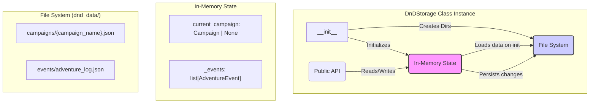

# Table of Contents
- [Table of Contents](#table-of-contents)
- [D\&D MCP Server - Development Guide (FastMCP 2.9.0+)](#dd-mcp-server---development-guide-fastmcp-290)
  - [📁 Project Structure](#-project-structure)
  - [🚀 FastMCP 2.9.0+ Architecture](#-fastmcp-290-architecture)
    - [**Major Changes from Raw MCP SDK**](#major-changes-from-raw-mcp-sdk)
      - [**1. Import Statement**](#1-import-statement)
      - [**2. Server Initialization**](#2-server-initialization)
      - [**3. Tool Definition**](#3-tool-definition)
      - [**4. Type Annotations \& Validation**](#4-type-annotations--validation)
      - [**5. Server Execution**](#5-server-execution)
  - [🏗️ FastMCP Tool Architecture](#️-fastmcp-tool-architecture)
    - [**Tool Categories (25+ tools)**](#tool-categories-25-tools)
    - [**FastMCP Tool Implementation Pattern**](#fastmcp-tool-implementation-pattern)
    - [**Advanced Parameter Types**](#advanced-parameter-types)
  - [💾 Storage Layer Guide](#-storage-layer-guide)
      - [**Data Flow and Architecture**](#data-flow-and-architecture)
      - [**Properties**](#properties)
      - [**Private Methods (Internal Logic)**](#private-methods-internal-logic)
      - [**Public Methods (Tool-Facing API)**](#public-methods-tool-facing-api)
        - [**Campaign Management**](#campaign-management)
        - [**Character Management**](#character-management)
        - [**NPC, Location, and Quest Management**](#npc-location-and-quest-management)
        - [**Game State \& Session Management**](#game-state--session-management)
        - [**Adventure Log / Event Management**](#adventure-log--event-management)
  - [📖 Data Models Guide](#-data-models-guide)
    - [**`AbilityScore`**](#abilityscore)
    - [**`CharacterClass`**](#characterclass)
    - [**`Race`**](#race)
    - [**`Item`**](#item)
    - [**`Spell`**](#spell)
    - [**`Character`**](#character)
    - [**`NPC`**](#npc)
    - [**`Location`**](#location)
    - [**`Quest`**](#quest)
    - [**`CombatEncounter`**](#combatencounter)
    - [**`SessionNote`**](#sessionnote)
    - [**`GameState`**](#gamestate)
    - [**`Campaign`**](#campaign)
    - [**`EventType`**](#eventtype)
    - [**`AdventureEvent`**](#adventureevent)
  - [🎯 Development Workflows](#-development-workflows)
    - [**Adding a New Tool with FastMCP 2.8.0+**](#adding-a-new-tool-with-fastmcp-280)
    - [**Extending Data Models**](#extending-data-models)
    - [**Testing with FastMCP CLI**](#testing-with-fastmcp-cli)
  - [🧪 Testing \& Validation](#-testing--validation)
    - [**FastMCP Development Workflow**](#fastmcp-development-workflow)
    - [**Tool Testing**](#tool-testing)
  - [🔍 Debugging \& Troubleshooting](#-debugging--troubleshooting)
    - [**FastMCP-Specific Issues**](#fastmcp-specific-issues)
      - [**Type Annotation Errors**](#type-annotation-errors)
      - [**Parameter Validation Issues**](#parameter-validation-issues)
      - [**Import Issues**](#import-issues)
    - [**Development Tools**](#development-tools)
  - [🚀 Deployment](#-deployment)
    - [**Claude Desktop Integration**](#claude-desktop-integration)
    - [**FastMCP CLI Installation**](#fastmcp-cli-installation)
  - [📝 Code Style \& Standards (Updated)](#-code-style--standards-updated)
    - [**FastMCP-Specific Conventions**](#fastmcp-specific-conventions)
    - [**Parameter Guidelines**](#parameter-guidelines)
  - [💡 Performance Considerations](#-performance-considerations)
    - [**FastMCP Advantages**](#fastmcp-advantages)
    - [**Migration Benefits**](#migration-benefits)

# D&D MCP Server - Development Guide (FastMCP 2.9.0+)

## 📁 Project Structure

```text
dnd-mcp/
├── src/
│   ├── gamemaster_mcp/           # Renamed for FastMCP compliance
│   │   ├── __init__.py          # Package initialization
│   │   ├── __main__.py          # Module entry point
│   │   ├── main.py              # FastMCP 2.8.0+ server implementation
│   │   ├── models.py            # Pydantic data models
│   │   └── storage.py           # Data persistence layer
│   └── main.py                  # CLI entry point
├── demo.py                      # Example usage script
├── requirements.txt             # Runtime dependencies
├── pyproject.toml              # Project configuration (FastMCP compliant)
├── mypy.ini                    # Type checking configuration
├── .gitignore                  # Git ignore rules
└── README.md                   # User documentation
```

## 🚀 FastMCP 2.9.0+ Architecture

### **Major Changes from Raw MCP SDK**

#### **1. Import Statement**

```python
# Old (Raw MCP SDK)
from mcp.server import Server
from mcp.server.stdio import stdio_server

# New (FastMCP 2.8.0+)
from fastmcp import FastMCP
```

#### **2. Server Initialization**

```python
mcp = FastMCP(
    name="D&D Campaign Manager",
)
```

#### **3. Tool Definition**
Tools should use the decorator pattern suggested by the FastMCP documentation.

```python
@mcp.tool
def create_campaign(
    name: Annotated[str, Field(description="Campaign name")],
    description: Annotated[str, Field(description="Campaign description")]
) -> str:
    """Create a new D&D campaign."""
    # Implementation
```

#### **4. Type Annotations & Validation**
FastMCP 2.8.0+ automatically generates schemas from type hints.

```python
@mcp.tool
def create_character(
    name: Annotated[str, Field(description="Character name")],
    class_level: Annotated[int, Field(description="Class level", ge=1, le=20)],
    alignment: Annotated[Optional[str], Field(description="Character alignment")] = None,
    strength: Annotated[int, Field(description="Strength score", ge=1, le=30)] = 10,
) -> str:
    """Create a new player character with automatic validation."""
```

#### **5. Server Execution**

```python
def main() -> None:
    """Main entry point for the D&D MCP Server."""
    mcp.run()
```

## 🏗️ FastMCP Tool Architecture

### **Tool Categories (25+ tools)**
1. **Campaign Tools** (4) - Automatic schema generation
2. **Character Tools** (5) - Rich parameter validation
3. **NPC Tools** (3) - Type-safe implementations
4. **Location Tools** (3) - Literal type constraints
5. **Quest Tools** (3) - Optional parameter handling
6. **Game State Tools** (2) - Complex object updates
7. **Combat Tools** (3) - List parameter processing
8. **Session Tools** (2) - Nested data structures
9. **Event Tools** (2) - Search and filtering
10. **Utility Tools** (2) - Mathematical calculations

### **FastMCP Tool Implementation Pattern**
**Use the following pattern when implementing or updating MCP server tools:**

```python
@mcp.tool
def tool_name(
    # Required parameters (no default value)
    required_param: Annotated[str, Field(description="Required parameter")],
    
    # Optional parameters (with default values)
    optional_param: Annotated[Optional[str], Field(description="Optional parameter")] = None,
    
    # Validated parameters (with constraints)
    validated_param: Annotated[int, Field(description="Validated param", ge=1, le=100)] = 10,
    
    # Literal constraints (enum-like)
    constrained_param: Annotated[Literal["option1", "option2"], Field(description="Constrained choices")] = "option1",
    
    # Complex types (lists, dicts)
    complex_param: Annotated[List[str], Field(description="List of strings")] = None,
) -> str:
    """
    Tool description that appears in the LLM interface.
    
    FastMCP automatically:
    - Generates JSON schema from type annotations
    - Validates parameters according to Pydantic Field constraints
    - Routes requests to this function
    - Handles errors and type conversion
    """
    # Implementation logic
    if complex_param is None:
        complex_param = []
    
    # Process parameters
    result = process_logic(required_param, optional_param, validated_param)
    
    # Return formatted response
    return f"Processed {required_param} with result: {result}"
```

### **Advanced Parameter Types**

```python
# Annotated Field Examples
@mcp.tool
def advanced_example(
    # String with pattern validation
    user_id: Annotated[str, Field(
        pattern=r"^[A-Z]{2}\d{4}$",
        description="User ID in format XX0000"
    )],
    
    # Number with range constraints
    level: Annotated[int, Field(
        ge=1, le=20,
        description="Character level between 1 and 20"
    )],
    
    # String with length constraints
    description: Annotated[str, Field(
        min_length=10, max_length=500,
        description="Description between 10-500 characters"
    )],
    
    # List with item constraints
    tags: Annotated[List[str], Field(
        description="List of tags",
        max_items=10
    )] = None,
    
    # Literal type for strict choices
    status: Annotated[Literal["active", "completed", "failed"], Field(
        description="Quest status"
    )] = "active",
) -> str:
    """Example of advanced parameter validation."""
```

## 💾 Storage Layer Guide

The `DnDStorage` class, defined in [`src/gamemaster_mcp/storage.py`](src/gamemaster_mcp/storage.py:27), is the persistence layer for the D&D MCP Server. It handles all reading from and writing to the file system, ensuring that campaign data is safely stored and retrieved between sessions. It uses JSON files to store data, with Pydantic models providing validation and structure.

#### **Data Flow and Architecture**

The storage system is designed around two primary data concepts:
1.  **Campaigns**: A single, comprehensive `Campaign` object holds the majority of the game data, including characters, NPCs, locations, quests, and the overall game state. Each campaign is stored in its own JSON file. The system keeps one campaign active in memory at a time (`_current_campaign`).
2.  **Adventure Events**: A global log of `AdventureEvent` objects, stored in a separate `adventure_log.json` file. This log is independent of any single campaign and tracks events across all gameplay.



#### **Properties**

-   **`data_dir: Path`**: The root directory where all campaign data is stored. Defaults to `dnd_data`.
-   **`_current_campaign: Campaign | None`**: An in-memory Pydantic `Campaign` object representing the currently loaded campaign. All operations on characters, quests, etc., are performed on this object before being saved.
-   **`_events: list[AdventureEvent]`**: An in-memory list of all `AdventureEvent` objects loaded from the adventure log.

#### **Private Methods (Internal Logic)**

These methods handle the direct file I/O operations.

-   **`_get_campaign_file(campaign_name: str | None) -> Path`**: Constructs the full file path for a given campaign name, sanitizing the name to make it safe for file systems.
-   **`_get_events_file() -> Path`**: Returns the static file path for the adventure log.
-   **`_save_campaign()`**: Serializes the `_current_campaign` object to its corresponding JSON file. This is called automatically by any public method that modifies the campaign state.
-   **`_load_current_campaign()`**: On initialization, this method finds the most recently modified campaign file in the `campaigns` directory and loads it into memory as the `_current_campaign`.
-   **`_save_events()`**: Serializes the `_events` list to the `adventure_log.json` file.
-   **`_load_events()`**: On initialization, loads all events from `adventure_log.json` into the `_events` list.

#### **Public Methods (Tool-Facing API)**

These methods provide a clean, high-level interface for the MCP server tools to interact with the data.

##### **Campaign Management**
-   **`create_campaign(...) -> Campaign`**: Creates a new `Campaign` object, sets it as the `_current_campaign`, and saves it to a new JSON file.
-   **`get_current_campaign() -> Campaign | None`**: Returns the currently loaded campaign object.
-   **`list_campaigns() -> list[str]`**: Returns a list of names of all available campaigns by scanning the `campaigns` directory.
-   **`load_campaign(name: str) -> Campaign`**: Loads a specific campaign from its JSON file into `_current_campaign`.
-   **`update_campaign(**kwargs)`**: Modifies attributes of the `_current_campaign` object and saves the changes.

##### **Character Management**
-   **`add_character(character: Character)`**: Adds a `Character` to the current campaign's character dictionary.
-   **`get_character(name: str) -> Character | None`**: Retrieves a single character by name from the current campaign.
-   **`update_character(name: str, **kwargs)`**: Updates attributes of a specific character in the current campaign.
-   **`remove_character(name: str)`**: Deletes a character from the current campaign.
-   **`list_characters() -> list[str]`**: Lists the names of all characters in the current campaign.

##### **NPC, Location, and Quest Management**
These methods follow the same CRUD (Create, Read, Update, Delete) pattern as Character Management:
-   **`add_npc(npc: NPC)`**, **`get_npc(name: str)`**, **`list_npcs()`**
-   **`add_location(location: Location)`**, **`get_location(name: str)`**, **`list_locations()`**
-   **`add_quest(quest: Quest)`**, **`get_quest(title: str)`**, **`update_quest_status(...)`**, **`list_quests(...)`**

##### **Game State & Session Management**
-   **`update_game_state(**kwargs)`**: Modifies attributes of the `GameState` object within the current campaign.
-   **`get_game_state() -> GameState | None`**: Retrieves the `GameState` object from the current campaign.
-   **`add_session_note(session_note: SessionNote)`**: Appends a `SessionNote` to the current campaign's session list.
-   **`get_sessions() -> list[SessionNote]`**: Returns all session notes for the current campaign.

##### **Adventure Log / Event Management**
-   **`add_event(event: AdventureEvent)`**: Adds a new event to the `_events` list and saves the adventure log.
-   **`get_events(...) -> list[AdventureEvent]`**: Retrieves events, with optional filtering by type and a limit on the number of results.
-   **`search_events(query: str) -> list[AdventureEvent]`**: Searches event titles and descriptions for a given query string.

## 📖 Data Models Guide
This section provides a detailed overview of the Pydantic data models used in the D&D MCP Server, defined in `src/gamemaster_mcp/models.py`. These models are the backbone of the data persistence and validation layer.

### **`AbilityScore`**
Represents a single D&D ability score (e.g., Strength, Dexterity).
- `score` (int): The raw ability score, validated to be between 1 and 30.
- `modifier` (property): A calculated property that returns the ability modifier (`(score - 10) // 2`).

### **`CharacterClass`**
Defines a character's class and level.
- `name` (str): The name of the class (e.g., "Fighter", "Wizard").
- `level` (int): The character's level in that class, validated between 1 and 20.
- `hit_dice` (str): The type of hit dice used by the class (e.g., "1d8").
- `subclass` (str | None): The character's chosen subclass or archetype.

### **`Race`**
Contains information about a character's race.
- `name` (str): The name of the race (e.g., "Elf", "Dwarf").
- `subrace` (str | None): The specific subrace, if any (e.g., "High Elf").
- `traits` (list[str]): A list of racial traits.

### **`Item`**
A generic model for any item in the game.
- `name` (str): The item's name.
- `description` (str | None): A description of the item.
- `quantity` (int): How many of the item are held.
- `weight` (float | None): The weight of a single item.
- `value` (str | None): The item's value (e.g., "50 gp").
- `item_type` (str): The category of the item (e.g., "weapon", "armor").
- `properties` (dict[str, Any]): A dictionary for custom item properties.

### **`Spell`**
Represents a single spell.
- `name` (str): The spell's name.
- `level` (int): The spell's level, from 0 (cantrip) to 9.
- `school` (str): The school of magic (e.g., "Evocation").
- `casting_time` (str): How long it takes to cast.
- `range` (str): The spell's range.
- `duration` (str): How long the spell's effects last.
- `components` (list[str]): A list of components (V, S, M).
- `description` (str): The full description of the spell's effects.
- `material_components` (str | None): Specific material components required.
- `prepared` (bool): Whether the spell is currently prepared by a caster.

### **`Character`**
The comprehensive model for a player character (PC), composing many of the other models.
- **Basic Info**: `name`, `player_name`, `character_class` (`CharacterClass`), `race` (`Race`), `background`, `alignment`.
- **Core Stats**: `abilities` (a dictionary mapping ability names to `AbilityScore` models).
- **Combat Stats**: `armor_class`, `hit_points_max`, `hit_points_current`, `temporary_hit_points`, `hit_dice_remaining`, `death_saves_success`, `death_saves_failure`.
- **Skills & Proficiencies**: `proficiency_bonus`, `skill_proficiencies`, `saving_throw_proficiencies`.
- **Equipment**: `inventory` (list of `Item`), `equipment` (dictionary for equipped items).
- **Spellcasting**: `spellcasting_ability`, `spell_slots`, `spell_slots_used`, `spells_known` (list of `Spell`).
- **Character Features**: `features_and_traits`, `languages`.
- **Misc**: `inspiration`, `notes`, `created_at`, `updated_at`.

### **`NPC`**
Represents a Non-Player Character.
- `name` (str): The NPC's name.
- `description` (str | None): A physical and personality description.
- `race` (str | None): The NPC's race.
- `occupation` (str | None): The NPC's job or role.
- `location` (str | None): The current location of the NPC.
- `attitude` (str | None): Their general attitude towards the party.
- `notes` (str): DM's notes about the NPC.
- `stats` (dict[str, Any] | None): A flexible field for combat stats if needed.
- `relationships` (dict[str, str]): Tracks relationships with other characters.

### **`Location`**
Defines a location in the game world.
- `name` (str): The location's name.
- `location_type` (str): The type of location (e.g., "city", "dungeon").
- `description` (str): A description of the location.
- `population` (int | None): The population size.
- `government` (str | None): The type of government.
- `notable_features` (list[str]): Key features or landmarks.
- `npcs` (list[str]): A list of NPC names found here.
- `connections` (list[str]): A list of connected locations.
- `notes` (str): DM's notes.

### **`Quest`**
Represents a quest or mission.
- `title` (str): The title of the quest.
- `description` (str): A detailed description of the quest.
- `giver` (str | None): The NPC who assigned the quest.
- `status` (str): The current status ("active", "completed", "failed").
- `objectives` (list[str]): A list of objectives to complete the quest.
- `completed_objectives` (list[str]): A list of completed objectives.
- `reward` (str | None): The reward for completing the quest.
- `notes` (str): DM's notes.
- `created_at` (datetime): When the quest was created.

### **`CombatEncounter`**
Defines a planned combat encounter.
- `name` (str): The name of the encounter.
- `description` (str): A description of the setup.
- `enemies` (list[str]): A list of enemy names or types.
- `difficulty` (str | None): The calculated difficulty (e.g., "hard").
- `experience_value` (int | None): Total XP value of the encounter.
- `location` (str | None): Where the encounter takes place.
- `status` (str): The status ("planned", "active", "completed").
- `notes` (str): DM's notes.

### **`SessionNote`**
Stores information about a single game session.
- `session_number` (int): The number of the session.
- `date` (datetime): The real-world date the session was played.
- `title` (str | None): An optional title for the session.
- `summary` (str): A summary of what happened.
- `events` (list[str]): A list of key events.
- `characters_present` (list[str]): Which PCs were present.
- `experience_gained` (int | None): XP awarded.
- `treasure_found` (list[str]): Treasure discovered.
- `notes` (str): DM's notes.

### **`GameState`**
A snapshot of the current state of the campaign world.
- `campaign_name` (str): The name of the campaign.
- `current_session` (int): The current session number.
- `current_date_in_game` (str | None): The in-game date.
- `current_location` (str | None): The party's current location.
- `active_quests` (list[str]): A list of active quest titles.
- `party_level` (int): The average party level.
- `party_funds` (str): The party's shared treasure.
- `initiative_order` (list[dict[str, Any]]): The order of turns in combat.
- `in_combat` (bool): Whether combat is active.
- `current_turn` (str | None): Whose turn it is in combat.
- `notes` (str): General notes on the game state.
- `updated_at` (datetime): When the state was last updated.

### **`Campaign`**
The top-level container for all campaign data. It aggregates all other models.
- `name` (str): The campaign's name.
- `description` (str): The overall campaign premise.
- `dm_name` (str | None): The Dungeon Master's name.
- `setting` (str | None): The campaign setting (e.g., "Forgotten Realms").
- `characters` (dict[str, Character]): A dictionary of all PCs, keyed by name.
- `npcs` (dict[str, NPC]): A dictionary of all NPCs, keyed by name.
- `locations` (dict[str, Location]): A dictionary of all locations, keyed by name.
- `quests` (dict[str, Quest]): A dictionary of all quests, keyed by title.
- `encounters` (dict[str, CombatEncounter]): A dictionary of all encounters.
- `sessions` (list[SessionNote]): A list of all session notes.
- `game_state` (GameState): The current `GameState` object.
- `world_notes` (str): High-level notes about the world.
- `created_at` (datetime): When the campaign was created.
- `updated_at` (datetime | None): When the campaign was last updated.

### **`EventType`**
An `Enum` for categorizing adventure log events.
- Values: `COMBAT`, `ROLEPLAY`, `EXPLORATION`, `QUEST`, `CHARACTER`, `WORLD`, `SESSION`.

### **`AdventureEvent`**
Represents a single, taggable event in the adventure log, allowing for a more granular timeline of the campaign.
- `event_type` (EventType): The type of event.
- `title` (str): A title for the event.
- `description` (str): A description of what happened.
- `timestamp` (datetime): The time the event was logged.
- `session_number` (int | None): The session it occurred in.
- `characters_involved` (list[str]): Which characters were involved.
- `location` (str | None): Where the event took place.
- `tags` (list[str]): Custom tags for filtering and searching.
- `importance` (int): A rating from 1 (minor) to 5 (major).

## 🎯 Development Workflows

### **Adding a New Tool with FastMCP 2.8.0+**
1. **Define Tool with Type Annotations**:

```python
@mcp.tool
def new_spell_tool(
    spell_name: Annotated[str, Field(description="Name of the spell")],
    spell_level: Annotated[int, Field(description="Spell level", ge=0, le=9)],
    school: Annotated[Literal["evocation", "enchantment", "necromancy"], Field(description="School of magic")],
    character_name: Annotated[Optional[str], Field(description="Character to add spell to")] = None,
) -> str:
    """Add a spell to the campaign or character spellbook."""
    # Implementation
    if character_name:
        character = storage.get_character(character_name)
        if not character:
            return f"Character '{character_name}' not found."
        # Add spell to character
    else:
        # Add to campaign spell library
    
    return f"Added spell '{spell_name}' (Level {spell_level} {school})"
```

### **Extending Data Models**
Models remain Pydantic-based and work seamlessly:

```python
class Spell(BaseModel):
    """Enhanced spell model."""
    name: str
    level: int = Field(ge=0, le=9)
    school: Literal["evocation", "enchantment", "necromancy", ...]
    description: str
    components: List[str] = Field(default_factory=list)
    
    # FastMCP automatically understands Pydantic models
```

### **Testing with FastMCP CLI**
It is recommended to use the improved MCP inspector:

```bash
npx @mcpjam/inspector
```

One the inspector is running, connect to it with the provided host and port numbers. (e.g., `https://localhost/8080`)

## 🧪 Testing & Validation

### **FastMCP Development Workflow**

```bash
# Create a virtual environment
uv venv

# Install development dependencies
uv sync --dev

# Run development server with inspector
npx @mcpjam/inspector

# Type checking
mypy src/

# Run tests
pytest
```

### **Tool Testing**
FastMCP provides better testing capabilities:

```python
# Test tools directly
import asyncio
from gamemaster_mcp.main import mcp

async def test_create_campaign():
    # Tools can be tested as regular Python functions
    result = create_campaign(
        name="Test Campaign",
        description="A test campaign"
    )
    assert "Created campaign 'Test Campaign'" in result

# Or test via MCP client
from fastmcp import Client

async def test_via_client():
    async with Client(mcp) as client:
        result = await client.call_tool("create_campaign", {
            "name": "Test Campaign",
            "description": "A test campaign"
        })
        assert result
```

## 🔍 Debugging & Troubleshooting

### **FastMCP-Specific Issues**

#### **Type Annotation Errors**

```python
# ❌ Wrong: Missing Annotated wrapper
def bad_tool(param: str = Field(description="Bad")) -> str:
    pass

# ✅ Correct: Proper Annotated syntax
def good_tool(
    param: Annotated[str, Field(description="Good")]
) -> str:
    pass
```

#### **Parameter Validation Issues**

```python
# FastMCP validates parameters automatically
@mcp.tool
def validate_example(
    level: Annotated[int, Field(ge=1, le=20)]  # Will reject values outside 1-20
) -> str:
    # No need for manual validation
    return f"Level {level} is valid!"
```

#### **Import Issues**

```python
# ✅ Correct FastMCP 2.8.0+ imports
from fastmcp import FastMCP
from pydantic import Field
from typing import Annotated, Optional, Literal, List, Dict
```

### **Development Tools**

```bash
# Check FastMCP version
fastmcp version

# Validate tool schemas
fastmcp dev src/gamemaster_mcp/main.py:mcp --validate

# Debug with inspector
fastmcp dev src/gamemaster_mcp/main.py:mcp --debug
```

## 🚀 Deployment
This MCP server is designed to be installed and run locally.

1. Install locally, or to user/system packages

```bash
# In root dir:
uv pip install -e .

or

uv pip install --system -e .
```

### **Claude Desktop Integration**

```json
{
  "mcpServers": {
    "dnd-campaign-manager": {
      "command": "fastmcp",
      "args": ["run", "/path/to/gamemaster_mcp/main.py:mcp"]
    }
  }
}
```

### **FastMCP CLI Installation**

```bash
# Install server for Claude Desktop
fastmcp install src/gamemaster_mcp/main.py:mcp -n "D&D Campaign Manager"

# With dependencies
fastmcp install src/gamemaster_mcp/main.py:mcp -n "D&D Campaign Manager" \
  --with "pydantic>=2.0.0" --with "typing-extensions>=4.0.0"
```

## 📝 Code Style & Standards (Updated)

### **FastMCP-Specific Conventions**
- **Tool Functions**: Use descriptive names with action_noun pattern (`create_campaign`, `get_character`)
- **Type Annotations**: Always use `Annotated[Type, Field(...)]` for parameters
- **Docstrings**: First line becomes tool description for LLM
- **Parameter Descriptions**: Use clear, LLM-friendly descriptions in Field()
- **Return Types**: Always specify return type (usually `str` for tool responses)

### **Parameter Guidelines**

```python
# ✅ Good: Clear, descriptive, validated
@mcp.tool  
def good_tool(
    character_name: Annotated[str, Field(description="Name of the character to update")],
    new_level: Annotated[int, Field(description="New character level", ge=1, le=20)],
    notes: Annotated[Optional[str], Field(description="Additional notes")] = None,
) -> str:
    """Update a character's level with optional notes."""

# ❌ Bad: Unclear, unvalidated
@mcp.tool
def bad_tool(name: str, level: int, notes: str = "") -> str:
    """Updates character."""
```

## 💡 Performance Considerations

### **FastMCP Advantages**
- **Faster Development** - Automatic schema generation
- **Better Type Safety** - Compile-time error detection
- **Reduced Boilerplate** - No manual tool registration
- **Enhanced DX** - Built-in development tools

### **Migration Benefits**
1. **Reduced Code** - ~70% less boilerplate code
2. **Better Validation** - Automatic parameter validation
3. **Improved Maintainability** - Type-safe, declarative approach
4. **Enhanced Testing** - Tools can be tested as regular functions
5. **Modern Standards** - Compliance with latest MCP best practices

This guide provides the foundation for developing with FastMCP 2.8.0+, emphasizing the modern, type-safe, and streamlined approach to MCP server development.\
