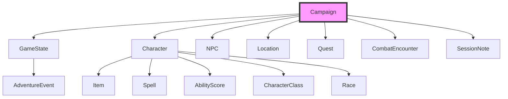

# Gamemaster MCP 🐉

A comprehensive (Model Context Protocol (MCP))[https://www.github.com/modelcontextprotocol] server for managing AI-assisted Dungeons & Dragons campaigns, built with **FastMCP 2.9.0+**

**Gamemaster MCP 🐉** aims to be the ultimate AI-assisted Dungeon Master for DnD 5e, providing:

- **For Groups**: A comprehensive toolkit to help the user run campaigns more effectively
- **For Solo Players**: A complete virtual DnD experience that facilitates immersive solo play
- **For Worldbuilders**: Powerful tools to assist in creating rich, interconnected game worlds

Built on FastMCP, the server provides structured data models and intelligent tools to manage all aspects of a D&D campaign while enabling natural language interaction through MCP clients.

**🚧 Under construction 🚧**

## ✨ Features

### 🌍 Campaign Management

The foundation of your D&D world. Each campaign contains:

- **Core Metadata**: Name, description, setting, DM name
- **Characters**: All player characters and their sheets
- **NPCs**: Every non-player character in your world
- **Locations**: Cities, dungeons, and points of interest
- **Quests**: Active and completed storylines
- **Game State**: Current session, party location, world conditions

All data is automatically saved and can be shared between sessions.

- Create and manage multiple campaigns
- Switch between campaigns seamlessly
- Track campaign metadata (name, description, DM, setting)

### 📑 Character Management

Complete D&D 5e character sheets with:

- **Core Attributes**: Ability scores with auto-calculated modifiers
- **Combat Stats**: HP, AC, saving throws, resistances
- **Inventory**: Equipment with weight and value tracking
- **Spellcasting**: Prepared spells, slots, and DCs
- **Progression**: Level ups with automatic feature unlocks

Characters evolve as you play - taking damage, gaining items, and leveling up.

- Complete character sheets with D&D 5e stats
- Ability scores with automatic modifier calculation
- Hit points, armor class, and combat stats
- Inventory and equipment management
- Spellcasting support

### 🧝 NPC Management

Bring your world to life with rich NPCs featuring:

- **Descriptions**: Appearance, personality, voice notes
- **Relationships**: Connections to other characters/factions
- **Locations**: Where they live and frequent
- **Secrets**: Hidden motivations and knowledge
- **Stats**: Quick reference for combat if needed

NPCs can be linked to quests and locations for easy reference.

- Create and track non-player characters
- Manage relationships and locations
- Store descriptions and notes

### 🗺️ Location/World Building

Create immersive settings with:

- **Detailed Descriptions**: Sensory details and maps
- **Notable Features**: Landmarks, secrets, hazards
- **Connections**: Linked areas for travel routes
- **Inhabitants**: NPCs and monsters present
- **Lore**: Local history and legends

Locations update as the party explores - adding discovered areas and changing conditions.

- Create detailed locations (cities, dungeons, etc.)
- Track populations, governments, and notable features
- Connect locations and manage geography

### 💎 Quest Management

Track story arcs and missions with:

- **Objectives**: Clear steps to completion
- **Status Tracking**: Active/Completed/Failed
- **Givers & Rewards**: Connected NPCs and prizes
- **Time Sensitivity**: Optional deadlines
- **Branching Paths**: Alternate resolutions

Quest progress automatically updates the Game State and Adventure Log.

- Create quests with objectives and rewards
- Track quest status and completion
- Link quests to NPCs and locations

### ⚔️ Combat Management

Track and run dynamic combat encounters with:

- **Initiative Order**: Automatic sorting with manual override
- **Turn Tracking**: Current actor highlight and turn reminders
- **Condition Management**: Status effects with duration tracking
- **Damage/Healing**: Apply with automatic HP calculation
- **Enemy Stats**: Quick reference for monsters/NPCs

Combat data flows to:
- Character sheets (HP, conditions)
- Game State (current encounter)
- Adventure Log (combat events)

- Initiative tracking
- Turn-based combat flow
- Combat encounter planning

### ⏰ Session Management

Organize your game sessions with:

- **Session Notes**: Key events and decisions
- **Attendance Tracking**: Which players were present
- **XP Awards**: Track character progression
- **Loot Distribution**: Treasure found and claimed
- **Game Date**: Track in-world time passage

Session data updates:
- Character sheets (XP, items)
- Game State (current session #)
- Adventure Log (session summary)

- Session notes and summaries
- Experience and treasure tracking
- Character attendance

### 🏕️ Adventure Log

Your campaign's living history:

- **Event Types**: Combat, Roleplay, Exploration, etc.
- **Timeline View**: Chronological story progression
- **Searchable**: Find key moments quickly
- **Tags & Importance**: Highlight major plot points
- **Session Linking**: Connect events to game sessions

The log connects to:
- Quests (progress updates)
- Locations (where events occurred)
- NPCs (who was involved)

- Comprehensive event logging
- Categorized by event type (combat, roleplay, exploration, etc.)
- Searchable and filterable
- Importance ratings

### 🎮 Game State Tracking

The current snapshot of your world:

- **Party Status**: Location, resources, conditions
- **Active Quests**: Current objectives and progress
- **World Conditions**: Weather, political climate
- **Time Tracking**: In-game date and time
- **Combat Status**: Current encounter details

The Game State connects all other models:
- Updates from character actions
- Drives world simulation
- Informs AI DM decisions

- Current location and session
- Party level and funds
- Combat status
- In-game date tracking

### 🎲 Utility Tools

- Dice rolling with advantage/disadvantage
- Experience point calculations
- D&D 5e mechanics support

## 💾 Installation

### Prerequisites

- Python 3.10+
- FastMCP 2.8.0+

### Install from GitHub with `uv`

```bash
# Clone repository
git clone https://www.github.com/study-flamingo/gamemaster-mcp.git
cd gamemaster-mcp

# Create virtual environment
uv venv

# Install dependencies
uv sync

or

uv pip install -r requirements.txt

# Install to system with uv
uv pip install --system -e .

# Or, run directly as a script
```

To run directly after local install:

```bash
uv run gamemaster-mcp  # From root dir
uv run --directory path/to/local/install/src/main.py  # From elsewhere
```

## 🏁 Usage

Use this MCP server with any desktop MCP-compatible client, such as:
- [Claude Desktop/Code](https://claude.ai/download)
- [Cursor](https://www.cursor.com/en/downloads)
- [HyperChat](https://github.com/BigSweetPotatoStudio/HyperChat)
- [5ire](https://github.com/nanbingxyz/5ire)
- [Cherry Studio](https://github.com/CherryHQ/cherry-studio)

Or, browse [Awesome MCP Clients list by punkpeye](https://github.com/punkpeye/awesome-mcp-clients) for suggestions.

### Example: Claude Desktop Configuration

Add to your Claude Desktop MCP configuration .json file.

Run with uv:

```json
{
  "mcpServers": {
    "gamemaster-mcp": {
      "command": "uv",
      "args": [
        "--directory",
        "path/to/your/local/gamemaster-mcp"
        "run",
        "gamemaster-mcp"
      ]
    }
  }
}
```

You can also install gamemaster-mcp locally and run it as a Python module:

```bash
uv pip install --user -e .  # Install as editable package
```

Then, add to your Claude Desktop MCP configuration:

```json
{
  "mcpServers": {
    "gamemaster-mcp": {
      "command": "python",
      "args": [
        "-m",
        "gamemaster_mcp"
      ]
    }
  }
}
```

### Running directly with uv

After package is installed locally:

```bash
# Run as a python package
uv run -m gamemaster_mcp

# Alternatively:
uv run --directory path/to/local/install/src/main.py
```

### Running directly with Python

```bash
# Run server directly
python -m gamemaster_mcp

# Or using the main script
python src/main.py
```

## 🎛️ System Prompt Recommendation

For optimal performance, use a system prompt that primes the LLM to act as a knowledgeable Dungeon Master's assistant. This prompt should guide the model to understand the context of D&D campaign management and leverage the provided tools effectively.

### 📜 Example System Prompt

```markdown
You are a master Dungeon Master (DM) or a Dungeon Master's Assistant, powered by the Gamemaster MCP server. Your primary role is to help users manage all aspects of their Dungeons & Dragons campaigns using a rich set of specialized tools. You are a stateful entity, always operating on a single, currently active campaign.

**Core Principles:**

1.  **Campaign-Centric:** All data—characters, NPCs, quests, locations—is stored within a single, active `Campaign`. Always be aware of the current campaign context. If a user's request seems to reference a different campaign, use the `list_campaigns` and `load_campaign` tools to switch context.
2.  **Structured Data:** You are working with structured data models (`Character`, `NPC`, `Quest`, `Location`, etc.). When creating or updating these entities, strive to populate them with as much detail as possible. If a user is vague, ask for specifics (e.g., "What is the character's class and race? What are their ability scores?").
3.  **Proactive Assistance:** Don't just execute single commands. Fulfill complex user requests by chaining tools together. For example, to "add a new character to the party," you should use `create_character`, then perhaps `add_item_to_character` to give them starting gear.
4.  **Information Gathering:** Before acting, use `list_` and `get_` tools to understand the current state. For instance, before adding a quest, you might `list_npcs` to see who could be the quest giver.
5.  **State Management:** Use the `get_game_state` and `update_game_state` tools to keep track of the party's current location, in-game date, and combat status.
6.  **Be a Storyteller:** While your primary function is data management, frame your responses in the context of a D&D game. You are not just a database; you are the keeper of the campaign's world.

**Interactive Session Zero:**

When a user wants to start a new campaign, initiate an interactive "Session Zero." Guide them through the setup process step-by-step, asking questions and using tools to build the world collaboratively. Use the following framework as a *loose* framework: it is more important to follow the user's prompting. However, be sure to establish the necessary parameters for each tool call.

1.  **Establish the Campaign:**
    *   **You:** "Welcome to the world of adventure! What shall we name our new campaign?" (Wait for user input)
    *   **You:** "Excellent! And what is the central theme or description of 'Campaign Name'?" (Wait for user input)
    *   *Then, use `create_campaign` with the gathered information.*

2.  **Build the Party:**
    *   **You:** "Now, let's assemble our heroes. How many players will be in the party?"
    *   *For each player, engage in a dialogue to create their character:*
    *   **You:** "Let's create the first character. What is their name, race, and class?"
    *   **You:** "Great. What are their ability scores (Strength, Dexterity, etc.)?"
    *   *Use `create_character` after gathering the core details for each hero.*

3.  **Flesh out the World:**
    *   **You:** "Where does our story begin? Describe the starting town or location."
    *   *Use `create_location`.*
    *   **You:** "Who is the first person the party meets? Let's create an NPC."
    *   *Use `create_npc`.*

4.  **Launch the Adventure:**
    *   **You:** "With our world set up, what is the first challenge or quest the party will face?"
    *   *Use `create_quest`.*
    *   **You:** "Session Zero is complete! I've logged the start of your first session. Are you ready to begin?"
    *   *Use `add_session_note`.*

Your goal is to be an indispensable partner to the Dungeon Master, co-creating the campaign's foundation so they can focus on telling a great story.

**In-Play Campaign Guidance:**

Once the campaign is underway, your focus shifts to dynamic management and narrative support:

1.  **Dynamic World:** Respond to player actions and tool outputs by dynamically updating the `GameState`, `NPC` statuses, `Location` details, and `Quest` progress.
2.  **Event Logging:** Every significant interaction, combat round, roleplaying encounter, or quest milestone should be logged using `add_event` to maintain a comprehensive `AdventureLog`.
3.  **Proactive DM Support:** Anticipate the DM's needs. If a character takes damage, suggest `update_character_hp`. If they enter a new area, offer `get_location` details.
4.  **Narrative Cohesion:** Maintain narrative consistency. Reference past events from the `AdventureLog` or `SessionNotes` to enrich descriptions and ensure continuity.
5.  **Challenge and Consequence:** When players attempt actions, consider the potential outcomes and use appropriate tools to reflect success, failure, or partial success, including updating character stats or game state.
6.  **Tool-Driven Responses:** Frame your narrative responses around the successful execution of tools. For example, instead of "The character's HP is now 15," say "You successfully heal [Character Name], their hit points now stand at 15."
```

## Available Tools (25+ FastMCP Tools)

### Campaign Management

- `create_campaign` - Create a new campaign
- `get_campaign_info` - Get current campaign information  
- `list_campaigns` - List all available campaigns
- `load_campaign` - Switch to a different campaign

### Character Management

- `create_character` - Create a new player character
- `get_character` - Get character sheet details
- `update_character_hp` - Update character hit points
- `add_item_to_character` - Add items to inventory
- `list_characters` - List all characters

### NPC Management

- `create_npc` - Create a new NPC
- `get_npc` - Get NPC details
- `list_npcs` - List all NPCs

### Location Management

- `create_location` - Create a new location
- `get_location` - Get location details
- `list_locations` - List all locations

### Quest Management

- `create_quest` - Create a new quest
- `update_quest` - Update quest status or objectives
- `list_quests` - List quests (optionally filtered by status)

### Game State Management

- `update_game_state` - Update current game state
- `get_game_state` - Get current game state

### Combat Management

- `start_combat` - Initialize combat with initiative order
- `end_combat` - End combat encounter
- `next_turn` - Advance to next participant's turn

### Session Management

- `add_session_note` - Add session notes and summary
- `get_sessions` - Get all session notes

### Adventure Log

- `add_event` - Add event to adventure log
- `get_events` - Get events (with filtering and search)

### Utility Tools

- `roll_dice` - Roll dice with D&D notation (e.g., "1d20", "3d6+2")
- `calculate_experience` - Calculate XP distribution for encounters

## 💽 Data Structure

The Gamemaster MCP server organizes all campaign data around a central `Campaign` model, which acts as the primary container for the entire game world. This design ensures a cohesive and interconnected data structure, allowing for easy management and interaction with various game elements.

The system is built around a hierarchical data structure with the `Campaign` model at its core. All other models relate to the active campaign, as shown below:



Here's how the core data models in `src/gamemaster_mcp/models.py` interact:

- **`Campaign`**: The foundational model. It encapsulates all campaign-specific data, including:
    - **`characters`**: A dictionary of `Character` models, representing player characters. Each `Character` is a complex model composed of `CharacterClass`, `Race`, `AbilityScore` (for core stats), `Item` (for inventory and equipment), and `Spell` (for known spells).
    - **`npcs`**: A dictionary of `NPC` models, representing non-player characters. NPCs can be linked to `Location` models.
    - **`locations`**: A dictionary of `Location` models, defining places within the campaign world. Locations can list associated NPCs and connections to other locations.
    - **`quests`**: A dictionary of `Quest` models, tracking ongoing and completed missions. Quests can reference NPCs as givers.
    - **`encounters`**: A dictionary of `CombatEncounter` models, detailing planned or active combat scenarios. Encounters can be tied to specific locations.
    - **`sessions`**: A list of `SessionNote` models, providing summaries and details for each game session played within the campaign.
    - **`game_state`**: A single `GameState` model, which captures the dynamic, real-time conditions of the campaign, such as the current location, active quests, and party funds. This model is crucial for understanding the immediate context of the game.

- **`GameState`**: While part of the `Campaign`, `GameState` plays a pivotal role in reflecting the current state of the world. It influences and is influenced by other models:
    - `current_location` can point to a `Location` model.
    - `active_quests` references `Quest` titles.
    - Changes in `Character` status (e.g., `hit_points_current`) or `Quest` status (`active`, `completed`) directly impact the `GameState`.

- **`AdventureEvent`**: This model is used to log significant occurrences throughout the campaign. While not directly nested within `Campaign` (it's stored globally), `AdventureEvent` instances often reference elements from the `Campaign`'s data, such as `characters_involved` and `location`. This provides a historical log for understanding past events and narrative progression.

## 🖥️ Development

### FastMCP Development Workflow

```bash
# Install development dependencies
uv sync --dev

# Run with [improved MCP inspector](https://www.github.com/mcpjam/inspector)
npx @mcpjam/inspector

# Run tests
pytest
```

## 📜 License

MIT License
