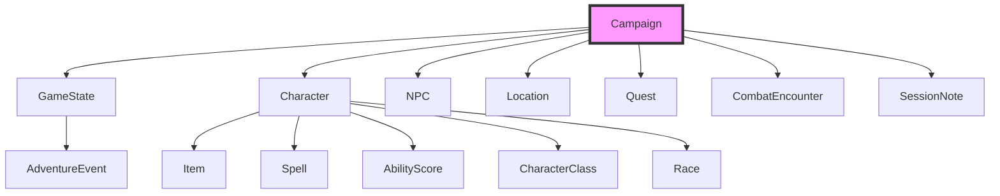

# Gamemaster MCP 🐉 - Project Roadmap

## 1. 🎯 Project Vision & Technical Architecture

### Data Model Relationships

The system is built around a hierarchical data structure with the `Campaign` model at its core. All other models relate to the active campaign through these key relationships:

**Key Technical Concepts:**

### Core Concepts: Interplay of Data Models

The Gamemaster MCP server organizes all campaign data around a central `Campaign` model, which acts as the primary container for the entire game world. This design ensures a cohesive and interconnected data structure, allowing the LLM client to easily manage and interact with various game elements.

Here's how the core data models in `src/gamemaster_mcp/models.py` interact and relate:

* **`Campaign`**: The foundational model. It encapsulates all campaign-specific data, including:
    * **`characters`**: A dictionary of `Character` models, representing player characters. Each `Character` is a complex model composed of `CharacterClass`, `Race`, `AbilityScore` (for core stats), `Item` (for inventory and equipment), and `Spell` (for known spells).
    * **`npcs`**: A dictionary of `NPC` models, representing non-player characters. NPCs can be linked to `Location` models.
    * **`locations`**: A dictionary of `Location` models, defining places within the campaign world. Locations can list associated NPCs and connections to other locations.
    * **`quests`**: A dictionary of `Quest` models, tracking ongoing and completed missions. Quests can reference NPCs as givers.
    * **`encounters`**: A dictionary of `CombatEncounter` models, detailing planned or active combat scenarios. Encounters can be tied to specific locations.
    * **`sessions`**: A list of `SessionNote` models, providing summaries and details for each game session played within the campaign.
    * **`game_state`**: A single `GameState` model, which captures the dynamic, real-time conditions of the campaign, such as the current location, active quests, and party funds. This model is crucial for the LLM to understand the immediate context of the game.

* **`GameState`**: While part of the `Campaign`, `GameState` plays a pivotal role in reflecting the current state of the world. It influences and is influenced by other models:
    * `current_location` can point to a `Location` model.
    * `active_quests` references `Quest` titles.
    * Changes in `Character` status (e.g., `hit_points_current`) or `Quest` status (`active`, `completed`) directly impact the `GameState` and how the LLM perceives the campaign.

* **`AdventureEvent`**: This model, along with `EventType`, is used to log significant occurrences throughout the campaign. While not directly nested within `Campaign` (it's stored globally), `AdventureEvent` instances often reference elements from the `Campaign`'s data, such as `characters_involved` and `location`. This provides a historical log that the LLM can use to understand past events and narrative progression.

This interconnected structure allows the LLM client to query, update, and generate content for the campaign by interacting with a unified and logically organized data set. The Pydantic validation ensures data integrity across all operations.

---

## 2. 🌟 Current Version (v1.0)

The current version of the server provides a robust foundation for comprehensive campaign management, built on a solid storage layer and a rich set of data models.

### Key Features

* **Architecture**: Modern, type-safe architecture using FastMCP 2.9.0+, with clear separation of concerns between the server logic ([`main.py`](src/gamemaster_mcp/main.py)), data models ([`models.py`](src/gamemaster_mcp/models.py)), and persistence ([`storage.py`](src/gamemaster_mcp/storage.py)).
* **Campaign Management**: Full CRUD operations for creating, loading, and managing multiple, distinct campaigns.
* **Data Persistence**: A reliable storage layer that saves campaign data to JSON files (`dnd_data/campaigns/`) and maintains a global event log (`dnd_data/events/adventure_log.json`).
* **Comprehensive Data Models**: A rich set of Pydantic models covering all core D&D concepts:
    * `Campaign`, `GameState`, `SessionNote`
    * `Character`, `NPC`, `Race`, `CharacterClass`
    * `Location`, `Quest`, `Item`, `Spell`
    * `CombatEncounter`, `AdventureEvent`
* **Core Toolset**: A suite of 25+ tools providing essential functionality for:
    * Campaign, Character, NPC, Location, and Quest management.
    * Game State and Session tracking.
    * Basic Combat and Event logging.
    * Utility functions like dice rolling.

---

## 3. 🛣️ Future Development Roadmap

### Phase 1: Enhanced Interactivity & DM Assistance (v1.1)

**Goal**: Move beyond data management to proactive, intelligent assistance that enhances the DM's creative workflow.

| Feature                       | Description                                                                                                                                                           | Related Tools / Models                                                                                             |
| ----------------------------- | --------------------------------------------------------------------------------------------------------------------------------------------------------------------- | ------------------------------------------------------------------------------------------------------------------ |
| **Data Storage Improvement**  | Migrate from simple JSON data storage to a more robust, efficient system with semantic search features (SQL and/or vector DB such as PostgreSQL, ChromaDB, or Qdrant) | `generate_random_encounter`, `generate_plot_hook`                                                                  |
| **Dynamic Event Generation**  | Tools to generate random encounters, plot hooks, or NPC interactions based on the current `GameState` (e.g., party location, level, active quests).                   | `generate_random_encounter`, `generate_plot_hook`                                                                  |
| **Generative Content Tools**  | Leverage the LLM's `sample` capability to generate descriptions for locations, NPCs, or items on the fly, saving them to the appropriate model.                       | `generate_npc_description`, `generate_location_details`                                                            |
| **Advanced Combat Tools**     | More granular combat management tools for applying damage/healing, adding/removing conditions, and tracking resources (e.g., spell slots, legendary actions).         | `apply_damage`, `add_condition_to_character`, `use_spell_slot`                                                     |
| **Improved Search & Query**   | Enhance the `search_events` tool and add new search capabilities to find specific items, characters, or lore across the entire campaign based on complex queries.     | `find_item_by_property`, `search_lore`                                                                             |
| **Knowledge Base Integration**| Add tools to look up rules, monster stats, or spell details from an integrated (and *user-expandable*) D&D 5e SRD knowledge base.                                          | `lookup_rule`, `get_monster_stats`, `get_spell_details`                                                            |
| **Expanded Character Sheet**  | Add support for tracking feats, skills, and other detailed character attributes beyond the core stats.                                                                | `Feat`, `Skill` models, `add_feat_to_character`                                                                    |
| **Worldbuilding Utilities**   | Tools for procedural generation of names, locations, plot hooks, and other creative elements to assist in worldbuilding.                                              | `generate_random_name`, `generate_location_idea`                                                                   |

### Phase 2: Deeper Simulation & Automation (v1.2)

**Goal**: Automate complex game mechanics and create a more dynamic, simulated world that reacts to player actions.

| Feature                          | Description                                                                                                                                                           | Related Tools / Models                                                                                             |
| -------------------------------- | --------------------------------------------------------------------------------------------------------------------------------------------------------------------- | ------------------------------------------------------------------------------------------------------------------ |
| **Faction & Reputation System**  | Introduce `Faction` models and tools to track player reputation with various in-game factions. Reputation changes could be triggered by completing quests or events. | `Faction` model, `update_reputation`, `get_faction_standing`                                                       |
| **Automated Character Progression** | A `level_up_character` tool that automatically handles HP increases, new features, and spell slot changes based on class.                                           | `level_up_character`, `CharacterClass` model updates                                                               |
| **Dynamic World State**          | The `GameState` will evolve more dynamically. NPCs change locations, shop inventories update, and quests become time-sensitive based on in-game date progression.      | `advance_in_game_time`, `update_npc_location`, `restock_shop_inventory`                                            |
| **Loot Generation**              | Tools to generate treasure hoards, magic items, or shop inventories based on challenge rating, location type, or campaign setting.                                     | `generate_treasure_hoard`, `generate_magic_item`                                                                   |
| **Calendar & Time-Based Events** | A more robust in-game calendar system. Schedule world events that trigger automatically when a certain date is reached via the `advance_in_game_time` tool.         | `Calendar` model, `schedule_world_event`                                                                           |

### Phase 3: Scalability & Integration (v1.3)

**Goal**: Evolve the server from a standalone tool into a scalable, interconnected hub for a broader D&D ecosystem.

| Feature                       | Description                                                                                                                                                           | Related Tools / Models                               |
| ----------------------------- | --------------------------------------------------------------------------------------------------------------------------------------------------------------------- | ---------------------------------------------------- |
| **Performance Optimization**  | Refactor the storage layer to handle extremely large campaigns with thousands of events and entries without performance degradation.                                    | `DnDStorage` optimization, potential async operations |
| **API for Third-Party Apps**  | Expose a secure, public API that allows other applications (e.g., character sheet managers, virtual tabletops) to read and write data to the campaign.                  | `OAuth2` integration, `RESTful API` models           |
| **Webhooks & Event Streaming**| Implement a system for pushing real-time updates to other services when key events occur in the campaign (e.g., a character levels up, a quest is completed).          | `Webhook` model, `emit_event` tool                   |
